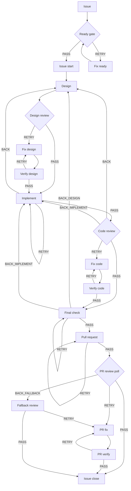

# kaji

言語: [English](README.md) | 日本語

[](https://github.com/apokamo/kaji/releases)
[](pyproject.toml)
[](LICENSE)

https://github.com/user-attachments/assets/b1e3fb2e-6b92-4798-8f4c-0227b0727ce1

<p align="center">
  <a href="docs/assets/demo.mp4">ターミナルデモを見る（MP4）</a>
</p>

Claude Code、Codex、Gemini CLIのための closed-loop agentic development。

kajiは、Issueを起点に、設計 -> 実装 -> レビュー -> 修正 -> 検証 -> PR までを
再開可能なワークフローとして実行するAIエージェントオーケストレータです。
human-in-the-loop の判断ポイントと、`verdict.yaml` などのartifact-backed verdictにより、
AIエージェントの作業をブラックボックスにせず運用できます。

> `kaji` は日本語の「舵」です。人間が方向を決め、エージェントが作業を進めます。

## なぜkajiか

AI coding agentは強力ですが、一発プロンプトだけでは開発プロセスを統制しにくいです。
設計するタイミング、レビューするタイミング、修正するタイミング、止めるタイミング、
そして人間が判断すべきタイミングを、agentの外側で管理する必要があります。

kajiはその層を提供します。

- 開発プロセスをworkflow YAMLとして定義する
- 各stepをClaude Code、Codex、Gemini CLIへ割り当てる
- 無限チャットではなく、上限付きの review -> fix -> verify ループにする
- 判断結果を構造化されたverdict artifactとして残す
- 中断した作業を特定stepから再開する
- 重要な判断ポイントは人間に残す

Beyond vibe coding: kajiはAI支援開発に、loop、log、quality gateを与えます。

## 他のツールとの違い

kajiは、汎用的なagent platformやswarm frameworkよりも、意図的に対象を絞っています。
既存のcoding-agent CLIを使いながら、リポジトリのIssueからPRまでの開発プロセスを
明示的で、上限があり、再開可能で、監査可能なものにすることへ集中しています。
以下は機能の有無ではなく、各ツールが第一級の抽象として何を中心に置くかの比較です。

| 比較軸 | kaji | [Ruflo](https://github.com/ruvnet/ruflo)（旧claude-flow） | [OpenHands](https://docs.openhands.dev/openhands/usage/agent-canvas/overview) | [Claude Code subagents](https://code.claude.com/docs/en/sub-agents)単体 |
|---|---|---|---|---|
| 中心となる抽象 | リポジトリが所有するIssue-to-PR開発workflow | Claude CodeとCodexのためのagent meta-harness | coding-agent runtimeとSDK、およびcontrol surfaceとしてのAgent Canvas | Claude Code session内で委譲される専門agent |
| オーケストレーションモデル | 名前付きstepと遷移を持つ明示的なworkflow YAML。各stepをClaude Code、Codex、Gemini CLIへ割り当て可能 | routing、swarm topology、plugin、loop、共有memory | agent conversation、automation、SDKでプログラム可能なworkflow。Agent CanvasはACP互換agentも実行可能 | 親sessionが、別contextを持つagentへ並列またはnestedな作業を委譲 |
| レビューの収束 | review -> fix -> verify cycleに反復上限と上限到達時の挙動を明示 | autonomous loop、consensus mechanism、再利用可能なworkflow plugin | [実験的なCritic](https://docs.openhands.dev/openhands/usage/agent-canvas/critic)が作業をscore化し、上限付きiterative refinementを実行可能。SDKで独自loopも構成可能 | prompt、hook、委譲agentでレビューを構成できるが、subagentという仕組み自体はIssue-to-PRのreview lifecycleを規定しない |
| 状態と再開 | 構造化された`PASS`、`RETRY`、`BACK`、`ABORT` verdict、attemptごとのartifact、名前付きworkflow stepからの再開 | 永続memory、agent state、telemetry、cross-session restoration | 型付きconversation event、conversationの永続化と再開、critic score、automation history | 結果を親へ返し、保持中のClaude Code session内でsubagent contextとtranscriptを再開可能 |
| 制御境界 | 名前付き遷移と明示的な停止・上限到達状態により、IssueやPRの判断にhuman gateを維持 | hook、security control、audit機能、circuit breakerによりautonomous coordinationを統制 | action confirmation、pause/resume、sandbox選択、automation管理 | agentごとのtool、permission、hook、親sessionによる監督 |
| 導入時の出発点 | [`kaji-starter-python`](https://github.com/apokamo/kaji-starter-python)リポジトリ一式がworkflow、skill、`AGENTS.md`、開発規約、test、lint、type check、Make targetを接続済み | `ruflo init`がagent、plugin、MCP連携、hook、memory、関連serviceをscaffold | SDKとplatformのquickstart、plugin、automation、sandbox backend、exampleを、teamのprocessに合わせて構成 | 再利用可能なagent定義。repository workflowとquality gateはproject側で選択 |
| 適した用途 | 既存のcoding-agent CLI上に、統制された再現可能なIssue-to-PR processを置きたいteam | coordination、memory、swarm behaviorを中心とする広範または動的なmulti-agent system | coding-agent runtime、sandbox、browser UI、SDK、hosted automationが必要なteam | Claude Code内での軽量な専門化と並列委譲 |

これらのツールは排他的ではありません。Claude Code subagentはkajiのstep内で作業できます。
主な要件が広範なagent coordination、プログラム可能またはmanagedなruntime、sandbox実行で
あれば、RufloやOpenHandsを中心に据える方が適する場合があります。

kajiが中心に置くのは開発プロセスそのものです。phase、上限付きfeedback loop、永続的な
verdict、step単位の再開、人間が制御する遷移を明示します。starter repositoryはこれらを
接続済みのsystemとして提供するため、teamはすべての接続を一から設計せず、実際に動く
workflow guardとquality gateから始められます。

## 仕組み



各agent stepはverdictを返します。

| Verdict | 意味 |
|---------|------|
| `PASS` | 次のstepへ進む |
| `RETRY` | 現在の問題を修正し、再検証する |
| `BACK` | 設計や実装など、前のフェーズへ戻る |
| `ABORT` | 理由を明示してworkflowを停止する |

harnessは `verdict.yaml` などの構造化出力を読み、attempt artifactを記録しながら、
各verdictから次のworkflow stepを決定論的に進めます。

## 主な機能

- **Multi-agent workflow orchestration**: 1つのworkflow定義からClaude Code、Codex、Gemini CLIを呼び分ける
- **Closed review loops**: review -> fix -> verify の閉じたサイクルでレビュー指摘を収束させる
- **Interactive tmux runner**: 通常のCLI agentをtmux paneで起動し、kajiがartifact-backed verdictを監視する
- **Headless runner**: CI的な非対話実行に向いた既存のheadless経路も維持する
- **Deterministic exec steps**: LLMが不要なstepはsubprocessとして直接実行する
- **Artifact-primary verdicts**: `verdict.yaml` を優先し、必要に応じてIssue commentやstdoutへfallbackする
- **Issue and PR lifecycle**: GitHub Issue、branch、PR、review、closeの流れを扱う
- **TDD and docs-as-code**: 実装、レビュー、テスト、ドキュメント更新を同じプロセスに載せる

## 拡張性

kajiは現在、Claude Code、Codex、Gemini CLIを中心に対応しています。runnerとworkflow modelは、
実際の需要があるcoding-agent CLIを追加できるように設計しています。

このループに組み込みたい別のcoding agentがあれば、ぜひIssueで教えてください。
どのようなworkflowで使いたいかも含めてリクエストしてもらえると助かります。

## Quick start

### 前提

- Python 3.11以上
- `uv`
- 使用したいagentのClaude Code、Codex、Gemini CLI
- GitHub Issue / PR連携を使う場合は認証済みの `gh`
- interactive terminal runnerを使う場合は `tmux` 3.1以上
- 対象リポジトリに `.claude/skills/` 配下のkaji skillがあること

### kajiをインストールする

PyPIからインストールします。

```bash
uv tool install kaji
kaji --help
```

未リリースの開発版を確認する場合は、Gitからインストールします。

```bash
uv tool install git+https://github.com/apokamo/kaji.git
```

### 対象リポジトリを設定する

kajiを実行したいリポジトリに `.kaji/config.toml` を追加します。
下の例で使う `.kaji/wf/dev.yaml` は、PR作成、PR review polling、Issue closeまで扱う
GitHub前提のworkflowです。

```toml
[paths]
artifacts_dir = ".kaji-artifacts"
skill_dir = ".claude/skills"
worktree_prefix = "kaji"

[execution]
default_timeout = 1800
agent_runner = "headless"
interactive_terminal_close_on_verdict = true

[provider]
type = "github"

[provider.github]
repo = "<owner>/<name>"
default_branch = "main"
git_remote = "origin"
```

`.kaji/config.toml` の全設定項目、overlay、利用可能なkeyの詳細は
[設定リファレンス](docs/reference/configuration.md)（英語正本、[日本語版](docs/reference/configuration.ja.md)）を参照してください。

GitHubを使わないlocal issue storageの場合は、local provider configにし、
gitignoredなmachine overlayを作成します。

```toml
[provider]
type = "local"
```

```bash
kaji local init
```

`kaji local init` は現在のmachine用の `.kaji/config.local.toml` を作成します。
trackedなbase configを置き換えるものではありません。local modeでは
`.kaji/wf/dev-local.yaml` などのlocal専用workflowを使います。local providerの
セットアップは [Local Mode CLI Guide](docs/cli-guides/local-mode.md) を参照してください。

skillは `.claude/skills/` に配置します。他agent向けのskill directoryは、
同じcanonical skill fileへのsymlinkとして構成できます。

### workflowを実行する

workflow fileは各リポジトリの `.kaji/wf/` から実行します。このリポジトリでは現在、
GitHub前提のworkflow setとして `.kaji/wf/dev.yaml`、`.kaji/wf/dev-thorough.yaml`、
`.kaji/wf/docs.yaml` を置いています。これらのworkflowを設定済みの新規Python
プロジェクトを始めるには、
[kaji-starter-python](https://github.com/apokamo/kaji-starter-python)
template repositoryからリポジトリを作成し、
[Python Starterガイド](docs/guides/python-starter.ja.md)に従ってください。

`dev.yaml` の例は、GitHub Issueが存在し、必要なskillがあり、選択するagent CLIが使え、
`/issue-create` が完了していることを前提にします。`issue-start` はworkflow内で実行します。

workflowを実行:

```bash
kaji run .kaji/wf/dev.yaml <issue-id>
```

特定stepから再開:

```bash
kaji run .kaji/wf/dev.yaml <issue-id> --from fix-code
```

単一stepだけ実行:

```bash
kaji run .kaji/wf/dev.yaml <issue-id> --step review-code
```

明示した順序で複数の GitHub Issue を実行:

```bash
kaji validate-series .kaji/series/my-series.yaml
kaji run-series .kaji/series/my-series.yaml --dry-run
kaji run-series .kaji/series/my-series.yaml
# 停止・中断後
kaji run-series .kaji/series/my-series.yaml --resume
```

`/series-create <issue>... --id <series-id>` は、本実行を開始せず検証済み定義を生成する。
runner は前段 workflow の正常終了と Issue の `closed/completed` を確認した場合だけ次へ進む。

### kaji自体を開発する

別リポジトリでkajiを使うのではなく、kaji自体を開発する場合だけ、この手順を使います。

```bash
git clone https://github.com/apokamo/kaji.git
cd kaji
uv sync
source .venv/bin/activate
kaji --help
```

## tmux interactive terminal runner

headless runnerではなく、通常のClaude CodeやCodex CLI sessionをtmux pane内で起動したい場合に使います。

```toml
[execution]
default_timeout = 2400
agent_runner = "interactive_terminal"
interactive_terminal_close_on_verdict = true
```

tmux session内で実行します。

```bash
tmux new-session
kaji run .kaji/wf/dev.yaml <issue-id> --agent-runner interactive-terminal
```

runnerは管理対象paneを開き、terminal transcriptを記録し、`verdict.yaml` を待ってworkflowを進めます。
ライブ観察、subscription CLI利用、agent挙動のデバッグに向いています。

詳細:
[Interactive Terminal Runner](docs/cli-guides/interactive-terminal-runner.md)

## workflow例

```yaml
name: minimal-code-review
description: "Bounded implement -> review -> fix -> verify loop"
execution_policy: auto

cycles:
  code-review:
    entry: review-code
    loop: [fix-code, verify-code]
    max_iterations: 3
    on_exhaust: ABORT

steps:
  - id: implement
    skill: issue-implement
    agent: claude
    on:
      PASS: review-code
      ABORT: end

  - id: review-code
    skill: issue-review-code
    agent: codex
    on:
      PASS: end
      RETRY: fix-code
      BACK_IMPLEMENT: implement
      ABORT: end

  - id: fix-code
    skill: issue-fix-code
    agent: claude
    on:
      PASS: verify-code
      ABORT: end

  - id: verify-code
    skill: issue-verify-code
    agent: codex
    resume: review-code
    on:
      PASS: end
      RETRY: fix-code
      ABORT: end
```

review loopの上限は `cycles.code-review.max_iterations` で指定します。上のskill名はkaji標準skill setの
実名に合わせています。対象リポジトリ側に対応するskill fileが必要です。
`model` と `effort` はYAML schema上は任意なので、この短い例では省略しています。
実運用workflowではpinすることが多いです。

`resume` は、runnerが対応している場合に、同じagentの前回sessionから続行するための指定です。

## ドキュメント

| Topic | Link |
|-------|------|
| Architecture | [docs/ARCHITECTURE.md](docs/ARCHITECTURE.md) |
| Workflow overview | [docs/dev/workflow_overview.md](docs/dev/workflow_overview.md) |
| Workflow authoring | [docs/dev/workflow-authoring.md](docs/dev/workflow-authoring.md) |
| Skill authoring | [docs/dev/skill-authoring.md](docs/dev/skill-authoring.md) |
| Interactive terminal runner | [docs/cli-guides/interactive-terminal-runner.md](docs/cli-guides/interactive-terminal-runner.md) |
| AI-driven development strategy | [docs/concepts/ai-driven-strategy.md](docs/concepts/ai-driven-strategy.md) |
| CLI guides | [docs/cli-guides/](docs/cli-guides/) |

## AIが読みやすいドキュメント

AI assistantやクローラ向けに、[llms.txt](llms.txt) に重要docs、主要コマンド、
workflow概念への短い索引を置いています。

## ステータス

現在の公開バージョンは v0.12.0 です。kajiはactive development中であり、
ユーザー向けのサポート対象エントリポイントは `kaji` CLIです。

`legacy/` directoryは過去実装の参照用であり、現在のサポート対象runtimeには含めません。

## 開発

```bash
source .venv/bin/activate
make check
```

個別target:

```bash
make lint
make format
make typecheck
make test
make verify-docs
make verify-packaging
```

## License

Apache-2.0
