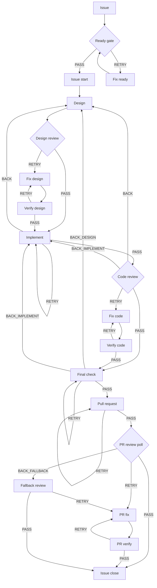

# kaji

Language: English | [Japanese](README.ja.md)

[](https://github.com/apokamo/kaji/releases)
[](pyproject.toml)
[](LICENSE)

https://github.com/user-attachments/assets/b1e3fb2e-6b92-4798-8f4c-0227b0727ce1

<p align="center">
  <a href="docs/assets/demo.mp4">Watch the terminal demo (MP4)</a>
</p>

Closed-loop agentic development for Claude Code, Codex, and Gemini CLI.

kaji turns an issue into a resumable design -> implement -> review -> fix
-> verify -> PR loop, with human-in-the-loop gates and artifact-backed
verdicts. It is built for developers who want AI agents to do real work without
turning the development process into a black box.

> `kaji` means "rudder" in Japanese: the human keeps direction, agents do the
> rowing.

## Why kaji

AI coding agents are powerful, but one-shot prompting is hard to govern. The
missing layer is often the workflow around the agent: when to design, when to
review, when to fix, when to stop, and when a human should decide.

kaji provides that layer.

- Define the development process as workflow YAML.
- Route each step to Claude Code, Codex, or Gemini CLI.
- Use bounded review/fix/verify loops instead of endless chat.
- Capture decisions as structured verdict artifacts.
- Resume from a specific step when work is interrupted.
- Keep human approval at the points that matter.

Beyond vibe coding: kaji gives AI-assisted development a loop, a log, and a
quality gate.

## How kaji compares

kaji is intentionally narrower than a general-purpose agent platform or swarm
framework. It focuses on making a repository's issue-to-PR development process
explicit, bounded, resumable, and auditable across existing coding-agent CLIs.
The comparison below is about each tool's primary abstraction, not a feature
checklist.

| Comparison | kaji | [Ruflo](https://github.com/ruvnet/ruflo) (formerly claude-flow) | [OpenHands](https://docs.openhands.dev/openhands/usage/agent-canvas/overview) | [Claude Code subagents](https://code.claude.com/docs/en/sub-agents) alone |
|---|---|---|---|---|
| Primary abstraction | A repository-owned issue-to-PR development workflow | An agent meta-harness for Claude Code and Codex | A coding-agent runtime and SDK, with Agent Canvas as a control surface | A specialized delegated agent inside a Claude Code session |
| Orchestration model | Explicit workflow YAML with named steps and transitions; each step can route to Claude Code, Codex, or Gemini CLI | Routing, swarm topologies, plugins, loops, and shared memory | Agent conversations, automations, and programmable SDK workflows; Agent Canvas can also run ACP-compatible agents | The parent session delegates parallel or nested work to agents with separate contexts |
| Review convergence | Explicit review -> fix -> verify cycles with iteration ceilings and defined exhaustion behavior | Autonomous loops, consensus mechanisms, and reusable workflow plugins | An [experimental Critic](https://docs.openhands.dev/openhands/usage/agent-canvas/critic) can score work and run bounded iterative refinement; the SDK also supports custom loops | Reviews can be composed with prompts, hooks, and delegated agents, but the subagent primitive does not prescribe an issue-to-PR review lifecycle |
| State and resume | Structured `PASS`, `RETRY`, `BACK`, and `ABORT` verdicts, per-attempt artifacts, and restart from a named workflow step | Persistent memory, agent state, telemetry, and cross-session restoration | Typed conversation events, persisted or resumed conversations, critic scores, and automation history | Results return to the parent; subagent context and transcripts can be resumed within the retained Claude Code session |
| Control boundary | Named transitions and explicit stop or exhaustion states keep human gates around issue and PR decisions | Hooks, security controls, audit features, and circuit breakers govern autonomous coordination | Action confirmation, pause and resume controls, sandbox choices, and automation management | Per-agent tools, permissions, hooks, and parent-session supervision |
| Starting point | The complete [`kaji-starter-python`](https://github.com/apokamo/kaji-starter-python) repository connects workflows, skills, `AGENTS.md`, development conventions, tests, linting, type checking, and Make targets | `ruflo init` scaffolds agents, plugins, MCP integration, hooks, memory, and supporting services | SDK and platform quickstarts, plugins, automations, sandbox backends, and examples that teams assemble around their process | Reusable agent definitions; the repository workflow and quality gates remain project choices |
| Best fit | Teams that want a governed, repeatable issue-to-PR process on top of their existing coding-agent CLIs | Broad or dynamic multi-agent systems centered on coordination, memory, and swarm behavior | Teams that need a coding-agent runtime, sandbox, browser UI, SDK, or hosted automation | Lightweight specialization and parallel delegation within Claude Code |

These tools are not mutually exclusive. Claude Code subagents can perform work
inside a kaji step. Ruflo or OpenHands may be the better center of gravity when
the primary need is broad agent coordination, a programmable or managed
runtime, or sandboxed execution.

kaji keeps the development process itself at the center: phases, bounded
feedback loops, durable verdicts, step-level resume, and human-controlled
transitions are explicit. Its starter repository delivers those pieces as one
connected system, so teams can begin with working workflow guards and quality
gates instead of designing every connection from scratch.

## How it works



Every agent step returns a verdict:

| Verdict | Meaning |
|---------|---------|
| `PASS` | Continue to the next step. |
| `RETRY` | Fix the current problem and verify again. |
| `BACK` | Return to an earlier phase, such as design or implementation. |
| `ABORT` | Stop the workflow with an explicit reason. |

The harness reads structured outputs such as `verdict.yaml`, records attempt
artifacts, and advances the workflow deterministically from each verdict.

## Core features

- **Multi-agent workflow orchestration**: run Claude Code, Codex, and Gemini CLI
  from one workflow definition.
- **Closed review loops**: model review feedback as explicit
  review -> fix -> verify cycles.
- **Interactive tmux runner**: run normal CLI agents in tmux panes while kaji
  watches for artifact-backed verdicts.
- **Headless runner**: keep existing non-interactive automation paths for CI-like
  execution.
- **Deterministic exec steps**: run subprocess steps directly when no LLM is
  needed.
- **Artifact-primary verdicts**: prefer `verdict.yaml`, then fall back to issue
  comments or stdout parsing.
- **Issue and PR lifecycle**: coordinate GitHub issue, branch, PR, review, and
  close workflows.
- **TDD and docs-as-code**: keep implementation, review, tests, and docs in the
  same process.

## Extensibility

kaji currently focuses on Claude Code, Codex, and Gemini CLI. The runner and
workflow model are designed to support additional coding-agent CLIs when there
is real demand.

Have another coding agent you want to plug into the loop? Open an issue and
tell us what workflow you want to run.

## Quick start

### Prerequisites

- Python 3.11 or newer
- `uv`
- Claude Code, Codex, or Gemini CLI installed for the agents you want to run
- `gh` authenticated if you use GitHub-backed issue and PR operations
- `tmux` 3.1 or newer if you use the interactive terminal runner
- A target repository with kaji skills under `.claude/skills/`

### Install kaji

Install from PyPI:

```bash
uv tool install kaji
kaji --help
```

For unreleased development builds, install from Git:

```bash
uv tool install git+https://github.com/apokamo/kaji.git
```

### Configure your repository

In the repository where you want to run kaji, add `.kaji/config.toml`.
The default workflow below, `.kaji/wf/dev.yaml`, is GitHub-backed because it
opens PRs, polls review state, and closes issues.

```toml
[paths]
artifacts_dir = ".kaji-artifacts"
skill_dir = ".claude/skills"
worktree_prefix = "kaji"

[execution]
default_timeout = 1800
agent_runner = "headless"
interactive_terminal_close_on_verdict = true

[provider]
type = "github"

[provider.github]
repo = "<owner>/<name>"
default_branch = "main"
git_remote = "origin"
```

For the full `.kaji/config.toml` reference, including overlays and all
available keys, see
[Configuration Reference](docs/reference/configuration.md).

For local issue storage without GitHub, use a local provider config and create a
gitignored machine overlay:

```toml
[provider]
type = "local"
```

```bash
kaji local init
```

`kaji local init` creates `.kaji/config.local.toml` for the current machine; it
does not replace the tracked base config. Local mode uses local-specific
workflows such as `.kaji/wf/dev-local.yaml`. See
[Local Mode CLI Guide](docs/cli-guides/local-mode.md)
([Japanese](docs/cli-guides/local-mode.ja.md)) for the local provider setup.

Skills live under `.claude/skills/`. Other agent-specific skill directories can
point to the same canonical skill files with symlinks.

### Run a workflow

Workflow files are run from `.kaji/wf/` in each repository. This repository
ships `.kaji/wf/dev.yaml`, `.kaji/wf/dev-thorough.yaml`, and `.kaji/wf/docs.yaml`
as the current GitHub-backed workflow set. To start a new Python project with
these workflows preconfigured, create it from the
[kaji-starter-python](https://github.com/apokamo/kaji-starter-python) template
repository and follow the
[Python Starter Guide](docs/guides/python-starter.md).

The `dev.yaml` example assumes that a GitHub issue already exists, required
skills are available, selected agent CLIs are installed, and `/issue-create` has
already been completed. The workflow runs `issue-start` itself.

Run a workflow:

```bash
kaji run .kaji/wf/dev.yaml <issue-id>
```

Resume from a specific step:

```bash
kaji run .kaji/wf/dev.yaml <issue-id> --from fix-code
```

Run only one step:

```bash
kaji run .kaji/wf/dev.yaml <issue-id> --step review-code
```

Run an explicitly ordered series of GitHub Issues:

```bash
kaji validate-series .kaji/series/my-series.yaml
kaji run-series .kaji/series/my-series.yaml --dry-run
kaji run-series .kaji/series/my-series.yaml
# after a stopped or interrupted run
kaji run-series .kaji/series/my-series.yaml --resume
```

Use `/series-create <issue>... --id <series-id>` to generate a validated definition without
starting execution. The runner advances only after the preceding workflow exits successfully and
the Issue is closed with reason `completed`.

### Develop kaji itself

Use this path only when you want to work on kaji, not just run it in another
repository:

```bash
git clone https://github.com/apokamo/kaji.git
cd kaji
uv sync
source .venv/bin/activate
kaji --help
```

## tmux interactive terminal runner

Use this when you want kaji to launch normal Claude Code or Codex CLI sessions
inside tmux panes instead of using the headless runner.

```toml
[execution]
default_timeout = 2400
agent_runner = "interactive_terminal"
interactive_terminal_close_on_verdict = true
```

Then run from inside a tmux session:

```bash
tmux new-session
kaji run .kaji/wf/dev.yaml <issue-id> --agent-runner interactive-terminal
```

The runner opens managed panes, records terminal transcripts, waits for
`verdict.yaml`, and advances the workflow. This is useful for live observation,
subscription CLI usage, and debugging agent behavior.

Read more:
[Interactive Terminal Runner](docs/cli-guides/interactive-terminal-runner.md)
([Japanese](docs/cli-guides/interactive-terminal-runner.ja.md))

## Workflow example

```yaml
name: minimal-code-review
description: "Bounded implement -> review -> fix -> verify loop"
execution_policy: auto

cycles:
  code-review:
    entry: review-code
    loop: [fix-code, verify-code]
    max_iterations: 3
    on_exhaust: ABORT

steps:
  - id: implement
    skill: issue-implement
    agent: claude
    on:
      PASS: review-code
      ABORT: end

  - id: review-code
    skill: issue-review-code
    agent: codex
    on:
      PASS: end
      RETRY: fix-code
      BACK_IMPLEMENT: implement
      ABORT: end

  - id: fix-code
    skill: issue-fix-code
    agent: claude
    on:
      PASS: verify-code
      ABORT: end

  - id: verify-code
    skill: issue-verify-code
    agent: codex
    resume: review-code
    on:
      PASS: end
      RETRY: fix-code
      ABORT: end
```

The review loop is bounded by `cycles.code-review.max_iterations`. The skill
names above match kaji's standard skill set; your repository must provide those
skill files. `model` and `effort` are optional in the YAML schema and omitted in
this compact example; production workflows often pin them.

`resume` tells kaji to continue from a previous session for the same agent when
the runner supports it.

## Documentation

| Topic | Link |
|-------|------|
| Architecture | [docs/ARCHITECTURE.md](docs/ARCHITECTURE.md) |
| Workflow overview | [docs/dev/workflow_overview.md](docs/dev/workflow_overview.md) |
| Workflow authoring | [docs/dev/workflow-authoring.md](docs/dev/workflow-authoring.md) |
| Skill authoring | [docs/dev/skill-authoring.md](docs/dev/skill-authoring.md) |
| Interactive terminal runner | [docs/cli-guides/interactive-terminal-runner.md](docs/cli-guides/interactive-terminal-runner.md) ([Japanese](docs/cli-guides/interactive-terminal-runner.ja.md)) |
| AI-driven development strategy | [docs/concepts/ai-driven-strategy.md](docs/concepts/ai-driven-strategy.md) ([Japanese](docs/concepts/ai-driven-strategy.ja.md)) |
| CLI guides | [docs/cli-guides/](docs/cli-guides/) |

## AI-readable docs

For AI assistants and crawlers, [llms.txt](llms.txt) provides a compact index of
the most important docs, commands, and workflow concepts.

## Project status

Current release: v0.12.0. kaji is under active development, and the supported
user-facing entry point is the `kaji` CLI.

The `legacy/` directory contains historical code and is not part of the current
supported runtime.

## Development

```bash
source .venv/bin/activate
make check
```

Individual targets:

```bash
make lint
make format
make typecheck
make test
make verify-docs
make verify-packaging
```

## License

Apache-2.0
