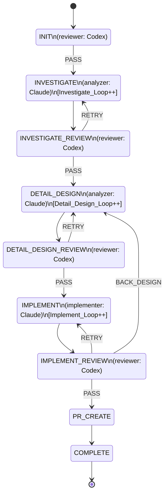
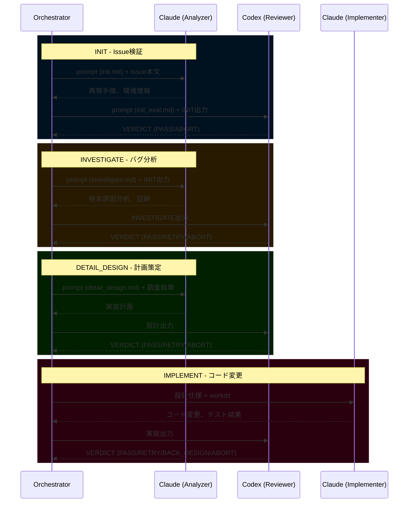
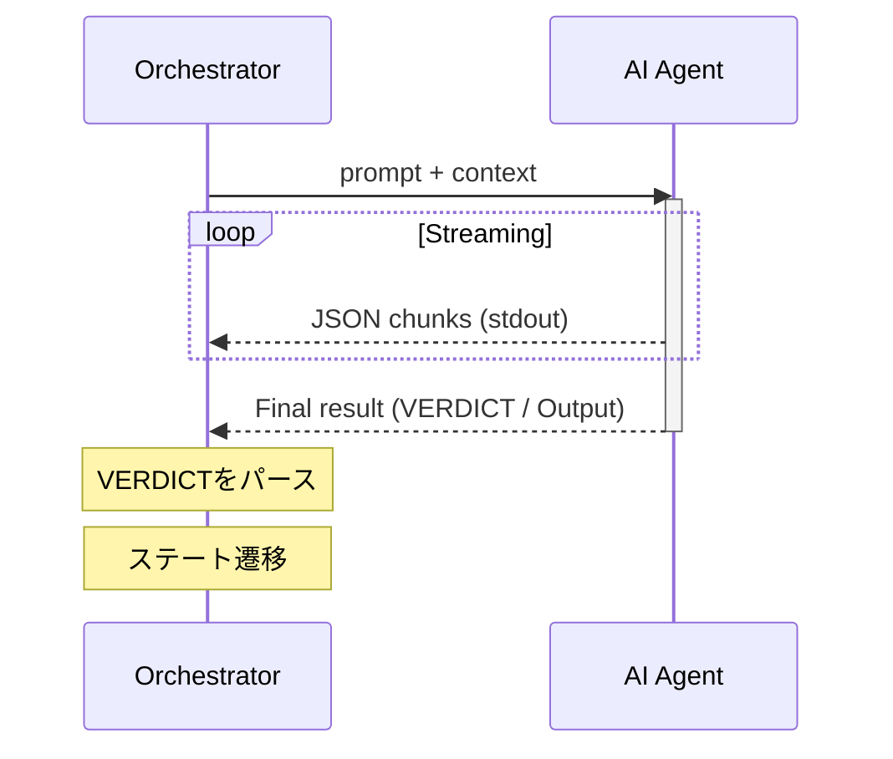
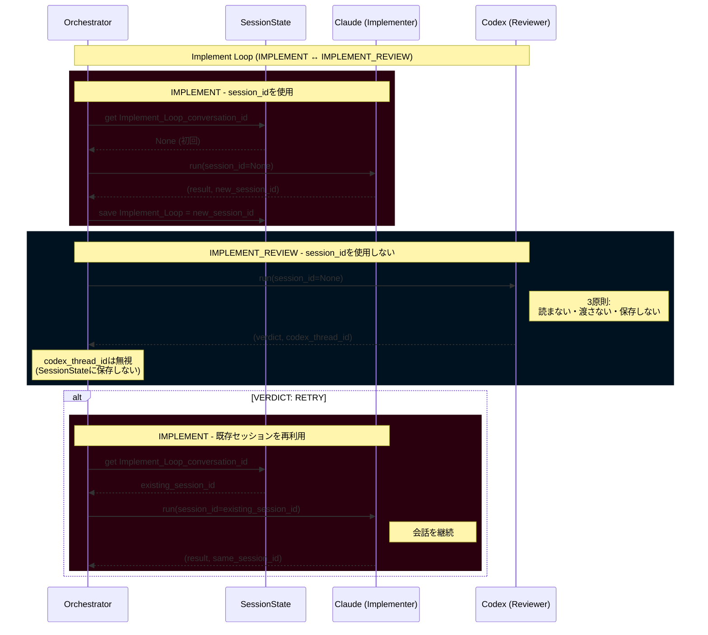
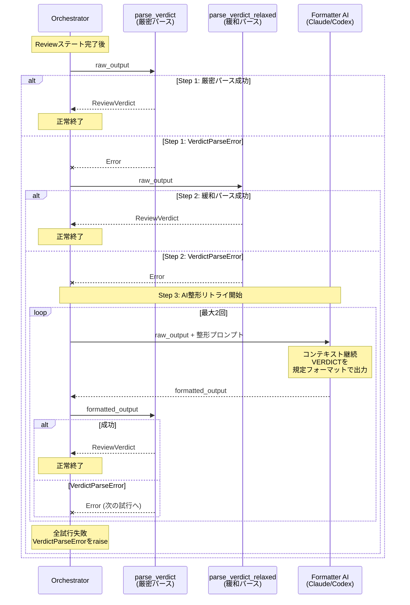

# BugfixAgent v5 アーキテクチャドキュメント

> Issue #194 プロトコル仕様と16回以上のE2Eテスト反復を統合した包括的な設計ドキュメント

**バージョン**: 2.2.0
**最終更新日**: 2025-12-18
**ステータス**: 開発中
**関連Issue**: [#194](https://github.com/apokamo/kamo2/issues/194), [#312](https://github.com/apokamo/kamo2/issues/312)

---

## 目次

1. [概要](#1-概要)
2. [ステートマシン](#2-ステートマシン)
3. [出力の標準化 (レビュー結果)](#3-出力の標準化-レビュー結果)
4. [ステートごとの定義](#4-ステートごとの定義)
5. [入力の標準化](#5-入力の標準化)
6. [データフロー](#6-データフロー)
7. [共通プロンプト](#7-共通プロンプト)
8. [終了条件](#8-終了条件)
9. [AIツール統合](#9-aiツール統合)
   - [9.5 セッション管理](#95-セッション管理)
10. [エラーハンドリングとフォールバック](#10-エラーハンドリングとフォールバック)
11. [アーキテクチャ決定記録](#11-アーキテクチャ決定記録)
12. [E2Eテスト設計](#12-e2eテスト設計)
13. [開発ガイド](#13-開発ガイド)

---

## 1. 概要

### 1.1 目的

BugfixAgent v5は、AI駆動の自律型バグ修正システムです。GitHub Issueを与えられると、以下の手順を実行します：
1. Issueの検証 (INIT)
2. バグの調査と再現 (INVESTIGATE)
3. 修正案の設計 (DETAIL_DESIGN)
4. 修正の実装 (IMPLEMENT)
5. プルリクエストの作成 (PR_CREATE)

### 1.2 問題提起

以前のバージョンでは、ステート間のインターフェースが一貫していませんでした：
- P0-1: Codexの出力フォーマットの不統一 (JSON/テキスト)
- P0-2: レビュー判定ロジックの不統一 (`blocker: Yes` vs `BLOCKED`)

根本原因：**ステートマシンレベルでのプロトコル定義の欠如**。

### 1.3 設計思想

- **プロトコルファースト**: 全ステートでレビュー結果フォーマットを統一
- **関心の分離**: 各AIモデルが特定の役割を持つ
- **フェイルセーフ設計**: サーキットブレーカー、リトライ制限、フォールバックメカニズム
- **可観測性**: JSONLロギング、リアルタイムストリーミング、構造化されたアーティファクト

---

## 2. ステートマシン

### 2.1 ステート図 (9ステート)



> **注**: `ABORT` はどのステートからでも例外的な終了として発生する可能性があるため、図には示していません。

### 2.2 ステート数の変遷

- **旧**: 11ステート (QA/QA_REVIEWあり)
- **新**: 9ステート (QA機能をIMPLEMENT_REVIEWに統合)

### 2.3 ステートEnum定義

```python
class State(Enum):
    INIT = auto()                # Issue検証
    INVESTIGATE = auto()         # 再現・調査
    INVESTIGATE_REVIEW = auto()  # 調査レビュー
    DETAIL_DESIGN = auto()       # 詳細設計
    DETAIL_DESIGN_REVIEW = auto()# 設計レビュー
    IMPLEMENT = auto()           # 実装
    IMPLEMENT_REVIEW = auto()    # 実装レビュー (QA統合)
    PR_CREATE = auto()           # PR作成
    COMPLETE = auto()            # 完了
```

---

## 3. 出力の標準化 (レビュー結果)

### 3.1 Statusキーワード (4種類)

| Status | 意味 | 遷移 | 備考 |
|---------|------|------|------|
| `PASS` | 成功、進行 | 次のステート | 正常フロー |
| `RETRY` | 同一ステートのリトライ | 同一ステート (ループ) | 軽微な問題 |
| `BACK_DESIGN` | 設計の見直しが必要 | DETAIL_DESIGN | 設計レベルの問題 |
| `ABORT` | **継続不可、即時終了** | **終了** | 環境/外部要因 |

### 3.2 出力フォーマット (必須)

> **注**: 旧ドキュメントでは `Review Result` / `Status` を使用していた。
> 現在は実装との整合性のため `VERDICT` / `Result` が正式な用語である。
> 他のドキュメント（E2E_TEST_FINDINGS.md 等）に旧用語が残っている場合があるが、
> 本ドキュメントの `VERDICT` / `Result` を正とすること。

```markdown
## VERDICT
- Result: PASS | RETRY | BACK_DESIGN | ABORT
- Reason: <判定理由>
- Evidence: <証拠/発見事項>
- Suggestion: <次のアクションの提案> (ABORTの場合は必須)
```

**重要**: 出力は必ず **stdout** に行ってください。`gh issue comment` の引数経由で出力しないでください。

### 3.3 パースロジック

**注記**: 以下は概念的な擬似コードです。実際の実装は `bugfix_agent/verdict.py` を参照してください。

```python
class Verdict(Enum):
    PASS = "PASS"
    RETRY = "RETRY"
    BACK_DESIGN = "BACK_DESIGN"
    ABORT = "ABORT"

def parse_verdict(text: str) -> Verdict:
    """テキストからVERDICTをパース（3ステップのハイブリッドフォールバック）

    Verdict enum のみを返す。ABORT は Verdict.ABORT として返され、
    AgentAbortError として発生させない（責務分離）。
    """
    # Step 1: 厳密パース - \w+ で拾ってからEnum検証
    match = re.search(r"Result:\s*(\w+)", text, re.IGNORECASE)
    if match:
        result_str = match.group(1).upper()
        try:
            return Verdict(result_str)  # マッチすれば Verdict.ABORT を返す
        except ValueError:
            # 不正な値（例: "PENDING"）→ 即座に例外
            raise InvalidVerdictValueError(f"Invalid VERDICT: {result_str}")

    # Step 2: 緩和パース（複数パターン）
    # Step 3: AI Formatter リトライ
    # ... (完全な実装は verdict.py を参照)

    raise VerdictParseError("No VERDICT Result found in output")

def handle_abort_verdict(verdict: Verdict, text: str) -> Verdict:
    """オーケストレーターの責務: ABORT を検知し AgentAbortError を発生

    注記: extract_field() は擬似コードです。実際の実装では
    verdict.py の _extract_verdict_field() を使用しています。
    """
    if verdict == Verdict.ABORT:
        # 複数のフィールド名をフォールバックで試行 (Summary/Reason, Next Action/Suggestion)
        reason = extract_field(text, "Summary") or extract_field(text, "Reason") or "No reason provided"
        suggestion = extract_field(text, "Next Action") or extract_field(text, "Suggestion") or ""
        raise AgentAbortError(reason, suggestion)
    return verdict  # ABORT でない場合はそのまま返す
```

### 3.4 レビュー結果遷移表

#### 作業ステート (Work States)

作業ステートはアーティファクトを生成し、対応するレビュー(REVIEW)ステートに自動遷移します。レビュー結果の出力はありません。

| 現在のステート | アーティファクト | 次のステート |
|--------------|----------------|-------------|
| INVESTIGATE | 調査結果 | -> INVESTIGATE_REVIEW |
| DETAIL_DESIGN | 設計ドキュメント | -> DETAIL_DESIGN_REVIEW |
| IMPLEMENT | 実装コード | -> IMPLEMENT_REVIEW |
| PR_CREATE | PR | -> COMPLETE |

> **例外**: 作業中に回復不能な問題が発生した場合、`ABORT` -> 終了

#### INIT / REVIEW ステート

レビュー結果を出力し、Resultに応じて遷移します。

| 現在のステート | PASS | RETRY | BACK_DESIGN | ABORT |
|--------------|------|-------|-------------|-------|
| **INIT** | INVESTIGATE | - | - | 終了 |
| **INVESTIGATE_REVIEW** | DETAIL_DESIGN | INVESTIGATE | - | 終了 |
| **DETAIL_DESIGN_REVIEW** | IMPLEMENT | DETAIL_DESIGN | - | 終了 |
| **IMPLEMENT_REVIEW** | PR_CREATE | IMPLEMENT | DETAIL_DESIGN | 終了 |
| **PR_CREATE** | COMPLETE | - | - | 終了 |

> `-` = そのステートでは許可されていないStatus

---

## 4. ステートごとの定義

### 4.1 INIT

#### 役割
Issue本文にバグ修正を開始するための最低限の情報が含まれているか検証します。
再現、環境構築、ブランチ操作などの**実行は行いません**。

#### 検証項目

| # | 項目 | 必須 | 基準 |
|---|------|:----:|------|
| 1 | **環境メタ情報** | 任意 | あれば使用。なければINVESTIGATEで判断 |
| 2 | **現象 (Symptom)** | 必須 | 何が問題か理解できること |
| 3 | **再現手順** | 必須 | 手順形式でなくても、再現のヒントがあればOK |
| 4 | **期待される動作** | 任意 | 現象/再現手順から推測可能ならOK |
| 5 | **実際の動作** | 任意 | 問題が明確なら概要レベルでOK |

> **方針**: 現象が理解でき、調査の手がかりがあればPASSとします。完璧なバグ報告を求めないでください。

#### 出力フォーマット

```markdown
### INIT / Issue Summary
- Issue: ${issue_url}
- Symptom: <Issue本文からの内容>
- Reproduction: <内容 または "No details (INVESTIGATE will determine)">
- Expected/Actual: <内容 または "Inferred: ...">

## VERDICT
- Result: PASS | ABORT
- Reason: <判定理由>
- Evidence: <証拠>
- Suggestion: <ABORTの場合: 最低限必要な追記内容>
```

#### 判定

| 状況 | Status | 理由 |
|------|--------|------|
| 現象が理解でき、調査の手がかりがある | PASS | INVESTIGATEに進める |
| 何が問題か全く不明 | ABORT | 人間に最低限の情報の追記を依頼 |

---

### 4.2 INVESTIGATE

#### 役割
再現手順を実行し、原因を調査します。

#### 必須出力

| # | 項目 | 説明 |
|---|------|------|
| 1 | **証拠付き再現手順** | 実行した手順と結果 (証拠: `${artifacts_dir}`) |
| 2 | **期待値との乖離** | 期待される動作との違い |
| 3 | **原因仮説** | 根拠を伴う考えられる原因 |
| 4 | **補足情報** | その他有用な情報 |

#### 出力フォーマット

```markdown
## Bugfix agent INVESTIGATE

### INVESTIGATE / Reproduction Steps
1. ... (evidence: <filename>)

### INVESTIGATE / Deviation from Expected
- ...

### INVESTIGATE / Cause Hypothesis
- Hypothesis A: <rationale>

### INVESTIGATE / Supplementary Info
- ...
```

---

### 4.3 INVESTIGATE_REVIEW

#### 完了基準

| # | チェック項目 | 基準 |
|---|-------------|------|
| 1 | 証拠付き再現手順 | 手順が実行され、証拠が存在すること |
| 2 | 期待値との乖離 | 乖離の具体的な記述があること |
| 3 | 原因仮説 | 根拠のある仮説が少なくとも1つあること |
| 4 | 補足情報 | セクションが存在すること (内容は任意) |

#### 判定

| Status | 遷移 |
|--------|------|
| PASS | DETAIL_DESIGN |
| RETRY | INVESTIGATE |
| ABORT | 終了 |

---

### 4.4 DETAIL_DESIGN

#### 必須出力

| # | 項目 | 説明 |
|---|------|------|
| 1 | **実装手順付き変更計画** | 対象ファイル/関数、変更内容、手順、コードスニペット |
| 2 | **テストケースリスト** | 目的、入力、期待される結果 |
| 3 | **補足情報** | 注意点、リスク |

#### 出力フォーマット

```markdown
## Bugfix agent DETAIL_DESIGN

### DETAIL_DESIGN / Change Plan
- Target: <file/function>
- Implementation steps: 1. ... 2. ...

### DETAIL_DESIGN / Test Cases
| ID | Purpose | Input | Expected Result |

### DETAIL_DESIGN / Supplementary
- ...
```

---

### 4.5 DETAIL_DESIGN_REVIEW

#### 完了基準

| # | チェック項目 | 基準 |
|---|-------------|------|
| 1 | 実装手順付き変更計画 | 実装に十分な詳細があること |
| 2 | テストケースリスト | 目的、入力、期待される結果が揃っていること |
| 3 | 補足情報 | セクションが存在すること |

#### 判定

| Status | 遷移 |
|--------|------|
| PASS | IMPLEMENT |
| RETRY | DETAIL_DESIGN |
| ABORT | 終了 |

---

### 4.6 IMPLEMENT

#### 必須出力

| # | 項目 | 説明 |
|---|------|------|
| 1 | **作業ブランチ情報** | ブランチ名と最新コミットID |
| 2 | **テスト実行結果** | E(既存)/A(追加)タグ、Pass/Fail、証拠 |
| 3 | **補足情報** | 残作業、注意点 |

#### 出力フォーマット

```markdown
## Bugfix agent IMPLEMENT

### IMPLEMENT / Working Branch
- Branch: fix/${issue_number}-xxx
- Commit: <sha>

### IMPLEMENT / Test Results
| Test | Tag | Result | Evidence |

### IMPLEMENT / Supplementary
- ...
```

#### カバレッジエラーハンドリング (E2Eテスト14からのADR)

カバレッジプラグインが失敗した場合、`pytest --no-cov` でリトライします。

---

### 4.7 IMPLEMENT_REVIEW (QA統合)

#### 役割
**最終ゲート**: 実装完了チェック + ソースレビュー + 追加検証。

#### 完了基準

| # | チェック項目 | 基準 |
|---|-------------|------|
| 1 | 作業ブランチ情報 | ブランチ名とコミットIDが存在すること |
| 2 | テスト実行結果 | E/Aタグ付けされ、全テストがパスしていること |
| 3 | ソースレビュー | diff + 既存コードとの整合性、可読性、境界条件 |
| 4 | 追加検証 | 計画外の観点からの検証 (不要な場合はN/A可) |
| 5 | 残存課題/注意点 | セクションが存在すること (なければ明記) |

#### 出力フォーマット

```markdown
## VERDICT
- Result: PASS | RETRY | BACK_DESIGN
- Reason: <判定理由>
- Evidence:
  - Working branch info: OK/NG
  - Test execution results: OK/NG (Pass: X/Y)
  - Source review: OK/NG
  - Additional verification: OK/NG/N/A
  - Remaining issues/cautions: OK/NG
- Suggestion: <改善指示>
```

#### 判定

| Status | 遷移 | 条件 |
|--------|------|------|
| PASS | PR_CREATE | 全項目OK、全テストパス |
| RETRY | IMPLEMENT | 軽微な実装上の問題 |
| BACK_DESIGN | DETAIL_DESIGN | 設計レベルの問題 |
| ABORT | 終了 | 継続不可 |

---

### 4.8 PR_CREATE

#### 役割
`gh` CLIを使用してプルリクエストを作成し、そのURLをIssueで共有します。

#### プロセス
1.  **Git情報の取得**: ハンドラは現在のブランチ名とコミットSHAを取得します。
2.  **PRの構築**: プルリクエストのタイトルと本文が構築されます。タイトルは`fix: issue #<issue_number>`の形式に従い、本文にはIssueへのリンク、簡単な要約、ブランチ/コミット情報が含まれます。
3.  **`gh pr create`の実行**: 構築されたタイトルと本文で`gh pr create`コマンドが実行されます。
4.  **Issueへのコメント**: 新しく作成されたプルリクエストのURLがコマンドの出力から抽出され、元のGitHub Issueにコメントとして投稿されます。
5.  **遷移**: その後、ステートマシンは`COMPLETE`に遷移します。

---

## 5. 入力の標準化

### 5.1 プロンプトテンプレート変数

| 変数 | 説明 | 対象ステート |
|------|------|-------------|
| `${issue_url}` | Issue URL | 全ステート |
| `${issue_number}` | Issue番号 | 全ステート |
| `${artifacts_dir}` | 証拠保存場所 | 作業ステート |
| `${state_name}` | 現在のステート名 | 全ステート |
| `${loop_count}` | ループ回数 (1始まり) | ループ対象 |
| `${max_loop_count}` | 最大ループ回数 | ループ対象 |

### 5.2 コンテキスト取得

- `${issue_url}` をエージェントに渡す
- エージェントは `gh issue view` 経由で最新のIssue本文を取得する
- **Issue本文が唯一の信頼できる情報源 (Single Source of Truth)**

---

## 6. データフロー

### 6.1 役割分担

| 出力先 | 内容 | タイミング |
|--------|------|------------|
| **コメント** | 作業ログ、詳細、試行錯誤 | 各ステート実行時 (常時) |
| **本文追記** | 確定したアーティファクト | レビューPASS時のみ |

### 6.2 フロー

```
作業ステート実行 (INVESTIGATE など)
  -> コメント投稿: [STATE_NAME] Detailed work log...

レビューステート実行 (INVESTIGATE_REVIEW など)
  -> コメント投稿: [STATE_NAME] VERDICT: PASS/RETRY/...
  -> PASSの場合: 確定したセクションを本文に追記
  -> RETRYの場合: 本文追記なし (作業ステートに戻る)
```

### 6.3 最終的なIssue本文構造

```markdown
## Summary
<元のIssue内容>

---

## INVESTIGATE (Finalized)
- Reproduction steps: ...
- Cause hypothesis: ...
- Evidence: ...

## DETAIL_DESIGN (Finalized)
- Approach: ...
- Test cases: ...

## IMPLEMENT (Finalized)
- Branch: fix/151-xxx
- Changed files: ...
- Test results: All passed
```

### 6.4 メリット

| 側面 | 効果 |
|------|------|
| **クリーンな本文** | 確定情報のみ、試行錯誤なし |
| **編集競合なし** | 作業中はコメントのみ、本文編集はPASS時のみ |
| **履歴追跡** | すべての試行はコメント経由で追跡可能 |
| **人間にとって見やすい** | 本文を見れば最新の確定状態がわかる |

---

## 7. 共通プロンプト

### 7.1 目的

各ステートのプロンプトに共通プロンプトを付加することで、全エージェントに共通ルールを適用します。

### 7.2 ファイル構造

```
prompts/
├── _common.md              # 共通プロンプト
├── init.md
├── investigate.md
├── investigate_review.md
├── detail_design.md
├── detail_design_review.md
├── implement.md
├── implement_review.md

```

### 7.3 共通プロンプト内容

```markdown
---
# Common Rules (Required reading for all states)

## Output Format (Required)

On task completion, always output in the following format:

## VERDICT
- Result: PASS | RETRY | BACK_DESIGN | ABORT
- Reason: <judgment reason>
- Evidence: <evidence>
- Suggestion: <next action suggestion> (required for ABORT)

**IMPORTANT**: Always output to stdout. Do not include in gh command arguments.

## Status Keywords

| Status | Meaning | Usage Condition |
|--------|---------|-----------------|
| PASS | Success | Task complete, can proceed to next state |
| RETRY | Retry | Minor issues, retry same state |
| BACK_DESIGN | Design return | Design issues, return to DETAIL_DESIGN |
| ABORT | Abort | Cannot continue, immediate exit |

## ABORT Conditions

Output ABORT and exit immediately for:
- Environment errors (Docker not running, DB connection failed)
- Permission issues (file write denied, API auth failed)
- External blockers (required info missing from Issue)
- Unexpected errors (tool execution error, timeout)
- Situations requiring human intervention

## Prohibited Actions

- Do not use sleep commands to wait
- Do not poll waiting for problem resolution
- Do not ignore blockers and continue
- Do not end task without VERDICT

## Issue Operation Rules

- Comment: gh issue comment ${issue_number} --body "..."
- Get body: gh issue view ${issue_number}
- Edit body: Only on review PASS (work states do not edit)

## Evidence Storage

Save logs, screenshots, etc. to ${artifacts_dir}.
```

### 7.4 load_prompt() 拡張

```python
def load_prompt(state_name: str, **kwargs) -> str:
    """Concatenate state-specific prompt + common prompt"""
    state_prompt = _load_template(f"{state_name}.md", **kwargs)
    common_prompt = _load_template("_common.md", **kwargs)
    return f"{state_prompt}\n\n{common_prompt}"
```

---

## 8. 終了条件

### 8.1 終了タイプ

| 終了タイプ | トリガー | 終了ステータス | 場所 |
|------------|----------|----------------|------|
| 正常完了 | PR_CREATE -> COMPLETE | `COMPLETE` | PR_CREATE |
| エージェント判断 | `VERDICT: ABORT` | `ABORTED` | 全ステート |
| ループ制限 | `*_Loop >= max_loop_count` | `LOOP_LIMIT` | ループ対象ステート |
| ツールエラー | CLI実行失敗、タイムアウト | `ERROR` | 全ステート |

### 8.2 サーキットブレーカー (ループ制限)

| ループカウンタ | インクリメント場所 | 制限 |
|----------------|--------------------|------|
| `Investigate_Loop` | INVESTIGATE | 3 (設定可能) |
| `Detail_Design_Loop` | DETAIL_DESIGN | 3 (設定可能) |
| `Implement_Loop` | IMPLEMENT | 3 (設定可能) |

### 8.3 レガシーキーワード移行

| 旧キーワード | 新キーワード | 備考 |
|--------------|--------------|------|
| `OK` | `PASS` | INITで統一 |
| `NG` | `ABORT` | Issue情報不足で継続不可 |
| `BLOCKED` | `RETRY` | 同一ステートリトライ |
| `FIX_REQUIRED` | `RETRY` | 実装修正 |
| `DESIGN_FIX` | `BACK_DESIGN` | 設計戻し |

---

## 9. AIツール統合

### 9.1 役割分担

| ツール | 役割 | 責務 | デフォルトモデル |
|--------|------|------|------------------|
| **Claude** | Analyzer | Issue分析、ドキュメント作成、設計 | claude-opus-4 |
| **Codex** | Reviewer | コードレビュー、判定、Web検索 | gpt-5.2 |
| **Claude** | Implementer | ファイル操作、コマンド実行 | claude-opus-4 |

### 9.2 ツールプロトコル

```python
class AIToolProtocol(Protocol):
    def run(
        self,
        prompt: str,
        context: str | list[str] = "",
        session_id: str | None = None,
        log_dir: Path | None = None,
    ) -> tuple[str, str | None]:
        """Execute AI tool and return (response, session_id)"""
        ...
```

### 9.3 CLI統合詳細

#### GeminiTool
```bash
gemini -o stream-json --allowed-tools run_shell_command,web_fetch --approval-mode yolo "<prompt>"
```

#### CodexTool
```bash
# New session
codex --dangerously-bypass-approvals-and-sandbox exec --skip-git-repo-check \
  -m codex-mini -C <workdir> -s workspace-write --enable web_search_request --json "<prompt>"

# Resume session (ADR from E2E Test 11)
codex --dangerously-bypass-approvals-and-sandbox exec --skip-git-repo-check \
  resume <thread_id> -c 'sandbox_mode="danger-full-access"' "<prompt>"
```

#### ClaudeTool (ADR from E2E Test 15)
```bash
claude -p --output-format stream-json --verbose --model claude-sonnet-4 \
  --dangerously-skip-permissions "<prompt>"
```
**重要**: 正しい作業ディレクトリを `cwd` に設定する必要があります。

### 9.4 エージェント呼び出しシーケンス

オーケストレータはバグ修正ワークフロー全体で複数のAIエージェントを調整します。
各ステートは、専門的な役割に基づいて特定のエージェントを呼び出します。



#### エージェントの役割

| エージェント | 役割 | 担当ステート |
|-------------|------|--------------|
| **Claude** | Analyzer (分析) | INIT, INVESTIGATE, DETAIL_DESIGN |
| **Codex** | Reviewer (レビュー) | INIT (review), INVESTIGATE_REVIEW, DETAIL_DESIGN_REVIEW, IMPLEMENT_REVIEW |
| **Claude** | Implementer (実装) | IMPLEMENT |

#### 各ステートの呼び出しフロー

| ステート | エージェント | 入力 | 出力 |
|----------|--------------|------|------|
| INIT | Claude | Issue本文, prompts/init.md | 再現手順、環境情報 |
| INIT (review) | Codex | INIT出力, prompts/init_eval.md | VERDICT (PASS/ABORT) |
| INVESTIGATE | Claude | INIT出力, prompts/investigate.md | 根本原因分析、証跡 |
| INVESTIGATE_REVIEW | Codex | INVESTIGATE出力 | VERDICT (PASS/RETRY/ABORT) |
| DETAIL_DESIGN | Claude | 調査結果, prompts/detail_design.md | 実装計画 |
| DETAIL_DESIGN_REVIEW | Codex | 設計出力 | VERDICT (PASS/RETRY/ABORT) |
| IMPLEMENT | Claude | 設計仕様, workdir | コード変更、テスト結果 |
| IMPLEMENT_REVIEW | Codex | 実装出力 | VERDICT (PASS/RETRY/BACK_DESIGN/ABORT) |


#### 通信プロトコル



各エージェント呼び出しは以下のパターンに従います:
1. オーケストレータが `load_prompt(state, **kwargs)` でプロンプトを構築
2. オーケストレータが `agent.run(prompt, context, session_id, log_dir)` を呼び出し
3. エージェントがJSON出力をstdoutにストリーミング（オーケストレータがキャプチャ）
4. オーケストレータが出力からVERDICTをパース
5. VERDICTのステータスに基づいてステート遷移

### 9.5 セッション管理

#### 目的

セッション管理により、AIツールが適切に会話コンテキストを維持しつつ、異なるツール間でのセッションID競合を防止します。

#### 設計原則

**作業ステート** (INVESTIGATE, DETAIL_DESIGN, IMPLEMENT):
- 同一ツール内での会話継続のため `session_id` を使用可能
- `active_conversations` dict にセッションIDを保存して次回イテレーションで再利用

**REVIEWステート** (INIT, INVESTIGATE_REVIEW, DETAIL_DESIGN_REVIEW, IMPLEMENT_REVIEW):
- **3原則**: 読まない・渡さない・保存しない
- 会話コンテキストを必要とせず、成果物を独立して評価
- 常に `session_id=None` でツールを呼び出す
- 返却されたセッションIDを `active_conversations` に保存しない

#### セッションIDフロー



#### セッション共有ルール

| セッションキー | 共有ステート | ツール | 備考 |
|----------------|--------------|--------|------|
| `Design_Thread_conversation_id` | INVESTIGATE, DETAIL_DESIGN | Claude | 同一ツール、同一スレッド |
| `Implement_Loop_conversation_id` | IMPLEMENTのみ | Claude | IMPLEMENT_REVIEWとは共有しない |

> **警告**: REVIEWステートは作業ステートとは異なるツール（Codex）を使用します。ClaudeのセッションIDをCodexに渡すと、クロスツールセッション再開によるハングが発生します。[Issue #312](https://github.com/apokamo/kamo2/issues/312) を参照。

#### 実装パターン

```python
# 作業ステート (例: IMPLEMENT) - session_idを使用
def handle_implement(ctx: AgentContext, state: SessionState) -> State:
    impl_session = state.active_conversations["Implement_Loop_conversation_id"]

    result, new_session = ctx.implementer.run(
        prompt=prompt,
        session_id=impl_session,  # 既存セッションを渡す
        log_dir=log_dir,
    )

    if not impl_session and new_session:
        state.active_conversations["Implement_Loop_conversation_id"] = new_session

    return State.IMPLEMENT_REVIEW


# REVIEWステート (例: IMPLEMENT_REVIEW) - 3原則
def handle_implement_review(ctx: AgentContext, state: SessionState) -> State:
    # Issue #312: 3原則（読まない・渡さない・保存しない）
    # 読まない: impl_session変数なし
    # 渡さない: session_id=None
    # 保存しない: 返却されたsession_idは無視 (_)

    decision, _ = ctx.reviewer.run(
        prompt=prompt,
        session_id=None,  # REVIEWステートは常にNone
        log_dir=log_dir,
    )

    # VERDICTをパースして次のステートを返す
    return parse_and_transition(decision)
```

#### 関連Issue

- [Issue #312](https://github.com/apokamo/kamo2/issues/312): クロスツールセッションID共有によるIMPLEMENT_REVIEWのハング
- [Issue #314](https://github.com/apokamo/kamo2/issues/314): セッション共有ステート間のconfigバリデーション

---

## 10. エラーハンドリングとフォールバック

### 10.1 ハイブリッドフォールバックパーサー (E2Eテスト16からのADR)

AIの出力は非決定的です。ハイブリッドフォールバックにより、複数のパース戦略を通じて高いパース成功率を達成します。

#### 背景

E2Eテスト16で `VerdictParseError: No VERDICT Result found in output` が発生しました。
原因は、AI（Codex/Claude）がVERDICTをstdoutではなく`gh issue comment`コマンドの引数として出力したため、
パーサーが抽出できなかったことです。

AI出力は本質的に非決定的であり、出力形式のばらつきを完全に防ぐことは困難です。
そこで、ハイブリッド・フォールバック機構を導入し、堅牢なパースを実現します。

#### 設計オプション

| オプション | 説明 | コスト | 堅牢性 |
|------------|------|--------|--------|
| A. AIリトライのみ | パース失敗→AI整形リトライ | 高 | 良好 |
| B. 正規表現の緩和 | 複数パターンでResult/Statusを探索 | 低 | 中程度 |
| C. 複数パターン抽出 | stdout全体から探索 | 低 | 中程度 |
| **D. ハイブリッド（採用）** | B+Cを先に試し、失敗時のみA | 中 | 優秀 |

#### シーケンス図



#### 簡易フロー

```
Step 1: Strict Parse ──(success)──> Return VERDICT
        │
        (fail)
        v
Step 2: Relaxed Parse ──(success)──> Return VERDICT
        │
        (fail)
        v
Step 3: AI Formatter Retry (max 2 attempts)
        │
        ├──(success)──> Return VERDICT
        │
        └──(all fail)──> Raise VerdictParseError
```

#### Step 1: Strict Parse
```python
# \w+ で拾ってからEnum変換で検証
match = re.search(r"Result:\s*(\w+)", text, re.IGNORECASE)
if match:
    result_str = match.group(1).upper()
    try:
        return Verdict(result_str)  # 有効値: PASS, RETRY, BACK_DESIGN, ABORT
    except ValueError:
        # 不正な値（例: "PENDING", "WAITING"）は即座に例外発生
        raise InvalidVerdictValueError(f"Invalid VERDICT: {result_str}")
```

#### Step 2: Relaxed Parse
```python
# すべてのパターンを有効なVERDICT値のみに制限
VALID_VALUES = r"(PASS|RETRY|BACK_DESIGN|ABORT)"
patterns = [
    rf"Result:\s*{VALID_VALUES}",           # Standard
    rf"-\s*Result:\s*{VALID_VALUES}",       # List format
    rf"\*\*Status\*\*:\s*{VALID_VALUES}",   # Bold format
    rf"ステータス:\s*{VALID_VALUES}",        # Japanese
    rf"Status\s*=\s*{VALID_VALUES}",        # Assignment format
]
```

#### Step 3: AI Formatter
```python
FORMATTER_PROMPT = """Extract VERDICT from the following output...
## VERDICT
- Result: <PASS|RETRY|BACK_DESIGN|ABORT>
- Reason: <1-line summary>
...
"""
```

**内部フォールバック**: AI整形後の出力は以下の順でパースされます:
1. 厳密パーサー（Step 1パターン）
2. 緩和パーサー（Step 2パターン）（厳密パースが失敗した場合）
これにより、AIが `Status:` 形式で返す場合にも対応します。

#### 責務分離

- **`parse_verdict()`**: `Verdict` enum のみを返す（`Verdict.ABORT` を含む）
  - `AgentAbortError` は発生させない
  - `ABORT` は有効なverdict値として扱い、例外ではない
- **`handle_abort_verdict()`**: オーケストレーターが `ABORT` を検知し `AgentAbortError` を発生
  - パースロジックとabortハンドリングを分離
  - すべてのステートで一貫したverdictパースを可能にする

#### InvalidVerdictValueError

不正なVERDICT値（例: `PENDING`, `WAITING`, `UNKNOWN`）は即座に例外を発生させます:

```python
class InvalidVerdictValueError(VerdictParseError):
    """不正なVERDICT値が含まれる場合に発生（プロンプト違反）"""
    pass
```

**特性**:
- **フォールバック対象外**: プロンプト違反または実装バグを示すため
- **即座に失敗**: リトライ試行なし
- **不正な値の例**: `PENDING`, `WAITING`, `IN_PROGRESS`, `UNKNOWN`

#### 出力トランケート戦略

AI出力が長さ制限を超える場合、head+tail方式でトランケートします:

```python
AI_FORMATTER_MAX_INPUT_CHARS = 8000  # AI Formatter への最大入力文字数
# delimiter で分割: 概ね半分ずつ head + tail
```

**理由**:
- VERDICTは通常、出力の末尾に現れる
- 末尾を保持することでVERDICT捕捉を確実にする
- 先頭はデバッグ用のコンテキストを提供
- delimiter (`\n...[truncated]...\n`) で分割位置を示す

### 10.2 フォールバック戦略の効果

多層的なフォールバックアプローチにより、堅牢なパースを実現します:
- **Step 1 (Strict)**: 適切にフォーマットされた出力の大部分を処理
- **Step 2 (Relaxed)**: 軽微なフォーマットのバリエーションをキャッチ
- **Step 3-1 (AI 1st)**: 大きなフォーマット逸脱から回復
- **Step 3-2 (AI 2nd)**: 強化されたプロンプトによる最終試行
- **完全失敗**: 手動介入が必要な稀なケース

#### 運用ガイダンス

**VerdictParseError が発生した場合**（全ステップ失敗）:
- **根本原因**: `Result:` 行が見つからない、または誤った場所（例: `gh comment` 引数）に出力された
- **修正者**: プロンプトエンジニア - ステートプロンプトを見直し、VERDICTをstdoutに出力するよう修正
- **デバッグ用アーティファクト**（優先順位順に確認）:
  1. **`stdout.log`**: 生のAI CLI出力（パースエラーの最も可能性が高い場所）
  2. **`cli_console.log`**: 整形済みの人間可読出力
  3. **`stderr.log`**: CLIツールからのエラーメッセージ
  4. **`run.log`**: JSONL実行ログ（オーケストレーターレベル）
  - bugfix-agentパス: `test-artifacts/bugfix-agent/<issue-number>/<YYMMDDhhmm>/<state>/`
  - E2Eパス: `test-artifacts/e2e/<fixture>/<timestamp>/`
- **即座の対応**: 出力に `Result:` が存在するか確認。`gh` コマンド引数にある場合、プロンプトを更新

**InvalidVerdictValueError が発生した場合**（不正なverdict値）:
- **根本原因**: AIが不正な値（例: `PENDING`, `WAITING`）を出力 - プロンプト違反または実装バグ
- **修正者**:
  - 値が概念的に妥当 → 実装チームが Verdict enum に追加
  - 値が無意味 → プロンプトエンジニアがステートプロンプトを修正
- **回復不能**: フォールバック試行なし - 根本的な問題を示す
- **デバッグ**: AI出力を確認し、なぜ不正な値が選択されたかを調査

**AI Formatter 起動基準**:
- Step 1とStep 2が両方失敗した後、自動的にトリガー
- 約0.5-1秒の遅延と追加のAPIコストが発生
- `stdout.log` を確認し、「All parse attempts failed (Step 1-2)」や「All N AI formatter attempts failed」といった例外メッセージを検索

### 10.3 例外階層

```
Exception
├── ToolError                    # AI tool returned "ERROR"
├── LoopLimitExceeded            # Circuit breaker triggered
├── VerdictParseError            # Review output parse failure
│   └── InvalidVerdictValueError # 不正なVERDICT値（フォールバック対象外）
└── AgentAbortError              # Explicit ABORT from AI
    ├── reason: str
    └── suggestion: str
```

---

## 11. アーキテクチャ決定記録 (ADR)

### ADR-001: QA/QA_REVIEW 統合

**背景**: 当初の11ステート設計では、QAとQA_REVIEWステートが分かれていた。

**決定**: QA機能をIMPLEMENT_REVIEWに統合する。

**根拠**: QAは本質的に実装検証である。ステートマシンの複雑さを軽減するため。

---

### ADR-002: VERDICT フォーマットの統一 (E2Eテスト12-13, Issue #293)

**背景**: E2Eテスト12で `VerdictParseError` が発生した。VERDICTがstdoutではなく `gh issue comment` 経由で出力されていた。

**決定**:
- 用語の標準化: `VERDICT` と `Result` フィールド
- フィールドの標準化: `Reason`, `Evidence`, `Suggestion`
- 明示的な指示を追加: "**Must output to stdout**"
- recency bias 対策として各レビュープロンプト末尾にポインタを追加 (Issue #293)

**注記**: 旧ドキュメントでは `Review Result` / `Status` という用語を使用していたが、実装との整合性のため `VERDICT` / `Result` に統一した。

---

### ADR-003: カバレッジエラーハンドリング (E2Eテスト14)

**背景**: 環境の問題により、カバレッジ付きpytestが失敗した。

**決定**: IMPLEMENTプロンプトにカバレッジフォールバック指示を追加: "On coverage error, retry with `pytest --no-cov`"

---

### ADR-004: Claude CLIの作業ディレクトリ (E2Eテスト15)

**背景**: Claude CLIが誤ったディレクトリで実行され、ファイル操作に失敗した。

**決定**: `ClaudeTool` に明示的な `workdir` パラメータを追加し、サブプロセスの `cwd` として渡す。

---

### ADR-005: ハイブリッドフォールバックパーサー (E2Eテスト16)

**背景**: E2Eテスト16で、AIがVERDICTをgh comment引数に出力したため、`VerdictParseError` で失敗した。

**決定**: 3ステップのハイブリッドフォールバックパーサー (strict -> relaxed -> AI retry) を実装する。

**トレードオフ**:
- メリット: 堅牢なフォールバック戦略による高い成功率
- デメリット: Step 3で必要に応じて追加のAPIコールが発生

---

### ADR-006: Codex Resume Mode Sandbox Override (E2Eテスト11)

**背景**: Codex `exec resume` は `-s` オプションをサポートしていない。

**決定**: resumeモードでは `-c sandbox_mode="danger-full-access"` を使用する。

---

## 12. E2Eテスト設計

### 12.1 テストフィクスチャ構造

```
.claude/agents/bugfix-v5/
├── test-fixtures/
│   └── L1-001.toml           # Level 1 fixture definition
├── e2e_test_runner.py        # E2E test runner
└── test-artifacts/
    └── e2e/<fixture>/<timestamp>/
        ├── report.json       # Test result report
        ├── agent_stdout.log  # Agent stdout
        └── agent_stderr.log  # Agent stderr
```

### 12.2 フィクスチャ定義 (TOML)

```toml
[meta]
id = "L1-001"
name = "type-error-date-conversion"
category = "Level 1 - Simple Type Error"

[issue]
title = "TypeError: Date型変換エラー"
body = """
## Overview
TypeError occurs in TradingCalendar class during Date type conversion

## Error Message
TypeError: descriptor 'date' for 'datetime.datetime' objects doesn't apply to a 'date' object

## Reproduction Steps
pytest apps/api/tests/domain/services/test_trading_calendar.py
"""

[expected]
flow = ["INIT", "INVESTIGATE", "INVESTIGATE_REVIEW", "DETAIL_DESIGN",
        "DETAIL_DESIGN_REVIEW", "IMPLEMENT", "IMPLEMENT_REVIEW", "PR_CREATE"]

[success_criteria]
tests_pass = true
pr_created = true
no_new_failures = true
bug_fixed = true
```

### 12.3 テストランナーフロー

```
[Setup]
  ├── Create test Issue (gh issue create)
  ├── Setup test environment
  └── Create working branch

[Run]
  ├── bugfix_agent_orchestrator.run(issue_url)
  ├── Log state transitions
  └── Collect artifacts

[Evaluate]
  ├── Path verification (expected vs actual flow)
  ├── Success criteria check
  └── Generate report

[Cleanup]
  ├── Close Issue/PR
  ├── Delete branch
  └── Restore files
```

### 12.4 レポートフォーマット

```json
{
  "test_id": "L1-001",
  "result": "PASS",
  "execution_time_seconds": 245,
  "flow": {
    "expected": ["INIT", "INVESTIGATE", "..."],
    "actual": ["INIT", "INVESTIGATE", "..."],
    "match": true,
    "divergence_point": null
  },
  "retries": {
    "investigate": 0,
    "detail_design": 0,
    "implement": 1
  },
  "success_criteria": {
    "bug_fixed": true,
    "tests_pass": true,
    "no_new_failures": true,
    "pr_created": true
  },
  "cost": {
    "api_calls": 12,
    "tokens_used": 45000
  },
  "artifacts": {
    "pr_url": "https://github.com/...",
    "log_dir": "test-artifacts/e2e/L1-001/..."
  }
}
```

### 12.5 E2Eテスト履歴サマリ

| Test # | Date | Result | Key Issue | Fix Applied |
|--------|------|--------|-----------|-------------|
| 1-6 | 12/05 | Setup | インフラの問題 | E2Eフレームワークセットアップ |
| 7-10 | 12/06 | FAIL | JSONパーサーの問題 | プレーンテキスト行収集 |
| 11 | 12/06 | FAIL | レート制限 | モデル変更、resume sandbox override |
| 12 | 12/07 | ERROR | VerdictParseError | stdout出力欠落 |
| 13 | 12/07 | FAIL | 用語の不一致 | VERDICT -> VERDICT |
| 14 | 12/07 | FAIL | カバレッジエラー | --no-cov フォールバック |
| 15 | 12/07 | ERROR | 誤った作業ディレクトリ | ClaudeTool workdir param |
| 16 | 12/08 | ERROR | パース失敗 | ハイブリッドフォールバックパーサー |

---

## 13. 開発ガイド

### 13.1 エージェントの実行

```bash
# Basic execution
python bugfix_agent_orchestrator.py --issue https://github.com/apokamo/kamo2/issues/240

# Single state execution (debugging)
python bugfix_agent_orchestrator.py --issue <url> --mode single --state INVESTIGATE

# Continue from specific state
python bugfix_agent_orchestrator.py --issue <url> --mode from-end --state IMPLEMENT

# Override tools
python bugfix_agent_orchestrator.py --issue <url> --tool claude --tool-model opus
```

### 13.2 ログ構造

```
test-artifacts/bugfix-agent/<issue>/<timestamp>/
├── run.log              # JSONL execution log
├── init/
│   ├── stdout.log       # Raw CLI output
│   ├── stderr.log       # Error output
│   └── cli_console.log  # Formatted console output
├── investigate/
│   └── ...
└── implement_review/
    └── ...
```

### 13.3 リアルタイムモニタリング

```bash
# Watch agent progress
tail -f test-artifacts/bugfix-agent/240/2512080230/run.log

# Watch specific state
tail -f test-artifacts/bugfix-agent/240/2512080230/implement/cli_console.log
```

### 13.4 ユニットテスト

```bash
# Run all tests
pytest test_bugfix_agent_orchestrator.py -v

# Run specific test class
pytest test_bugfix_agent_orchestrator.py::TestParseWithFallback -v

# Run with coverage
pytest test_bugfix_agent_orchestrator.py --cov=bugfix_agent_orchestrator
```

### 13.5 E2Eテスト

```bash
# Run E2E test
python e2e_test_runner.py --fixture L1-001 --verbose

# Check results
cat test-artifacts/e2e/L1-001/<timestamp>/report.json
```

### 13.6 新規ステートの追加

1. `State` Enumにステートを追加
2. ハンドラ関数を作成: `handle_<state>(ctx, session) -> State`
3. `STATE_HANDLERS` 辞書にハンドラを追加
4. プロンプトファイルを作成: `prompts/<state>.md`
5. 必要に応じてループカウンタを更新
6. テストを追加

### 13.7 デバッグのヒント

1. **JSONLログを確認**: `run.log` に構造化イベントが含まれています
2. **stdout.logをレビュー**: パース前の生のAI出力を確認
3. **作業ディレクトリを検証**: `cwd` が正しいか確認
4. **レート制限を監視**: stderr.logで429エラーを確認
5. **パース失敗**: `cli_console.log` でフォーマットされた出力を確認

---

## 付録A: 設定リファレンス

### A.1 設定の階層

設定システムは3レベルの階層をサポートし、カスケードフォールバックを提供します：

```
states.<STATE>.<KEY>  →  tools.<TOOL>.<KEY>  →  agent.default_timeout
      (個別指定)              (ツールデフォルト)     (グローバルデフォルト)
```

**解決順序:**
1. **ステート固有**: `states.INVESTIGATE.timeout = 600` (最高優先度)
2. **ツールデフォルト**: `tools.gemini.timeout = 300` (ステート固有が未設定の場合)
3. **グローバルデフォルト**: `agent.default_timeout = 300` (ツールデフォルトも未設定の場合)

### A.2 ステート設定

各ステートで使用するエージェント（ツール）、モデル、タイムアウトを指定できます：

```toml
[states.INIT]
agent = "gemini"          # 使用するAIツール: "gemini" | "codex" | "claude"
# model と timeout は指定がなければ tools.gemini から継承

[states.INVESTIGATE]
agent = "gemini"
timeout = 600             # このステートのみタイムアウトを上書き

[states.INVESTIGATE_REVIEW]
agent = "codex"
model = "gpt-5.1-codex"   # このステートのみモデルを上書き
timeout = 300

[states.DETAIL_DESIGN]
agent = "claude"
model = "opus"            # 複雑な設計タスクにOpusを使用
timeout = 900

[states.DETAIL_DESIGN_REVIEW]
agent = "codex"

[states.IMPLEMENT]
agent = "claude"
timeout = 1800            # 実装に30分

[states.IMPLEMENT_REVIEW]
agent = "codex"
timeout = 600

[states.PR_CREATE]
agent = "claude"
```

### A.3 ツールデフォルト

ステート固有の値が指定されていない場合のデフォルト値：

```toml
[tools.gemini]
model = "gemini-2.5-pro"
timeout = 300             # Geminiステートのデフォルトタイムアウト

[tools.codex]
model = "codex-mini"
sandbox = "workspace-write"
timeout = 300             # Codexステートのデフォルトタイムアウト

[tools.claude]
model = "claude-sonnet-4-20250514"
permission_mode = "default"
timeout = 600             # Claudeステートのデフォルトタイムアウト
```

### A.4 グローバル設定

```toml
[agent]
max_loop_count = 3        # ステートごとのサーキットブレーカー上限
verbose = true            # リアルタイムCLI出力
workdir = ""              # 空の場合は自動検出
default_timeout = 300     # 他で指定がない場合のフォールバックタイムアウト（秒）
state_transition_delay = 1.0  # ステート間の遅延（秒）

[logging]
base_dir = "test-artifacts/bugfix-agent"

[github]
max_comment_retries = 2
retry_delay = 1.0
```

### A.5 完全な設定例

```toml
# グローバルデフォルト
[agent]
max_loop_count = 5
verbose = true
workdir = ""
default_timeout = 300
state_transition_delay = 1.0

# ツールデフォルト（ステート固有がない場合に使用）
[tools.gemini]
model = "gemini-2.5-pro"
timeout = 900

[tools.codex]
model = "gpt-5.1-codex"
sandbox = "workspace-write"
timeout = 900

[tools.claude]
model = "opus"
permission_mode = "default"
timeout = 1800

# ステート固有の上書き
[states.INIT]
agent = "gemini"
# tools.gemini.model と tools.gemini.timeout を使用

[states.INVESTIGATE]
agent = "gemini"
# tools.gemini のデフォルトを使用

[states.INVESTIGATE_REVIEW]
agent = "codex"
# tools.codex のデフォルトを使用

[states.DETAIL_DESIGN]
agent = "claude"
model = "opus"
timeout = 1200            # 複雑な設計に20分

[states.DETAIL_DESIGN_REVIEW]
agent = "codex"
# tools.codex のデフォルトを使用

[states.IMPLEMENT]
agent = "claude"
model = "opus"
timeout = 1800            # 実装に30分

[states.IMPLEMENT_REVIEW]
agent = "codex"
timeout = 600             # レビューは短めに

[states.PR_CREATE]
agent = "claude"
timeout = 600

[logging]
base_dir = "test-artifacts/bugfix-agent"

[github]
max_comment_retries = 2
retry_delay = 1.0
```

### A.6 設定解決関数

オーケストレーターは以下の関数を使用して設定を解決します：

```python
def get_state_agent(state: str) -> str:
    """ステートで使用するエージェントを取得"""
    return get_config_value(f"states.{state}.agent", "gemini")

def get_state_model(state: str) -> str:
    """ステートのモデルをツールデフォルトへのフォールバック付きで取得"""
    agent = get_state_agent(state)
    state_model = get_config_value(f"states.{state}.model")
    if state_model:
        return state_model
    return get_config_value(f"tools.{agent}.model", "auto")

def get_state_timeout(state: str) -> int:
    """ステートのタイムアウトをカスケードフォールバックで取得"""
    # 1. ステート固有のタイムアウトをチェック
    state_timeout = get_config_value(f"states.{state}.timeout")
    if state_timeout is not None:
        return state_timeout

    # 2. ツールデフォルトをチェック
    agent = get_state_agent(state)
    tool_timeout = get_config_value(f"tools.{agent}.timeout")
    if tool_timeout is not None:
        return tool_timeout

    # 3. グローバルデフォルトにフォールバック
    return get_config_value("agent.default_timeout", 300)
```

## 付録B: ファイル構造

```
.claude/agents/bugfix-v5/
├── AGENT.md                      # User documentation
├── ARCHITECTURE.md               # This document
├── config.toml                   # Configuration
├── bugfix_agent_orchestrator.py  # Main orchestrator (~2400 lines)
├── test_bugfix_agent_orchestrator.py  # Unit tests (~3500 lines)
├── e2e_test_runner.py           # E2E test framework
├── prompts/                     # State prompts
│   ├── _common.md
│   ├── init.md
│   ├── investigate.md
│   ├── investigate_review.md
│   ├── detail_design.md
│   ├── detail_design_review.md
│   ├── implement.md
│   ├── implement_review.md
│   
├── test-artifacts/              # Execution logs
└── test-fixtures/               # E2E fixtures
```

## 付録C: 参考文献

- [AGENT.md](./AGENT.md) - ユーザー向けドキュメント
- [config.toml](./config.toml) - 設定
- [Issue #194](https://github.com/apokamo/kamo2/issues/194) - プロトコル仕様
- [Issue #191](https://github.com/apokamo/kamo2/issues/191) - 問題リスト

---

*このドキュメントは、Issue #194のプロトコル仕様と16回以上のE2Eテストの反復を統合したものです。*
