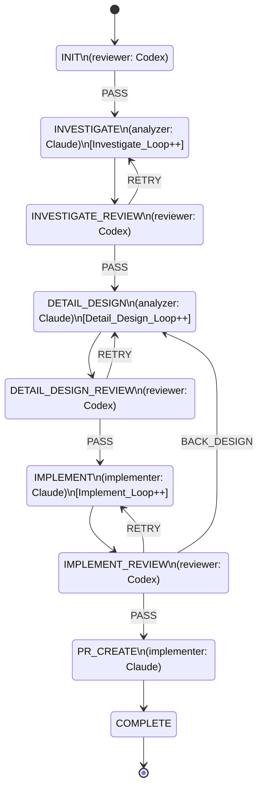
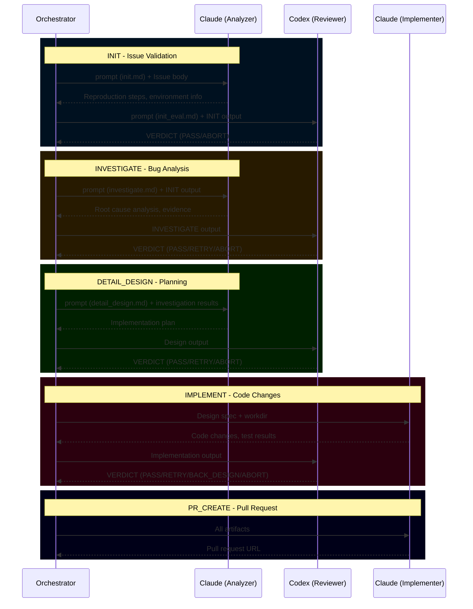
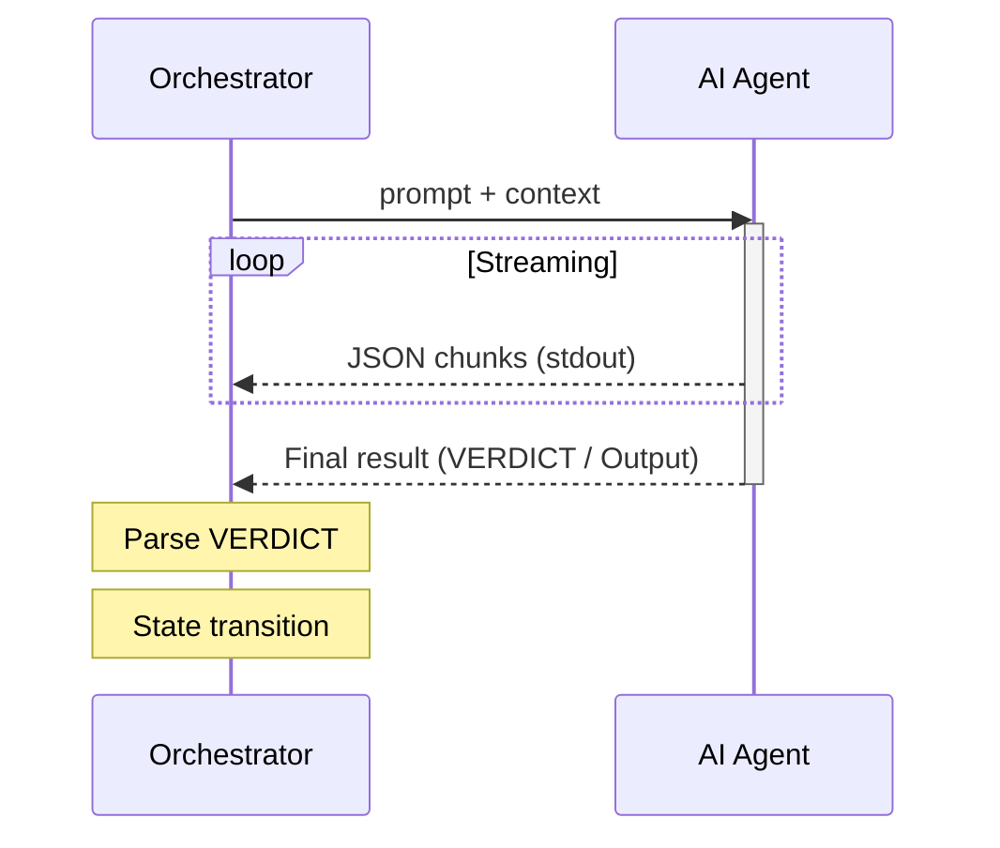
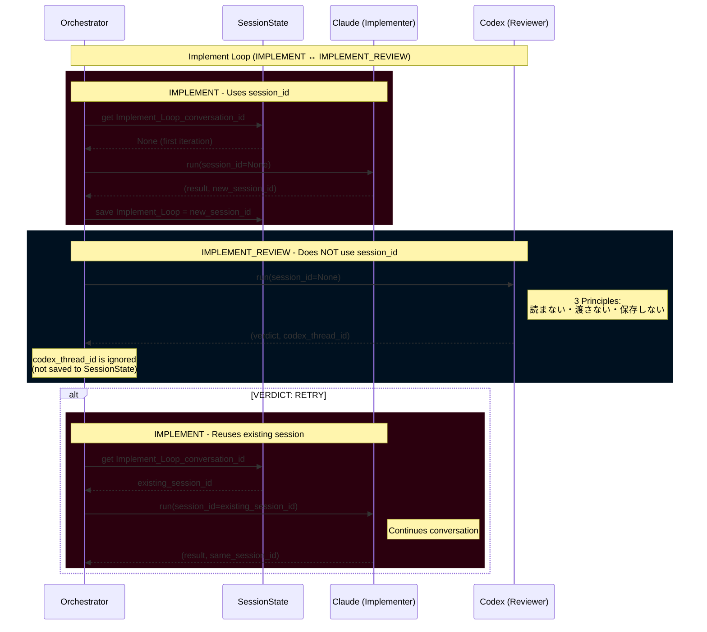
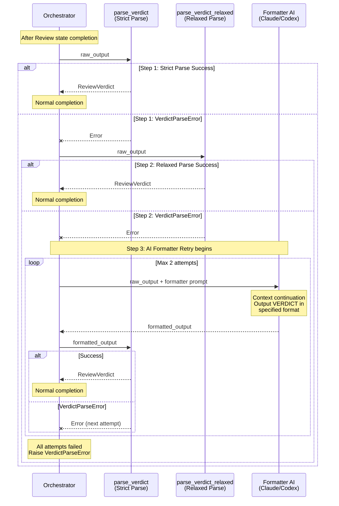

# BugfixAgent v5 Architecture Document

> Comprehensive design documentation consolidating Issue #194 protocol specification and 16+ E2E test iterations

**Version**: 2.2.0
**Last Updated**: 2025-12-18
**Status**: Active Development
**Related Issues**: [#194](https://github.com/apokamo/kamo2/issues/194), [#284](https://github.com/apokamo/kamo2/issues/284), [#312](https://github.com/apokamo/kamo2/issues/312)

---

## Table of Contents

1. [Overview](#1-overview)
2. [State Machine](#2-state-machine)
3. [Output Standardization (VERDICT)](#3-output-standardization-verdict)
4. [State-Specific Definitions](#4-state-specific-definitions)
5. [Input Standardization](#5-input-standardization)
6. [Data Flow](#6-data-flow)
7. [Common Prompt](#7-common-prompt)
8. [Termination Conditions](#8-termination-conditions)
9. [AI Tool Integration](#9-ai-tool-integration)
   - [9.6 Session Management](#96-session-management)
10. [Error Handling & Fallback](#10-error-handling--fallback)
11. [Architecture Decision Records](#11-architecture-decision-records)
12. [E2E Test Design](#12-e2e-test-design)
13. [Development Guide](#13-development-guide)

---

## 1. Overview

### 1.1 Purpose

BugfixAgent v5 is an AI-driven autonomous bug fixing system. Given a GitHub Issue, it:
1. Validates the Issue (INIT)
2. Investigates and reproduces the bug (INVESTIGATE)
3. Designs a fix (DETAIL_DESIGN)
4. Implements the fix (IMPLEMENT)
5. Creates a Pull Request (PR_CREATE)

### 1.2 Problem Statement

Previous versions had inconsistent state interfaces:
- P0-1: Codex output format inconsistency (JSON/text)
- P0-2: Review judgment logic inconsistency (`blocker: Yes` vs `BLOCKED`)

Root cause: **Lack of protocol definition at the state machine level**.

### 1.3 Design Philosophy

- **Protocol-First**: Standardized VERDICT format across all states
- **Separation of Concerns**: Each AI model has a specific role
- **Fail-Safe Design**: Circuit breakers, retry limits, fallback mechanisms
- **Observability**: JSONL logging, real-time streaming, structured artifacts

---

## 2. State Machine

### 2.1 State Diagram (9 States)



> **Note**: `ABORT` can occur from any state as an exceptional termination, so it's not shown in the diagram.

### 2.2 State Count Evolution

- **Old**: 11 states (with QA/QA_REVIEW)
- **New**: 9 states (QA functionality merged into IMPLEMENT_REVIEW)

### 2.3 State Enum Definition

```python
class State(Enum):
    INIT = auto()                # Issue validation
    INVESTIGATE = auto()         # Reproduction & investigation
    INVESTIGATE_REVIEW = auto()  # Investigation review
    DETAIL_DESIGN = auto()       # Detailed design
    DETAIL_DESIGN_REVIEW = auto()# Design review
    IMPLEMENT = auto()           # Implementation
    IMPLEMENT_REVIEW = auto()    # Implementation review (QA integrated)
    PR_CREATE = auto()           # PR creation
    COMPLETE = auto()            # Completion
```

---

## 3. Output Standardization (VERDICT)

### 3.1 Status Keywords (4 Types)

| Status | Meaning | Transition | Notes |
|---------|---------|-----------|-------|
| `PASS` | Success, proceed | Next state | Normal flow |
| `RETRY` | Retry same state | Same state (loop) | Minor issues |
| `BACK_DESIGN` | Design revision needed | DETAIL_DESIGN | Design-level issues |
| `ABORT` | **Cannot continue, immediate exit** | **Exit** | Environment/external factors |

### 3.2 Output Format (Required)

> **Note**: Previous documentation used `Review Result` / `Status` terminology.
> Current standard is `VERDICT` / `Result` for consistency with implementation.
> If legacy terminology (`Review Result` / `Status`) appears in other documents (e.g., E2E_TEST_FINDINGS.md),
> this document's `VERDICT` / `Result` is authoritative.

```markdown
## VERDICT
- Result: PASS | RETRY | BACK_DESIGN | ABORT
- Reason: <judgment reason>
- Evidence: <evidence/findings>
- Suggestion: <next action suggestion> (required for ABORT)
```

**CRITICAL**: Output must go to **stdout**. Do not output via `gh issue comment` arguments.

### 3.3 Parse Logic

**Note**: The following is conceptual pseudo-code. See `bugfix_agent/verdict.py` for actual implementation.

```python
class Verdict(Enum):
    PASS = "PASS"
    RETRY = "RETRY"
    BACK_DESIGN = "BACK_DESIGN"
    ABORT = "ABORT"

def parse_verdict(text: str) -> Verdict:
    """Parse VERDICT from text (hybrid fallback with 3 steps).

    Returns Verdict enum only. ABORT is returned as Verdict.ABORT,
    not raised as AgentAbortError (responsibility separation).
    """
    # Step 1: Strict parse - capture with \w+ then validate via Enum
    match = re.search(r"Result:\s*(\w+)", text, re.IGNORECASE)
    if match:
        result_str = match.group(1).upper()
        try:
            return Verdict(result_str)  # Returns Verdict.ABORT if matched
        except ValueError:
            # Invalid value (e.g., "PENDING") → immediate exception
            raise InvalidVerdictValueError(f"Invalid VERDICT: {result_str}")

    # Step 2: Relaxed parse (multiple patterns)
    # Step 3: AI Formatter retry
    # ... (see verdict.py for full implementation)

    raise VerdictParseError("No VERDICT Result found in output")

def handle_abort_verdict(verdict: Verdict, text: str) -> Verdict:
    """Orchestrator's responsibility: Detect ABORT and raise AgentAbortError.

    Note: extract_field() is pseudo-code. Actual implementation uses
    _extract_verdict_field() in verdict.py.
    """
    if verdict == Verdict.ABORT:
        # Try multiple field names with fallback (Summary/Reason, Next Action/Suggestion)
        reason = extract_field(text, "Summary") or extract_field(text, "Reason") or "No reason provided"
        suggestion = extract_field(text, "Next Action") or extract_field(text, "Suggestion") or ""
        raise AgentAbortError(reason, suggestion)
    return verdict  # Returns verdict as-is if not ABORT
```

### 3.4 VERDICT Transition Table

#### Work States

Work states generate artifacts and auto-transition to corresponding REVIEW states. No VERDICT output.

| Current State | Artifact | Next State |
|--------------|----------|-----------|
| INVESTIGATE | Investigation results | -> INVESTIGATE_REVIEW |
| DETAIL_DESIGN | Design document | -> DETAIL_DESIGN_REVIEW |
| IMPLEMENT | Implementation code | -> IMPLEMENT_REVIEW |
| PR_CREATE | PR | -> COMPLETE |

> **Exception**: If an unrecoverable problem occurs during work, `ABORT` -> Exit

#### INIT / REVIEW States

Output VERDICT, transition depends on Result.

| Current State | PASS | RETRY | BACK_DESIGN | ABORT |
|--------------|------|-------|-------------|-------|
| **INIT** | INVESTIGATE | - | - | Exit |
| **INVESTIGATE_REVIEW** | DETAIL_DESIGN | INVESTIGATE | - | Exit |
| **DETAIL_DESIGN_REVIEW** | IMPLEMENT | DETAIL_DESIGN | - | Exit |
| **IMPLEMENT_REVIEW** | PR_CREATE | IMPLEMENT | DETAIL_DESIGN | Exit |
| **PR_CREATE** | COMPLETE | - | - | Exit |

> `-` = Status not allowed for that state

---

## 4. State-Specific Definitions

### 4.1 INIT

#### Role
Verify that the Issue body contains minimum information to start bug fixing.
**No execution** of reproduction, environment setup, or branch operations.

#### Validation Items

| # | Item | Required | Criteria |
|---|------|:--------:|----------|
| 1 | **Environment meta-info** | Optional | Use if present; INVESTIGATE can determine if missing |
| 2 | **Symptom** | Required | Can understand what the problem is |
| 3 | **Reproduction steps** | Required | Even without step format, any reproduction hint is OK |
| 4 | **Expected behavior** | Optional | OK if inferable from symptom/reproduction |
| 5 | **Actual behavior** | Optional | OK at overview level if problem is clear |

> **Policy**: PASS if symptom is understandable and there's investigation leads. Don't require perfect bug reports.

#### Output Format

```markdown
### INIT / Issue Summary
- Issue: ${issue_url}
- Symptom: <content from Issue body>
- Reproduction: <content or "No details (INVESTIGATE will determine)">
- Expected/Actual: <content or "Inferred: ...">

## VERDICT
- Result: PASS | ABORT
- Reason: <judgment reason>
- Evidence: <evidence>
- Suggestion: <for ABORT: minimum required additions>
```

#### Judgment

| Situation | Status | Reason |
|-----------|--------|--------|
| Symptom understandable, investigation leads exist | PASS | Can proceed to INVESTIGATE |
| Completely unclear what the problem is | ABORT | Request human to add minimum info |

---

### 4.2 INVESTIGATE

#### Role
Execute reproduction steps and investigate the cause.

#### Required Output

| # | Item | Description |
|---|------|-------------|
| 1 | **Reproduction steps with evidence** | Executed steps and results (evidence: `${artifacts_dir}`) |
| 2 | **Deviation from expected** | Difference from expected behavior |
| 3 | **Cause hypothesis** | Possible causes with rationale |
| 4 | **Supplementary info** | Other useful information |

#### Output Format

```markdown
## Bugfix agent INVESTIGATE

### INVESTIGATE / Reproduction Steps
1. ... (evidence: <filename>)

### INVESTIGATE / Deviation from Expected
- ...

### INVESTIGATE / Cause Hypothesis
- Hypothesis A: <rationale>

### INVESTIGATE / Supplementary Info
- ...
```

---

### 4.3 INVESTIGATE_REVIEW

#### Completion Criteria

| # | Check Item | Criteria |
|---|-----------|----------|
| 1 | Reproduction steps with evidence | Steps executed, evidence exists |
| 2 | Deviation from expected | Concrete description of deviation |
| 3 | Cause hypothesis | At least one hypothesis with rationale |
| 4 | Supplementary info | Section exists (content optional) |

#### Judgment

| Status | Transition |
|--------|-----------|
| PASS | DETAIL_DESIGN |
| RETRY | INVESTIGATE |
| ABORT | Exit |

---

### 4.4 DETAIL_DESIGN

#### Required Output

| # | Item | Description |
|---|------|-------------|
| 1 | **Change plan with implementation steps** | Target file/function, changes, steps, code snippets |
| 2 | **Test case list** | Purpose, input, expected result |
| 3 | **Supplementary info** | Cautions, risks |

#### Output Format

```markdown
## Bugfix agent DETAIL_DESIGN

### DETAIL_DESIGN / Change Plan
- Target: <file/function>
- Implementation steps: 1. ... 2. ...

### DETAIL_DESIGN / Test Cases
| ID | Purpose | Input | Expected Result |

### DETAIL_DESIGN / Supplementary
- ...
```

---

### 4.5 DETAIL_DESIGN_REVIEW

#### Completion Criteria

| # | Check Item | Criteria |
|---|-----------|----------|
| 1 | Change plan with implementation steps | Sufficient detail for implementation |
| 2 | Test case list | Purpose, input, expected result complete |
| 3 | Supplementary info | Section exists |

#### Judgment

| Status | Transition |
|--------|-----------|
| PASS | IMPLEMENT |
| RETRY | DETAIL_DESIGN |
| ABORT | Exit |

---

### 4.6 IMPLEMENT

#### Required Output

| # | Item | Description |
|---|------|-------------|
| 1 | **Working branch info** | Branch name and latest commit ID |
| 2 | **Test execution results** | E(existing)/A(added) tags, Pass/Fail, evidence |
| 3 | **Supplementary info** | Remaining work, cautions |

#### Output Format

```markdown
## Bugfix agent IMPLEMENT

### IMPLEMENT / Working Branch
- Branch: fix/${issue_number}-xxx
- Commit: <sha>

### IMPLEMENT / Test Results
| Test | Tag | Result | Evidence |

### IMPLEMENT / Supplementary
- ...
```

#### Coverage Error Handling (ADR from E2E Test 14)

If coverage plugin fails, retry with `pytest --no-cov`.

---

### 4.7 IMPLEMENT_REVIEW (QA Integrated)

#### Role
**Final gate**: Implementation completion check + source review + additional verification.

#### Completion Criteria

| # | Check Item | Criteria |
|---|-----------|----------|
| 1 | Working branch info | Branch name and commit ID present |
| 2 | Test execution results | E/A tagged, all tests pass |
| 3 | Source review | diff + existing code consistency, readability, boundary conditions |
| 4 | Additional verification | Verification from unplanned perspectives (N/A allowed if not needed) |
| 5 | Remaining issues/cautions | Section exists (explicitly state if none) |

#### Output Format

```markdown
## VERDICT
- Result: PASS | RETRY | BACK_DESIGN
- Reason: <judgment reason>
- Evidence:
  - Working branch info: OK/NG
  - Test execution results: OK/NG (Pass: X/Y)
  - Source review: OK/NG
  - Additional verification: OK/NG/N/A
  - Remaining issues/cautions: OK/NG
- Suggestion: <improvement instructions>
```

#### Judgment

| Status | Transition | Condition |
|--------|-----------|-----------|
| PASS | PR_CREATE | All items OK, all tests pass |
| RETRY | IMPLEMENT | Minor implementation issues |
| BACK_DESIGN | DETAIL_DESIGN | Design-level issues |
| ABORT | Exit | Cannot continue |

---

### 4.8 PR_CREATE

#### Role
Create PR and share with Issue.

#### Required Output

| # | Item | Description |
|---|------|-------------|
| 1 | PR URL | Created PR URL |
| 2 | PR Title | Conventional Commits format |
| 3 | PR Summary | Change summary |
| 4 | Final test results | All tests pass confirmation |

#### Output Format

```markdown
## Bugfix agent PR_CREATE

### PR_CREATE / Pull Request
- URL: https://github.com/...
- Title: fix(scope): description
- Reason: ...
- Test Result: All passed

## VERDICT
- Result: PASS
- Reason: PR creation complete
- Evidence: PR URL
- Suggestion: Human review and merge pending
```

---

## 5. Input Standardization

### 5.1 Prompt Template Variables

| Variable | Description | Target States |
|----------|-------------|--------------|
| `${issue_url}` | Issue URL | All states |
| `${issue_number}` | Issue number | All states |
| `${artifacts_dir}` | Evidence save location | Work states |
| `${state_name}` | Current state name | All states |
| `${loop_count}` | Loop count (1-indexed) | Loop targets |
| `${max_loop_count}` | Maximum loop count | Loop targets |

### 5.2 Context Retrieval

- Pass `${issue_url}` to agent
- Agent retrieves latest Issue body via `gh issue view`
- **Issue body is the Single Source of Truth**

---

## 6. Data Flow

### 6.1 Role Division

| Output Target | Content | Timing |
|--------------|---------|--------|
| **Comment** | Work logs, details, trial-and-error | Each state execution (always) |
| **Body append** | Finalized artifacts | Review PASS only |

### 6.2 Flow

```
Work state execution (INVESTIGATE, etc.)
  -> Comment post: [STATE_NAME] Detailed work log...

Review state execution (INVESTIGATE_REVIEW, etc.)
  -> Comment post: [STATE_NAME] VERDICT: PASS/RETRY/...
  -> If PASS: Append finalized section to body
  -> If RETRY: No body append (return to work state)
```

### 6.3 Final Issue Body Structure

```markdown
## Summary
<Original Issue content>

---

## INVESTIGATE (Finalized)
- Reproduction steps: ...
- Cause hypothesis: ...
- Evidence: ...

## DETAIL_DESIGN (Finalized)
- Approach: ...
- Test cases: ...

## IMPLEMENT (Finalized)
- Branch: fix/151-xxx
- Changed files: ...
- Test results: All passed
```

### 6.4 Benefits

| Aspect | Effect |
|--------|--------|
| **Clean body** | Only finalized info, no trial-and-error |
| **No edit conflicts** | Only comments during work, body edit only on PASS |
| **History tracking** | All attempts traceable via comments |
| **Human-friendly** | Body shows latest finalized state |

---

## 7. Common Prompt

### 7.1 Purpose

Apply common rules to all agents by appending common prompt to each state prompt.

### 7.2 File Structure

```
prompts/
├── _common.md              # Common prompt
├── init.md
├── investigate.md
├── investigate_review.md
├── detail_design.md
├── detail_design_review.md
├── implement.md
├── implement_review.md
└── pr_create.md
```

### 7.3 Common Prompt Content

```markdown
---
# Common Rules (Required reading for all states)

## Output Format (Required)

On task completion, always output in the following format:

## VERDICT
- Result: PASS | RETRY | BACK_DESIGN | ABORT
- Reason: <judgment reason>
- Evidence: <evidence>
- Suggestion: <next action suggestion> (required for ABORT)

**IMPORTANT**: Always output to stdout. Do not include in gh command arguments.

## Status Keywords

| Status | Meaning | Usage Condition |
|--------|---------|-----------------|
| PASS | Success | Task complete, can proceed to next state |
| RETRY | Retry | Minor issues, retry same state |
| BACK_DESIGN | Design return | Design issues, return to DETAIL_DESIGN |
| ABORT | Abort | Cannot continue, immediate exit |

## ABORT Conditions

Output ABORT and exit immediately for:
- Environment errors (Docker not running, DB connection failed)
- Permission issues (file write denied, API auth failed)
- External blockers (required info missing from Issue)
- Unexpected errors (tool execution error, timeout)
- Situations requiring human intervention

## Prohibited Actions

- Do not use sleep commands to wait
- Do not poll waiting for problem resolution
- Do not ignore blockers and continue
- Do not end task without VERDICT

## Issue Operation Rules

- Comment: gh issue comment ${issue_number} --body "..."
- Get body: gh issue view ${issue_number}
- Edit body: Only on review PASS (work states do not edit)

## Evidence Storage

Save logs, screenshots, etc. to ${artifacts_dir}.
```

### 7.4 load_prompt() Extension

```python
def load_prompt(state_name: str, **kwargs) -> str:
    """Concatenate state-specific prompt + common prompt"""
    state_prompt = _load_template(f"{state_name}.md", **kwargs)
    common_prompt = _load_template("_common.md", **kwargs)
    return f"{state_prompt}\n\n{common_prompt}"
```

---

## 8. Termination Conditions

### 8.1 Exit Types

| Exit Type | Trigger | Exit Status | Location |
|-----------|---------|-------------|----------|
| Normal completion | PR_CREATE -> COMPLETE | `COMPLETE` | PR_CREATE |
| Agent decision | `VERDICT: ABORT` | `ABORTED` | All states |
| Loop limit | `*_Loop >= max_loop_count` | `LOOP_LIMIT` | Loop target states |
| Tool error | CLI execution failed, timeout | `ERROR` | All states |

### 8.2 Circuit Breaker (Loop Limits)

| Loop Counter | Increment Location | Limit |
|-------------|-------------------|-------|
| `Investigate_Loop` | INVESTIGATE | 3 (configurable) |
| `Detail_Design_Loop` | DETAIL_DESIGN | 3 (configurable) |
| `Implement_Loop` | IMPLEMENT | 3 (configurable) |

### 8.3 Legacy Keyword Migration

| Old Keyword | New Keyword | Notes |
|------------|-------------|-------|
| `OK` | `PASS` | INIT unified |
| `NG` | `ABORT` | Cannot continue due to insufficient Issue info |
| `BLOCKED` | `RETRY` | Same state retry |
| `FIX_REQUIRED` | `RETRY` | Implementation fix |
| `DESIGN_FIX` | `BACK_DESIGN` | Design return |

---

## 9. AI Tool Integration

### 9.1 Role Assignment

| Tool | Role | Responsibilities | Default Model |
|------|------|------------------|---------------|
| **Claude** | Analyzer | Issue analysis, documentation, design | claude-opus-4 |
| **Codex** | Reviewer | Code review, judgment, web search | gpt-5.2 |
| **Claude** | Implementer | File operations, command execution | claude-opus-4 |

### 9.2 Tool Protocol

```python
class AIToolProtocol(Protocol):
    def run(
        self,
        prompt: str,
        context: str | list[str] = "",
        session_id: str | None = None,
        log_dir: Path | None = None,
    ) -> tuple[str, str | None]:
        """Execute AI tool and return (response, session_id)"""
        ...
```

### 9.3 CLI Integration Details

#### GeminiTool
```bash
gemini -o stream-json --allowed-tools run_shell_command,web_fetch --approval-mode yolo "<prompt>"
```

#### CodexTool
```bash
# New session
codex --dangerously-bypass-approvals-and-sandbox exec --skip-git-repo-check \
  -m codex-mini -C <workdir> -s workspace-write --enable web_search_request --json "<prompt>"

# Resume session (ADR from E2E Test 11)
codex --dangerously-bypass-approvals-and-sandbox exec --skip-git-repo-check \
  resume <thread_id> -c 'sandbox_mode="danger-full-access"' "<prompt>"
```

#### ClaudeTool (ADR from E2E Test 15)
```bash
claude -p --output-format stream-json --verbose --model claude-sonnet-4 \
  --dangerously-skip-permissions "<prompt>"
```
**IMPORTANT**: Must set `cwd` to correct working directory.

### 9.4 Agent Call Sequence

The orchestrator coordinates multiple AI agents throughout the bugfix workflow.
Each state invokes specific agents based on their specialized roles.



#### Agent Responsibilities

| Agent | Role | States |
|-------|------|--------|
| **Claude** | Analyzer | INIT, INVESTIGATE, DETAIL_DESIGN |
| **Codex** | Reviewer | INIT (review), INVESTIGATE_REVIEW, DETAIL_DESIGN_REVIEW, IMPLEMENT_REVIEW |
| **Claude** | Implementer | IMPLEMENT, PR_CREATE |

#### Call Flow Per State

| State | Agent | Input | Output |
|-------|-------|-------|--------|
| INIT | Claude | Issue body, prompts/init.md | Reproduction steps, environment info |
| INIT (review) | Codex | INIT output, prompts/init_eval.md | VERDICT (PASS/ABORT) |
| INVESTIGATE | Claude | INIT output, prompts/investigate.md | Root cause analysis, evidence |
| INVESTIGATE_REVIEW | Codex | INVESTIGATE output | VERDICT (PASS/RETRY/ABORT) |
| DETAIL_DESIGN | Claude | Investigation results, prompts/detail_design.md | Implementation plan |
| DETAIL_DESIGN_REVIEW | Codex | Design output | VERDICT (PASS/RETRY/ABORT) |
| IMPLEMENT | Claude | Design spec, workdir | Code changes, test results |
| IMPLEMENT_REVIEW | Codex | Implementation output | VERDICT (PASS/RETRY/BACK_DESIGN/ABORT) |
| PR_CREATE | Claude | All artifacts | Pull request |

#### Communication Protocol



Each agent call follows this pattern:
1. Orchestrator constructs prompt using `load_prompt(state, **kwargs)`
2. Orchestrator calls `agent.run(prompt, context, session_id, log_dir)`
3. Agent streams JSON output to stdout (captured by orchestrator)
4. Orchestrator parses VERDICT from output
5. State transition based on VERDICT status

### 9.5 IssueProvider Abstraction

#### Purpose

Decouple GitHub API operations from the orchestrator to enable:
- Local testing without GitHub API calls
- Dependency injection for different environments
- Clear separation of Issue operations

#### Interface

```python
# bugfix_agent/providers.py
class IssueProvider(ABC):
    """Abstract interface for Issue operations."""

    @abstractmethod
    def get_issue_body(self) -> str:
        """Get the Issue body content."""
        ...

    @abstractmethod
    def add_comment(self, body: str) -> None:
        """Post a comment to the Issue."""
        ...

    @abstractmethod
    def update_body(self, body: str) -> None:
        """Update the Issue body."""
        ...

    @property
    @abstractmethod
    def issue_number(self) -> int: ...

    @property
    @abstractmethod
    def issue_url(self) -> str: ...
```

#### Implementations

| Implementation | Use Case | GitHub API |
|---------------|----------|------------|
| `GitHubIssueProvider` | Production | ✅ Uses `gh` CLI |
| `MockIssueProvider` | Unit/Handler tests | ❌ In-memory only |
| `_SimpleTestIssueProvider` | Legacy test compatibility | ❌ Minimal mock |

#### Usage in Handlers

```python
def handle_init(ctx: AgentContext, state: SessionState) -> State:
    # IssueProvider is injected via AgentContext
    result, _ = ctx.reviewer.run(prompt=prompt, context=ctx.issue_url)
    check_tool_result(result, "reviewer")

    # Post comment via IssueProvider (production or mock)
    ctx.issue_provider.add_comment(f"## INIT Check Result\n\n{result}")

    return State.INVESTIGATE
```

#### Test Example

```python
# Using MockIssueProvider for unit tests
from tests.utils.providers import MockIssueProvider

def test_handler_posts_comment():
    provider = MockIssueProvider(initial_body="# Test Issue")
    ctx = AgentContext(
        reviewer=MockTool(["## VERDICT\n- Result: PASS"]),
        issue_provider=provider,
        ...
    )
    handle_init(ctx, state)

    # Verify comment was posted
    assert provider.comment_count == 1
    assert "PASS" in provider.last_comment
```

### 9.6 Session Management

#### Purpose

Session management ensures that AI tools maintain conversation context appropriately while preventing cross-tool session ID conflicts.

#### Design Principles

**Work States** (INVESTIGATE, DETAIL_DESIGN, IMPLEMENT):
- May use `session_id` for conversation continuity within the same tool
- Store session ID to `active_conversations` dict for future iterations

**REVIEW States** (INIT, INVESTIGATE_REVIEW, DETAIL_DESIGN_REVIEW, IMPLEMENT_REVIEW):
- **3 Principles**: 読まない・渡さない・保存しない (Don't read, Don't pass, Don't save)
- Evaluate artifacts independently without requiring conversation context
- Always call tool with `session_id=None`
- Never store returned session ID to `active_conversations`

#### Session ID Flow



#### Session Sharing Rules

| Session Key | Shared States | Tool | Notes |
|-------------|---------------|------|-------|
| `Design_Thread_conversation_id` | INVESTIGATE, DETAIL_DESIGN | Claude | Same tool, same thread |
| `Implement_Loop_conversation_id` | IMPLEMENT only | Claude | Not shared with IMPLEMENT_REVIEW |

> **Warning**: REVIEW states use different tools (Codex) than their corresponding work states. Passing a session ID from Claude to Codex causes cross-tool session resume hang. See [Issue #312](https://github.com/apokamo/kamo2/issues/312).

#### Implementation Pattern

```python
# WORK STATE (e.g., IMPLEMENT) - Uses session_id
def handle_implement(ctx: AgentContext, state: SessionState) -> State:
    impl_session = state.active_conversations["Implement_Loop_conversation_id"]

    result, new_session = ctx.implementer.run(
        prompt=prompt,
        session_id=impl_session,  # Pass existing session
        log_dir=log_dir,
    )

    if not impl_session and new_session:
        state.active_conversations["Implement_Loop_conversation_id"] = new_session

    return State.IMPLEMENT_REVIEW


# REVIEW STATE (e.g., IMPLEMENT_REVIEW) - 3 Principles
def handle_implement_review(ctx: AgentContext, state: SessionState) -> State:
    # Issue #312: 3原則（読まない・渡さない・保存しない）
    # Don't read: No impl_session variable
    # Don't pass: session_id=None
    # Don't save: Ignore returned session_id (_)

    decision, _ = ctx.reviewer.run(
        prompt=prompt,
        session_id=None,  # Always None for REVIEW states
        log_dir=log_dir,
    )

    # Parse verdict and return next state
    return parse_and_transition(decision)
```

#### Related Issues

- [Issue #312](https://github.com/apokamo/kamo2/issues/312): IMPLEMENT_REVIEW hang caused by cross-tool session ID sharing
- [Issue #314](https://github.com/apokamo/kamo2/issues/314): Config validation for session-sharing states

---

## 10. Error Handling & Fallback

### 10.1 Hybrid Fallback Parser (ADR from E2E Test 16)

AI output is non-deterministic. The hybrid fallback achieves high parse success rates through multiple parsing strategies.

#### Background

E2E Test 16 encountered `VerdictParseError: No VERDICT Result found in output`.
The cause was that the AI (Codex/Claude) output VERDICT via `gh issue comment` argument
instead of stdout, making it impossible for the parser to extract.

Since AI output is inherently non-deterministic and format variations cannot be completely prevented,
a hybrid fallback mechanism was introduced to achieve robust parsing.

#### Design Options

| Option | Description | Cost | Robustness |
|--------|-------------|------|------------|
| A. AI Retry Only | Parse fail → AI reformatter retry | High | Good |
| B. Relaxed Regex | Multi-pattern Result/Status search | Low | Moderate |
| C. Multi-pattern Extract | Search entire stdout | Low | Moderate |
| **D. Hybrid (Adopted)** | B+C first, then A on failure | Medium | Excellent |

#### Sequence Diagram



#### Simple Flow

```
Step 1: Strict Parse ──(success)──> Return VERDICT
        │
        (fail)
        v
Step 2: Relaxed Parse ──(success)──> Return VERDICT
        │
        (fail)
        v
Step 3: AI Formatter Retry (max 2 attempts)
        │
        ├──(success)──> Return VERDICT
        │
        └──(all fail)──> Raise VerdictParseError
```

#### Step 1: Strict Parse
```python
# Captures with \w+ then validates via Enum conversion
match = re.search(r"Result:\s*(\w+)", text, re.IGNORECASE)
if match:
    result_str = match.group(1).upper()
    try:
        return Verdict(result_str)  # Valid: PASS, RETRY, BACK_DESIGN, ABORT
    except ValueError:
        # Invalid values (e.g., "PENDING", "WAITING") raise immediately
        raise InvalidVerdictValueError(f"Invalid VERDICT: {result_str}")
```

#### Step 2: Relaxed Parse
```python
# All patterns restricted to valid VERDICT values only
VALID_VALUES = r"(PASS|RETRY|BACK_DESIGN|ABORT)"
patterns = [
    rf"Result:\s*{VALID_VALUES}",           # Standard
    rf"-\s*Result:\s*{VALID_VALUES}",       # List format
    rf"\*\*Status\*\*:\s*{VALID_VALUES}",   # Bold format
    rf"ステータス:\s*{VALID_VALUES}",        # Japanese
    rf"Status\s*=\s*{VALID_VALUES}",        # Assignment format
]
```

#### Step 3: AI Formatter
```python
FORMATTER_PROMPT = """Extract VERDICT from the following output...
## VERDICT
- Result: <PASS|RETRY|BACK_DESIGN|ABORT>
- Reason: <1-line summary>
...
"""
```

**Internal Fallback**: After AI formatting, the output is parsed using:
1. Strict parser (Step 1 pattern)
2. Relaxed parser (Step 2 patterns) if strict fails
This handles cases where AI returns `Status:` format instead of `Result:`.

#### Responsibility Separation

- **`parse_verdict()`**: Returns `Verdict` enum only (including `Verdict.ABORT`)
  - Never raises `AgentAbortError`
  - `ABORT` is treated as a valid verdict value, not an exception
- **`handle_abort_verdict()`**: Orchestrator detects `ABORT` and raises `AgentAbortError`
  - Separates parsing logic from abort handling
  - Allows consistent verdict parsing across all states

#### InvalidVerdictValueError

Invalid VERDICT values (e.g., `PENDING`, `WAITING`, `UNKNOWN`) trigger immediate exception:

```python
class InvalidVerdictValueError(VerdictParseError):
    """Raised when VERDICT contains invalid value (prompt violation)."""
    pass
```

**Characteristics**:
- **Not subject to fallback**: Indicates prompt violation or implementation bug
- **Immediate failure**: No retry attempts
- **Example invalid values**: `PENDING`, `WAITING`, `IN_PROGRESS`, `UNKNOWN`

#### Output Truncation Strategy

When AI output exceeds length limits, truncation uses head+tail approach:

```python
AI_FORMATTER_MAX_INPUT_CHARS = 8000  # Maximum input to AI Formatter
# Split with delimiter: approximately half head + half tail
```

**Rationale**:
- VERDICT typically appears at the end of output
- Preserving tail ensures VERDICT capture
- Head provides context for debugging
- Delimiter (`\n...[truncated]...\n`) marks the split point

### 10.2 Fallback Strategy Effectiveness

The multi-layered fallback approach ensures robust parsing:
- **Step 1 (Strict)**: Handles the majority of well-formatted outputs
- **Step 2 (Relaxed)**: Catches minor formatting variations
- **Step 3-1 (AI 1st)**: Recovers from significant format deviations
- **Step 3-2 (AI 2nd)**: Final attempt with enhanced prompting
- **Total Failure**: Rare cases requiring manual intervention

#### Operational Guidance

**When VerdictParseError occurs** (all steps failed):
- **Root cause**: `Result:` line missing or in wrong location (e.g., `gh comment` argument instead of stdout)
- **Who fixes**: Prompt engineer - review state prompts to ensure VERDICT output to stdout
- **Debug artifacts** (check in order of priority):
  1. **`stdout.log`**: Raw AI CLI output (most likely location for parse errors)
  2. **`cli_console.log`**: Formatted human-readable output
  3. **`stderr.log`**: Error messages from CLI tool
  4. **`run.log`**: JSONL execution log (orchestrator level)
  - Bugfix-agent path: `test-artifacts/bugfix-agent/<issue-number>/<YYMMDDhhmm>/<state>/`
  - E2E path: `test-artifacts/e2e/<fixture>/<timestamp>/`
- **Immediate action**: Check if `Result:` exists in output; if in `gh` command argument, update prompt

**When InvalidVerdictValueError occurs** (invalid verdict value):
- **Root cause**: AI output invalid value (e.g., `PENDING`, `WAITING`) - prompt violation or implementation bug
- **Who fixes**:
  - If value is conceptually valid → Implementation team adds to Verdict enum
  - If value is nonsensical → Prompt engineer fixes state prompt
- **Not recoverable**: No fallback attempted - indicates fundamental issue
- **Debug**: Review AI output for why invalid value was chosen

**AI Formatter invocation criteria**:
- Automatically triggered after Step 1 and Step 2 both fail
- Adds ~0.5-1 second latency and additional API cost
- Check `stdout.log` for exception messages like "All parse attempts failed (Step 1-2)" or "All N AI formatter attempts failed"

### 10.3 Exception Hierarchy

```
Exception
├── ToolError                    # AI tool returned "ERROR"
├── LoopLimitExceeded            # Circuit breaker triggered
├── VerdictParseError            # Review output parse failure
│   └── InvalidVerdictValueError # Invalid VERDICT value (not fallback eligible)
└── AgentAbortError              # Explicit ABORT from AI
    ├── reason: str
    └── suggestion: str
```

---

## 11. Architecture Decision Records

### ADR-001: QA/QA_REVIEW Consolidation

**Context**: Original 11-state design had separate QA and QA_REVIEW states.

**Decision**: Consolidate QA functionality into IMPLEMENT_REVIEW.

**Rationale**: QA is essentially implementation verification. Reduces state machine complexity.

---

### ADR-002: Unify VERDICT Format (E2E Test 12-13, Issue #293)

**Context**: E2E Test 12 failed with `VerdictParseError`. VERDICT was output via `gh issue comment` instead of stdout.

**Decision**:
- Standardized terminology: `VERDICT` with `Result` field
- Standardized fields: `Reason`, `Evidence`, `Suggestion`
- Added explicit instruction: "**Must output to stdout**"
- Added recency bias countermeasure:末尾ポインタ in each review prompt (Issue #293)

**Note**: Previous documentation used `Review Result` / `Status` terminology, which has been deprecated in favor of `VERDICT` / `Result` for consistency with implementation.

---

### ADR-003: Coverage Error Handling (E2E Test 14)

**Context**: pytest with coverage failed due to environment issues.

**Decision**: Add coverage fallback instructions to IMPLEMENT prompt: "On coverage error, retry with `pytest --no-cov`"

---

### ADR-004: Working Directory for Claude CLI (E2E Test 15)

**Context**: Claude CLI executed in wrong directory, causing file operation failures.

**Decision**: Add explicit `workdir` parameter to `ClaudeTool` and pass as `cwd` to subprocess.

---

### ADR-005: Hybrid Fallback Parser (E2E Test 16)

**Context**: E2E Test 16 failed with `VerdictParseError` because AI output VERDICT in gh comment argument.

**Decision**: Implement 3-step hybrid fallback parser (strict -> relaxed -> AI retry).

**Trade-offs**:
- Pros: High success rate through robust fallback strategies
- Cons: Step 3 adds additional API calls when needed

---

### ADR-006: Codex Resume Mode Sandbox Override (E2E Test 11)

**Context**: Codex `exec resume` doesn't support `-s` option.

**Decision**: Use `-c sandbox_mode="danger-full-access"` for resume mode.

---

## 12. E2E Test Design

### 12.1 Test Fixture Structure

```
.claude/agents/bugfix-v5/
├── test-fixtures/
│   └── L1-001.toml           # Level 1 fixture definition
├── e2e_test_runner.py        # E2E test runner
└── test-artifacts/
    └── e2e/<fixture>/<timestamp>/
        ├── report.json       # Test result report
        ├── agent_stdout.log  # Agent stdout
        └── agent_stderr.log  # Agent stderr
```

### 12.2 Fixture Definition (TOML)

```toml
[meta]
id = "L1-001"
name = "type-error-date-conversion"
category = "Level 1 - Simple Type Error"

[issue]
title = "TypeError: Date型変換エラー"
body = """
## Overview
TypeError occurs in TradingCalendar class during Date type conversion

## Error Message
TypeError: descriptor 'date' for 'datetime.datetime' objects doesn't apply to a 'date' object

## Reproduction Steps
pytest apps/api/tests/domain/services/test_trading_calendar.py
"""

[expected]
flow = ["INIT", "INVESTIGATE", "INVESTIGATE_REVIEW", "DETAIL_DESIGN",
        "DETAIL_DESIGN_REVIEW", "IMPLEMENT", "IMPLEMENT_REVIEW", "PR_CREATE"]

[success_criteria]
tests_pass = true
pr_created = true
no_new_failures = true
bug_fixed = true
```

### 12.3 Test Runner Flow

```
[Setup]
  ├── Create test Issue (gh issue create)
  ├── Setup test environment
  └── Create working branch

[Run]
  ├── bugfix_agent_orchestrator.run(issue_url)
  ├── Log state transitions
  └── Collect artifacts

[Evaluate]
  ├── Path verification (expected vs actual flow)
  ├── Success criteria check
  └── Generate report

[Cleanup]
  ├── Close Issue/PR
  ├── Delete branch
  └── Restore files
```

### 12.4 Report Format

```json
{
  "test_id": "L1-001",
  "result": "PASS",
  "execution_time_seconds": 245,
  "flow": {
    "expected": ["INIT", "INVESTIGATE", "..."],
    "actual": ["INIT", "INVESTIGATE", "..."],
    "match": true,
    "divergence_point": null
  },
  "retries": {
    "investigate": 0,
    "detail_design": 0,
    "implement": 1
  },
  "success_criteria": {
    "bug_fixed": true,
    "tests_pass": true,
    "no_new_failures": true,
    "pr_created": true
  },
  "cost": {
    "api_calls": 12,
    "tokens_used": 45000
  },
  "artifacts": {
    "pr_url": "https://github.com/...",
    "log_dir": "test-artifacts/e2e/L1-001/..."
  }
}
```

### 12.5 E2E Test History Summary

| Test # | Date | Result | Key Issue | Fix Applied |
|--------|------|--------|-----------|-------------|
| 1-6 | 12/05 | Setup | Infrastructure issues | E2E framework setup |
| 7-10 | 12/06 | FAIL | JSON parser issues | Plain text line collection |
| 11 | 12/06 | FAIL | Rate limit | Model change, resume sandbox override |
| 12 | 12/07 | ERROR | VerdictParseError | stdout output missing |
| 13 | 12/07 | FAIL | Terminology mismatch | VERDICT -> VERDICT |
| 14 | 12/07 | FAIL | Coverage error | --no-cov fallback |
| 15 | 12/07 | ERROR | Wrong workdir | ClaudeTool workdir param |
| 16 | 12/08 | ERROR | Parse failure | Hybrid fallback parser |

---

## 13. Development Guide

### 13.1 Running the Agent

```bash
# Basic execution
python bugfix_agent_orchestrator.py --issue https://github.com/apokamo/kamo2/issues/240

# Single state execution (debugging)
python bugfix_agent_orchestrator.py --issue <url> --mode single --state INVESTIGATE

# Continue from specific state
python bugfix_agent_orchestrator.py --issue <url> --mode from-end --state IMPLEMENT

# Override tools
python bugfix_agent_orchestrator.py --issue <url> --tool claude --tool-model opus
```

### 13.2 Log Structure

```
test-artifacts/bugfix-agent/<issue>/<timestamp>/
├── run.log              # JSONL execution log
├── init/
│   ├── stdout.log       # Raw CLI output
│   ├── stderr.log       # Error output
│   └── cli_console.log  # Formatted console output
├── investigate/
│   └── ...
└── implement_review/
    └── ...
```

### 13.3 Real-time Monitoring

```bash
# Watch agent progress
tail -f test-artifacts/bugfix-agent/240/2512080230/run.log

# Watch specific state
tail -f test-artifacts/bugfix-agent/240/2512080230/implement/cli_console.log
```

### 13.4 Unit Tests

```bash
# Run all tests
pytest test_bugfix_agent_orchestrator.py -v

# Run specific test class
pytest test_bugfix_agent_orchestrator.py::TestParseWithFallback -v

# Run with coverage
pytest test_bugfix_agent_orchestrator.py --cov=bugfix_agent_orchestrator
```

### 13.5 E2E Tests

```bash
# Run E2E test
python e2e_test_runner.py --fixture L1-001 --verbose

# Check results
cat test-artifacts/e2e/L1-001/<timestamp>/report.json
```

### 13.6 Adding New States

1. Add state to `State` enum
2. Create handler function: `handle_<state>(ctx, session) -> State`
3. Add handler to `STATE_HANDLERS` dict
4. Create prompt file: `prompts/<state>.md`
5. Update loop counters if needed
6. Add tests

### 13.7 Debugging Tips

1. **Check JSONL logs**: `run.log` contains structured events
2. **Review stdout.log**: Raw AI output before parsing
3. **Verify working directory**: Ensure `cwd` is correct
4. **Monitor rate limits**: Check for 429 errors in stderr.log
5. **Parse failures**: Check `cli_console.log` for formatted output

---

## Appendix A: Configuration Reference

### A.1 Configuration Hierarchy

The configuration system supports a three-level hierarchy with cascading fallbacks:

```
states.<STATE>.<KEY>  →  tools.<TOOL>.<KEY>  →  agent.default_timeout
      (specific)              (tool default)       (global default)
```

**Resolution Order:**
1. **State-specific**: `states.INVESTIGATE.timeout = 600` (highest priority)
2. **Tool default**: `tools.gemini.timeout = 300` (if state-specific not set)
3. **Global default**: `agent.default_timeout = 300` (if tool default not set)

### A.2 State Configuration

Each state can specify which agent (tool) to use, along with model and timeout overrides:

```toml
[states.INIT]
agent = "gemini"          # Which AI tool to use: "gemini" | "codex" | "claude"
# model and timeout inherit from tools.gemini if not specified

[states.INVESTIGATE]
agent = "gemini"
timeout = 600             # Override timeout for this state only

[states.INVESTIGATE_REVIEW]
agent = "codex"
model = "gpt-5.1-codex"   # Override model for this state
timeout = 300

[states.DETAIL_DESIGN]
agent = "claude"
model = "opus"            # Use Opus for complex design tasks
timeout = 900

[states.DETAIL_DESIGN_REVIEW]
agent = "codex"

[states.IMPLEMENT]
agent = "claude"
timeout = 1800            # 30 minutes for implementation

[states.IMPLEMENT_REVIEW]
agent = "codex"
timeout = 600

[states.PR_CREATE]
agent = "claude"
```

### A.3 Tool Defaults

Tool-level settings serve as defaults when state-specific values are not provided:

```toml
[tools.gemini]
model = "gemini-2.5-pro"
timeout = 300             # Default timeout for Gemini states

[tools.codex]
model = "codex-mini"
sandbox = "workspace-write"
timeout = 300             # Default timeout for Codex states

[tools.claude]
model = "claude-sonnet-4-20250514"
permission_mode = "default"
timeout = 600             # Default timeout for Claude states
```

### A.4 Global Settings

```toml
[agent]
max_loop_count = 3        # Circuit breaker limit per state
verbose = true            # Real-time CLI output
workdir = ""              # Auto-detected if empty
default_timeout = 300     # Fallback timeout (seconds) when not specified elsewhere
state_transition_delay = 1.0  # Delay between states (seconds)

[logging]
base_dir = "test-artifacts/bugfix-agent"

[github]
max_comment_retries = 2
retry_delay = 1.0
```

### A.5 Complete Example

```toml
# Global defaults
[agent]
max_loop_count = 5
verbose = true
workdir = ""
default_timeout = 300
state_transition_delay = 1.0

# Tool defaults (used when state-specific not set)
[tools.gemini]
model = "gemini-2.5-pro"
timeout = 900

[tools.codex]
model = "gpt-5.1-codex"
sandbox = "workspace-write"
timeout = 900

[tools.claude]
model = "opus"
permission_mode = "default"
timeout = 1800

# State-specific overrides
[states.INIT]
agent = "gemini"
# Uses tools.gemini.model and tools.gemini.timeout

[states.INVESTIGATE]
agent = "gemini"
# Uses tools.gemini defaults

[states.INVESTIGATE_REVIEW]
agent = "codex"
# Uses tools.codex defaults

[states.DETAIL_DESIGN]
agent = "claude"
model = "opus"
timeout = 1200            # 20 minutes for complex designs

[states.DETAIL_DESIGN_REVIEW]
agent = "codex"
# Uses tools.codex defaults

[states.IMPLEMENT]
agent = "claude"
model = "opus"
timeout = 1800            # 30 minutes for implementation

[states.IMPLEMENT_REVIEW]
agent = "codex"
timeout = 600             # Shorter timeout for review

[states.PR_CREATE]
agent = "claude"
timeout = 600

[logging]
base_dir = "test-artifacts/bugfix-agent"

[github]
max_comment_retries = 2
retry_delay = 1.0
```

### A.6 Configuration Resolution Functions

The orchestrator uses these functions to resolve configuration:

```python
def get_state_agent(state: str) -> str:
    """Get which agent to use for a state."""
    return get_config_value(f"states.{state}.agent", "gemini")

def get_state_model(state: str) -> str:
    """Get model for a state with fallback to tool default."""
    agent = get_state_agent(state)
    state_model = get_config_value(f"states.{state}.model")
    if state_model:
        return state_model
    return get_config_value(f"tools.{agent}.model", "auto")

def get_state_timeout(state: str) -> int:
    """Get timeout for a state with cascading fallback."""
    # 1. Check state-specific timeout
    state_timeout = get_config_value(f"states.{state}.timeout")
    if state_timeout is not None:
        return state_timeout

    # 2. Check tool default
    agent = get_state_agent(state)
    tool_timeout = get_config_value(f"tools.{agent}.timeout")
    if tool_timeout is not None:
        return tool_timeout

    # 3. Fall back to global default
    return get_config_value("agent.default_timeout", 300)
```

## Appendix B: File Structure

```
.claude/agents/bugfix-v5/
├── AGENT.md                      # User documentation
├── ARCHITECTURE.md               # This document
├── config.toml                   # Configuration
├── bugfix_agent_orchestrator.py  # Main orchestrator (~2400 lines)
├── test_bugfix_agent_orchestrator.py  # Unit tests (~3500 lines)
├── e2e_test_runner.py           # E2E test framework
├── bugfix_agent/                # Core modules
│   ├── __init__.py
│   ├── agent_context.py         # AgentContext with IssueProvider
│   ├── providers.py             # IssueProvider, GitHubIssueProvider
│   ├── handlers/
│   │   └── init.py              # INIT handler using IssueProvider
│   └── ...
├── tests/                       # Test modules
│   ├── conftest.py              # pytest fixtures (mock_issue_provider, etc.)
│   ├── test_issue_provider.py   # IssueProvider unit tests (11 tests)
│   └── utils/
│       └── providers.py         # MockIssueProvider for testing
├── prompts/                     # State prompts
│   ├── _common.md
│   ├── init.md
│   ├── investigate.md
│   ├── investigate_review.md
│   ├── detail_design.md
│   ├── detail_design_review.md
│   ├── implement.md
│   ├── implement_review.md
│   └── pr_create.md
├── test-artifacts/              # Execution logs
└── test-fixtures/               # E2E fixtures
```

## Appendix C: References

- [AGENT.md](./AGENT.md) - User documentation
- [config.toml](./config.toml) - Configuration
- [Issue #194](https://github.com/apokamo/kamo2/issues/194) - Protocol specification
- [Issue #191](https://github.com/apokamo/kamo2/issues/191) - Problem list

---

*Document consolidates Issue #194 protocol specification and 16+ E2E test iterations.*
