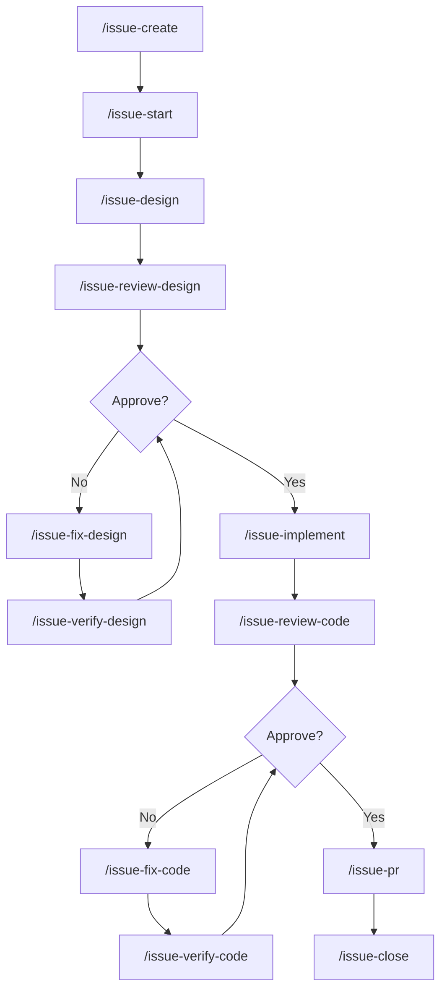
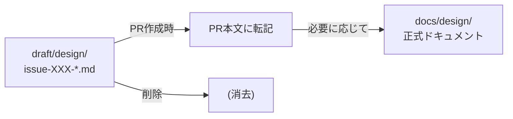

# Development Workflow

AI駆動の開発ワークフロー。Issue作成から完了まで一貫した流れで作業を進める。

## 全体フロー



## フェーズ概要

| フェーズ | コマンド | 成果物 |
|----------|----------|--------|
| 1. 起票 | `/issue-create` | GitHub Issue + ラベル |
| 2. 着手 | `/issue-start` | worktree + Issue本文にメタ情報 |
| 3. 設計 | `/issue-design` | `draft/design/` に設計書 |
| 4. 実装 | `/issue-implement` | コード + テスト |
| 5. PR作成 | `/issue-pr` | PR（設計書をPR本文に転記後、draft/削除） |
| 6. 完了 | `/issue-close` | PRマージ + worktree削除 |

## 詳細フロー

```
┌─────────────────────────────────────────────────────────────────────┐
│ Phase 1: 起票                                                       │
│ /issue-create "タイトル" [type]                                     │
├─────────────────────────────────────────────────────────────────────┤
│ • Issue作成                                                         │
│ • ラベル付与 (enhancement / bug / refactoring)                      │
│ • Issue番号を返却                                                   │
└─────────────────────────────────────────────────────────────────────┘
                                  ↓
┌─────────────────────────────────────────────────────────────────────┐
│ Phase 2: 着手                                                       │
│ /issue-start <issue-number> [prefix]                                │
├─────────────────────────────────────────────────────────────────────┤
│ • worktree作成: ../[prefix]-[issue-number]                          │
│ • Issue本文にWorktree情報を追記                                     │
└─────────────────────────────────────────────────────────────────────┘
                                  ↓
┌─────────────────────────────────────────────────────────────────────┐
│ Phase 3: 設計                                                       │
│ /issue-design <issue-number>                                        │
├─────────────────────────────────────────────────────────────────────┤
│ • Issue本文からWorktree情報を取得 → 移動                            │
│ • draft/design/issue-[number]-xxx.md を作成                         │
│ • コミット                                                          │
│ • Issueに設計完了コメント                                           │
│                                                                     │
│ ┌─────────────────────────────────────────────────────────────────┐ │
│ │ レビューサイクル                                                 │ │
│ │ /issue-review-design → /issue-fix-design → /issue-verify-design │ │
│ │                              ↑                    │              │ │
│ │                              └── Changes ─────────┘              │ │
│ │                                     ↓ Approve                    │ │
│ └─────────────────────────────────────────────────────────────────┘ │
└─────────────────────────────────────────────────────────────────────┘
                                  ↓
┌─────────────────────────────────────────────────────────────────────┐
│ Phase 4: 実装                                                       │
│ /issue-implement <issue-number>                                     │
├─────────────────────────────────────────────────────────────────────┤
│ • Issue本文からWorktree情報を取得 → 移動                            │
│ • draft/design/ を参照                                              │
│ • TDD: テスト作成 (Red) → 実装 (Green) → リファクタ                 │
│ • ruff check && ruff format && mypy && pytest                       │
│ • Issueに実装完了コメント                                           │
│                                                                     │
│ ┌─────────────────────────────────────────────────────────────────┐ │
│ │ レビューサイクル                                                 │ │
│ │ /issue-review-code → /issue-fix-code → /issue-verify-code       │ │
│ │                            ↑                  │                  │ │
│ │                            └── Changes ───────┘                  │ │
│ │                                   ↓ Approve                      │ │
│ └─────────────────────────────────────────────────────────────────┘ │
└─────────────────────────────────────────────────────────────────────┘
                                  ↓
┌─────────────────────────────────────────────────────────────────────┐
│ Phase 5: PR作成                                                     │
│ /issue-pr <issue-number>                                            │
├─────────────────────────────────────────────────────────────────────┤
│ • Issue本文からWorktree情報を取得 → 移動                            │
│ • git absorb --and-rebase でコミット整理                            │
│ • draft/design/ の内容をPR本文に転記                                │
│ • git rm -rf draft/ && git commit                                   │
│ • git push                                                          │
│ • gh pr create                                                      │
└─────────────────────────────────────────────────────────────────────┘
                                  ↓
┌─────────────────────────────────────────────────────────────────────┐
│ Phase 6: 完了                                                       │
│ /issue-close <issue-number>                                         │
├─────────────────────────────────────────────────────────────────────┤
│ • gh pr merge --merge --delete-branch                               │
│ • git worktree remove                                               │
│ • 完了報告                                                          │
└─────────────────────────────────────────────────────────────────────┘
```

## レビューサイクルの重要性

### なぜ verify が必要か

`review` → `fix` → `review` のサイクルでは、毎回フルレビューが実行されるため：

- 新しい指摘が発生し続ける
- 些末な指摘の繰り返しでサイクルが収束しない
- ワークフローが破綻するリスクがある

`verify` は「指摘事項が修正されたか」のみを確認する限定的なチェックで、**新規指摘を追加しない**ことでレビューの収束を保証する。

```
review → fix → verify → (修正OK) → 次フェーズへ
                  ↓
            (修正不十分) → fix に戻る
```

## 設計書ルール

| ルール | 説明 |
|--------|------|
| What & Constraint | 入力/出力と制約のみ |
| Minimal How | 実装詳細は方針のみ。疑似コードはOK |
| API仕様 | 公式リンク参照（コピペ禁止） |
| Test Strategy | ID羅列ではなく検証観点を言語化 |

## ラベル・prefix マッピング

| ラベル | prefix | 用途 |
|--------|--------|------|
| `enhancement` | feat | 新機能追加 |
| `bug` | fix | バグ修正 |
| `refactoring` | refactor | リファクタリング |
| `documentation` | docs | ドキュメント |

## Issue本文の構造

`/issue-start` 実行後、Issue本文の先頭にメタ情報が追記される:

```markdown
> [!NOTE]
> **Worktree**: `../[prefix]-[issue-number]`
> **Branch**: `[prefix]/[issue-number]`

(元のIssue本文)
```

## 設計書の保存場所



| フェーズ | 場所 | 説明 |
|----------|------|------|
| 作業中 | `draft/design/issue-XXX-*.md` | worktree内、コミット対象 |
| PR作成時 | PR本文に転記 | 永続化、draft/は削除 |
| 恒久設計 | `docs/design/` | 必要に応じて手動で更新 |

## コマンド一覧

### ライフサイクル管理

| コマンド | 説明 |
|----------|------|
| `/issue-create` | Issue作成 + ラベル付与 |
| `/issue-start` | worktree構築 + Issue本文にメタ情報追記 |
| `/issue-pr` | コミット整理 + 設計書転記 + draft削除 + PR作成 |
| `/issue-close` | PRマージ + worktree削除 |

### 設計フェーズ

| コマンド | 説明 |
|----------|------|
| `/issue-design` | draft/design/ に設計書作成 |
| `/issue-review-design` | 設計レビュー（フル） |
| `/issue-fix-design` | 設計修正 |
| `/issue-verify-design` | 設計再確認（修正箇所のみ） |

### 実装フェーズ

| コマンド | 説明 |
|----------|------|
| `/issue-implement` | TDDで実装 |
| `/issue-review-code` | コードレビュー（フル） |
| `/issue-fix-code` | コード修正 |
| `/issue-verify-code` | コード再確認（修正箇所のみ） |
