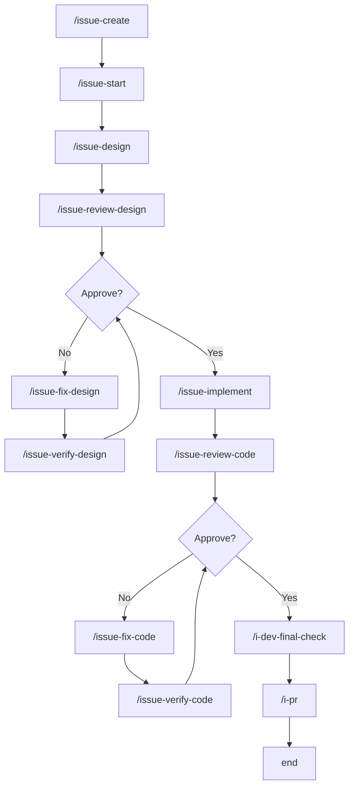
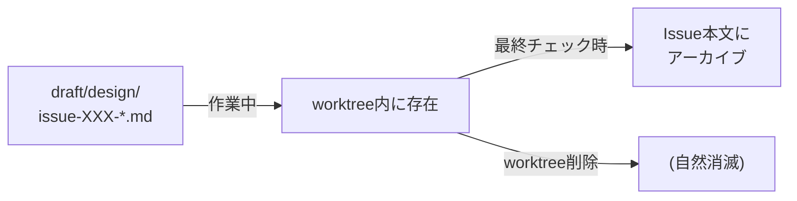

# Development Workflow

AI駆動の開発ワークフロー。Issue作成から完了まで一貫した流れで作業を進める。

## 全体フロー



## フェーズ概要

| フェーズ | コマンド | 成果物 |
|----------|----------|--------|
| 1. 起票 | `/issue-create` | GitHub Issue + ラベル |
| 2. 着手 | `/issue-start` | worktree + Issue本文にメタ情報 |
| 3. 設計 | `/issue-design` | `draft/design/` に設計書 |
| 4. 実装 | `/issue-implement` | コード + テスト |
| 5. 最終チェック | `/i-dev-final-check` | エビデンス集約 + 品質チェック + 設計書アーカイブ |
| 6. PR作成 | `/i-pr` | PR作成 |
| 7. 完了 | `/issue-close` | PRマージ + ブランチ安全削除 + worktree削除（※手動実行） |

## 詳細フロー

```
┌─────────────────────────────────────────────────────────────────────┐
│ Phase 1: 起票                                                       │
│ /issue-create "タイトル" [type]                                     │
├─────────────────────────────────────────────────────────────────────┤
│ • Issue作成                                                         │
│ • ラベル付与 (type:feature / type:bug / type:refactor 等)           │
│ • Issue番号を返却                                                   │
└─────────────────────────────────────────────────────────────────────┘
                                  ↓
┌─────────────────────────────────────────────────────────────────────┐
│ Phase 2: 着手                                                       │
│ /issue-start <issue-number> [prefix]                                │
├─────────────────────────────────────────────────────────────────────┤
│ • prefix 未指定時は feat をデフォルト使用                           │
│ • worktree作成: ../kaji-[prefix]-[issue-number]                      │
│ • .venv シンボリックリンク作成                                      │
│ • Issue本文にWorktree情報を追記                                     │
└─────────────────────────────────────────────────────────────────────┘
                                  ↓
┌─────────────────────────────────────────────────────────────────────┐
│ Phase 3: 設計                                                       │
│ /issue-design <issue-number>                                        │
├─────────────────────────────────────────────────────────────────────┤
│ • Issue本文からWorktree情報を取得 → 作業                            │
│ • draft/design/issue-[number]-xxx.md を作成                         │
│ • コミット                                                          │
│ • Issueに設計完了コメント                                           │
│                                                                     │
│ ┌─────────────────────────────────────────────────────────────────┐ │
│ │ レビューサイクル                                                 │ │
│ │ /issue-review-design → /issue-fix-design → /issue-verify-design │ │
│ │                              ↑                    │              │ │
│ │                              └── Changes ─────────┘              │ │
│ │                                     ↓ Approve                    │ │
│ └─────────────────────────────────────────────────────────────────┘ │
└─────────────────────────────────────────────────────────────────────┘
                                  ↓
┌─────────────────────────────────────────────────────────────────────┐
│ Phase 4: 実装                                                       │
│ /issue-implement <issue-number>                                     │
├─────────────────────────────────────────────────────────────────────┤
│ • Issue本文からWorktree情報を取得 → 作業                            │
│ • draft/design/ を参照                                              │
│ • Baseline Check: pytest 実行 → failure あれば Issue コメントに記録  │
│ • TDD: テスト作成 (Red) → 実装 (Green) → リファクタ                 │
│ • 品質チェック（コミット前必須）:                                   │
│   source .venv/bin/activate                                         │
│   ruff check kaji_harness/ tests/ && ruff format kaji_harness/ tests/ │
│   mypy kaji_harness/ && pytest                                      │
│ • Issueに実装完了コメント（pytest出力を含む）                       │
│                                                                     │
│ ┌─────────────────────────────────────────────────────────────────┐ │
│ │ レビューサイクル                                                 │ │
│ │ /issue-review-code → /issue-fix-code → /issue-verify-code       │ │
│ │                            ↑                  │                  │ │
│ │                            └── Changes ───────┘                  │ │
│ │                                   ↓ Approve                      │ │
│ └─────────────────────────────────────────────────────────────────┘ │
│                                                                     │
└─────────────────────────────────────────────────────────────────────┘
                                  ↓
┌─────────────────────────────────────────────────────────────────────┐
│ Phase 5: 最終チェック                                               │
│ /i-dev-final-check <issue-number>                                   │
├─────────────────────────────────────────────────────────────────────┤
│ • 全フェーズのエビデンス集約・確認                                  │
│ • 品質チェック: ruff check + ruff format --check + mypy + pytest    │
│ • 設計書を Issue 本文にアーカイブ（<details>タグ）                  │
└─────────────────────────────────────────────────────────────────────┘
                                  ↓
┌─────────────────────────────────────────────────────────────────────┐
│ Phase 6: PR作成                                                     │
│ /i-pr <issue-number>                                                │
├─────────────────────────────────────────────────────────────────────┤
│ • Issue本文からWorktree情報を取得                                   │
│ • git absorb（コミット履歴の整理）                                  │
│ • git push                                                          │
│ • gh pr create                                                      │
│ • ここでワークフロー自動実行は終了                                  │
└─────────────────────────────────────────────────────────────────────┘
                                  ↓
┌─────────────────────────────────────────────────────────────────────┐
│ Phase 7: 完了（※ワークフロー外。手動で実行）                        │
│ /issue-close <issue-number>                                         │
├─────────────────────────────────────────────────────────────────────┤
│ • gh pr merge --merge                                               │
│ • ブランチ安全削除（merge-base 確認後）                             │
│ • .venv シンボリックリンク削除                                      │
│ • git worktree remove                                               │
│ • stale ref クリーンアップ                                          │
│ • 完了報告                                                          │
└─────────────────────────────────────────────────────────────────────┘
```

## 設計書ルール

| ルール | 説明 |
|--------|------|
| What & Constraint | 入力/出力と制約のみ |
| Minimal How | 実装詳細は方針のみ。疑似コードはOK |
| Primary Sources | 一次情報（公式ドキュメント等）のURL/パスを必ず記載 |
| API仕様 | 公式リンク参照（コピペ禁止） |
| Test Strategy | ID羅列ではなく検証観点を言語化 |

## ラベル・type マッピング

| ラベル | type | 用途 |
|--------|------|------|
| `enhancement` | feat | 新機能追加 |
| `bug` | fix | バグ修正 |
| `refactoring` | refactor | リファクタリング |
| `documentation` | docs | ドキュメント |
| `good first issue` | test | テスト追加・改善 |

## Issue本文の構造

`/issue-start` 実行後、Issue本文の先頭にメタ情報が追記される:

```markdown
> [!NOTE]
> **Worktree**: `../kaji-fix-123`
> **Branch**: `fix/123`

(元のIssue本文)
```

PR作成後:

```markdown
> [!NOTE]
> **Worktree**: `../kaji-fix-123`
> **Branch**: `fix/123`
> **PR**: #456
```

## 設計書の保存場所



| フェーズ | 場所 | 説明 |
|----------|------|------|
| 作業中 | `draft/design/issue-XXX-*.md` | worktree内、コミット対象 |
| 最終チェック時 | Issue本文にアーカイブ | `/i-dev-final-check` で `<details>` タグに折りたたみ |
| アーキテクチャ決定 | `docs/adr/` | ADRとして永続化（従来通り） |

## コマンド一覧

### ライフサイクル管理

| コマンド | 説明 |
|----------|------|
| `/issue-create` | Issue作成 + ラベル付与 |
| `/issue-start` | worktree構築 + Issue本文にメタ情報追記 |
| `/i-dev-final-check` | エビデンス集約 + 品質チェック + ドキュメント影響確定 + 設計書アーカイブ |
| `/i-pr` | コミット整理 + PR作成 |
| `/issue-close` | PRマージ + ブランチ安全削除 + worktree削除（※手動実行） |

### 設計フェーズ

| コマンド | 説明 |
|----------|------|
| `/issue-design` | draft/design/ に設計書作成 |
| `/issue-review-design` | 設計レビュー |
| `/issue-fix-design` | 設計修正 |
| `/issue-verify-design` | 設計再確認 |

### 実装フェーズ

| コマンド | 説明 |
|----------|------|
| `/issue-implement` | TDDで実装 |
| `/issue-review-code` | コードレビュー |
| `/issue-fix-code` | コード修正 |
| `/issue-verify-code` | コード再確認 |
