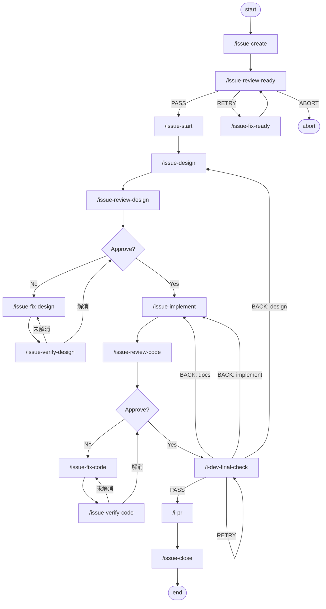
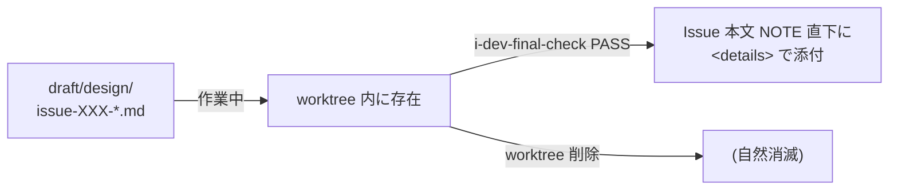

# Development Workflow

実装を伴う Issue 向けの開発ワークフロー。
入口と共通原則は [workflow_overview.md](./workflow_overview.md) を参照し、本書では dev workflow に限定して扱う。

## 対象

- コード変更を含む Issue
- テスト追加や品質ゲート実行が必要な Issue
- 設計書の昇格または既存 docs の更新が必要な Issue

docs-only の Issue は [docs_maintenance_workflow.md](./docs_maintenance_workflow.md) を使用する。

## フロー



## フェーズ概要

| フェーズ | コマンド | 主な責務 |
|----------|----------|-----------|
| 起票 | `/issue-create` | Issue 作成、ラベル付与 |
| レディネスレビュー | `/issue-review-ready` → `/issue-fix-ready` ループ | Issue 本文の記述品質ゲート |
| 着手 | `/issue-start` | worktree 作成、Issue 本文 NOTE ブロックに Worktree / Branch を追記 |
| 設計 | `/issue-design` | 設計書作成（`draft/design/issue-XXX-*.md`）、影響ドキュメント整理、テスト方針整理 |
| 設計レビュー | `/issue-review-design` | 一次情報・設計整合性・影響評価の確認 |
| 実装 | `/issue-implement` | 実装、docs 更新、品質ゲート（`make check`）実行 |
| コードレビュー | `/issue-review-code` | 設計整合、テスト証跡、docs 更新漏れの確認 |
| 最終チェック | `/i-dev-final-check` | PR 前の最終品質ゲート（`make check`）、docs 整合、設計書 NOTE 直下添付、Issue 本文更新 |
| PR 作成 | `/i-pr` | branch/worktree 解決、push、`gh pr create`（`--no-ff` merge 前提） |
| 完了 | `/issue-close` | PR merge、worktree cleanup、Issue close、完了報告コメント（※手動実行） |

## type 別の差分

dev workflow のフローそのものは type に依存しないが、各スキル内での処理は Issue の `type:` ラベルにより分岐する。

| フェーズ | feat | bug | refactor |
|----------|------|-----|----------|
| review-ready | ユーザーストーリー / スコープ境界を追加確認 | OB / EB / 再現手順が必須 | 測定可能な改善指標を追加確認 |
| create | feat 用テンプレートを適用 | bug 用テンプレートを適用 | refactor 用テンプレートを適用 |
| design | `_shared/design-by-type/feat.md` を適用（IF 設計・使用例中心） | `_shared/design-by-type/bug.md` を適用（OB/EB + 根本原因） | `_shared/design-by-type/refactor.md` を適用（ベースライン計測・改善指標） |
| review-design | IF / 使用例に重み | OB/EB 整合・再現可能性に重み | 測定指標の定量性・振る舞い非変更に重み |
| implement | `_shared/implement-by-type/feat.md` を適用（標準 TDD） | `_shared/implement-by-type/bug.md` を適用（再現テスト先行） | `_shared/implement-by-type/refactor.md` を適用（計測 → safety net → 改修 → 再計測） |
| review-code | IF 契約の忠実性 | 再現テストの Red→Green 証跡・同根欠陥の波及修正 | 振る舞い非変更の保証・改善指標の達成 |

**fix/verify 系スキル（`issue-fix-*` / `issue-verify-*` / `pr-fix` / `pr-verify`）には type 分岐を入れない**。レビューサイクルの収束保証（`issue-verify-code/SKILL.md` の「新規指摘は行わない」原則）を損なうため。

**type:docs は dev workflow の対象外**。docs-only workflow（`/i-doc-update` 起点）を使用する。

**canonical 外 type（`type:test` / `type:chore` / `type:perf` / `type:security`）**は、上記分岐対象スキルでは `type:feature` と同等に扱う（フォールバック規則）。

## type → ラベル マッピング

> **参照**: [docs/rfc/github-labels-standardization.md](../rfc/github-labels-standardization.md)（GitHub Labels 標準化）

| type | ラベル | 用途 |
|------|--------|------|
| `feat` | `type:feature` | 新機能追加 |
| `fix` | `type:bug` | バグ修正 |
| `refactor` | `type:refactor` | リファクタリング |
| `docs` | `type:docs` | ドキュメント |
| `test` | `type:test` | テスト追加・改善 |
| `chore` | `type:chore` | 雑務・依存の掃除 |
| `perf` | `type:perf` | パフォーマンス改善 |
| `security` | `type:security` | セキュリティ対応 |

## 完了条件の考え方

- 各フェーズは、その段階で確認可能な完了条件を終盤で確認し、Issue コメントに証跡を残す
- `i-dev-final-check` が前段の証跡を横断確認し、PR に進めるか最終判定する
- docs 更新判断は design / implement / review-code / final-check の各段で確認する
- `i-dev-final-check` の PASS 時に Issue 本文の完了条件チェックボックスを更新し、設計書を NOTE 直下に添付する

詳細は以下を参照:

- [workflow_completion_criteria.md](./workflow_completion_criteria.md) — フェーズ別確認項目、証跡責務、Issue 本文更新プロトコル
- [documentation_update_criteria.md](./documentation_update_criteria.md)
- [shared_skill_rules.md](./shared_skill_rules.md)

## テストと品質ゲート

kaji は Python 単一スタックであり、品質ゲートは `make check` に統一されている。

- 日常開発・コミット前の統合ゲート: `make check`（`ruff check` → `ruff format` → `mypy` → `pytest`）
- docs-only 変更時のリンク整合性ゲート: `make verify-docs`
- packaging-only 変更時の独立検証: `make verify-packaging`
- マーカー別個別実行: `make test-small` / `make test-medium` / `make test-large`

詳細は以下を参照:

- [testing-convention.md](./testing-convention.md) — テスト規約 + 恒久テスト追加不要の 4 条件（docs-only / metadata-only / packaging-only）
- [../reference/testing-size-guide.md](../reference/testing-size-guide.md)
- [../../CLAUDE.md](../../CLAUDE.md) — Essential Commands（`make check` 等の正本）

## コミットメッセージ規約（Conventional Commits）

kaji は Conventional Commits を採用する。Squash merge は禁止し、`--no-ff` merge を必須とする。詳細は [../guides/git-commit-flow.md](../guides/git-commit-flow.md) を参照。

| prefix | 用途 |
|--------|------|
| `feat:` | 新機能 |
| `fix:` | バグ修正 |
| `refactor:` | リファクタリング |
| `docs:` | ドキュメント変更 |
| `test:` | テスト追加・改善 |
| `chore:` | 雑務・依存の掃除 |
| `perf:` | パフォーマンス改善 |
| `build:` / `ci:` | ビルド / CI |

PR title も Conventional Commits に揃える。`--no-ff` merge により merge commit が残るため、PR title が直接の commit message にはならないが、履歴可読性のために統一する。

## 設計書の扱い

- 作業中の設計書は `draft/design/issue-XXX-*.md`（worktree 内、コミット対象）
- `/i-dev-final-check` の PASS 時に Issue 本文の NOTE ブロック直下に `<details>` で添付（worktree 削除後も Issue から辿れる）
- アーキテクチャ決定は `docs/adr/` に ADR として永続化（従来通り）
- 既存 docs の更新が必要な場合は `_shared/promote-design.md` を参照



## Issue 本文の構造

`/issue-start` 実行後、Issue 本文の先頭に NOTE ブロックが追記される:

```markdown
> [!NOTE]
> **Worktree**: `../kaji-feat-123`
> **Branch**: `feat/123`

(元の Issue 本文)
```

PR 作成後（`/i-pr` が PR 番号を追記）:

```markdown
> [!NOTE]
> **Worktree**: `../kaji-feat-123`
> **Branch**: `feat/123`
> **PR**: #456
```

`/i-dev-final-check` PASS 時、設計書が NOTE 直下に添付される（詳細は [workflow_completion_criteria.md](./workflow_completion_criteria.md) の「Issue 本文更新プロトコル」を参照）。

## コマンド一覧

### ライフサイクル管理

| コマンド | 説明 |
|----------|------|
| `/issue-create` | Issue 作成 + ラベル付与 |
| `/issue-review-ready` | Issue 本文レディネスレビュー（全 workflow 共通ゲート） |
| `/issue-fix-ready` | レディネス RETRY 指摘への対応 |
| `/issue-start` | worktree 構築 + Issue 本文 NOTE ブロックに Worktree/Branch 追記 |
| `/i-dev-final-check` | エビデンス集約 + 品質チェック + 設計書 NOTE 直下添付 + Issue 本文更新 |
| `/i-pr` | コミット整理 + push + PR 作成 |
| `/issue-close` | PR merge + worktree 削除 + ブランチ安全削除 + Issue クローズ（※手動実行） |

### 設計フェーズ

| コマンド | 説明 |
|----------|------|
| `/issue-design` | `draft/design/` に設計書作成 |
| `/issue-review-design` | 設計レビュー（新規指摘可） |
| `/issue-fix-design` | 設計修正 |
| `/issue-verify-design` | 設計再確認（新規指摘不可） |

### 実装フェーズ

| コマンド | 説明 |
|----------|------|
| `/issue-implement` | TDD で実装 + `make check` |
| `/issue-review-code` | コードレビュー（新規指摘可） |
| `/issue-fix-code` | コード修正 |
| `/issue-verify-code` | コード再確認（新規指摘不可） |
