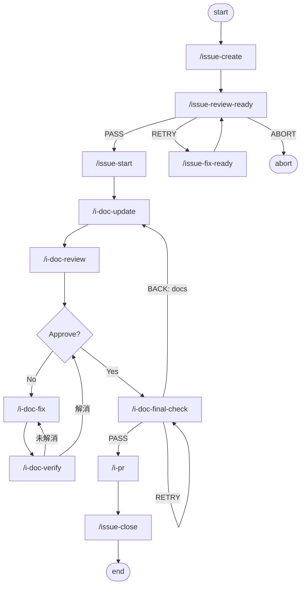

# Docs Maintenance Workflow

docs-only Issue 向けのワークフロー。
コード、設定、テストは変更せず、現行実装・CLI・運用方針との整合を確認しながら docs を更新する。

## 対象

- `docs/`, `README.md`, `CLAUDE.md`, `workflows/`, `.claude/skills/` の整理が主目的
- 実装変更なしで整合性を回復できる Issue

コード変更が必要になった場合は docs-only のまま進めず、dev workflow に切り替える。

## フロー

## フェーズ概要

| フェーズ | コマンド | 主な責務 |
|----------|----------|-----------|
| 起票 | `/issue-create` | Issue 作成、ラベル付与（`type:docs`） |
| レディネスレビュー | `/issue-review-ready` → `/issue-fix-ready` ループ | Issue 本文の記述品質ゲート |
| 着手 | `/issue-start` | worktree 作成、Issue 本文 NOTE ブロックに Worktree / Branch を追記 |
| docs 更新 | `/i-doc-update` | docs 修正、参照整合確認、リンクチェック |
| docs レビュー | `/i-doc-review` | 事実整合性・実装整合性・運用整合性レビュー（新規指摘可） |
| docs 修正 | `/i-doc-fix` | レビュー指摘への対応（新規指摘なし） |
| docs 再確認 | `/i-doc-verify` | 修正確認（新規指摘不可） |
| 最終チェック | `/i-doc-final-check` | docs-only として PR に進めるか最終判定（`make verify-docs`） |
| PR 作成 | `/i-pr` | push、`gh pr create`（`--no-ff` merge 前提） |
| 完了 | `/issue-close` | PR merge、worktree cleanup、Issue close（※手動実行） |

## 実行制約

- コード、設定、テストは変更しない
- 事実確認のための read / search / コマンド実行は許可
- docs だけでは安全に吸収できない問題は ABORT し、dev workflow への切り替えを提案

## 整合性監査の観点

`/i-doc-update` / `/i-doc-review` / `/i-doc-verify` で確認する 3 観点。詳細は [documentation_update_criteria.md](./documentation_update_criteria.md) を参照。

| 観点 | 確認内容 |
|------|----------|
| 事実整合性 | 現行コード・CLI・コマンド出力との一致 |
| 実装整合性 | コード差分との対応関係（実装に対して docs が遅れていないか） |
| 運用整合性 | CLAUDE.md / workflow / skill 構成との一致、リンク切れ・古いコマンド例の有無 |

## docs-only final-check の責務

- リンク、参照パス、コマンド例の整合確認（`make verify-docs`）
- 現行実装・CLI・運用方針との整合確認
- docs-only の完了条件確認
- Issue 本文・コメントの状態更新

`make check`（`ruff` / `mypy` / `pytest`）は docs-only final-check の必須条件ではない。docs だけが対象であれば `make verify-docs` の通過で十分。ただし `.claude/skills/` 配下に Python テストが連動するケースなど、影響範囲が docs を超える兆候があれば dev workflow への切り替えを検討する。

## 恒久テスト追加の扱い

docs-only ワークフローでは恒久テスト（pytest）の追加を行わない。理由は [testing-convention.md](./testing-convention.md) の 4 条件「docs-only / metadata-only / packaging-only の場合に恒久テスト追加が不要」に従う。代替検証は `make verify-docs` および本ドキュメント記載の整合性監査で担保する。

## 関連ドキュメント

- [workflow_overview.md](./workflow_overview.md)
- [workflow_completion_criteria.md](./workflow_completion_criteria.md)
- [documentation_update_criteria.md](./documentation_update_criteria.md)
- [shared_skill_rules.md](./shared_skill_rules.md)
- [testing-convention.md](./testing-convention.md)
