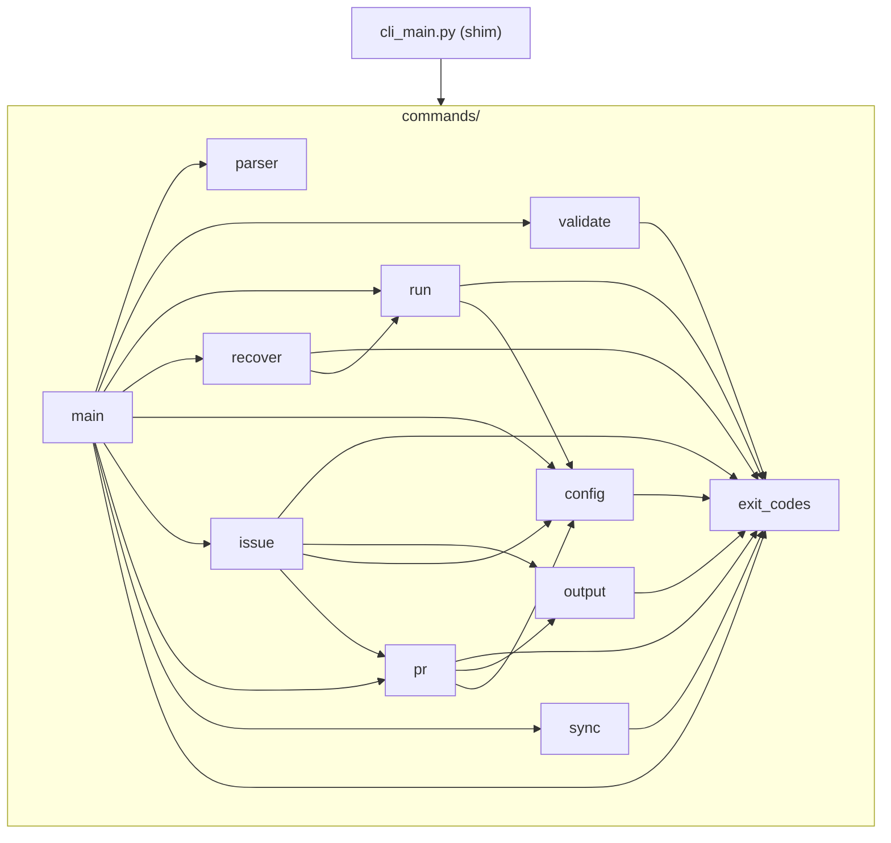

# [設計] cli_main.py を kaji_harness/commands/ パッケージへ機械的分割（R1）

Issue: #283

## 概要

`kaji_harness/cli_main.py`（2,421 行 / トップレベル関数 66 個）を、責務単位で
`kaji_harness/commands/` package（10 実体モジュール + `__init__.py`）へ機械的に分割する。
ロジック変更を伴わないコード移動と import 調整に限定し、`cli_main.py` は既存シンボルを
explicit re-export する互換 shim + `python -m` 互換ブロックとして残す。

## 背景・目的

### 現状の問題（観測可能な形）

- `cli_main.py` に 8 責務（parser 登録 / run / recover / PR / issue / local issue CRUD /
  sync / config / jq・JSON 出力 / entrypoint）が集中し、単一ファイル 2,421 行・66 関数
  （`wc -l` / `grep -cE '^(def|async def) ' kaji_harness/cli_main.py` で再現）
- Issue 作成後にも recovery/config 系 7 関数が追加され、旧 2,050 行・60 関数から増加が継続
- tests の `kaji_harness.cli_main.<symbol>` module 経由 patch が **131 件**
  （R0 = #282 棚卸し。`scripts/inventory_cli_main_patch_targets.sh` で再現）あり、
  責務ごとの変更が patch 互換の全域に波及する構造

### 改善指標（実装フェーズで再計測して比較）

| 指標 | 現状（ベースライン） | 目標 | 計測コマンド |
|------|---------------------|------|--------------|
| `cli_main.py` 行数 | 2,421 行 | explicit re-export shim + `__main__` ブロックのみ（見積り約 130 行。R1 では固定上限を置かず実測値を記録。最終縮小は #284） | `wc -l kaji_harness/cli_main.py` |
| 実体モジュール行数 | —（新設） | 各 700 行以下（§配置表に見積り。超過時は理由を記録） | `wc -l kaji_harness/commands/*.py` |
| 関数の配置 | 66 関数が単一ファイル | 66 関数 + 12 定数を 100% 配置（§配置表） | `grep -cE '^(def|async def) '` の合計一致 |
| tests の `cli_main.*` patch target | 131 件 | **0 件**（全件を実体 module target へ機械的書換え） | `bash scripts/inventory_cli_main_patch_targets.sh` の出力が空 |
| 循環 import | —（単一ファイルのため無し） | 0 件（§依存図は DAG。import 成功 = `kaji --version` で確認） | `kaji --version` / `python -c "import kaji_harness.cli_main"` |

## ベースライン計測

R0（#282）成果物（Issue #282 コメント「R0 棚卸し成果物」を正本とする）+ 本設計時の再計測:

| 指標 | 値 | 取得コマンド | 本設計時の再計測 |
|------|----|--------------|-----------------|
| 行数 | 2,421 | `wc -l kaji_harness/cli_main.py` | 2,421（一致） |
| トップレベル関数 | 66 | `grep -nE '^(def\|async def) ' kaji_harness/cli_main.py` | 66（一致） |
| coverage（R0 完了後） | 88% / 1,142 stmts / 137 missed | `pytest --cov=kaji_harness.cli_main --cov-report=term-missing -m 'small or medium' -q` | 実装フェーズ冒頭で再実行 |
| 全テスト | 2,345 passed, 1 skipped | `pytest`（フィルタなし） | 実装フェーズ冒頭で再実行 |
| patch target | 131 件（全件 module 経由） | `bash scripts/inventory_cli_main_patch_targets.sh`（frozen baseline TSV と diff ゼロ） | 実装フェーズ冒頭で再実行 |

分割後の coverage 比較は、対象が package へ移るため
`pytest --cov=kaji_harness.cli_main --cov=kaji_harness.commands --cov-report=term-missing -m 'small or medium' -q`
で再計測し、合算値がベースライン（88%）以上であることを確認する。

## インターフェース

### 公開 IF は不変（宣言）

以下の外部観測面をすべて不変とする:

1. **console entrypoint**: `pyproject.toml` の `kaji = "kaji_harness.cli_main:main"` は変更しない。
   entry point の object reference は「module のインポート + 属性参照」で解決される
   （一次情報: [Entry points specification](https://packaging.python.org/en/latest/specifications/entry-points/)）ため、
   `cli_main` が `main` を re-export すれば維持できる
2. **`python -m kaji_harness.cli_main`**: `kaji_harness/recovery/handler.py:655` の
   `_child_argv()` が recovery child run をこの形式で起動する。`-m` は module を `__main__`
   として実行する（一次情報: [Python cmdline `-m`](https://docs.python.org/3/using/cmdline.html#cmdoption-m)）ため、
   shim 末尾に `if __name__ == "__main__": sys.exit(main())` ブロックを**維持する（必須）**
3. **`kaji` CLI の全 subcommand 表面と exit code**: 変更しない
4. **`from kaji_harness.cli_main import <symbol>` / `cli_main.<symbol>` 参照**: tests 18+ ファイルが
   from-import で直接シンボルを参照する（例: `tests/test_recovery_cli.py:17` / `tests/test_preflight.py:22`）。
   shim の explicit re-export で全維持する
5. **`kaji_harness/cli.py`**: 移動・改名・変更しない。新 package 名は `commands/` であり
   `kaji_harness/cli/` は作成しないため名前衝突なし（`kaji_harness/interactive_terminal.py:43` /
   `kaji_harness/runner.py:18` の `from .cli import ...` 契約は不変）

### 入力

- 対象: `kaji_harness/cli_main.py`（着手時 main = commit `6f9b4e6`）
- 設計入力: R0（#282）の patch target 棚卸し（131 件 / frozen baseline TSV / symbol 別対応表）

### 出力

- 新設 `kaji_harness/commands/` package（`__init__.py` + 実体 10 モジュール）
- shim 化された `kaji_harness/cli_main.py`
- 書換え済み patch target（131 件、対象 test ファイル 15 個）

### 使用例（分割後も不変）

```python
# entrypoint 経由(不変)
# $ kaji run .kaji/wf/dev.yaml 283
# $ python -m kaji_harness.cli_main run .kaji/wf/dev.yaml 283

# 旧 import は shim 経由で全て動作(不変)
from kaji_harness.cli_main import main, create_parser, _handle_issue, EXIT_OK

# 新 patch target(tests のみ機械的書換え)
patch("kaji_harness.commands.run.WorkflowRunner")       # 旧: kaji_harness.cli_main.WorkflowRunner
patch("kaji_harness.commands.pr.subprocess")            # 旧: kaji_harness.cli_main.subprocess
```

## 制約・前提条件

- 変更はコード移動・re-export・機械的 import 調整に限定。ロジック変更・振る舞い変更なし
- tests の import / assertion / fixture / test data / 制御フローは変更しない。
  例外は R0 で「re-export 維持不可能」と分類された patch/monkeypatch target path の機械的書換えのみ
- `kaji_harness/cli.py` は対象外。domain/application 再設計は #286、private import 整理は #285、
  shim 最終削除・tests import 移行は #284 の責務（本 R1 では行わない）
- 移動先関数は移動先 module の globals から名前を解決する
  （一次情報: [unittest.mock — Where to patch](https://docs.python.org/3/library/unittest.mock.html#where-to-patch)）。
  この制約が patch target 書換えと module 集約設計（決定 D1）の根拠
- 関数内の遅延 import（`create_parser` 内 `local_init` / `cmd_run` 内 `console_log` /
  `_run_pr_review_poll` 内 `scripts` / sync 系 / jq 系の計 14 箇所）は関数と一体で移動する

## 方針

### Before / After 構造

```
Before:
  kaji_harness/cli_main.py          2,421 行 / 66 関数 / 12 定数 / __main__ ブロック

After:
  kaji_harness/cli_main.py          互換 shim(explicit re-export 78 シンボル + __main__ ブロック)
  kaji_harness/commands/
    __init__.py                     package marker(docstring のみ)
    exit_codes.py                   EXIT_* 定数(共有 leaf)
    parser.py                       parser 構築・subcommand 登録
    validate.py                     kaji validate
    run.py                          kaji run + failure triage + provider 整合ガード
    recover.py                      kaji recover
    pr.py                           kaji pr 全経路 + gh CLI 転送層(集約。決定 D1)
    issue.py                        kaji issue dispatch + GitHub verdict + local issue CRUD
    config.py                       kaji config + dispatch 用 config 読込
    output.py                       jq / JSON 整形・body 引数読込(共有 leaf)
    sync.py                         kaji sync
    main.py                         main() dispatch + exit code mapping
```

### 全 66 関数 + 12 定数の配置表

行番号は着手時 main（2,421 行版）の実測。「見積り行数」は移動元行数 + module ヘッダ
（docstring / `from __future__` / import 群）の概算。

#### commands/exit_codes.py（見積り 約 15 行）

| シンボル | 種別 | 移動元行 |
|----------|------|----------|
| `EXIT_OK` / `EXIT_ABORT` / `EXIT_VALIDATION_ERROR` / `EXIT_DEFINITION_ERROR` / `EXIT_CONFIG_NOT_FOUND` / `EXIT_INVALID_INPUT` / `EXIT_RUNTIME_ERROR` | 定数 7 個 | 53–59 |

#### commands/parser.py（10 関数、見積り 約 300 行）

| 関数 | 移動元行 |
|------|----------|
| `_get_version` | 62–67 |
| `create_parser` | 70–88 |
| `_register_sync` | 91–125 |
| `_register_config` | 128–160 |
| `_register_run` | 163–226 |
| `_add_recovery_arguments` | 229–273 |
| `_register_recover` | 276–303 |
| `_register_issue` | 306–318 |
| `_register_pr` | 321–336 |
| `_register_validate` | 339–350 |

`main()` は `args.command` 文字列で dispatch しており `set_defaults(func=...)` を使わないため、
parser.py はコマンドハンドラへの依存を持たない（leaf）。`create_parser` 内の遅延 import
`from .local_init import register_subcommand as _register_local` は相対階層を
`from ..local_init import ...` へ機械調整して移動する。

#### commands/validate.py（4 関数、見積り 約 115 行）

| 関数 | 移動元行 |
|------|----------|
| `_resolve_project_root_for_validate` | 353–381 |
| `cmd_validate` | 384–441 |
| `_print_success` | 444–446 |
| `_print_error` | 449–453 |

#### commands/run.py（4 関数、見積り 約 290 行）

| 関数 | 移動元行 |
|------|----------|
| `_apply_execution_overrides` | 456–497 |
| `cmd_run` | 500–654 |
| `_run_failure_triage` | 657–703 |
| `_validate_workflow_provider_match` | 835–859 |

`_run_failure_triage` は `cmd_run` 専用の下請け（他呼出なし）のため run.py に置く。
`_validate_workflow_provider_match` は `cmd_run` / `cmd_recover` の共有だが、
recover.py → run.py の一方向 import で解決し循環を回避する（決定 D3）。

#### commands/recover.py（3 関数、見積り 約 145 行）

| 関数 | 移動元行 |
|------|----------|
| `cmd_recover` | 706–774 |
| `_resolve_recover_issue_context` | 777–785 |
| `_resolve_target_run_dir` | 788–832 |

#### commands/pr.py（16 関数 + 4 定数、見積り 約 575 行）

| シンボル | 移動元行 |
|----------|----------|
| `_FORGE_METHOD_FLAGS`（定数） | 862 |
| `_user_specified_repo` | 865–883 |
| `_forward_to_gh` | 886–931 |
| `_PR_BUILTIN_SUBCOMMANDS`（定数） | 934 |
| `_PR_BARE_PROVIDER_ERROR`（定数） | 936–949 |
| `_is_ascii_decimal` | 952–959 |
| `_GH_MISSING_GUIDANCE`（定数） | 962–966 |
| `_detect_repo` | 969–991 |
| `_forward_pr_review_comments` | 1013–1027 |
| `_forward_pr_reviews` | 1030–1044 |
| `_forward_pr_api_list` | 1047–1076 |
| `_forward_pr_reply_to_comment` | 1079–1116 |
| `_run_pr_review_poll` | 1119–1126 |
| `_dispatch_pr_builtin` | 1129–1185 |
| `_has_approve_flag` | 1188–1200 |
| `_has_request_changes_flag` | 1203–1215 |
| `_gh_capture_value` | 1218–1239 |
| `_gh_post_issue_comment_silent` | 1242–1267 |
| `_github_pr_review` | 1270–1371 |
| `_handle_pr` | 1374–1436 |

**決定 D1（gh CLI 転送層の pr.py 集約）**: `subprocess` / `shutil` を lookup する gh 系関数
（`_forward_to_gh` / `_detect_repo` / `_gh_capture_value` / `_gh_post_issue_comment_silent` /
`_forward_pr_api_list` / `_forward_pr_reply_to_comment` / `_github_pr_review`）を**単一 module に集約**する。
根拠: 既存 test には 1 つの patch（例: `cli_main.subprocess`）で複数関数の lookup を同時に差し替える
flow test が多数あり（例: `_github_pr_review` → `_gh_capture_value` → `_forward_to_gh` と貫通する
`tests/test_cli_main.py:1350`）、これらの関数を複数 module に分散させると旧 target 1 件が新 target
複数件に分裂し「機械的書換え」が成立しなくなる。単一 module 集約により、gh 系 `subprocess` / `shutil` /
`_detect_repo` patch の書換え先は常に `kaji_harness.commands.pr` の 1 namespace に確定する。
R0 対応表の暫定候補 `commands/gh_forward.py`（`_forward_to_gh` 単独分離）はこの理由で不採用。
`_forward_to_gh` は `_handle_issue`（issue.py）からも使われるが、issue.py → pr.py の一方向 import で
解決し循環しない（pr.py は issue.py を import しない）。

#### commands/config.py（4 関数、見積り 約 100 行）

| 関数 | 移動元行 |
|------|----------|
| `_emit_provider_overlay_divergence_warning` | 1439–1448 |
| `_load_config_for_dispatch` | 1451–1461 |
| `cmd_config_provider_type` | 2213–2244 |
| `cmd_config_artifacts_dir` | 2247–2273 |

R0 対応表の暫定候補 `commands/dispatch.py` は新設せず、config 読込の実体として config.py に置く
（`_load_config_for_dispatch` の patch は consumer 側 namespace への書換えとなるため、
定義 module の名前は patch 互換に影響しない。§patch 対応表参照）。

#### commands/output.py（6 関数、見積り 約 165 行）

| 関数 | 移動元行 |
|------|----------|
| `_compose_json_and_jq` | 994–1010 |
| `_read_body_arg` | 1601–1614 |
| `_apply_jq` | 1651–1701 |
| `_format_jq_results` | 1704–1727 |
| `_issue_to_json_dict` | 1730–1749 |
| `_emit_json` | 1752–1765 |

**決定 D6**: `_read_body_arg` は pr 系（`_github_pr_review`）と issue 系（verdict comment /
local CRUD）の両方から使われる。issue.py に置くと pr.py → issue.py → pr.py の循環が生じるため、
jq / JSON 整形と合わせて共有 leaf の output.py に置く。

#### commands/issue.py（16 関数 + 1 定数、見積り 約 640 行）

| シンボル | 移動元行 |
|----------|----------|
| `_handle_issue` | 1464–1519 |
| `_github_issue_comment_with_verdict` | 1522–1569 |
| `_resolve_local_id` | 1575–1598 |
| `_resolve_verdict_marker` | 1617–1634 |
| `_has_verdict_flags` | 1637–1648 |
| `build_worktree_note_body` | 1768–1791 |
| `_handle_issue_prepend_note` | 1794–1859 |
| `_handle_issue_context` | 1862–1914 |
| `_LOCAL_ISSUE_SUBS`（定数） | 1917 |
| `_handle_issue_local` | 1920–1982 |
| `_local_issue_view` | 1985–2018 |
| `_local_issue_create` | 2021–2039 |
| `_commit_local_issue_change` | 2042–2089 |
| `_local_issue_edit` | 2092–2130 |
| `_local_issue_comment` | 2133–2173 |
| `_local_issue_close` | 2176–2186 |
| `_local_issue_list` | 2189–2210 |

見積り 640 行は 700 行制限内だが最も近い。**contingency**: import ブロック追加で 700 行を超えた場合は
local issue CRUD（`_resolve_local_id` / `_resolve_verdict_marker` / `_commit_local_issue_change` /
`_local_issue_*` 7 関数）を `commands/issue_local.py` へ分離し、issue.py → issue_local.py の
一方向 import とする（`_github_issue_comment_with_verdict` が使う `_resolve_verdict_marker` も
issue_local 側に置けば循環しない）。採用した場合は配置表と patch 対応表の該当行を実測で更新する。

#### commands/sync.py（2 関数、見積り 約 120 行）

| 関数 | 移動元行 |
|------|----------|
| `cmd_sync_from_github` | 2276–2327 |
| `cmd_sync_status` | 2330–2379 |

#### commands/main.py（1 関数、見積り 約 55 行）

| 関数 | 移動元行 |
|------|----------|
| `main` | 2382–2417 |

`main()` 内の遅延 import `from .local_init import cmd_local` は `from ..local_init import cmd_local`
へ機械調整する。exit code mapping（`EXIT_ABORT` 返却含む）は main() と一体で移動する。

**配置検算**: parser 10 + validate 4 + run 4 + recover 3 + pr 16 + config 4 + output 6 +
issue 16 + sync 2 + main 1 = **66 関数**（全数一致）。定数 exit_codes 7 + pr 4 + issue 1 = **12 定数**。

### モジュール依存図（DAG・循環なし）



モジュール間参照（関数レベル。AST 解析による全数調査の結果、cross-module 参照は以下の 6 本のみ）:

| import 元 | import 先 | シンボル | 由来する呼び出し |
|-----------|-----------|----------|------------------|
| run.py | config.py | `_emit_provider_overlay_divergence_warning` | `cmd_run` |
| recover.py | run.py | `_validate_workflow_provider_match` | `cmd_recover` |
| pr.py | output.py | `_compose_json_and_jq`, `_read_body_arg` | `_forward_pr_api_list`, `_github_pr_review` |
| pr.py | config.py | `_load_config_for_dispatch` | `_handle_pr` |
| issue.py | config.py | `_load_config_for_dispatch` | `_handle_issue` |
| issue.py | pr.py | `_forward_to_gh` | `_handle_issue`（GitHub passthrough） |
| issue.py | output.py | `_read_body_arg`, `_emit_json`, `_issue_to_json_dict` | verdict comment / local CRUD / context |

すべて一方向。`main.py` → 各 cmd モジュール、shim → 全モジュール。逆方向参照は 0 件。

### shim 設計（cli_main.py の After）

```python
"""kaji CLI 互換 shim。実体は kaji_harness.commands 配下(#283 R1 で分割)。

旧 `from kaji_harness.cli_main import X` / `python -m kaji_harness.cli_main` /
console entrypoint `kaji_harness.cli_main:main` を維持する。最終削除は #284。
"""

from __future__ import annotations

import sys

from .commands.exit_codes import (EXIT_OK, EXIT_ABORT, ...)          # 7 定数
from .commands.parser import (_get_version, create_parser, ...)      # 10 関数
from .commands.validate import (...)                                 # 4 関数
from .commands.run import (...)                                      # 4 関数
from .commands.recover import (...)                                  # 3 関数
from .commands.pr import (...)                                       # 16 関数 + 4 定数
from .commands.config import (...)                                   # 4 関数
from .commands.output import (...)                                   # 6 関数
from .commands.issue import (...)                                    # 16 関数 + 1 定数
from .commands.sync import (...)                                     # 2 関数
from .commands.main import main

__all__ = [...]  # 上記 78 シンボル。ruff F401(unused import)は __all__ 登載で解消

if __name__ == "__main__":
    sys.exit(main())
```

- **export 対象**: 66 関数 + 12 定数 = **78 シンボル全部**。R1 では選別しない。
  維持理由: (a) tests 18+ ファイルが from-import / 属性参照で私有関数含め直接参照
  （tests の import 変更は #284 の責務）、(b) entrypoint、(c) `python -m` 互換。
  export の削減・tests import 移行後の shim 削除は #284 で目安 50 行前後へ縮小する
- **見積り行数**: 約 130 行（docstring + import 群 + `__all__` + `__main__` ブロック）。
  実測値・最終 export 一覧は実装完了時に Issue コメントへ記録する
- **stdlib / 外部シンボル（`subprocess` / `shutil` / `WorkflowRunner` 等）は re-export しない**。
  これらへの tests 参照は全件 patch target（棚卸し 131 件に含まれる）であり、書換え後は
  cli_main namespace への参照が残らないため。実装時に
  `grep -rnE 'cli_main\.[A-Za-z_]+' tests/` で patch 以外の残存参照が無いことを検証し、
  発見時は当該シンボルを re-export に追加して理由を記録する（fail-safe）

### patch target 対応表（R0 棚卸し 131 件 → R1 新 target）

R0 の結論: 131 件は**全件 module 経由**であり、本設計では 66 関数すべてが cli_main から移動する
ため、**131 件全件が「re-export で維持不可能」に確定**し、機械的書換え対象となる（Issue の許容例外
に該当。理由 = [Where to patch](https://docs.python.org/3/library/unittest.mock.html#where-to-patch):
移動先関数は移動先 module globals から名前解決するため、cli_main namespace への patch は不達）。
書換え先は「当該 test が exercise する flow で target symbol を lookup する関数が属する実体 module」
とする（Issue の規定「書換え先は実際に依存をlookupする実体moduleとする」に一致）。

| 旧 target（`kaji_harness.cli_main.` 配下） | 件数 | lookup する関数（配置先） | 新 target |
|--------------------------------------------|------|---------------------------|-----------|
| `WorkflowRunner` | 17 | `cmd_run`（run.py。`_run_failure_triage` は型注釈のみで runtime lookup なし） | `kaji_harness.commands.run.WorkflowRunner` |
| `subprocess` | 36 | `_forward_to_gh` / `_detect_repo` / `_gh_capture_value` / `_gh_post_issue_comment_silent` / `_forward_pr_api_list` / `_forward_pr_reply_to_comment`（全て pr.py） | `kaji_harness.commands.pr.subprocess` |
| `shutil` | 32 | `_forward_to_gh` / `_forward_pr_api_list` / `_forward_pr_reply_to_comment` / `_github_pr_review`（全て pr.py） | `kaji_harness.commands.pr.shutil` |
| `_detect_repo` | 17 | `_forward_pr_api_list` / `_forward_pr_reply_to_comment` / `_github_pr_review`（全て pr.py） | `kaji_harness.commands.pr._detect_repo` |
| `_forward_to_gh` | 11 | `_handle_pr` / `_github_pr_review`（pr.py）。baseline 11 件は全件 PR flow | `kaji_harness.commands.pr._forward_to_gh` |
| `_load_config_for_dispatch` | 9 | `_handle_pr`（pr.py）/ `_handle_issue`（issue.py） | flow 別: PR flow → `kaji_harness.commands.pr._load_config_for_dispatch` / issue flow → `kaji_harness.commands.issue._load_config_for_dispatch`。両 flow を跨ぐ共有 fixture は両 namespace を patch する（機械的に 1 行 → 2 行） |
| `_github_pr_review` | 7 | `_handle_pr`（pr.py） | `kaji_harness.commands.pr._github_pr_review` |
| `version` | 1 | `_get_version`（parser.py） | `kaji_harness.commands.parser.version` |
| `validate_skill_exists` | 1 | `cmd_validate`（validate.py） | `kaji_harness.commands.validate.validate_skill_exists` |

補足:

- `subprocess` は `_commit_local_issue_change`（issue.py）も lookup するが、frozen baseline 131 行に
  local issue commit flow を patch する test は存在しない（local 系 test は実 `git init` fixture を使用）。
  実装時に該当が発見された場合のみ `kaji_harness.commands.issue.subprocess` へ書き換える
- 全 131 行の行単位の新旧対応は、実装フェーズで frozen baseline TSV（test_file / line / target_symbol）
  を入力に生成し、**PR に全件一覧化**する（Issue 完了条件「例外変更はPRで一覧化」）
- issue.py が `from .pr import _forward_to_gh` で名前を束縛するため、issue flow で
  `_forward_to_gh` を patch する test が将来現れた場合の target は
  `kaji_harness.commands.issue._forward_to_gh`（consumer namespace）となる。baseline に該当は 0 件

**書換えの検証（3 重）**:

1. **テスト green**: 大多数の patch は mock 呼び出しを assert する flow test であり、
   target 不達なら assertion が fail する（検出可能）
2. **inventory script**: `bash scripts/inventory_cli_main_patch_targets.sh` の出力が**空**
   （`kaji_harness.cli_main` への patch target 0 件）であることを確認する。
   「patch していないことの証明」に使えるのは、スクリプトが monkeypatch / 属性代入 /
   patch.object / fixture 経由を含む全参照形態を走査対象とするため
3. **spy 型 patch の個別確認**: 「gh が呼ばれないことを assert する」spy 型 patch
  （例: `tests/test_dispatcher.py:847`）は target を誤っても green になりうるため、
  書換え 131 行を frozen baseline と突き合わせるレビューで担保する（PR の全件一覧が入力）

### 移行ステップ（実装順序）

1. ベースライン再計測（§ベースライン計測の全コマンド。green + drift ゼロを確認）
2. `kaji_harness/commands/` 新設 → leaf から順に作成:
   `exit_codes` → `output` / `parser` / `config` / `validate` → `run` → `recover` / `pr` →
   `issue` / `sync` → `main`（依存图の下流から。各段階で `python -c "import ..."` により循環を即検出）
3. `cli_main.py` を shim 化（78 シンボル re-export + `__main__` ブロック）
4. patch target 131 件を対応表に従い機械的書換え（`sed` / 一括置換。対象 15 test ファイル）
5. 検証（§テスト戦略）
6. 手編集箇所の列挙を PR に記録

**手編集箇所（コード移動以外の新規・変更行）の宣言**: (a) 各新 module の docstring /
`from __future__ import annotations` / import ブロック、(b) 遅延 import の相対階層調整
（`.local_init` → `..local_init` 等、`.` 1 個の機械的追加。対象 14 箇所）、(c) shim 全体、
(d) tests の patch target 文字列 131 行。これ以外の関数 body 行は無変更移動とし、
`git diff --color-moved=zebra --color-moved-ws=ignore-space-change` で移動判定されることを確認する
（一次情報: [git-diff --color-moved](https://git-scm.com/docs/git-diff#Documentation/git-diff.txt---color-movedltmodegt)）。

## テスト戦略

> 変更タイプ: **実行時コード変更**（ただし振る舞い非変更の機械的移動）。
> refactor 固有ルール（振る舞い非変更の保証）を適用する。

### 既存テストのカバレッジ評価（safety net は R0 で整備済み）

- 変更対象 `cli_main.py` の coverage は **88%**（R0 完了後、1,142 stmts / 137 missed）
- R0（#282）が本分割の safety net として characterization test **52 件**を先行追加済み。
  これらは stdlib `subprocess.run` / `shutil.which` の直 patch と `tmp_path` fixture を採用しており
  **module 移動に対して頑健**（R0 設計の R1-robust 方針）
- 全テスト 2,345 passed / 1 skipped がベースライン。「カバレッジが低い箇所は先にテストを足す」は
  R0 で完了しているため、本 R1 でのテスト追加は不要

### bridging test（新規追加しない理由とエビデンス）

新規 bridging test は追加しない。エビデンス: R0 の `tests/test_cli_main_characterization.py`
52 件がまさに「分割前後で同じ入力 → 同じ出力」を固定する目的で追加された bridging test であり
（#282 設計書 §概要）、既存 suite 全体（2,345 件）が分割後も**無改変**（patch target 文字列の
書換えのみ）で green になることが振る舞い非変更の直接証拠となる。

### Small テスト

- 新規追加なし。既存 Small（純粋分岐関数 / parser 表面 / dispatch 境界 mock）を無改変で流用し、
  分割後 green を確認する

### Medium テスト

- 新規追加なし。既存 Medium（local issue CRUD の実ファイル I/O + `git init` fixture /
  `_resolve_target_run_dir` 等）を無改変で流用する

### Large テスト

- 新規追加なし。外部 API との対話面（gh CLI への引数列・exit code 透過）は変更されず、
  実 forge 疎通で新たに得られる回帰シグナルがないため（`docs/dev/testing-convention.md` の
  4 条件: 独自ロジック追加なし / 既存ゲートで捕捉済み / 回帰検出情報が増えない / 本節で理由説明）

### 変更固有検証（恒久化しない一時検証）

| 検証 | コマンド | 合否基準 |
|------|----------|----------|
| patch target 全消し | `bash scripts/inventory_cli_main_patch_targets.sh` | 出力空（0 件） |
| tests 残存参照 | `grep -rnE 'cli_main\.[A-Za-z_]+' tests/` | patch 書換え漏れ・属性参照漏れ 0 件（shim export 78 シンボル内の from-import / 呼び出しは可） |
| tests diff 純度 | `git diff main..HEAD -- tests/` | patch/monkeypatch target 文字列以外の diff 0 行 |
| 移動純度 | `git diff --color-moved=zebra main..HEAD -- kaji_harness/` | 関数 body が移動判定。非移動行は §手編集箇所の宣言と一致 |
| entrypoint 不変 | `kaji --version` / `python -m kaji_harness.cli_main --version` | ともに version 表示・exit 0 |
| coverage 非劣化 | `pytest --cov=kaji_harness.cli_main --cov=kaji_harness.commands -m 'small or medium'` | 合算 88% 以上 |
| 品質ゲート | `make check`（ruff / ruff format / mypy / pytest 全件） | 全 PASS |

恒久テストにしない理由: いずれも本移行の一回性検証（移動純度・書換え完了性）であり、
分割完了後は検出対象そのものが消滅する（4 条件の 3「回帰検出情報が増えない」に該当）。

## 影響ドキュメント

| ドキュメント | 影響の有無 | 理由 |
|-------------|-----------|------|
| docs/adr/ | なし | 機械的移動のみで新規アーキテクチャ決定なし。恒久構造の決定は #286（責務再設計）で ADR 化を判断。既存 ADR 004/007 の cli_main 言及は歴史的記録のため改変しない |
| docs/ARCHITECTURE.md | なし | cli_main / commands への言及なし（grep で確認済み） |
| docs/dev/testing-convention.md | **あり** | L134 の patch スコープ規約が旧 target `kaji_harness.cli_main.subprocess.run` を明記 → `kaji_harness.commands.pr.subprocess.run` へ更新 |
| docs/dev/workflow-authoring.md | **あり** | L88 の `kaji_harness/cli_main.py:validate` 参照 → `kaji_harness/commands/validate.py` へ更新 |
| docs/cli-guides/local-mode.md / local-mode.ja.md | **あり** | `_commit_local_issue_change` の所在参照（en L219/L232、ja L213/L226）→ `kaji_harness/commands/issue.py` へ更新 |
| docs/reference/ | なし | API 仕様・コーディング規約の変更なし |
| AGENTS.md / CLAUDE.md | なし | 規約変更なし |

## 参照情報（Primary Sources）

| 情報源 | URL/パス | 根拠（引用/要約） |
|--------|----------|-------------------|
| unittest.mock — Where to patch | https://docs.python.org/3/library/unittest.mock.html#where-to-patch | 「patch where the thing is looked up, which is not necessarily the same place as where it is defined」。131 件全件書換えの必要性（re-export では移動先 globals の lookup に届かない）と、書換え先 = lookup が起きる実体 module という規則の一次根拠 |
| Entry points specification | https://packaging.python.org/en/latest/specifications/entry-points/ | object reference は `importable.module:object.attr` 形式で「module を import し attr を辿って解決」。`main` の re-export で `kaji_harness.cli_main:main` が維持できる根拠 |
| Python cmdline `-m` | https://docs.python.org/3/using/cmdline.html#cmdoption-m | 「the named module is executed as the `__main__` module」。`recovery/handler.py:655` の child 起動（`python -m kaji_harness.cli_main`）互換のため shim に `if __name__ == "__main__"` ブロックを残す根拠 |
| git-diff --color-moved | https://git-scm.com/docs/git-diff#Documentation/git-diff.txt---color-movedltmodegt | 「Moved lines of code are colored differently」。移動純度検証（Issue 完了条件）の手段 |
| R0 棚卸し成果物（#282） | https://github.com/apokamo/kaji/issues/282 の「R0 棚卸し成果物」コメント + `scripts/inventory_cli_main_patch_targets.sh` | patch target 131 件（全件 module 経由 / import 束縛 87 / cli_main 内定義 44）、symbol 別内訳（subprocess 36 / shutil 32 / _detect_repo 17 / WorkflowRunner 17 / _forward_to_gh 11 / _load_config_for_dispatch 9 / _github_pr_review 7 / version 1 / validate_skill_exists 1）、frozen baseline TSV。本設計の patch 対応表の入力 |
| 対象コード | `kaji_harness/cli_main.py`（着手時 main = `6f9b4e6`、2,421 行 / 66 関数） | 配置表・依存図は AST 解析（関数間参照・外部 import 使用・遅延 import 14 箇所・`__main__` ブロック）の全数調査に基づく |
| `python -m` 依存の実在 | `kaji_harness/recovery/handler.py:655` | `_child_argv()` が `[sys.executable, "-m", "kaji_harness.cli_main", "run", ...]` を構築。公開 IF 宣言 2 の一次確認 |
| テスト規約 | `docs/dev/testing-convention.md` | サイズ定義・`subprocess.run` patch スコープ（L132–142）・恒久テスト不要 4 条件 |
