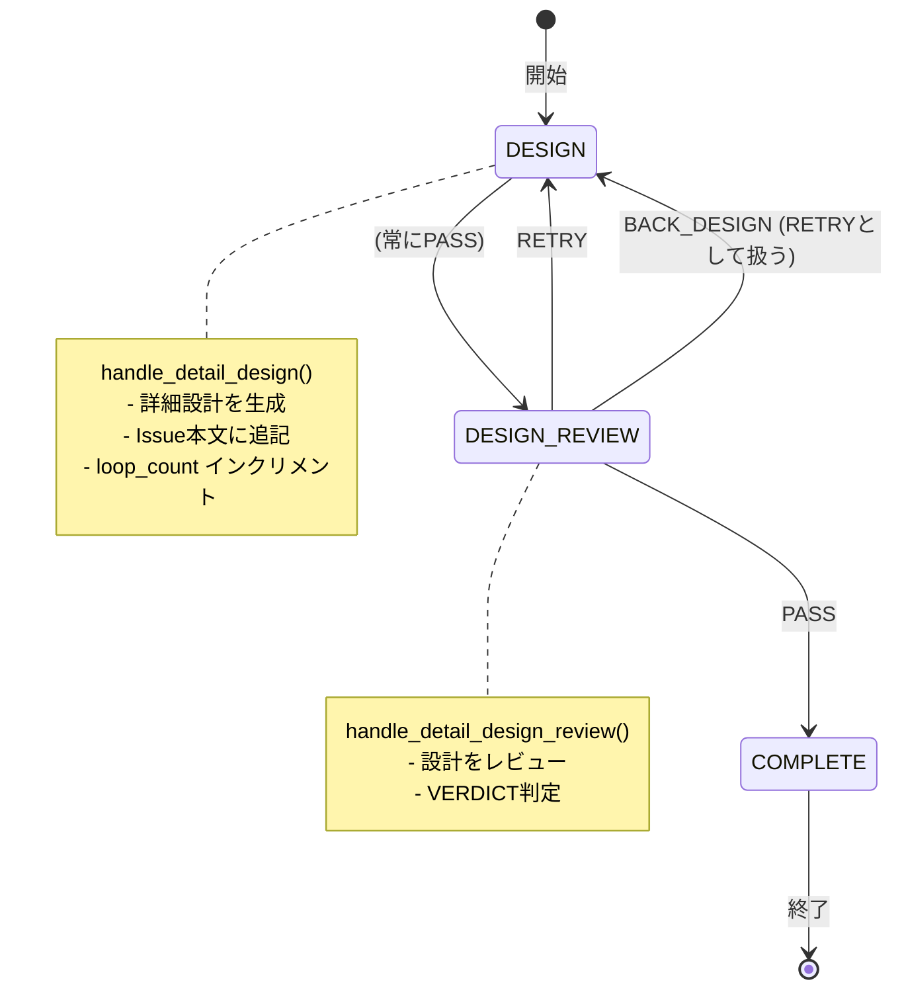

# 設計メモ: bugfix-agent-v5 をホストに Phase1/2 を統合（v5-first）

## 背景 / 前提
- v5（`/home/aki/claude/kamo2/.claude/agents/bugfix-v5/`）は動作実績あり
- 再現性担保のため、v5 を repo 内にスナップショット固定する（下記「v5 スナップショット方針」）
- dao（dev-agent-orchestra）は Phase1/2 を完了済みだが、移植漏れが多発
- 「最小移植」方針は失敗（漏れ多発）
- 以降は「不要なもの以外は全移植」方針で進める

## 目的
- v5 の動作基盤を維持したまま、#1 Phase1/2（core基盤/DesignWorkflow）を v5 に統合
- dao の成果を“互換追加”として v5 に差し込み、動作実績を崩さない
- 将来的に dao 側へ抽出可能な「整理済み基盤」を v5 に整備

## スコープ（移植対象）

### v5 スナップショット方針（再現性のため必須）
- 取得元: `/home/aki/claude/kamo2/.claude/agents/bugfix-v5/`
- 取得先: `external/bugfix-v5/`（**repo内に丸ごとコピー固定**）
- 編集方針: `external/bugfix-v5/` は**スナップショット専用**（直接編集しない）
- 仕様ドキュメントの正本: `external/bugfix-v5/docs/`
- dao側の参照用インデックス: `docs/bugfix-v5/README.md`（正本へのリンク・取得メタのみ記載）
- スナップショットID: 取得時に `git rev-parse HEAD` もしくは `sha256` を記録

**取得手順（例）**:
```bash
# 1) スナップショット取得
rm -rf external/bugfix-v5
cp -a /home/aki/claude/kamo2/.claude/agents/bugfix-v5/ external/bugfix-v5/

# 2) スナップショットメタ情報を記録
cat > external/bugfix-v5/.snapshot_meta <<'EOF'
snapshot_date: 2026-01-25T00:00:00Z
source_path: /home/aki/claude/kamo2/.claude/agents/bugfix-v5/
source_git_rev: <git rev-parse HEAD もしくは "unknown">
source_checksum: <sha256sum>
python_version: <python --version>
dependencies: <requirements.txt もしくは requirements.lock のパス>
EOF
```

**取得メタ情報フォーマット**:
`external/bugfix-v5/.snapshot_meta` を YAML 形式で保存する。
- `snapshot_date`: 取得日時（ISO-8601）
- `source_path`: 取得元パス
- `source_git_rev`: 取得元の git commit（不明なら `unknown`）
- `source_checksum`: スナップショット全体のチェックサム（例: `tar | sha256sum`）
- `python_version`: 使用 Python バージョン
- `dependencies`: 依存関係ファイルのパス（`requirements.txt` / `requirements.lock`）

**v5 ディレクトリ構成（参照固定）**:
- スナップショット取得後に `tree` 出力を保存して参照可能にする。
```bash
tree -L 3 external/bugfix-v5 > docs/bugfix-v5/tree.txt
```
- 設計書に記載するパスは、以降この `docs/bugfix-v5/tree.txt` を正本とする。
- **主要パス（取得後に `tree.txt` で検証）**:
  - `external/bugfix-v5/bugfix_agent/`（`config.py`, `verdict.py`, `state.py`, `context.py`, `run_logger.py`）
  - `external/bugfix-v5/handlers/`（`design.py`）
  - `external/bugfix-v5/prompts/`
  - `external/bugfix-v5/tests/`
  - `external/bugfix-v5/docs/`
  - `external/bugfix-v5/bugfix_agent_orchestrator.py`（CLI 入口）
- **検証**: `docs/bugfix-v5/README.md` に `.snapshot_meta` と `tree.txt` の更新履歴を記録する。

### 移植判定基準（全移植方針の明確化）

「不要なもの以外は全移植」の「不要」判定基準:
1. **bugfix 9ステート専用**: INVESTIGATE / IMPLEMENT / PR_CREATE 等、今回スコープ外のステートに紐づくもの
2. **dao未実装**: dao Phase1/2 に相当するものがないもの（例: v5固有の実験的機能）
3. **重複機能**: 同じ機能が v5/dao で異なる実装を持ち、どちらかを選択済みのもの

それ以外は移植対象。判断に迷う場合は移植する。

### A. Core基盤（Phase1の成果）

#### 1) 設定層統合

**現状**:
- v5: `bugfix_agent/config.py` + `config.toml`（tomllib + `get_config_value()` ドット記法）
- dao: `src/core/config.py`（pydantic-settings、環境変数 `DAO_` prefix）

**方針**:
- v5 に Settings（pydantic-settings）を導入
- 既存 `get_config_value()` を互換ラッパーとして維持
- `config.toml` は読み込み互換を保つ

**設定値の優先順位**:
```
1. 環境変数（BUGFIX_AGENT_ prefix）  ← 最優先
2. config.toml                        ← ファイル設定
3. Settings クラスのデフォルト値      ← フォールバック
```

**互換マッピング表**:

| v5 キー (config.toml) | 環境変数 | Settings属性 | 型 | デフォルト |
|-----------------------|----------|--------------|-----|-----------|
| `agent.max_loop_count` | `BUGFIX_AGENT_MAX_LOOP_COUNT` | `max_loop_count` | int | 3 |
| `agent.workdir` | `BUGFIX_AGENT_WORKDIR` | `workdir` | Path | auto-detect |
| `github.max_comment_retries` | `BUGFIX_AGENT_MAX_COMMENT_RETRIES` | `max_comment_retries` | int | 2 |
| `github.retry_delay` | `BUGFIX_AGENT_RETRY_DELAY` | `retry_delay` | float | 1.0 |
| `tools.context_max_chars` | `BUGFIX_AGENT_CONTEXT_MAX_CHARS` | `context_max_chars` | int | 4000 |

**型変換・不正値時の挙動**:
- pydantic-settings のバリデーションに委ねる
- 型変換失敗 → `ValidationError` で起動失敗（設定ミスは早期検出）
- 必須値の欠落 → デフォルト値を使用（上表参照）

**環境変数プレフィックスの互換性**:

| プレフィックス | 状態 | 説明 |
|---------------|------|------|
| `BUGFIX_AGENT_` | ✅ 採用 | v5 ホストのため、新プレフィックスを採用 |
| `DAO_` | ❌ 非互換 | 読み込まない（将来の dao 統合時に移行予定） |

- 今回は v5 ホストのため `BUGFIX_AGENT_` を使用
- 将来 dao へ統合する際は `DAO_` へ移行し、`BUGFIX_AGENT_` を deprecated エイリアスとして一定期間維持する想定

**get_config_value() 互換ラッパー**:
```python
def get_config_value(key_path: str, default: Any = None) -> Any:
    """既存コードとの互換性を維持するラッパー"""
    # 1. 新 Settings から取得を試行
    # 2. 見つからない場合は config.toml から取得（レガシー対応）
    # 3. それでもない場合は default を返す
```

#### 2) IssueProvider強化

**現状**:
- v5: リトライ付き `add_comment()`（max_retries=2, delay=1.0秒）
- dao: URL検証（正規表現）、例外階層（IssueNotFound/RateLimit/Auth）、リトライなし

**方針**:
- v5 リトライロジックを維持しつつ dao 例外階層を追加
- API互換を維持しハンドラ破壊を避ける

**URL検証仕様**:
```python
# 許容フォーマット（正規表現）
r"^https://github\.com/([^/]+)/([^/]+)/issues/(\d+)/?$"

# 例: OK
"https://github.com/owner/repo/issues/123"
"https://github.com/owner/repo/issues/123/"

# 例: NG（ValueError送出）
"https://github.com/owner/repo/pull/123"  # PR URL
"http://github.com/owner/repo/issues/123"  # http
"github.com/owner/repo/issues/123"         # プロトコルなし
```

**例外階層**:
```
IssueProviderError (基底)
├── IssueNotFoundError    # Issue が存在しない
├── IssueRateLimitError   # API レート制限
└── IssueAuthenticationError  # 認証エラー
```

**リトライ仕様**:

| 項目 | 値 | 設定キー |
|------|-----|---------|
| 最大リトライ回数 | 2 | `github.max_comment_retries` |
| リトライ間隔 | 1.0秒 | `github.retry_delay` |
| バックオフ | 固定間隔（指数バックオフなし） | - |

**リトライ対象の判定**:

| 例外 | リトライ対象 | 理由 |
|------|-------------|------|
| `IssueRateLimitError` | ✅ Yes | 一時的、待機で解消可能 |
| `subprocess.CalledProcessError` (一般) | ✅ Yes | ネットワーク等の一時的エラー |
| `IssueNotFoundError` | ❌ No | 永続的エラー |
| `IssueAuthenticationError` | ❌ No | 設定問題、リトライ無意味 |
| `ValueError` (URL不正) | ❌ No | 入力エラー |

**RateLimit 判定条件**:

`gh` コマンドの出力を基に判定する:

| 判定根拠 | パターン | 例 |
|---------|---------|-----|
| stderr メッセージ | `rate limit` を含む（case-insensitive） | `"API rate limit exceeded"` |
| HTTP ステータス | `403` または `429` | `gh` が返す JSON 内の status |
| 終了コード | `gh` が非ゼロで、上記メッセージを含む | - |

```python
def _is_rate_limit_error(stderr: str) -> bool:
    """gh コマンドの stderr から RateLimit を判定"""
    return "rate limit" in stderr.lower()
```

**HTTP ステータス取得元**:
- `gh api ... --include` を使用できる場合は、そのレスポンスヘッダ/ステータスを参照する。
- `gh issue comment` など `--include` が使えないケースは stderr 判定を優先する。

#### 3) Verdict/Abort の一致

**現状**:
- v5: `bugfix_agent/verdict.py`（3段パース実装済み）
- dao: `src/core/verdict.py`（同等の3段パース）

**方針**:
- dao 実装へ v5 を寄せる（実装はほぼ同一、差分のみ調整）
- ABORT時の field抽出拡張（Summary/Reason/Next Action）

**3段パース仕様**:

```
Step 1: Strict Parse
  └─ パターン: "Result: <KEYWORD>" (case-insensitive)
  └─ 成功 → Verdict 返却
  └─ 失敗 → Step 2 へ

Step 2: Relaxed Parse
  └─ 複数パターンを順次試行:
     - "- Result: <KEYWORD>"
     - "Status: <KEYWORD>"
     - "**Status**: <KEYWORD>"
     - "ステータス: <KEYWORD>"
     - "Result = <KEYWORD>"
  └─ 成功 → Verdict 返却
  └─ 失敗 → Step 3 へ

Step 3: AI Formatter Retry
  └─ AI formatter が提供されている場合のみ実行
  └─ 最大 max_retries 回リトライ
  └─ 全失敗 → VerdictParseError 送出
```

**AI Formatter 仕様**:

| 項目 | 値 | 備考 |
|------|-----|------|
| 呼び出し条件 | Step 1/2 両方失敗時 | ai_formatter が None の場合は即エラー |
| 最大リトライ回数 | 2 | `parse_verdict(max_retries=2)` |
| 入力文字数上限 | 8000文字 | head+tail 戦略で切り詰め |
| 使用ツール | reviewer | ctx.reviewer を使用 |
| タイムアウト | ツール側設定に従う | 明示的な上書きなし |

**失敗時の挙動**:

| 失敗パターン | 挙動 |
|-------------|------|
| Step 1/2 失敗 + ai_formatter なし | `VerdictParseError` 送出 |
| Step 3 全リトライ失敗 | `VerdictParseError` 送出 |
| 不正な VERDICT 値（例: "PENDING"） | `InvalidVerdictValueError` 送出（即時、リトライ対象外） |
| AI ツール通信エラー | 例外が呼び出し元に伝播 |

**ABORT フィールド抽出**:
```python
# 抽出対象フィールド（優先順）
reason = extract_field("Summary") or extract_field("Reason") or "No reason provided"
suggestion = extract_field("Next Action") or extract_field("Suggestion") or ""
```

#### 4) SessionState APIの統合

**現状**:
- v5: `bugfix_agent/state.py` の SessionState（loop_counters, active_conversations）
- dao: `src/workflows/base.py` の便利 API（increment_loop, get_conversation_id 等）

**方針**:
- v5 SessionState を維持しつつ便利 API を追加
- Session 3原則に基づくイベント境界を明確化

**追加する API**:

```python
class SessionState:
    # 既存
    loop_counters: dict[str, int]
    active_conversations: dict[str, str | None]

    # 追加 API
    def increment_loop(self, key: str) -> int:
        """ループカウンタをインクリメントし、新しい値を返す"""

    def reset_loop(self, key: str) -> None:
        """ループカウンタをリセット（0に戻す）"""

    def is_loop_exceeded(self, key: str, max_count: int | None = None) -> bool:
        """ループ上限を超えたか判定（max_count未指定時は設定値を使用）"""

    def get_conversation_id(self, role: str) -> str | None:
        """ロール（analyzer/reviewer/implementer）のセッションIDを取得"""

    def set_conversation_id(self, role: str, session_id: str) -> None:
        """ロールのセッションIDを設定"""
```

**Session 3原則のイベント境界**:

| イベント | 処理 | 対象ロール |
|---------|------|-----------|
| handler 入口 | `get_conversation_id()` でセッション取得 | 当該ハンドラのロール |
| AI 呼び出し後 | `set_conversation_id()` で新セッション保存 | AI ツールから返却されたセッション |
| RETRY 遷移 | セッション継続（変更なし） | 同一ロール |
| PASS 遷移（フェーズ切替） | 次フェーズ開始時に新規セッション | 新ロール |
| BACK_DESIGN 遷移 | Design フェーズのセッション継続 | analyzer |

**ループカウンタのキー名**:

| キー | 用途 | 上限デフォルト |
|-----|------|---------------|
| `design` | DESIGN ↔ DESIGN_REVIEW ループ | 3 |
| `Investigate_Loop` | v5互換（bugfix用） | 3 |
| `Detail_Design_Loop` | v5互換（bugfix用） | 3 |
| `Implement_Loop` | v5互換（bugfix用） | 3 |

#### 5) Context構築

**現状**:
- v5: `bugfix_agent/context.py` の `build_context()` に allowed_root 検証あり

**方針**:
- v5 実装をそのまま維持（既に dao 相当の安全対策が実装済み）

**build_context() 仕様**:

```python
def build_context(
    context: str | list[str],
    max_chars: int | None = None,
    allowed_root: Path | None = None,
) -> str:
```

**パラメータ詳細**:

| パラメータ | 型 | デフォルト | 説明 |
|-----------|-----|-----------|------|
| `context` | str \| list[str] | - | テキストまたはファイルパスリスト |
| `max_chars` | int \| None | `config: tools.context_max_chars` (4000) | 最大文字数（0で無制限） |
| `allowed_root` | Path \| None | `get_workdir()` | 読み込み許可ディレクトリ |

**セキュリティ対策（Path Traversal 防止）**:

```python
# ファイルパスリストの場合
for path_str in context:
    resolved = Path(path_str).resolve()
    resolved.relative_to(allowed_root)  # 配下でなければ ValueError
```

**エラー時の挙動**:

| エラーパターン | 挙動 | 理由 |
|---------------|------|------|
| allowed_root 配下でないパス | スキップ + 警告出力 | 処理継続を優先 |
| ファイルが存在しない | スキップ（警告なし） | 許容ケース |
| 読み取り権限なし (PermissionError) | スキップ + 警告出力 | 処理継続を優先 |
| max_chars 超過 | 先頭から切り詰め | 情報欠落を最小化 |

### B. DesignWorkflow（Phase2の成果）

#### 1) DesignWorkflow wrapper

**現状**:
- v5: `handlers/design.py` の `handle_detail_design()` / `handle_detail_design_review()`
- dao: `src/workflows/design/workflow.py` の DesignWorkflow

**方針**:
- v5 `handlers/design.py` のハンドラを流用
- 状態: DESIGN / DESIGN_REVIEW / COMPLETE
- 既存 `load_prompt()` を使用

**状態遷移図**:



**遷移条件の詳細**:

| 現在状態 | VERDICT | 次状態 | 備考 |
|---------|---------|--------|------|
| DESIGN | (常にPASS) | DESIGN_REVIEW | DESIGN ハンドラは常に PASS |
| DESIGN_REVIEW | PASS | COMPLETE | 設計完了 |
| DESIGN_REVIEW | RETRY | DESIGN | 設計やり直し |
| DESIGN_REVIEW | BACK_DESIGN | DESIGN | RETRY として扱う（DesignWorkflow では同義） |
| DESIGN_REVIEW | ABORT | - | AgentAbortError 送出 |

**CLI 入口**:

```bash
# オプション名（実装時に確定、以下は想定）
python -m bugfix_agent --workflow design --issue <URL>

# または
python bugfix_agent_orchestrator.py --design --issue <URL>
```

| オプション | 説明 |
|-----------|------|
| `--workflow design` または `--design` | DesignWorkflow を実行 |
| `--issue <URL>` | 対象 Issue URL（必須） |

**デフォルト動作**:
- 初期状態: DESIGN
- オプションなしで bugfix_agent を実行した場合: 従来通り bugfix ワークフロー

**COMPLETE の成果物**:
- Issue 本文に設計内容が追記されていること
- artifacts/{state}/ に prompt/response/verdict が保存されていること

#### 2) Designプロンプト移植

**移植元（正本）**:
- ディレクトリ: `external/bugfix-v5/prompts/`（v5 スナップショット内）
- 参照コミット: スナップショット取得時に `docs/bugfix-v5/README.md` に記録

**移植対象ファイル**:

| ファイル | 用途 | dao参照（#28） |
|---------|------|---------------|
| `detail_design.md` | 詳細設計プロンプト | `src/workflows/design/prompts/design.md` |
| `detail_design_review.md` | 設計レビュープロンプト | `src/workflows/design/prompts/design_review.md` |
| `_common.md` | 共通プロンプト（VERDICT等） | - |
| `_review_preamble.md` | レビュー前文 | - |
| `_footer_verdict.md` | VERDICT フッター | - |

**差分確認手順**:
```bash
# v5 スナップショット取得後
diff external/bugfix-v5/prompts/detail_design.md src/workflows/design/prompts/design.md
diff external/bugfix-v5/prompts/detail_design_review.md src/workflows/design/prompts/design_review.md
```

3) CLI実行ルート
- v5 orchestrator に design 実行入口を追加
- CLIオプション名は実装時に確定
- bugfix の既存 CLI は壊さない

### C. ログ・実行基盤（維持・必要なら拡張）

**既存維持**:
- RunLogger は維持（`bugfix_agent/run_logger.py`）
- `cli_console.log` 出力は既存維持
- `format_jsonl_line` の 3ツール対応は v5 既存実装を維持
- dao 側の未実装分は不要

**DesignWorkflow のログ出力**:

| ファイル | 形式 | 保存先 | 内容 |
|---------|------|--------|------|
| `run.log` | JSONL | artifacts/ | ハンドラ実行ログ（handler_start, ai_call_*, verdict_*） |
| `prompt.md` | Markdown | artifacts/{state}/ | AI に送信したプロンプト |
| `response.md` | Markdown | artifacts/{state}/ | AI からの応答 |
| `verdict.txt` | Text | artifacts/{state}/ | 解析された VERDICT 値 |
| `cli_console.log` | Text | ./ | コンソール出力のコピー |

**JSONL ログイベント**:

```jsonl
{"event": "handler_start", "handler": "design", "loop_count": 0, "timestamp": "..."}
{"event": "ai_call_start", "role": "analyzer", "prompt_length": 1234, "timestamp": "..."}
{"event": "ai_call_end", "role": "analyzer", "response_length": 5678, "session_id": "...", "timestamp": "..."}
{"event": "handler_end", "handler": "design", "verdict": "PASS", "timestamp": "..."}
```

## プロンプト移植チェックリスト（必須）

### detail_design.md
- [ ] 出力形式セクション（マークダウン構造指定）
- [ ] テンプレート変数: `${issue_url}`, `${artifacts_dir}`, `${loop_count}`, `${max_loop_count}`
- [ ] Issue更新方法（Loop=1 vs Loop>=2 の分岐）

### detail_design_review.md
- [ ] 完了条件チェックリスト（4項目の表形式）
- [ ] 禁止事項セクション（次ステート責務の実行禁止）
- [ ] VERDICT出力形式
- [ ] 判定ガイドライン（PASS→IMPLEMENT / RETRY→DETAIL_DESIGN）

> **DesignWorkflow での補足**: 既存プロンプトの「PASS→IMPLEMENT」は bugfix ワークフローの遷移先を示す。DesignWorkflow では PASS = COMPLETE（設計完了）として扱う。プロンプト自体は変更せず、呼び出し側（ワークフロー）が適切な終端状態に遷移する。

### _common.md
- [ ] Output Format (VERDICT)
- [ ] Status Keywords (PASS/RETRY/BACK_DESIGN/ABORT)
- [ ] ABORT Conditions
- [ ] Prohibited Actions
- [ ] Issue Operation Rules
- [ ] Evidence Storage

### _review_preamble.md
- [ ] Review preamble（Devil's Advocate）を review ステートに付与

### _footer_verdict.md
- [ ] VERDICT footer を review/INIT ステートに付与

## 各ステップの完了判定基準

### 1) config統合
- [ ] Settings（pydantic-settings）クラス追加
- [ ] get_config_value() 互換ラッパー実装
- [ ] 既存テスト通過

### 2) errors / providers
- [ ] IssueNotFoundError, RateLimitError, AuthError 追加
- [ ] URL検証ロジック追加
- [ ] 既存 retry 動作維持確認

### 3) verdict
- [ ] 3段パース（strict → relaxed → AI formatter）
- [ ] InvalidVerdictValueError 追加
- [ ] ABORT field抽出拡張

### 4) session state / context
- [ ] increment_loop / reset_loop / is_loop_exceeded
- [ ] set_conversation_id / get_conversation_id
- [ ] build_context の allowed_root 検証と max_chars 制御

### 5) DesignWorkflow wrapper + CLI
- [ ] design 実行入口の追加（CLIオプション名は実装時に確定）
- [ ] handle_design / handle_design_review ハンドラ
- [ ] bugfix CLI 互換維持確認

### 6) prompts
- [ ] 上記「プロンプト移植チェックリスト」全項目

### 7) tests
- [ ] 既存 unit/E2E tests 通過
- [ ] DesignWorkflow unit test 追加

## 設計判断（明記）

| 項目 | 選択肢 | 採用 | 理由 |
|------|--------|------|------|
| ステート名 | `DETAIL_DESIGN` vs `DESIGN` | DESIGN/DESIGN_REVIEW | DesignWorkflow は独立ワークフロー。内部で detail_design ハンドラを流用して互換を確保し、dao Phase2 との整合を優先する。 |
| Issue更新方式 | 本文追記 vs artifacts保存 | 本文追記（v5維持） | v5 の動作実績・運用フローを維持するため。 |
| Session 3原則 | 明示 vs 暗黙 | 明示 | バグ回避のため、session管理ルールを明文化する。 |

### Session 3原則（明示）
1) ロール単位で session_id を保持（analyzer / reviewer / implementer）
2) RETRY 時は同一ロールの session_id を継続
3) フェーズ切替（Design→Implement等）では必要に応じて明示リセット

## 運用・移行方針（明示）
- **記載の通りを正とする**: 実装時の判断は本書の記載内容を正とし、追加仕様が必要なら文書化してから着手する。
- **エラー時の挙動**: 原則としてエラーは例外を送出してプロセスを終了する。リトライ対象（RateLimit 等）以外は継続しない。
  - ただし、本書で「スキップ+警告」と明記したケースは「エラー」ではなく警告扱いとする。
- **移行タイミング**: v5 の動作確認（完了条件達成）後に dao への移行を検討する。本 Issue のスコープ外。
- **言語/I18N**: エラーメッセージの言語は v5 既存の方針を踏襲する。日本語/国際化対応は将来課題として別途扱う。

## 作業順序（依存順）
1) config統合
2) errors / providers
3) verdict
4) session state / context
5) DesignWorkflow wrapper + CLI
6) prompts
7) tests

## テスト・検証

### テスト実行の前提条件
- **Python バージョン**: `external/bugfix-v5/.snapshot_meta` の `python_version` を使用する。
- **依存関係**:
  - `external/bugfix-v5/requirements.txt` が存在する場合はそれを使用。
  - 存在しない場合は v5 実行環境の `pip freeze` を `docs/bugfix-v5/requirements.lock` に保存して使用する。
- **スナップショット正本**: テスト対象は `external/bugfix-v5/` を正本とし、編集しない。

### 回帰テスト（既存動作の維持）
- [ ] v5 既存ユニットテスト通過
- [ ] v5 既存 E2E テスト通過
- [ ] bugfix ワークフロー（9ステート）が従来通り動作

### 新規テスト（DesignWorkflow）

**config 統合テスト**:
- [ ] 環境変数が config.toml より優先されること
- [ ] get_config_value() が新 Settings から値を取得すること
- [ ] 型不正時に ValidationError が送出されること

**IssueProvider テスト**:
- [ ] 正しい URL フォーマットでインスタンス生成
- [ ] 不正 URL で ValueError 送出
- [ ] RateLimitError 時にリトライされること
- [ ] NotFoundError 時にリトライされないこと

**Verdict テスト**:
- [ ] Step 1: "Result: PASS" でパース成功
- [ ] Step 2: "Status: RETRY" でパース成功
- [ ] Step 3: AI formatter 経由でパース成功
- [ ] 不正値 "PENDING" で InvalidVerdictValueError
- [ ] ABORT 時に AgentAbortError 送出

**Context テスト**:
- [ ] allowed_root 配下のファイルが読める
- [ ] allowed_root 外のファイルがスキップされる（警告出力）
- [ ] max_chars で切り詰められる

**DesignWorkflow テスト**:
- [ ] DESIGN → DESIGN_REVIEW → COMPLETE の遷移
- [ ] RETRY 時に DESIGN に戻る
- [ ] ループ上限超過時に LoopLimitExceededError
- [ ] artifacts/ にログファイルが出力される

### ログ出力テスト
- [ ] run.log が JSONL 形式で出力される
- [ ] cli_console.log が出力される
- [ ] artifacts/{state}/ に prompt.md, response.md が保存される

## 完了条件
- v5 bugfix フロー継続動作
- DesignWorkflow が実行可能
- 設定・IssueProvider・Verdict 仕様が dao と一致
- 主要ログが維持される（run.log / cli_console.log）

## 非スコープ
- bugfix 9ステート再設計（Phase4扱い）
- dao へ直接移植する作業（今回は v5 ホスト）
