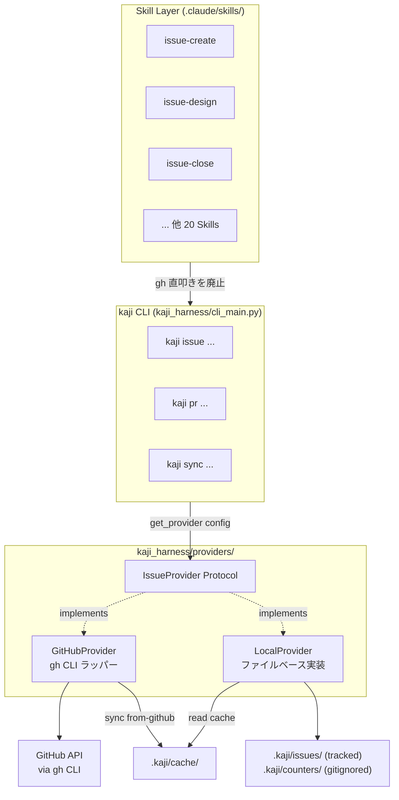
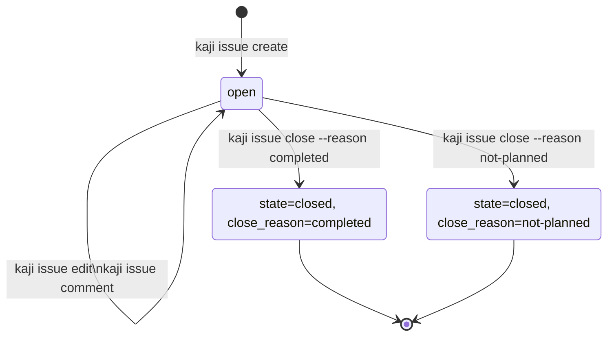

# [設計] kaji local mode — GitHub 非依存のローカル運用 provider

Issue: TBD（GitHub アカウント停止中。復旧後に起票して紐付ける。本設計が解決する障害そのもののため、設計レビュー時点では Issue 番号を付けられない）

## Primary Sources（一次情報）

> **2026-05-08 方針転換以降**: local-mode は検証期間中の SoT として運用される。本表は当初設計（buildout 期間中 + GitHub 復旧前提）時点の参照を維持しているが、forge 通信に関する項目（`gh api` / 実 GitHub Issue 等）は §残課題 で扱う。Phase 5 設計書 (`phase5-design.md`) と本ファイルの §履歴 / §残課題 章も参照のこと。

設計判断の根拠として参照した実装・設定・既存 Skill。レビュアーは以下を起点に整合性を検証できる。

| カテゴリ | パス / コマンド | 参照目的 |
|---------|----------------|---------|
| **既存 CLI 実装（Phase 3-e 完了後の現状）** | `kaji_harness/cli_main.py`（`run` / `issue` / `pr` / `local init`）| `kaji run` の `issue` 引数は `str` 型化済。`kaji issue` は provider-aware dispatcher、`kaji pr` は Phase 4 まで GitHub passthrough |
| 既存 CLI 実装 | `kaji_harness/state.py:43`（`SessionState.issue_number: str`）+ `__post_init__` の int→str 境界正規化 | Phase 1 で `int` → `str` 化済。後方互換のため `__post_init__` で int 受理を保つ（Phase 1 報告 5.1 採用案 (B)）|
| 既存 CLI 実装 | `kaji_harness/prompt.py` の `issue_id` / `issue_ref` / `IssueContext` 注入 | Phase 3 で `issue_input` / `branch_prefix` / `branch_name` / `worktree_dir` / `design_path` / `provider_type` / `default_branch` を provider 経由で注入済。`issue_context is None` 互換ブランチだけ Phase 4 候補として残る |
| 既存 CLI 実装 | `kaji_harness/logger.py` の `issue` フィールド | Phase 1 で `int` → `str` 化済 |
| 既存 config | `.kaji/config.toml` / `.kaji/config.local.toml` | Phase 3-e 時点で `[provider]` は必須化済。machine 固有 overlay は `.kaji/config.local.toml`（gitignored）で扱う |
| 既存 config 実装 | `kaji_harness/config.py` | `[provider]` / `[provider.github]` / `[provider.local]` の merge、`machine_id` validation、fail-fast の正本 |
| 既存 workflow | `.kaji/wf/feature-development.yaml` / `.kaji/wf/feature-development-local.yaml` | GitHub 用 workflow と local 用 workflow の分岐。local 用は Phase 3-d で追加済 |
| 既存 Skill 全般 | `find .claude/skills -name SKILL.md \| wc -l` = **23**、dir 数 24 のうち `_shared/` を除外 | Skill 数の根拠（`gh` 直叩きカウント 20 の母数）。互換 alias `issue-pr` / `issue-doc-check` 削除後の値（refactor: drop deprecated skill aliases にて 25→23 に減少） |
| 既存 Skill | `.claude/skills/issue-close/SKILL.md:81, 89` | `gh pr merge --merge` 呼び出しの存在、worktree → branch 削除順序の規範 |
| 既存依存関係 | `pyproject.toml:21` の `[project.dependencies]` | `httpx` が未掲載 → sync は HTTP client を新規導入せず、`gh api` subprocess 経由で実装する根拠 |
| インシデント | 2026-05-03 GitHub アカウント停止 | 本設計の動機（背景・目的セクション参照） |
| 規約 | `docs/reference/testing-size-guide.md` | テストサイズ Small/Medium/Large の定義（Large = 外部実通信のみ） |
| 規約 | `docs/guides/git-commit-flow.md` | merge 戦略 `--no-ff` 固定の根拠 |
| 既存 ADR | `docs/adr/001-003` | EPIC orchestration ADR は未確定（004 は `draft/lab/`）、本設計の loose coupling 方針の前提 |

各設計判断の根拠は本文内で当該パス / コマンドを inline で再掲する。本一覧は review 時の起点として使用する。

## 概要

kaji を **GitHub に依存せずローカルファイルだけで全 workflow を完結**できる
ようにする。`kaji_harness/providers/` に provider 抽象層を導入し、
`provider: local | github` を config で切り替え可能にする。Skill からの
`gh` 直接呼び出しを廃し、`kaji` CLI の薄いラッパー (`kaji issue ...` /
`kaji pr ...`) 経由に統一する。Issue は `.kaji/issues/local-<machine>-<n>-<slug>/issue.md`
（directory-per-issue、frontmatter + body）として表現し、コメントは同ディレクトリ内
`comments/` に格納する。

### 当面の運用方針（2026-05-08 確定）

GitHub アカウント復旧の見込みが立たないため、**当面 (期間未定) は local-mode を
SoT として運用する**。検証期間中は：

- 全 Issue は `local-<machine>-<n>` として local mode で管理
- ソース管理は git remote に push（現状 gitlab、急ぎバックアップ目的で採用）
- forge 機能（PR / inline review）は使用しない。code review は
  `/issue-review-design` / `/issue-review-code` Skill で代替

検証期間後の運用先（gitlab 本格採用 / github 復帰 / 他 forge）は別途判断する。
`local-mode を恒久 SoT とする決定はしていない` 点に注意。本設計は
**検証期間中の安定運用** と **forge 移行時の判断材料** を提供することを目的とする。

### Phase 5 の位置づけ

Phase 1-4 で local-mode の機能実装は完了している。Phase 5 は **方針転換の docs
反映**を行う Phase であり、新規機能の追加はしない。
（後述 § 実績と残スコープ 参照）

### Phase 3 完了時点の実装同期（2026-05-06）

Phase 3-a〜3-e で LocalProvider / provider dispatcher / IssueContext 注入 / `kaji local init` / `feature-development-local.yaml` / fail-fast 化は実装済み。以降の本設計書では以下を baseline とする。

- `[provider]` 未設定や `.kaji/config.toml` 不在の legacy passthrough は廃止済。`kaji issue` / `kaji pr` / `kaji run` は config 不備を exit 2 で fail-fast する
- machine 固有 overlay は `.kaji/config.local.toml`、local 採番 counter は `.kaji/counters/<machine>.txt`。いずれも `.gitignore` 対象
- `IssueContext` の Issue 系変数（`issue_id` / `issue_ref` / `issue_input` / `branch_prefix` / `branch_name` / `worktree_dir` / `design_path` / `provider_type` / `default_branch`）は provider 経由で注入済
- `provider=local` での GitHub cache 参照は `remote_cache` と呼び、CLI 入力は `gh:<number>`。`kaji run` の対象にはできない read-only 参照として扱う
- Phase 4 で 3 層ガード（CLI / Workflow / Skill）が完成し、`provider=local` での `kaji pr ...` 起動は exit 2 で停止する
- Windows は現時点の対応対象外。local mode は Linux / macOS / WSL を対象とし、Windows native での実行保証はしない（後述）

PR の扱いは provider によって異なる：

- **GitHub provider**: 従来通り `kaji pr create/view/merge/review` を介して GitHub PR をフル活用（forge 採用先確定までは未使用）
- **local provider**: PR 概念は持たない。git ブランチ + 既存の design / code レビュー Skill (`/issue-review-design` `/issue-review-code`) でレビュー文化を維持し、merge は手元の `git merge --no-ff` で完結

> **2026-05-08 方針転換以降の運用**: 検証期間中は local provider で運用し、forge 通信は行わない。`kaji sync from-github` 等の同期機能は §残課題 として後送りされており、forge 採用先（gitlab 本格採用 / github 復帰 / 他）が確定した時点で再設計する。
> 旧設計（github = SoT、local = BCP）の本文は §履歴 と git 履歴で参照可能。

複数 PC（4 台想定）からの並行運用に対応するため、Issue ID には **machine prefix** を含める (`local-pc1-1`, `local-pc2-1`)。これにより各 PC は独立した番号空間を持ち、ID 採番の衝突は構造的に発生しない。同一 Issue を異なる PC で同時に編集した場合は git の通常の merge conflict として扱う。

## 検証戦略の前提（検証期間中の運用モデル）

> **2026-05-08 方針転換以降**: 当初は「通常時は github = SoT、停止時は local = BCP」を運用モデルとし、buildout 期間中の temporal inversion を制約として扱っていた。GitHub 復旧前提を放棄したため、本章は「検証期間中の運用モデル」へ書き直されている。**旧 § buildout 期間中の verification 原則 / Large-forge 復旧後追跡** は §履歴 と git 履歴で参照可能。

検証期間中は **local-mode が SoT** であり、forge 通信を必要とする検証 (`Large-forge`) は **forge 採用先が確定するまで全項目を §残課題 として後送り**する。受け入れ条件 / Phase 完了 gate は **`Large-local` と Small/Medium のみ**で構成する。

| 当初の前提 | 検証期間中の実態 |
|------------|----------------|
| github = SoT、local = BCP | **local = 検証期間中の SoT**、forge は git remote としてのみ使用 |
| Large テスト = 実 github 通信を含む | 検証期間中は forge 通信を一切行わない |
| Phase 完了 gate に「`provider=github` で完走」を含める | gate は `provider=local` での E2E のみ。`[forge-required]` タグ項目は §残課題 へ降格 |

### 検証期間中の verification 原則

1. **forge 通信は Phase 完了 gate に据えない**（恒久。当初は「buildout 期間中のみ」だったが、方針転換により恒久化）。代替手段（CliRunner + subprocess mock pass-through / `libjq` 直呼びによる bit-exact 検証 / `grep` ベース静的検証）は引き続き有効
2. **`provider=local` 経路を end-to-end 検証の正本に据える**（Phase 3 で確立済）。Phase 4 で 3 層ガードが完成し、Phase 5 以降も local-mode が継続的検証の対象である
3. **forge 採用先確定後の追跡項目を §残課題 に集約**する。`Large-forge` / `kaji sync` 系 / PR context 注入はすべて §残課題 で個別追跡され、forge 移行時に再評価する

### この原則が変える設計上の判断

- Large テスト分類は **Large-local（subprocess + 外部通信なし）** のみが Phase 完了 gate の対象。**Large-forge** は §残課題（forge 移行時に再評価）
- `[forge-required]` タグの受け入れ条件項目はすべて §残課題 へ降格。`[buildout-ok]` タグは「検証期間中の必須項目」として継続
- Phase 3 完了時点が `local-mode が end-to-end 動作する` 初の検証点であり、Phase 4 で 3 層ガード、Phase 5 で docs 整備が完了した。Phase 6 以降は forge 移行時に検討

## 運用前提

| 構成 | 必要なもの |
|------|----------|
| **複数 PC 運用** | 共有可能な git remote が 1 つ以上必要（GitHub / GitLab / 他 cloud forge / self-host Gitea / Forgejo / LAN 内 bare repo 等） |
| **単一 PC 運用** | local mode のみで完結。git remote 不要 |

local mode は「issue 管理を GitHub から切り離す」機能であり、複数 PC 間のコード同期そのものは git remote の責務である。local mode が動作するための remote は GitHub である必要はない。具体的な選定基準と setup 手順は `docs/operations/local-mode-runbook.md` で扱う。

> **2026-05-08 時点での現状の選択**: 検証期間中はバックアップ目的で **GitLab** に push している（急ぎ採用、本格採用判断は別途）。本設計は GitLab を「現状の選択」として事実記述するに留め、推奨明示はしない。検証期間後の forge 採用先（gitlab 本格採用 / github 復帰 / 他）は別途判断する。

## 背景・目的

### 現状の問題

| 観点 | 現状 | 1 次情報 |
|------|------|---------|
| Skill の forge 依存 | 23 Skill のうち 20 が `gh` CLI 直叩き | `find .claude/skills -name SKILL.md \| wc -l` = 23（`.claude/skills/` 配下 dir 数 24 のうち `_shared/` を除外）、`grep -l "gh issue\|gh pr\|gh api" .claude/skills/*/SKILL.md \| wc -l` = 20。**注: この計測は文字列マッチで verdict 例の prose にも hit しうるため、Phase 2 着手前にコードブロック内の `gh` 呼び出しのみを抽出する形へ計測手法を見直す（drop-deprecated-skill-aliases リファクタの遺留事項）** |
| 障害耐性 | GitHub アカウント停止 / GitHub 障害で開発が完全停止 | 2026-05-03 にアカウント停止が実発生し全 workflow が機能停止 |
| 試用障壁 | 新規ユーザーは GitHub アカウント + token + repo 設定が必須 | `docs/operations/release/admin-setup.md` 参照 |
| vendor lock-in | GitHub 以外の forge (GitLab/Codeberg) への移行は全 Skill 書き換えが必要 | 抽象層が存在しない |

### ユーザーストーリー

- **Maintainer (apokamo) として**、GitHub 接続不能時もローカルで設計・実装・レビューを継続したい。
- **新規ユーザーとして**、GitHub アカウント設定なしで `kaji run` を試し、ツールの価値を体験したい。
- **将来の私として**、別 forge への移行を「provider 実装の追加」だけで実現できる構造にしておきたい。

### 設計判断のサマリ

| 論点 | 決定 | 理由 |
|------|------|------|
| **検証期間中の運用方針 (2026-05-08 確定)** | **local-mode を SoT として運用、forge 通信は行わない** | GitHub アカウント復旧の見込みが立たないため。検証期間後の forge 採用先（gitlab 本格採用 / github 復帰 / 他）は別途判断 |
| モード併存 | provider 抽象化（`github` / `local` の 2 実装） | 復旧後も両方使える。将来 `gitlab` 等を追加しやすい |
| Skill ↔ provider 結合 | Skill は `kaji` CLI のみ呼ぶ。`gh` 直叩き全廃 | Skill markdown を provider 中立に保つ |
| Issue ID | `local-<machine>-<int>` 形式、CLI 入力では `<int>` 単独も省略可 | GitHub `#N` との混同防止。字形衝突回避（`l-001` を退ける） |
| ID の zero-pad | **なし** (`local-pc1-1` / `local-pc1-1234`)。GitHub `#N` と一貫 | 1000 等の閾値で破綻しない。tooling は常に int parse でソート |
| マルチ PC 対応 | machine prefix で番号空間を PC 単位に分離 (`local-pc1-*` / `local-pc2-*`) | 4 PC 並行運用想定。ID 衝突を構造的にゼロにする |
| machine_id の管理 | `.kaji/config.local.toml`（gitignore 対象）で PC ごとに設定。**未指定時はエラー停止**（hostname 自動採用は行わない） | repo 内 `config.toml` だと PC 間で衝突する。fail-fast 原則により暗黙のフォールバックを設けない |
| PR 概念 | **GitHub provider では従来通り使用**。local provider のみ廃止し、git merge + 既存 review Skill で代替 | local には PR を載せる中央サーバーが無い。GitHub mode の運用は不変 |
| 同期 | GitHub → local の **単方向 snapshot のみ**。write 同期なし | dual-write は分散システム問題で複雑度爆発。snapshot だけで BCP 効果は得られる |
| 停止時の継続性 | `kaji sync from-github` で日常的に cache 更新 → 停止時 1 コマンドで local provider に切替 | 停止発生時に焦らず即時継続できる。差分転記は手動で十分 |
| Issue 保存場所 | `.kaji/issues/local-<machine>-<n>-<slug>/issue.md`（directory-per-issue、git 管理対象） | comments を同ディレクトリ配下に同居でき、複数 PC 間で git 同期可能 |
| Comment 配置 | `.kaji/issues/<id>/comments/<seq>-<machine>.md` | 正本として git 管理。複数 PC 間で同期される |
| Config 形式 | TOML（既存 `kaji_harness/config.py:48` と整合）| 既存の `[paths]` `[execution]` セクションを破壊せず、`[provider]` `[provider.local]` `[provider.github]` を追加 |
| 設定値の解決 | **fail-fast 原則**。未設定値に暗黙デフォルトを設けず、必須項目が欠けたらエラー停止 | 想定外の挙動を避ける。user の意図を環境推測ではなく宣言で確定する。エラーメッセージは「何を、どこに、どう書くか」を完全に提示 |
| kaji 規約パス | **本設計で新規追加する** `.kaji/issues/`, `.kaji/cache/` はコード内固定（user 設定不可）。既存の `paths.artifacts_dir` は user 設定可能を維持 | 「新規 path = kaji 規約、既存 path = 既存挙動維持」で破壊的変更を避ける |
| provider 切替の永続化先 | `.kaji/config.local.toml`（gitignored）に書き込む。tracked な `.kaji/config.toml` は触らない | BCP 切替で tracked file を汚さない。PC 間で active provider が独立 |
| 状態管理 | frontmatter に `state: open | closed`、`labels`、`assignees` を持つ | YAML で機械可読、git diff で人間可読 |
| JSON 出力契約 | **既存 Skill が利用する GitHub API field の互換 subset**（`labels: [{"name": "..."}, ...]`、`title`、`body`、PR の `number`/`title`/`headRefName` 等） | Skill 側の jq クエリを変更不要にする。frontmatter 表記は string 配列 `[type:feature]` で良いが、provider 内部で変換。**全 GitHub API への完全準拠は目指さない**（color/description 等の付加情報は null で返す） |

## インターフェース

### CLI（新規追加）

provider に依存しない統一 CLI を `kaji` 配下に追加する。Skill はこちらだけを呼ぶ。

```
kaji issue create   --title TEXT (--body TEXT | --body-file PATH) [--label LABEL]...
kaji issue view     ID   [--comments] [--json FIELDS] [--jq EXPR | -q EXPR]
kaji issue edit     ID   [(--body TEXT | --body-file PATH)] [--add-label LABEL]... [--add-frontmatter KEY=VALUE]...
kaji issue comment  ID   (--body TEXT | --body-file PATH)
kaji issue close    ID   [--reason completed|not-planned]
kaji issue list          [--state open|closed|all] [--label LABEL] [--json FIELDS] [--jq EXPR | -q EXPR]

kaji pr   create    --base BRANCH [--head BRANCH] --title TEXT (--body TEXT | --body-file PATH)
                                                # --head 省略時は現在の HEAD branch を採用（gh 互換）
kaji pr   view      ID   [--comments] [--json FIELDS] [--jq EXPR | -q EXPR]
kaji pr   list           [--head BRANCH] [--search QUERY] [--state open|merged|closed] [--json FIELDS] [--jq EXPR | -q EXPR]
kaji pr   merge     ID                          # 常に no-ff merge（後述）
kaji pr   comment   ID   (--body TEXT | --body-file PATH)
kaji pr   review    ID   --approve|--request-changes (--body TEXT | --body-file PATH | --body-file -)
                                                # `--body-file -` で stdin 受付（既存 Skill が heredoc で多用）

# 以下は GitHub provider 専用（forge 機能依存）。local provider では明示エラー停止
kaji pr   review-comments  ID   [--json FIELDS] [--jq EXPR]
                                                # gh api repos/.../pulls/N/comments の置換（pr-fix Skill が使用）
kaji pr   reviews          ID   [--json FIELDS] [--jq EXPR]
                                                # gh api repos/.../pulls/N/reviews の置換
kaji pr   reply-to-comment PR_ID --to COMMENT_ID --body TEXT
                                                # gh api .../comments/<id>/replies の置換

# kaji pr 配下のコマンドは forge provider 専用
# （PR / MR を持つ remote 系 provider。現状は github のみ、
#  将来 gitlab / forgejo 等を追加可能）。
# provider=local（bare provider）で呼ばれた場合は明示的なエラーで停止し、
# 「local mode は forge を持たないため PR 概念がありません。
#  git merge --no-ff で完結してください」とガイドする
# （後述「local mode における PR の扱い」参照）。

# kaji pr merge は --method フラグを露出しない。
# 内部で常に gh pr merge --merge（--no-ff 相当）固定で実行する。
# squash / rebase は kaji の merge 規約 (docs/guides/git-commit-flow.md)
# に反するため CLI 上に出さない。

kaji sync from-github            [--dry-run] [--since DATE]   # [残課題] forge 採用先確定後に再評価
kaji sync status                                                # [残課題] forge 採用先確定後に再評価
kaji sync local-to-github-plan   [--json]                       # [残課題] forge 採用先確定後に再評価
```

> **[残課題]**: `kaji sync` 系の 3 コマンドは Phase 5 着手前の方針転換により実装されない。詳細は §残課題 を参照。以下の説明は当初設計を記録目的で残す。

`kaji sync from-github` は GitHub 上の Issue を全件（または `--since` 指定時はその日付以降の更新分）取得し、`.kaji/cache/issues/<gh-number>.json` に GitHub 形式で保存する。あわせて `.kaji/cache/state.json` に最終同期時刻を記録する。`--dry-run` で取得対象だけ表示する。

**実装方針**: GitHubProvider が `gh` CLI ラッパーである方針と一貫させるため、sync も **`gh api repos/<owner>/<repo>/issues?...` を `subprocess.run` で呼び出す**形式で実装する。HTTP client（`httpx` 等）は新規導入しない（現行 `pyproject.toml:21` の runtime dependency に未掲載のため、依存追加を回避する）。paging は `gh api --paginate` フラグで処理。テストは `subprocess.run` を mock する Small テストでカバーし、Large テストで実 `gh api` 通信を検証する。

`kaji sync status` は最終同期時刻、cache 件数、現在の provider、GitHub 接続性を表示する診断用コマンド。

`kaji sync local-to-github-plan` は GitHub 復旧後の運用補助コマンドで、停止期間中に作られた `local-<machine>-<n>` Issue を **全 PC 横断**で一覧表示する（既に `migrated_to: <gh-number>` frontmatter を持つものは除外）。`--json` で機械可読出力（AI に転記依頼する用途）。**plan の出力のみ**を提供し、転記実行は user / AI の手動作業とする（後述「BCP フロー」参照）。

`kaji issue edit ID --add-frontmatter KEY=VALUE` は frontmatter にユーザー拡張 key を追記する。ad-hoc な metadata（GitHub 復旧後の `migrated_to: <gh-number>` 等）を保持するための interface。**[残課題]**: 当初は `local-to-github-plan` / 復旧フローと一体で実装する予定だったが、forge 移行が後送りになったため §残課題 へ降格（forge 採用先確定後に再評価）。

**reserved field の保護**:

frontmatter の core field（kaji 自身が semantics を定義する key）は `--add-frontmatter` で**上書き不可**。理由は user の typo / AI の判断ミスで状態管理が壊れることを防ぐため。違反入力はエラー停止し、専用 CLI（`kaji issue edit --body`、`--add-label`、`kaji issue close` 等）の使用をガイドする。

| 分類 | key | 上書き手段 |
|------|-----|----------|
| **reserved（禁止）** | `id`, `state`, `labels`, `assignees`, `created_at`, `updated_at`, `closed_at`, `close_reason`, `closed_by`, `created_by`, `title` | 専用 CLI のみ（`--add-label`, `kaji issue close` 等）|
| **user 拡張（許可）**| 上記以外の任意 key | `--add-frontmatter` で許可 |

実装方針:

- `RESERVED_FRONTMATTER_KEYS: frozenset[str]` を `kaji_harness/providers/models.py` で定義し、CLI 層で入力 KEY を validate
- 値は string 固定（YAML scalar として安全。複合型を許容すると schema が膨らむため）
- KEY 文法は `[a-z][a-z0-9_]{0,31}`（snake_case、32 文字以内、frontmatter key として安全）
- 違反時のエラー文言は「`--add-frontmatter` cannot overwrite reserved key '`state`'. Use `kaji issue close` instead.」のように、reserved 各 key に専用ガイドを示す

ID は以下のいずれの形式でも受理し、**provider と入力形式の組み合わせで解決先を一意に決定**する：

| 入力形式 | provider=github | provider=local |
|---------|-----------------|----------------|
| `local-pc1-1` / `local-pc2-42` | エラー（local 専用形式） | local Issue として解決 |
| `pc1-1`（machine 省略形）| エラー | local Issue として解決 |
| 数値のみ `1` / `153` | GitHub Issue #1 / #153 | **local Issue `local-<config.machine_id>-1` を新規採番／参照**（cache 参照ではない） |
| `gh:153` | GitHub Issue #153 | **cache から読み出す GitHub Issue #153**（local mode 中の read-only 参照専用） |

**重要な設計判断**: local mode 中の数値のみ入力（例: `kaji issue view 153`）は **local 番号空間** (`local-<machine>-153`) として解釈する。GitHub cache を参照したい場合は `gh:153` を必須とする。これにより以下が達成できる：

- 数値のみ入力の解決先が provider 内で曖昧にならない（local mode 中は常に local 空間、`gh:` prefix で明示的に cache を指す）
- normalize_id の出力が「`local-<machine>-<n>` または cache key（github 番号）」のいずれか一意に決まる
- `kaji issue list` で local Issue と cache 由来 Issue を統合表示する際、ID 形式 (`local-pc1-1` vs `gh:153`) で出自が判別可能

**`#` ではなく `gh:` を採用する理由**（shell-safety）:

- bash / zsh で未引用の `#153` はコメントとして parse され、`kaji issue view #153` だと `#153` 以降が捨てられる（実装が ID を一切受け取れない）
- `'#153'` の quote 強制は user に毎回求める設計として粗悪
- `gh:153` は colon を区切りとした URI scheme 風の prefix で、shell 上で quote なしに渡せる（`:` は bash の word boundary ではない）
- 将来 `gitlab:42` `forgejo:7` 等の forge 別 prefix も同形で拡張できる

provider が未確定で数値のみが渡された場合はエラー。`gh:N` 形式は cache 存在チェックを経て、cache 不在ならエラー停止する。**表示文言中の `#153`（人間可読の GitHub Issue 番号）はそのまま使用**し、CLI 入力構文の `gh:153` と区別する。

> **[残課題]**: `gh:N` の cache 自動 populate (`kaji sync from-github`) は §残課題（forge 採用先確定後に再評価）。cache reader (`view_cached_issue()`) 自体は Phase 3-c で実装済み (`kaji_harness/cli_main.py:1000` / `tests/test_phase3c_dispatcher.py:329-365`) で、検証期間中も既存契約として維持される。手動で `.kaji/cache/issues/<n>.json` を投入すれば動作するが、forge 通信を行わない方針 (2026-05-08 確定) のため非推奨。

#### 既存 Skill との互換契約

`kaji issue` / `kaji pr` は **`gh issue` / `gh pr` のフラグサブセット互換**を保つ。Skill 側のコマンドラインを変更不要にするため、Skill が現在使っているフラグはすべて受理する：

| フラグ | 用途 | github provider | local provider |
|---|---|---|---|
| `--title` | タイトル指定 | `gh` に渡す | frontmatter / 引数で受理 |
| `--body` | 本文を引数で渡す | `gh` に渡す | 直接受理 |
| `--body-file` | 本文をファイルから読む | `gh` に渡す | ファイル読み込み |
| `--label` | ラベル付与 | `gh` に渡す | frontmatter `labels` に追記 |
| `--add-label` | ラベル追加（edit 時） | `gh` に渡す | frontmatter `labels` に append |
| `--json FIELDS` | JSON 出力 | `gh` に渡す | LocalProvider が GitHub API スキーマで生成 |
| `--jq EXPR` / `-q EXPR` | jq 式評価 | `gh` に渡す | Python `jq` library で評価し、**gh 互換 raw 出力**（scalar string は quote を外す）に整形（後述「LocalProvider の `--jq` 実装方針」参照）|
| `--comments` | コメント含めて表示 | `gh` に渡す | コメントディレクトリを集約 |
| `--state` / `--reason` | 状態指定 | `gh` に渡す | frontmatter 更新 |

**LocalProvider の `--jq` 実装方針（gh 互換）**:

`gh --jq` の挙動は `jq -c` 単独では再現できない。具体的には以下の差がある（`gh` ソース `pkg/export/template.go` および動作確認済み）：

- **scalar の raw 出力**: `gh issue view N --jq '.body'` は **JSON quote / escape を外した raw string** を返す。`jq -c '.body'` は `"..."` を残す。Skill `.claude/skills/issue-start/SKILL.md:76` は `CURRENT_BODY=$(gh issue view ... -q '.body')` の出力を `gh issue edit ... --body "$CURRENT_BODY"` で **そのまま Issue body として書き戻す**ため、quote が混入すると本文が `"..."` で囲まれて壊れる
- **配列の改行区切り出力**: 配列 / object stream は `\n` 区切りで出力（`jq -c` も同じ）
- **null / boolean / number**: 値そのまま出力（quote なし）
- **複合値（object / array）**: compact JSON で出力

実装は外部 `jq` を呼ばず、**Python ライブラリ `jq` (PyPI `jq` パッケージ、libjq バインディング) を runtime dependency に追加**し、結果に対して以下の post-processing で gh 互換 raw 出力を再現する：

```python
import jq

def gh_compatible_jq(expr: str, data: object) -> str:
    """gh --jq の出力フォーマットを再現する。

    - scalar string → quote を外した raw text
    - null / bool / number → そのまま
    - object / array → compact JSON
    - 複数結果 → 改行区切り
    """
    results = jq.compile(expr).input_value(data).all()
    lines: list[str] = []
    for r in results:
        if isinstance(r, str):
            lines.append(r)              # raw（quote なし）— gh -q '.body' 互換
        elif r is None:
            lines.append("")             # gh の挙動: null は空行
        elif isinstance(r, bool):
            lines.append("true" if r else "false")
        elif isinstance(r, (int, float)):
            lines.append(str(r))
        else:
            lines.append(json.dumps(r, ensure_ascii=False, separators=(",", ":")))
    return "\n".join(lines)
```

**依存追加**: `pyproject.toml` の `[project.dependencies]` に `jq>=1.6` を追加（C extension wheel 配布あり）。外部 `jq` バイナリ依存を持たないため、ユーザーが追加インストールする必要がない。local mode の公式対象は Linux / macOS / WSL とし、Windows native は現時点の対応対象外。

**互換性テスト（Small）**: 以下の入出力ペアが `gh` と一致することを確認する：

| jq expr | input | 期待出力（gh 互換） | 注 |
|---------|-------|------------------|----|
| `.body` | `{"body": "hello\n世界"}` | `hello\n世界`（改行はそのまま、quote なし）| Issue body 復元の基本ケース |
| `.title` | `{"title": "feat: \"X\""}` | `feat: "X"`（escape 解除）| escape 文字を持つ string |
| `.labels[].name` | `{"labels":[{"name":"a"},{"name":"b"}]}` | `a\nb` | 改行区切り array |
| `.number` | `{"number": 153}` | `153` | numeric scalar |
| `.merged` | `{"merged": true}` | `true` | bool |
| `.state` | `{"state": null}` | （空行）| null |
| `.assignees` | `{"assignees":[{"login":"a"}]}` | `[{"login":"a"}]` | object array は compact JSON |

これにより Skill の `gh issue view 123 --json title,body --jq '.title'` を `kaji issue view 123 --json title,body --jq '.title'` にそのまま置換でき、特に `CURRENT_BODY=$(... -q '.body')` パターンが壊れない。

### Config

config は既存の `.kaji/config.toml` を拡張する形で実装する（既存実装 `kaji_harness/config.py:48` と整合）。**共通設定** と **マシン固有設定** の 2 ファイルに分離する。

#### 設定値の解決方針: fail-fast 原則

未設定値に対する暗黙のデフォルトは設けない。必須設定が欠けた場合は明示的なエラーで停止する。理由は「想定外の挙動を避ける」「user の意図を環境推測ではなく宣言で確定する」こと。

**user が決める設定**（必須、未設定はエラー停止 — **Phase 3 以降**）:

| 設定 | 種別 | 未設定時 |
|------|------|---------|
| `provider.type` | 共通 | エラー停止。`github` / `local` の指定を要求 |
| `provider.local.machine_id` | machine 固有 | エラー停止（provider=local 時）。hostname 自動採用は行わない |
| `provider.local.default_branch` | 共通 | エラー停止（provider=local 時）。明示的な branch 名を要求 |
| `provider.github.repo` | 共通 | エラー停止（provider=github 時） |

**Phase 1-3d の暫定動作（完了済）と Phase 3-e 以降の契約**:

`provider` 抽象が未導入だった Phase 1（`kaji issue` / `kaji pr` CLI 追加）と Phase 2（Skill の `gh` → `kaji` 置換）、および Phase 3-c / 3-d の過渡期では、`kaji issue` / `kaji pr` は provider config なしでも `gh` 互換ラッパーとして動作した（既存挙動の維持）。これは Phase 3-e で廃止済みであり、現在の契約は以下。

- `.kaji/config.toml` 自体が無い場所では `kaji issue` / `kaji pr` は exit 2。単なる `gh` wrapper としては使わない
- `.kaji/config.toml` に `[provider]` が無い場合も exit 2。GitHub 運用を継続する repo でも `[provider] type = "github"` と `[provider.github] repo` を明示する
- `provider.type = "local"` で `provider.local.machine_id` が解決できない場合は exit 2。`kaji local init` で `.kaji/config.local.toml` を作るのが標準手順
- migration guide は `CHANGELOG.md` と `docs/cli-guides/local-mode.md` に記録済

`config` なしで `kaji issue` を呼んだときの暫定挙動（内部で `gh` を呼ぶ）は現在存在しない。

**kaji 規約（設定不可、コード内固定）**:

`.kaji/issues/`, `.kaji/cache/` のディレクトリ配置は本設計で新規導入するため、kaji の filesystem 規約として固定し、user は変更できない。これは config の対象外であり、cargo の `target/` や git 自体の `.git/` と同じ位置づけ。

**例外: `paths.artifacts_dir`**:

`.kaji-artifacts/` 等の artifacts 出力先は **既存実装で user 設定可能 (`paths.artifacts_dir`) として運用されている**ため、本設計では既存挙動を維持する（`paths.artifacts_dir` を引き続き user 設定対象とする）。「既に user が決めている path は尊重し、新規 path のみ kaji 規約として固定する」というルール。

| パス | 設定可否 | 既定 | 理由 |
|------|---------|------|------|
| `paths.artifacts_dir` | **user 設定可能（既存挙動維持）** | 既存 repo は `.kaji-artifacts` | 既存 config を破壊しない |
| `.kaji/issues/` | kaji 規約（固定） | — | 本設計で新規導入。user 設定不要 |
| `.kaji/cache/` | kaji 規約（固定） | — | 本設計で新規導入。user 設定不要 |

エラーメッセージは「**何を、どのファイルに、どう書くか**」を完全に示すことを必須とする。エラーを見た user / AI が即修正できる粒度を保証する。

#### 設定ファイル例

**`.kaji/config.toml`（共通、git 管理対象）**:

このファイルには **base 値（推奨運用）** を宣言する。BCP 切替時にこのファイルを書き換えると、tracked file が dirty になり、PC 間差分・復帰時の混乱が発生する。そのため active provider の個人選択は `.kaji/config.local.toml` overlay で行い、本ファイルは原則書き換えない。

```toml
# 既存の必須セクション（artifacts_dir は user 設定可能を維持）
[paths]
artifacts_dir = ".kaji-artifacts"     # 既存値を維持。user 設定対象（kaji 規約として固定しない）
skill_dir = ".claude/skills"

[execution]
default_timeout = 300

# 本設計で追加するセクション。すべて必須項目（fail-fast）
[provider]
type = "github"                       # 必須。base 値。github | local

[provider.local]
default_branch = "main"               # provider=local 時に必須。/issue-close で merge する base

[provider.github]
repo = "apokamo/kaji"                 # provider=github 時に必須
```

**`.kaji/config.local.toml`（マシン固有、`.gitignore` 対象、active provider 永続化先）**:

```toml
[provider.local]
machine_id = "pc1"                    # provider=local 時に必須。各 PC で個別設定

# BCP 切替時はこのファイルに type を書く（tracked config を汚さないため）
# [provider]
# type = "local"                      # active provider の override
```

**`~/.config/kaji/config.toml`（グローバル、ユーザー単位、任意）**:

```toml
# 全 repo 共通のデフォルトを置きたい場合のみ使用
[provider.local]
machine_id = "pc1"
```

#### 優先順位（高い順に上書き）

1. 環境変数 (`KAJI_PROVIDER_TYPE`, `KAJI_MACHINE_ID`)
2. `.kaji/config.local.toml`（machine 固有、active provider の永続化先）
3. `.kaji/config.toml`（repo 共通、base 値）
4. `~/.config/kaji/config.toml`（user グローバル）

**いずれの層でも値が解決できなければエラー停止**（環境変数で全必須項目を埋める運用も可能）。

#### provider 切替の書き込み先

Phase 3 完了時点では `kaji config set` コマンドは実装しない。provider 切替は **`.kaji/config.local.toml`（gitignored）overlay を作る / 編集する / 削除する**ことで行う。`kaji local init` は overlay 生成ヘルパーであり、tracked な `.kaji/config.toml` は触らない。

理由：

- `.kaji/config.toml` は git tracked。書き換えると未コミット差分が発生し、PC 間 sync で意図しない競合を生む
- BCP 切替（github → local）は **PC ごとの一時的な state** であり、PC 間で共有すべきではない
- 復旧時に `.kaji/config.local.toml` の `[provider] type` を削除するだけで、tracked `.kaji/config.toml` の base 値（`github`）に戻る

```
通常時:
  .kaji/config.toml         [provider] type = "github"  ← base
  .kaji/config.local.toml   （[provider] セクションなし）
  → active = github

停止時 (`kaji local init` または overlay 手編集で `type = "local"` を書いた後):
  .kaji/config.toml         [provider] type = "github"  ← base、変化なし
  .kaji/config.local.toml   [provider] type = "local"   ← override
  → active = local

復旧時 (overlay の `[provider] type` を削除、または overlay 自体を削除):
  .kaji/config.toml         [provider] type = "github"  ← base、変化なし
  .kaji/config.local.toml   （[provider] type を削除）
  → active = github（base に戻る）
```

machine_id / local default_branch も `.kaji/config.local.toml` を正本とする（machine 固有設定なので tracked 不可）。将来 `kaji config set` を追加する場合も、書き込み先はこの方針に従う。

#### エラーメッセージ仕様

未設定エラー時の出力例：

```
ERROR: provider.type is not configured.

To use GitHub, add the following to .kaji/config.toml:

  [provider]
  type = "github"

  [provider.github]
  repo = "owner/repo"

To use local mode, add the following:

  [provider]
  type = "local"

  [provider.local]
  default_branch = "main"

And add to .kaji/config.local.toml (machine-specific):

  [provider.local]
  machine_id = "<your-pc-name>"

See docs/cli-guides/config.md for the full reference.
```

このように **書くべき場所と内容を完全に提示**することを義務とする。「設定が不足している」だけでは user が次に何をすべきか分からない。

### ファイルレイアウト（local mode）

```
.kaji/
├── config.toml                       # 共通設定（git 管理対象、既存 TOML を拡張）
├── config.local.toml                 # マシン固有設定（.gitignore 対象、machine_id 等）
├── issues/                           # Issue source data（local mode の正本、directory-per-issue）
│   ├── local-pc1-1-foo/              # 1 Issue = 1 ディレクトリ
│   │   ├── issue.md                  # frontmatter + body
│   │   └── comments/                 # コメント・編集履歴（git 管理）
│   │       ├── 0001-pc1.md           # Issue 本文の編集前 snapshot
│   │       ├── 0002-pc1.md           # コメント 1
│   │       └── 0003-pc2.md           # 別 PC からのコメント
│   ├── local-pc1-2-bar/
│   │   ├── issue.md
│   │   └── comments/
│   ├── local-pc2-1-baz/              # 別 PC が作成した Issue
│   │   ├── issue.md
│   │   └── comments/
│   └── ...
├── cache/                            # GitHub からの snapshot（BCP 用、user-data 性、git 管理）
│   ├── state.json                    # 最終同期時刻、件数等のメタ情報
│   └── issues/
│       ├── 153.json                  # GitHub Issue #153 の snapshot（GitHub API JSON）
│       ├── 154.json
│       └── ...
├── counters/                         # machine 別 ID カウンタ（.gitignore 対象）
│   ├── pc1.txt                       # pc1 の最新採番値（テキスト整数）
│   ├── pc2.txt
│   └── ...
└── （`paths.artifacts_dir` 設定値、例: `.kaji-artifacts/`）  # 実行時生成物（.gitignore 対象）
    ├── <issue>/                      # 既存: kaji run の Issue 単位 output
    │   └── ...
    └── _epics/                       # 将来 EPIC orchestration 用（loose coupling）
        └── <epic_n>/
            └── state.json
```

注: `paths.artifacts_dir` は user の config 設定値に従う。一方、local Issue の採番 counter は Phase 3 実装で `.kaji/counters/` に固定した。理由は counter が local provider の machine 固有 state であり、artifacts_dir を消しても `.kaji/issues/` との整合を取り直しやすく、`.gitignore` で明示的に保護できるため。

レイアウトの方針：

- **user-data 性のもの（`issues/`, `cache/`, `config.toml`）は git 管理対象**: 複数 PC 間で同期されるべきデータ。Issue とコメントの正本はここに集約
- **runtime state（`paths.artifacts_dir` / `.kaji/counters/`）は `.gitignore` 対象**: kaji 実行が生成する派生データ・カウンタ等。machine 別カウンタは PC 固有なので git 同期不要
- **machine 固有設定 (`config.local.toml`) は `.gitignore` 対象**: machine_id は PC ごとに異なるべき
- アンダースコア prefix (`_epics`) で「kaji 内部用」を示し、Issue 番号ディレクトリと衝突しない命名

**git 管理対象 vs 非対象の早見表**:

| パス | git | 理由 |
|------|-----|------|
| `.kaji/config.toml` | ✓ | 共通設定 |
| `.kaji/config.local.toml` | ✗ | machine 固有 |
| `.kaji/issues/` | ✓ | Issue 正本（コメント含む） |
| `.kaji/cache/` | ✓ | GitHub snapshot（停止時の read 用） |
| `.kaji/counters/` | ✗ | machine 固有 counter。commit すると PC 間の番号空間を汚染する |
| `paths.artifacts_dir`（既存。例: `.kaji-artifacts/`） | ✗ | 実行時生成物。配置先は既存 config に従う |

Issue ファイル例（`.kaji/issues/local-pc1-1-foo/issue.md`）:

```markdown
---
id: local-pc1-1
title: ローカル mode の最小実装
state: open
labels: [type:feature, area:harness]      # frontmatter 表記は string 配列（人間可読優先）
assignees: [apokamo]
created_by: pc1                       # 作成 machine_id（後で「どの PC で作ったか」を追える）
created_at: 2026-05-04T15:30:00+09:00
updated_at: 2026-05-04T16:00:00+09:00
closed_at: null
---

## 概要

(Issue 本文)
```

注: frontmatter の `labels` は string 配列で表現するが、`kaji issue view --json` で出力する際は GitHub API スキーマに揃えて `[{"name": "type:feature"}, {"name": "area:harness"}]` の object 配列に変換する。Skill 側の jq クエリ (`[.labels[].name]`) を変更しないための設計上の配慮。

### 出力契約

`kaji issue view <id> --json title,body,labels` は **既存 Skill が利用する GitHub API field の互換 subset**を返す（全 field の完全準拠ではなく、Skill が実際に jq で参照している `labels[].name`、`title`、`body`、PR の `number`/`title`/`headRefName` 等を最低保証）：

```json
{
  "title": "ローカル mode の最小実装",
  "body": "## 概要\n...",
  "labels": [
    {"name": "type:feature", "color": null, "description": null},
    {"name": "area:harness", "color": null, "description": null}
  ]
}
```

Skill 側の jq クエリ (`--jq '{title: .title, body: .body, labels: [.labels[].name]}'` 等) を変えなくて済むよう、**既存 Skill が参照する field の互換 subset**を provider 共通契約とする。LocalProvider は内部で frontmatter の string 配列を object 配列に変換する（`color` / `description` 等の付加情報は LocalProvider では `null` を返す）。GitHub API の全 field 互換は目指さない方針：Skill が新たな field を要求し始めたら、その都度 LocalProvider 側に足す。

## 詳細設計

### provider の概念区分

PR (Pull Request) / MR (Merge Request) は git 本体の機能ではなく、forge（GitHub / GitLab / Forgejo 等の Web 系 git ホスティング）が提供する機能である。git CLI そのものはブランチと merge を持つだけで、レビューコメント・approve / request-changes・マージキュー等の概念は持たない。

この観点から provider を 2 種に分類する：

| 分類 | 例 | PR / MR | レビュー | sync 元 |
|------|---|---------|---------|---------|
| **forge provider** | github、（将来）gitlab / forgejo / codeberg / gitea | ✓ | ✓ | forge → local |
| **bare provider** | local（ファイルベース）、（将来）NAS bare repo 等 | ✗ | git commit/branch ベースで代替 | — |

`kaji pr ...` 配下のコマンドは **forge provider 専用**。bare provider では構造的に PR 概念が存在しないため、エラー停止し代替手順をガイドする。

`kaji issue ...` 配下のコマンドは **両方の provider で動作する**（issue は forge 機能ではなく、forge も bare も同等に持てる概念）。

### provider 抽象層



`kaji_harness/providers/` を新設：

```
kaji_harness/
└── providers/
    ├── __init__.py        # get_provider(config) -> IssueProvider
    ├── base.py            # IssueProvider Protocol（PR/MR 系は Phase 4）
    ├── models.py          # Issue, Comment, Label, IssueContext (dataclass)
    ├── github.py          # GitHubProvider — 既存 gh 呼び出しの集約
    └── local.py           # LocalProvider — ファイルベース実装
```

Protocol 定義（抜粋）：

```python
class IssueProvider(Protocol):
    @property
    def is_readonly(self) -> bool: ...

    # CRUD
    def create_issue(self, *, title: str, body: str,
                     labels: list[str] | None = None,
                     slug: str | None = None) -> Issue: ...
    def view_issue(self, issue_id: str) -> Issue: ...
    def edit_issue(self, issue_id: str, *, title: str | None = None,
                   body: str | None = None,
                   add_labels: list[str] | None = None,
                   remove_labels: list[str] | None = None) -> Issue: ...
    def comment_issue(self, issue_id: str, body: str) -> Comment: ...
    def close_issue(self, issue_id: str, reason: str | None = None) -> Issue: ...
    def list_issues(self, *, state: str = "open",
                    labels: list[str] | None = None,
                    limit: int | None = None) -> list[Issue]: ...
    def list_labels(self) -> list[Label]: ...
    def resolve_issue_context(self, issue_id: str) -> IssueContext: ...


class ReviewRequestProvider(Protocol):
    """forge provider 専用。PR/MR を抽象化する Phase 4 候補。bare provider は実装しない。"""
    def create(self, *, base: str, head: str, title: str, body: str) -> PullRequest: ...
    def view(self, pr_id: str) -> PullRequest: ...
    def view_json(self, pr_id: str, *, fields: list[str],
                  jq: str | None = None) -> str: ...
    def list(self, *, head: str | None = None, state: str = "open") -> list[PullRequest]: ...
    def list_json(self, *, head: str | None, state: str,
                  fields: list[str], jq: str | None = None) -> str: ...
    def merge(self, pr_id: str) -> None: ...               # 常に no-ff 固定
    def comment(self, pr_id: str, body: str) -> Comment: ...
    def review(self, pr_id: str, *,
               decision: Literal["approve", "request-changes"],
               body: str) -> None: ...
    def list_review_comments(self, pr_id: str) -> list[ReviewComment]: ...
```

`kaji issue ...` CLI は `get_provider(config)` で実装を取得し、引数を Protocol メソッドに渡す薄いディスパッチャ。`provider=local` の `gh:N` は `LocalProvider.view_cached_issue()` / `is_readonly_id("remote_cache")` で扱い、write 系は CLI 層で編集不可エラーにする。`kaji pr ...` の provider-aware 化は Phase 4 で扱う。

### ID 採番（local mode）

- `.kaji/counters/<machine_id>.txt` をテキスト整数で保持（初期値 `0`、最初の採番で `1` になる）
- 各 PC は **自分の machine_id のカウンタのみ更新**する。他 PC のカウンタは触らない
- ID は **zero-pad なし**で表現する。`local-pc1-1` / `local-pc1-1234`。tooling は常に最後のセグメントを `int` parse してから比較・ソートする

#### 採番アルゴリズム（fresh clone / artifacts 削除耐性）

カウンタファイルを gitignored な `.kaji/counters/` に置くため、fresh clone 直後や cleanup 後はカウンタが存在しない（または `0`）状態になる。一方で `.kaji/issues/local-<machine>-*` ディレクトリは tracked のため、既に `local-pc1-3` まで採番されている可能性がある。**カウンタだけを信用すると `local-pc1-1` を再採番して既存 dir と衝突する**。

これを防ぐため、`kaji issue create` の採番時は以下を必ず実行する：

```python
def next_local_id(machine_id: str, issues_root: Path, counter_path: Path) -> int:
    """カウンタと既存 dir の両方の max を取って次の ID を決定する。

    - counter_path: .kaji/counters/<machine_id>.txt（gitignored）
    - issues_root: .kaji/issues/（tracked、他 PC の作成分も含む）
    """
    counter_value = int(counter_path.read_text().strip()) if counter_path.exists() else 0
    # 既存 issue dir から自分の machine_id 分の最大 n を取得
    pattern = re.compile(rf"^local-{re.escape(machine_id)}-([1-9][0-9]*)-")
    existing_max = 0
    for d in issues_root.iterdir():
        if d.is_dir() and (m := pattern.match(d.name)):
            existing_max = max(existing_max, int(m.group(1)))
    next_n = max(counter_value, existing_max) + 1
    counter_path.write_text(str(next_n))  # カウンタを再同期
    return next_n
```

**設計上の効果**:

- fresh clone でカウンタ不在でも、`.kaji/issues/local-pc1-1`～`local-pc1-3` を見て次は `4` から採番される
- `.kaji/counters/` が削除されても同様
- 他 PC が pull で持ってきた `local-pc1-*`（=自分が以前作って push したもの）も拾える

**呼び出し側**: `kaji issue create` 実行時に flock で `.kaji/counters/<machine_id>.txt` を排他制御し、`next_local_id()` を呼ぶ → Issue 作成。採番後に Issue ファイル作成が失敗した場合、ID は欠番として残す（rollback しない、運用シンプル化のため）。

#### 排他制御の実装方針（OS 依存性）

| プラットフォーム | 実装 | 状態 |
|-----------------|------|------|
| Linux / macOS (POSIX) | `fcntl.flock(fd, fcntl.LOCK_EX)` で advisory lock | Phase 3 で対応 |
| WSL | Linux として扱う | 現時点の Windows 利用推奨経路 |
| Windows native | **対応対象外**。Phase 3 実装は警告して flock を skip する暫定挙動を持つが、公式サポートとはみなさない | 本設計の対象外 |
| 将来対応 | `portalocker` パッケージで OS 抽象化、または atomic create+rename ベース（`*.tmp` → `os.replace`）に置換 | 別 Issue / 別設計 |

カウンタ更新は単一 PC 内のプロセス間排他のみ保証する。複数 PC 間は machine prefix で番号空間を物理分離しているため、排他制御は不要。

### ID 正規化

`kaji_harness/providers/__init__.py`:

**machine_id の文法**:

machine_id は `[a-z0-9]{1,16}` に制限する（**ハイフン禁止**）。理由：

- `local-<machine>-<int>` 形式の parse を完全に一意化する
- `local-mac-mini-1` のような曖昧な ID（machine が `mac` か `mac-mini` か判別不能）を構造的に防ぐ
- `pc1-1` 省略形やディレクトリ名 `local-pc1-1-foo` の解析も正規表現 1 本で確定する

実用上は `pc1`、`mac1`、`desktop`、`home`、`office` 等で十分。「mac-mini」のような複合語が必要な場合は `macmini` にする。

**正規化ロジック**:

```python
import re

# machine_id 文法: 英数字のみ、1〜16 文字
MACHINE_RE = re.compile(r"^[a-z0-9]{1,16}$")
# Local ID 全体: local-<machine>-<int>
LOCAL_ID_RE = re.compile(r"^local-([a-z0-9]{1,16})-([1-9][0-9]*)$")
# 省略形: <machine>-<int>
SHORT_RE = re.compile(r"^([a-z0-9]{1,16})-([1-9][0-9]*)$")
# GitHub cache 参照: gh:N（# prefix は shell unsafe のため不採用）
GH_REF_RE = re.compile(r"^gh:([1-9][0-9]*)$")


@dataclass(frozen=True)
class ResolvedId:
    kind: Literal["local", "remote_cache", "github"]
    value: str  # local: "local-pc1-1", github / remote_cache: "153"


def normalize_id(raw: str, *, provider_name: str, machine_id: str | None) -> ResolvedId:
    """入力 ID を provider と組み合わせて一意な ResolvedId に正規化。

    - provider=github: 数値 / "gh:N" → ResolvedId(github, "N")
    - provider=local:
        - "local-<m>-<n>" / "<m>-<n>" / 数値 → ResolvedId(local, "local-<m>-<n>")
            （数値は config.machine_id を補う。cache の意味はもたない）
        - "gh:N" → ResolvedId(remote_cache, "N")（cache 参照専用、read-only）
    """
    if provider_name == "github":
        if m := GH_REF_RE.match(raw):
            return ResolvedId("github", m.group(1))
        if raw.isdigit() and int(raw) > 0:
            return ResolvedId("github", raw)
        raise ValueError(f"github provider expects 'gh:N' or positive integer, got: {raw}")

    if provider_name == "local":
        # cache 参照は明示的な "gh:N" のみ。数値のみは local 空間に予約する
        if m := GH_REF_RE.match(raw):
            return ResolvedId("remote_cache", m.group(1))
        if m := LOCAL_ID_RE.match(raw):
            return ResolvedId("local", f"local-{m.group(1)}-{int(m.group(2))}")
        if m := SHORT_RE.match(raw):
            return ResolvedId("local", f"local-{m.group(1)}-{int(m.group(2))}")
        if raw.isdigit() and int(raw) > 0:
            if not machine_id:
                raise ValueError(
                    "machine_id is required to resolve numeric-only id under local provider; "
                    "set [provider.local] machine_id in .kaji/config.local.toml "
                    "or use 'local-<machine>-<n>' form explicitly. "
                    "To reference a cached GitHub issue, use 'gh:N' instead."
                )
            if not MACHINE_RE.match(machine_id):
                raise ValueError(
                    f"invalid machine_id '{machine_id}': must match [a-z0-9]{{1,16}}"
                )
            return ResolvedId("local", f"local-{machine_id}-{int(raw)}")
        raise ValueError(
            f"local provider expects 'local-<machine>-<n>', '<machine>-<n>', "
            f"numeric ID (local space), or 'gh:N' (cache); got: {raw}"
        )

    raise ValueError(f"unknown provider: {provider_name}")
```

CLI 層は `ResolvedId.kind` で分岐する：

- `local` → LocalProvider の CRUD
- `remote_cache` → cache reader（read-only。edit/comment/close は明示エラー）
- `github` → GitHubProvider の CRUD

これにより local mode 中の `kaji issue view 153` は **local-<machine>-153 として解釈**され、GitHub cache を参照したい場合は `kaji issue view gh:153` を必要とする。`gh:` prefix は shell-safe（quote 不要）。

**ディレクトリ名の parse も同じ文法で一意化**: `local-pc1-1-foo` は regex `^local-([a-z0-9]{1,16})-([1-9][0-9]*)-(.+)$` で一意に machine=`pc1`, n=`1`, slug=`foo` に分解できる。

#### ID から Issue ディレクトリへの解決

CLI は ID（例: `local-pc1-1`）から実ディレクトリパス（例: `.kaji/issues/local-pc1-1-foo/`）を解決する必要がある。アルゴリズム：

```python
def resolve_issue_dir(issues_root: Path, issue_id: str) -> Path:
    """正規化済み ID から Issue ディレクトリを一意解決。

    ID に対応する slug 部分は実行時に決まるため glob で検索する。
    重複検出時はエラーで停止し、user に状況を提示する。
    """
    candidates = list(issues_root.glob(f"{issue_id}-*"))
    if not candidates:
        raise IssueNotFoundError(
            f"Issue not found: {issue_id}\n"
            f"  searched in: {issues_root}\n"
            f"  expected pattern: {issue_id}-<slug>/"
        )
    if len(candidates) > 1:
        raise DuplicateIssueIdError(
            f"Duplicate ID detected: {issue_id} matched {len(candidates)} directories:\n"
            + "\n".join(f"  - {c.name}" for c in candidates)
            + "\nThis should not happen in normal operation. "
            "It may indicate a git merge conflict left untreated. "
            "Resolve manually by renaming or removing duplicates."
        )
    return candidates[0]
```

**設計上の注意**:

- index ファイル (`.kaji/issues/_index.json` 等) は持たない。**git merge 衝突の温床になる**ため、glob ベースで都度解決する
- glob の性能: 4 PC × 数百 Issue 規模では実用上問題なし（ms オーダー）
- 重複は正常運用では発生しないが、git merge 事故等で発生し得る → 検出してエラーで停止する設計

**slug の rename**:

ディレクトリ名の slug 部分を変更したい場合は通常の git 操作（`git mv .kaji/issues/local-pc1-1-foo .kaji/issues/local-pc1-1-bar`）で扱う。kaji 側に専用コマンドは持たない。将来必要なら `kaji issue rename <id> <new-slug>` を追加する余地は残す（オープン論点）。

### Skill の改修

全 Skill markdown の `gh` 呼び出しを `kaji` 経由に置換。例：

| Before | After |
|--------|-------|
| `gh issue view 123 --json title,body,labels` | `kaji issue view 123 --json title,body,labels` |
| `gh issue edit 123 --body-file body.md` | `kaji issue edit 123 --body-file body.md` |
| `gh issue close 123 --reason completed` | `kaji issue close 123 --reason completed` |
| `gh pr create --base main --title ...` | `kaji pr create --base main --title ...` |
| `gh pr merge feat-123-foo --merge` | `kaji pr merge feat-123-foo`（`--merge` 等の method flag は露出しない。内部で常に `--no-ff` 相当固定） |
| `gh api repos/{owner}/{repo}/pulls/.../comments` | （GitHub 専用機能。local 不要、Skill 側で provider 分岐） |

**Phase 2 の置換時の注意**: 既存 Skill (`.claude/skills/issue-close/SKILL.md` 等) は `gh pr merge ... --merge` を呼んでいるが、`kaji pr merge` は method flag を露出しないため、置換時に `--merge` 引数も**同時に除去**する。単純な `gh` → `kaji` の文字列置換では済まない例外として Phase 2 タスクで扱う（legacy alias は受け入れない。混乱を増やすだけのため）。

レビューコメント API (`gh api .../pulls/N/comments`、`.../reviews`、`.../comments/<id>/replies`) は GitHub の inline review 機能に依存しており local では非対応。Phase 2 の Skill 置換時には、これら 3 種の `gh api` 呼び出しを `kaji pr review-comments` / `kaji pr reviews` / `kaji pr reply-to-comment` 経由に置換する。`pr-fix` / `pr-verify` Skill は **provider が github の時のみ動作する**仕様とし、`provider=local` 時は「review コメントは設計書 / コミットメッセージで代替」というガイドを表示する。

#### 実 Skill 棚卸しと CLI 契約の対応

Phase 2 の置換対象は以下の `gh` 呼び出しパターン（`grep -rh "^[[:space:]]*gh " .claude/skills/*/SKILL.md` で抽出済）。すべて `kaji` 互換 CLI でカバーされる：

| 既存 `gh` 呼び出し | 置換後 `kaji` 呼び出し | 備考 |
|------------------|-----------------------|------|
| `gh issue view N --json F --jq E` / `-q E` | `kaji issue view N --json F --jq E` | gh 互換 raw 出力 |
| `gh issue view N --comments` | `kaji issue view N --comments` | コメント集約 |
| `gh issue edit N --body ...` / `--body-file ...` | `kaji issue edit N --body ...` / `--body-file ...` | |
| `gh issue comment N --body ...` / `--body-file -` | `kaji issue comment N --body ...` / `--body-file -` | heredoc/stdin 対応 |
| `gh issue close N --reason completed` | `kaji issue close N --reason completed` | |
| `gh pr create --base main --title ... --body ...` | `kaji pr create --base main --title ... --body ...` | `--head` は省略可（HEAD fallback。`i-pr` 互換）|
| `gh pr list --search "..." --json ... --jq ...` | `kaji pr list --search "..." --json ... --jq ...` | `pr-fix` Skill が使用 |
| `gh pr list --head "..." --json ...` | `kaji pr list --head "..." --json ...` | branch 名から PR を逆引き |
| `gh pr view PR --comments` | `kaji pr view PR --comments` | |
| `gh pr merge PR --merge` | `kaji pr merge PR` | `--merge` 引数を**同時に除去**（前述） |
| `gh pr review PR --approve --body-file -` | `kaji pr review PR --approve --body-file -` | stdin heredoc |
| `gh pr review PR --request-changes --body-file -` | `kaji pr review PR --request-changes --body-file -` | stdin heredoc |
| `gh api .../pulls/N/comments --jq ...` | `kaji pr review-comments PR --jq ...` | github 専用 |
| `gh api .../pulls/N/reviews --jq ...` | `kaji pr reviews PR --jq ...` | github 専用 |
| `gh api .../pulls/N/comments/CID/replies` | `kaji pr reply-to-comment PR --to CID --body ...` | github 専用 |

### ブランチ命名規則と provider 中立コンテキスト変数

#### 既存 Skill の前提と齟齬

既存 Skill の branch 命名は `<prefix>/<issue-number>` 形式である（`.claude/skills/issue-start/SKILL.md:32`、例: `docs/247`、`feat/153`）。本設計の初稿は `<type>-<gh-number>-<slug>` を提案していたが、**実装と乖離するため既存形式を正本とする**。`<type>` は `<prefix>` と同義（feat/fix/docs 等）、`/` 区切りも維持する。

| provider | パターン | 例 |
|---------|---------|------|
| github | `<prefix>/<gh-number>` | `feat/153`, `docs/247` |
| local | `<prefix>/local-<machine>-<n>` | `feat/local-pc1-1`, `docs/local-pc2-7` |

worktree パスは `<repo-root>/../kaji-<prefix>-<issue-number-or-local-id>/`（`.claude/skills/issue-start/SKILL.md:33` の既存規約に追従）。`/` を含む branch 名のため worktree dir 名は `-` で連結する。worktree 機構そのものは git 標準 (`git worktree add`) を使用するため、provider の違いによる影響はない。

#### provider 中立コンテキスト変数

既存 Skill の `[issue-number]` `[prefix]` `[branch-name]` 等の placeholder は **GitHub 番号が int であることを暗黙に前提**している（`.claude/skills/issue-design/SKILL.md:28` `issue_number: int`、`.claude/skills/issue-start/SKILL.md:23-26`）。local-mode で `local-pc1-1` のような string ID を導入するには、これらを provider 中立な変数名に整理する必要がある。

Phase 2 の Skill 改修で以下の context 変数体系へ移行する：

| 旧 placeholder | 新 context 変数 | 型 | 内容 / 例 |
|---------------|----------------|----|---------|
| `[issue-number]` / `issue_number` | `issue_id` | `str` | 正規化済み ID。`"153"` (github) / `"local-pc1-1"` (local) |
| （表示用）| `issue_ref` | `str` | 人間可読参照。`"#153"` (github) / `"local-pc1-1"` (local)。GitHub Issue は `#` を維持、local は prefix なし |
| （CLI 入力用）| `issue_input` | `str` | shell-safe な CLI 引数。`"153"` (github) / `"gh:153"` (local の cache 参照) / `"local-pc1-1"` |
| `[prefix]` | `branch_prefix` | `str` | `feat` / `fix` / `docs` 等（変更なし） |
| `[branch-name]` | `branch_name` | `str` | `feat/153` (github) / `feat/local-pc1-1` (local) |
| （新規）| `worktree_dir` | `str` | `kaji-feat-153` / `kaji-feat-local-pc1-1`（worktree dir 名、`/` を `-` に） |
| 設計書パス（暗黙） | `design_path` | `str` | `draft/design/issue-153-<slug>.md` (github) / `draft/design/issue-local-pc1-1-<slug>.md` (local)。`kaji_harness/providers/context.py::build_design_path()` の実装に合わせ、provider を問わず `issue-<issue_id>-<slug>.md` 形式 |
| `[pr-number]` | `pr_id` | `str` | 正規化済み PR ID。`"42"` (github) / local では PR 概念が無いため未注入（Phase 4 で `pr-fix`/`pr-verify` 自体を bare provider エラー化する） |
| （表示用）| `pr_ref` | `str` | 人間可読 PR 参照。`"#42"` (github) のみ。`issue_ref` と同様 `prompt.py` 側で provider 別整形 |

#### Phase 2 で更新される全 Skill 範囲

Phase 3-d までに Issue 系の provider 中立変数は `IssueContext` 経由で実装済み。Skill markdown は `issue_id` / `issue_ref` に加え、`issue_input` / `branch_prefix` / `branch_name` / `worktree_dir` / `design_path` / `provider_type` / `default_branch` を参照できる。`pr_id` / `pr_ref` は PR 取得経路（`kaji pr list --search` の Issue→PR 解決）と一体で Phase 4 に整理する。

具体的には以下の更新を Phase 2 で実施する（チェックリスト化）：

1. **placeholder 置換（Phase 2 スコープ）**: `[issue-number]` / `[number]` / `#[issue-number]` / `Closes #[issue-number]` 等を `[issue_id]` / `[issue_ref]` の 2 種に正規化
2. **frontmatter / 引数定義**: `issue_number: int` → `issue_id: str`（`.claude/skills/issue-design/SKILL.md:28` 等）
3. **表示文言**: `Issue #[issue-number]` → `Issue [issue_ref]`（`#` の有無は provider で異なる）
4. **設計書ファイル名**: Phase 3-d で `design_path` を正本化済。Skill は `draft/design/issue-[issue_id]-*.md` の探索に加え、必要に応じて `[design_path]` を使う
5. **branch / worktree 名**: Phase 3-d で `branch_name` / `worktree_dir` を正本化済。branch 名は `<branch_prefix>/<issue_id>`、worktree dir は `kaji-<branch_prefix>-<issue_id>`（slug は同梱しない）
6. **PR 識別子（Phase 4）**: `[pr-number]` placeholder（`pr-fix` / `pr-verify` 等）は Phase 4 で `pr_id` / `pr_ref` に移行し、`provider=local` 時の bare provider エラー化と一体で実施する

これらは `gh` → `kaji` の単純置換とは独立した改修で、Issue 系は Phase 3 までに完了済。PR 系のみ Phase 4 へ残る。

#### Phase 2-B 実装で確定した追加スコープ

`phase2b-implementation-report.md` § 9 のレビューサイクルで以下が Phase 2 のスコープに含まれることが確定した（設計初稿には未記載だったが、`issue_ref` 契約の完全性を担保するために必要）:

- **入力表での `issue_ref` 宣言**: `issue_id` のみを宣言する Skill 入力表は不完全契約。本文で `[issue_ref]` を使う以上、ハーネス経由の自動注入と手動実行時の `issue_id` からの導出ルール（GitHub→`#<issue_id>` / local→bare ID）を入力表 + 解決ルールで明示する
- **走査範囲の再帰化**: Skill markdown の静的検証 grep / Medium テストは `.claude/skills/**/*.md` を再帰走査する。`*/SKILL.md` + `_shared/*.md` の限定列挙だと `_shared/design-by-type/` / `_shared/implement-by-type/` / `issue-create/templates/` を取りこぼす
- **`<number>` 山括弧形式の検出**: 旧表記の山括弧版（`issue-<number>-<slug>` 等の path template 表現）も legacy placeholder として禁止。`<issue-number>` だけ見ていると path template 内の `<number>` を取りこぼす

`issue_id` / `issue_ref` を含む Issue 系変数は provider が `IssueContext` として解決し、`kaji_harness/prompt.py` は文字列で展開して渡す（Skill markdown 自体は provider の storage を意識しない）。

### マルチ PC 並行運用

4 PC からの並行使用に耐える設計。各衝突点と防御方式を明示する。

#### 衝突マトリクス

| 衝突点 | シナリオ | 防御方式 |
|---|---|---|
| **ID 採番** | pc1 と pc2 が同時に「次の番号」を取得 | machine prefix で番号空間を物理分離。pc1 は `local-pc1-*`、pc2 は `local-pc2-*` のみ作成。**衝突は構造的に発生しない** |
| **同一 PC 内の複数 workflow が同時採番** | 同じ pc1 上で kaji が 2 並列実行され、両方が `kaji issue create` | `flock` で `.kaji/counters/pc1.txt` を排他制御（Linux / macOS / WSL） |
| **同一 Issue を別 PC が同時編集** | pc1 で `local-pc1-1` を edit、pc2 でも同じ Issue を edit | git の通常 merge conflict として扱う。kaji は介入しない |
| **コメントファイル番号の衝突** | 同じ Issue の異なる PC が `0003.md` を作成 | コメントファイル名は `<seq>-<machine>.md` 形式（例: `.kaji/issues/local-pc1-1-foo/comments/0003-pc1.md`）。同一 seq でも machine 違いで共存可能。git の merge 時もファイル名衝突なし |
| **`kaji sync from-github` の race** | pc1 と pc2 が同時 sync で cache 書き込み競合 | atomic rename (`*.tmp` に書いて `os.replace`) で個別ファイルの破損を防ぐ。複数 PC 間の最終勝者は git push 順序で決まる |
| **config.local.toml の commit 事故** | machine_id を含むファイルを誤って commit | repo の `.gitignore` に `.kaji/config.local.toml` を登録（kaji セットアップ時の手順で明記） |

#### machine_id 命名と運用ルール

- 各 PC は repo を初めて clone した直後に `kaji local init --machine-id <name>` を実行する（または `.kaji/config.local.toml` を手動作成する）
- `<name>` の制約: `[a-z0-9]{1,16}`（**ハイフン禁止**）。`pc1` / `mac1` / `desktop` / `home` / `office` 等が想定。複合語が必要な場合は `macmini` のように連結する
- `.kaji/config.local.toml` は `.gitignore` 必須
- 同一 user が同じ machine_id を 2 PC で使ってしまった場合は ID 衝突する。回避は user 責務（明示宣言を必須とすることで「自動推測の罠」を排除）

#### 同一 Issue の同時編集が起きた時の挙動

- pc1 で `local-pc1-1-foo.md` の body を edit、commit、push
- pc2 でも同じファイルを edit、commit、push しようとする → push reject（non-fast-forward）
- pc2 で `git pull --rebase` → merge conflict → user 解決 → push

これは git の通常運用そのもの。kaji は何もしない。

#### Issue 作成のタイミング考察

- Issue 作成は user が `kaji issue create` を打った時点で確定（local file が即作られる）
- その時点では別 PC は知らない
- pc1 が作成 → 他 PC が `git pull` するまで存在を知らない
- これは GitHub mode でも `gh issue create` の直後 〜 他 PC が view するまでの間は同じ。実害なし

### local mode における PR の扱い

- **「PR」は概念として存在しない**。代わりに：
  - `/issue-design` → `draft/design/issue-local-<machine>-<n>-foo.md` 作成
  - `/issue-review-design` → 設計レビュー（自己 or 別 agent）
  - `/issue-implement` → ブランチ作業 + commit
  - `/issue-review-code` → コードレビュー（commit diff / `git log -p` ベース）
  - `/issue-close` → ローカルで `git merge --no-ff` してブランチ削除、Issue を closed に
- `kaji pr ...` CLI は **forge provider 専用**（github / 将来 gitlab 等）。bare provider (local) で呼ばれたらエラーで停止し、上記の代替手順をガイドする
- `i-pr` / `pr-fix` / `pr-verify` Skill は provider=local では skip するか、エラーで止める

#### local mode における `/issue-close` の手順

bare provider 環境では PR を介した merge が存在しないため、`/issue-close` は git 操作と Issue frontmatter 更新を直接行う。手順を厳密に定める：

1. **Preflight check**:
   - `git status --porcelain` の出力が空（未コミット変更がない）
   - 現在の HEAD が `<type>-local-<machine>-<n>-<slug>` パターンのブランチ上にある
   - base branch（`provider.local.default_branch`、設定必須）が ローカルに存在する
   - いずれか失敗 → ABORT、エラーメッセージで原因を表示
2. **Base branch の最新化**:
   - remote 設定があれば `git fetch <remote> <base>` を実行
   - `git switch <base> && git merge --ff-only <remote>/<base>`（fast-forward 失敗 → ABORT）
3. **Merge 実行**:
   - `git merge --no-ff --no-edit <feature-branch>`
   - 衝突 → ABORT、Issue は open のまま、user に手動 resolve を依頼
   - その他失敗 → ABORT
4. **Issue frontmatter 更新 + commit**（destructive ops の前に確定させる）:
   - `state: closed`、`closed_at: <ISO8601>`、`close_reason: completed`、`closed_by: <machine_id>` を frontmatter に書き込み
   - `git add .kaji/issues/<id>-<slug>/issue.md && git commit -m "chore(issue): close <id>"`
   - commit 失敗 → ABORT（Issue は open のまま、merge は base に残る点を user に通知）
5. **Cleanup**（既存 skill `.claude/skills/issue-close/SKILL.md:89` と同順序: worktree → branch）:
   - `git worktree remove <worktree-path>`
   - `git branch -d <feature-branch>`（worktree 削除後でないと checkout 中で削除失敗するため、この順序が必須）
   - cleanup 失敗 → 警告のみ（Issue は既に closed 確定。手動 cleanup を促す）
6. **Push**（remote 設定がある場合）:
   - `git push <remote> <base>`
   - 失敗 → 警告のみ（Issue 状態の更新は完了している、手動 push を促す）

各ステップで失敗時の挙動を明示し、Issue の半端な状態（branch 削除済みだが state が open のまま等）を防ぐ。**Step 4 までで Issue close は確定**（commit が完了している）。Step 5/6 の失敗は警告に留め、user が手動回復できる状態にする。

**順序設計の根拠**:

- frontmatter 更新を Step 5 の cleanup より前に置く理由: cleanup（worktree/branch 削除）が失敗しても Issue 状態は closed として確定済になり、「branch は消えたが Issue は open」の半端状態が構造的に発生しない
- worktree 削除を branch 削除より前に置く理由: feature branch が worktree で checkout 中だと `git branch -d` が失敗する（既存 skill `.claude/skills/issue-close/SKILL.md:89` と同方針）

### 状態遷移（local mode）

**state は `open` / `closed` の 2 値のみ**。`not-planned` は `state` ではなく `close_reason` field の値として保持する（GitHub の Issue モデルと同じ semantics: state は open/closed、reason は completed/not-planned）。



| イベント | 変更 |
|---------|------|
| `kaji issue create` | `state: open`, `created_at`, `updated_at` 設定。`next_issue_id` インクリメント |
| `kaji issue edit` | `body` 上書き、`updated_at` 更新。コメント履歴に edit 前 body を保存 |
| `kaji issue comment` | `.kaji/issues/local-<machine>-<n>-<slug>/comments/<seq>-<machine>.md` に追記（git 管理対象） |
| `kaji issue close` | `state: closed`, `closed_at`, `close_reason` 設定 |
| `kaji issue list --state open` | `issues_dir` を走査、frontmatter で `state: open` のものを返す |

cache 由来 Issue（GitHub 番号）は **frontmatter を持たない** GitHub API JSON 形式で `.kaji/cache/issues/NNN.json` に保存されており、`provider: local` 時は read-only。状態遷移の対象外。

### 旧 BCP フロー（§残課題 へ降格、forge 採用先確定後に再評価）

> **2026-05-08 方針転換**: 旧 § BCP フロー（GitHub 停止検知 → local 切替 → 復旧時 sync）の本文は **削除した**。当初は本章に通常時 / 停止検知 / 停止期間中 / 復旧時の 4 フェーズの運用フローと sync コマンド利用例を記載していたが、forge 通信を行わない現方針 (§ 概要 / § 検証戦略の前提) では恒久的に動作しない。
>
> 当該本文は **git 履歴で参照可能**:
>
> ```bash
> git show <Phase 4 マージ時 commit>:draft/design/local-mode/design.md | sed -n '1076,1185p'
> ```
>
> 旧フローを構成していた要素は次のいずれかで扱う：
>
> - `kaji sync from-github` / `kaji sync status` / `kaji sync local-to-github-plan` → §残課題（forge 採用先確定後に再評価）
> - `migrated_to: <gh-number>` frontmatter / `--add-frontmatter` → §残課題
> - 検証期間中の運用フロー（複数 PC / conflict 解決 / forge 移行判断） → `docs/operations/local-mode-runbook.md`
>
> forge 採用先（gitlab 本格採用 / github 復帰 / 他）が確定した時点で BCP フローは **採用先に応じた新設計が必要**。旧フローをそのまま再利用することは想定しない。

### Workflow YAML との関係

### Workflow YAML の追加（local mode 用）

既存 `.kaji/wf/feature-development.yaml` は `final-check -> i-pr -> end` で終端しており、`i-pr` は forge 上で PR を作成する Skill のため bare provider では動作しない。Phase 3-d で **local 用 workflow ファイルを追加済み**。さらに **Phase 5 で `docs-maintenance-local.yaml` を追加** し、type:docs Issue も local provider 配下で完走可能にした：

なお既存 workflow と同様、**`/issue-create` および `/issue-start` は workflow 起動前に手動実行することが前提**（`.kaji/wf/feature-development.yaml:3` の description および `kaji_harness/cli_main.py:58` の issue 引数必須仕様による）。`kaji run` 起動時点で Issue は既に存在し、worktree が用意されている状態を期待する。local 用 workflow も `issue-design` を起点とする：

```
.kaji/wf/feature-development-local.yaml   # type:feature 系（Phase 3-d 追加）
.kaji/wf/docs-maintenance-local.yaml      # type:docs 系（Phase 5 追加）
```

#### 既存 workflow との差分

| step 順序 | github 用（既存） | local 用（Phase 3-d 追加済） |
|----------|------------------|-----------------|
| 1 | issue-design | issue-design |
| 2 | issue-review-design | issue-review-design |
| 3 | issue-fix-design / verify-design | issue-fix-design / verify-design |
| 4 | issue-implement | issue-implement |
| 5 | issue-review-code | issue-review-code |
| 6 | issue-fix-code / verify-code | issue-fix-code / verify-code |
| 7 | i-dev-final-check | i-dev-final-check |
| 8 | **i-pr** | **issue-close** ← 差分 |
| 9 | end | end |

local 用 workflow は **PR 作成 step を skip し、直接 issue-close（merge + Issue クローズ）に進む**。`/issue-close` の手順は本設計で詳細仕様化済み（「local mode における /issue-close の手順」参照）。

#### 呼び出し方

```bash
# GitHub mode（既存、検証期間中は使用しない）
kaji run feature-development.yaml 153

# local mode (type:feature)
kaji run feature-development-local.yaml local-pc1-1

# local mode (type:docs、Phase 5 追加)
kaji run docs-maintenance-local.yaml local-pc1-2
```

config の `provider.type` と workflow ファイルの整合は **Phase 4 で `Workflow.requires_provider: Literal["github", "local", "any"]` により fail-fast 化済**（`feature-development-local.yaml` / `docs-maintenance-local.yaml` は `requires_provider: local`、`feature-development.yaml` は `requires_provider: github`）。`provider=github` で local 用 workflow を呼ぶ等の不整合は kaji 起動時に exit 2 で停止する。

#### `provider=local` で `pr-fix` / `pr-verify` を呼んだ場合

通常の workflow には現れないが、user が手動で `/pr-fix` `/pr-verify` を呼んだ場合は kaji CLI レベルで明示的なエラー停止：

```
ERROR: pr-fix is a forge-only skill and cannot run in local mode.
For local mode, use the design / code review skills directly:
  /issue-review-code, /issue-fix-code, /issue-verify-code
```

#### Phase 計画への反映

Phase 3-d で `feature-development-local.yaml` は追加済み。Phase 4 では `pr-*` Skill / `kaji pr` の provider 対応に集中し、local workflow 自体は回帰テスト対象として扱う。

### `kaji run` の issue パラメータ型と canonical ID（Phase 3-e baseline）

既存の `kaji run workflow.yaml <issue>` の **CLI 上のインターフェースは互換**を保ったまま、Phase 1 で内部型を `int` → `str` に変更済み。Phase 3-d preflight でさらに `kaji run` 起動時に provider 経由で canonical Issue ID を確定する設計へ補正し、Phase 3-e で `[provider]` 必須化により fallback 経路を廃止した。

| 観点 | 現状（Phase 3-e 完了後）|
|------|-------|
| `cli_main.py` の `run` 引数 | `issue: str`（`type=str` で argparse 受理）|
| `state.py:43` の `SessionState.issue_number` | `str`。`__post_init__` で int 受理時は `str(...)` 境界正規化（後方互換）|
| `runner.py` の canonical 化 | `normalize_id()` と provider の `resolve_issue_context()` を `run()` 冒頭で実行し、state / artifacts / run log / prompt / success summary は canonical id を共有する |
| 受理する CLI 入力 | `153` / `local-pc1-1` / `pc1-1` / `1` 等。provider に応じて `normalize_id()` が解決する。`provider=local` の `gh:N` は read-only cache 参照のため `kaji run` 対象として拒否する |
| artifact path 生成 | canonical id ベース（例: raw `1` を `provider=local` + `machine_id=pc1` で起動すると `.kaji-artifacts/local-pc1-1/`）|
| 表示文言（`prompt.py`）| `IssueContext` があれば provider 由来の `issue_id` / `issue_ref` / Issue 系変数を注入。`issue_context is None` 互換分岐は Phase 4 候補として残る |

**Phase 4 候補**: `build_prompt(..., issue_context: IssueContext | None = None)` の Optional を required 化し、内部の `if issue_context is not None:` 互換分岐を削除する。Phase 3-e では既存 fixture の大量更新を避けるため見送ったが、本番経路は `cmd_run` preflight で必ず `IssueContext` を解決するため、設計上は削除可能。

### Workflow YAML との関係

`kaji run` の内部で provider を解決して issue body 取得や状態更新を行う。Workflow の各 step が呼ぶ Skill が `kaji` CLI 経由になっているので、provider 切り替えは Skill 側に透過。Workflow YAML 自体のスキーマは変更不要。

## EPIC orchestration との将来連携方針 (loose coupling)

EPIC 単位の自動連続実行（複数 Issue を依存グラフ順に処理する仕組み）は `draft/lab/epic-orchestration.md` および `draft/lab/adr-004-epic-orchestration.md` で検討中であり、ADR としては未確定（現在の `docs/adr/` には 001-003 のみ存在）。本設計はこの構想に **依存しない**（loose coupling）。

ただし将来 EPIC orchestration が ADR 化・実装される際の整合性を担保するため、ディレクトリ命名規則と provider 抽象を以下のとおり整える。EPIC 側が後で ADR 化された時に本設計の変更が不要になることを目的とする。

### 概念レイヤーの分離

```mermaid
flowchart TB
    subgraph EPIC["EPIC Layer (将来 ADR、未確定)"]
        ER[kaji run-epic]
        ES[child issue states\nPENDING/IN_PROGRESS/MERGED/\nREVIEW_SETTLED/ABORT/PAUSED]
    end
    subgraph LM["Local-mode Layer (本設計)"]
        IC[kaji issue/pr/sync]
        IP[IssueProvider Protocol\ngithub | local]
    end
    ER --> IC
    IC --> IP

    classDef epic fill:#fef3c7,stroke:#92400e
    classDef lm fill:#dbeafe,stroke:#1e40af
    class ER,ES epic
    class IC,IP lm
```

- **将来 EPIC ADR = EPIC scope の orchestration 層**: 複数子 Issue の依存解決・並列実行・post-merge レビュー収束待ち
- **local-mode = 単一 Issue scope の persistence 層**: Issue 1 件の CRUD と GitHub backend からの抽象化
- 両者は **直交する関心事**であり、概念を統合してはならない（`open` ≠ `PENDING`、`closed` ≠ `MERGED`）

### 統合ポイント

| 観点 | 統合方針 |
|---|---|
| ディレクトリ命名 | EPIC 側は `<artifacts_dir>/_epics/`（将来 ADR）を使う。local-mode の Issue 正本は `.kaji/issues/`、counter は `.kaji/counters/` に固定する |
| state.json の置き場所 | EPIC: `<artifacts_dir>/_epics/<epic_n>/state.json`。local-mode: `.kaji/issues/` と `.kaji/counters/` を使用し、`<artifacts_dir>/_local/` は採用しない |
| EPIC runner と provider 抽象 | `kaji run-epic` は子 Issue の状態取得を **provider 抽象経由**で行う。これにより local-mode 上でも EPIC を実行可能 |
| local-mode 切替時の EPIC 挙動 | EPIC 実行中に GitHub 停止を検知した場合、将来 EPIC ADR の `PAUSED` 状態に遷移させる（人手判断を要するため）。自動継続はしない |

### 将来 EPIC ADR への影響（loose coupling）

- 将来 EPIC ADR の Decision 部分は **変更を要しない**（本設計が EPIC の concept に手を入れない）
- 将来 EPIC ADR で言及される `<artifacts_dir>/_epics/<epic_n>/state.json` のパス規約は本設計と整合済み（`<artifacts_dir>` は `paths.artifacts_dir` 設定値）
- 将来 EPIC ADR が child issue state を取得する経路は、本設計の Phase 1-2（CLI + Skill 置換）完了時点で `kaji issue view` 経由に揃う

### 実装順序の調整

| Phase | 本設計 | 将来 EPIC orchestration | 備考 |
|-------|--------|---------|------|
| 先行 | Phase 1 (CLI 追加) | — | EPIC runner が依存する `kaji issue view` の interface を先に固める |
| 並行可 | Phase 2-5 | EPIC runner 実装 | Skill 置換と EPIC runner は独立に進められる |
| 後続 | — | EPIC × local-mode の統合テスト | 両機能完成後の組み合わせ検証 |

## 移行・互換性

### 既存 config の移行手順

fail-fast 原則の採用により、既存の `.kaji/config.toml`（`[provider]` セクションなし）は **Phase 3-e リリース以降、次回 `kaji issue` / `kaji pr` / `kaji run` 実行時に exit 2 で停止**する（Phase 3-d までは WARN + GitHub fallback で動作）。Phase 3-e リリース時に利用者は以下の追記を 1 度行う必要がある。

**Phase 3-e 確定（2026-05-06）**: `phase3e-implementation-report.md` 参照。`.kaji/config.toml` 自体が無い repo で `kaji issue` / `kaji pr` を呼ぶ legacy passthrough も同時に削除された（kaji リポジトリ外で `gh` ラッパとして使う経路は撤去）。`provider.local.machine_id` の `[a-z0-9]{1,16}` 検証も config load 段に統合された。

**最小の追記例（既存 GitHub 運用を継続するケース）**:

```toml
# 以下を .kaji/config.toml の末尾に追加
[provider]
type = "github"

[provider.github]
repo = "apokamo/kaji"   # owner/repo を実値で
```

**local mode を有効にするケース**:

```toml
# .kaji/config.toml に追記
[provider]
type = "local"

[provider.local]
default_branch = "main"
```

```toml
# 新規作成: .kaji/config.local.toml（gitignore 対象）
[provider.local]
machine_id = "pc1"
```

**自動移行ヘルパー**: 本フェーズでは提供しない。エラーメッセージで完全に手順が伝わるため、手動追記で十分。将来 `kaji init` / `kaji config doctor` 等のコマンドを追加する余地は残す（オープン論点）。

**現実的な影響範囲**: kaji の現利用者は本リポジトリの maintainer（apokamo）1 名のため、上記の追記を一度行えば移行は完了する。OSS 公開後も初回 setup 手順としてドキュメント化する。

### 既存 GitHub 運用への影響

- **Phase 3 以降**、既存ユーザーは初回 `kaji run` 前に `[provider]` セクションを 1 度追記する必要がある（前述「既存 config の移行手順」参照）。一度追記すれば従来運用がそのまま継続できる
- **Phase 1 〜 Phase 3-d の間**は config 追記なしでも `kaji issue` / `kaji pr` が `gh` 互換ラッパーとして動作した（Phase 3-c 以降は WARN を出した上での過渡的 fallback）。fail-fast 化は **Phase 3-e で確定済の破壊的変更**で、`CHANGELOG.md` で明示告知している。`.kaji/config.toml` 自体が無い場所での passthrough も同時撤去された
- 移行は段階実装可能：
  1. Phase 1: `kaji issue` / `kaji pr` CLI を追加し、内部実装は `gh` 直呼び出し（GitHub provider のみ）
  2. Phase 2: 全 Skill の `gh` を `kaji` に置換
  3. Phase 3: `LocalProvider` 実装追加、`config.provider` 切替を有効化
  4. Phase 4: `pr-*` 系 Skill の provider 対応（3 層ガード完成）
  5. Phase 5: 方針転換の docs 反映（local-mode を検証期間中の SoT として位置づけ、`kaji sync` 系は §残課題 へ降格）

### 既存 Issue（`#1` ~ `#170` 程度）の扱い

- GitHub にあるものは GitHub に留め置き、移行しない
- local mode は新規 Issue 用。番号空間が完全に独立 (`#153` vs `local-pc1-1`)
- 検証期間後に forge 採用先が確定したら、必要に応じて local issue を採用先 forge に手動転記する

### forge 移行時の判断基準

> **2026-05-08 方針転換以降の追加**: 検証期間後の forge 採用先（gitlab 本格採用 / github 復帰 / 他 forge）を判断する基準を runbook と共に明文化する。詳細は `docs/operations/local-mode-runbook.md` § 5「将来 forge への移行」を参照。

- forge 採用先が確定した時点で検証期間は終了する。期間 KPI は設定しない（user の forge 採用判断に同期）
- 採用先が決まったら、**local Issue を採用先 forge に手動転記**する（自動転記は §残課題）
- 採用先によっては `GitLabProvider` 等の新規実装が必要（§残課題）
- `kaji sync` 系 / `--add-frontmatter` / PR context 注入は採用先確定後に再評価する

## スコープ外

> **2026-05-08 方針転換以降**: 「GitHub 復旧前提」の機能群（双方向同期 / sync / cache 自動 populate 等）は **本設計の現在のスコープ外** とする。当初は forge 採用先が確定するまで未決定としていた項目もすべて **forge 採用先確定後に再評価** する方針へ整理した。

### 現在のスコープ外（恒久 / forge 採用先確定後に再評価）

- **`kaji sync` 系の forge 通信機能**（`kaji sync from-github` / `kaji sync status` / `kaji sync local-to-github-plan`）。検証期間中は forge 通信を行わない方針 (2026-05-08 確定) のため §残課題 へ降格。forge 採用先確定後に再評価
- **`.kaji/cache/` の自動 populate**。同上。cache reader (`view_cached_issue()`) 自体は Phase 3-c で実装済で、検証期間中も既存契約として維持される。手動 JSON 投入は技術的には可能だが非推奨
- **`--add-frontmatter` / `migrated_to=<gh-number>` 機構**。forge 移行時の手動転記補助として再評価する。§残課題 参照
- **PR context 注入**（`pr_id` / `pr_ref` の prompt 自動注入）。forge 採用先（github / gitlab / 他）確定後に GitHubProvider / GitLabProvider のいずれで実装するか判断する。§残課題 参照
- **forge 移行時の Issue 一括転記支援**（local → gitlab/github 等）。検証期間後の手動転記を前提とし、必要に応じて再評価
- **`GitLabProvider` / 他の新規 forge provider 実装**。gitlab 本格採用が決まった場合のみ実装

### 当初設計時点でのスコープ外（継続）

- **双方向同期 / 常時 dual-write**（local ↔ forge）。トランザクション境界・drift・競合解決の複雑性が爆発する。一方向 snapshot ＋手動転記のみ採用する原則は維持
- **forge 停止の自動検知＋自動切替**。誤検知時の混乱を避け、必ずユーザーの明示的切替を要求する
- **forge Web UI 経由の編集の追跡**。snapshot は sync 実行時点の状態のみ反映する原則を維持
- **マルチユーザー**運用（複数の異なる開発者が同一 repo で local-mode を使う）。local mode は **単一開発者・複数 PC** 前提
- **同一 Issue の同時編集の自動マージ**。pc1 と pc2 が同じ Issue を編集した場合は git の merge conflict として扱い、kaji は介入しない
- **複数 PC 間のソースコード同期機構**。git remote の構成（cloud mirror / self-host / bundle）に依存し、本設計では扱わない。`docs/operations/local-mode-runbook.md` § 4 で概念整理のみ提供
- **inline review コメント**の bare provider 実装。forge provider のみで提供
- **CI 連携 (GitHub Actions / GitLab CI)**。local mode は手元 `make check` で代替
- **ラベル定義の構造化管理** (`.github/labels.yml` 相当の local 版)。labels は frontmatter の自由文字列リストとして扱う
- **Windows native 対応**。現時点では local mode の対応対象を Linux / macOS / WSL に限定し、Windows native はサポートしない

## 受け入れ条件

> **2026-05-08 方針転換以降**: `[forge-required]` タグの 5 項目は §残課題 へ降格（forge 採用先確定後に再評価）。`[buildout-ok]` タグは「検証期間中の必須項目」として継続。Phase 5 前提として残っていた `--add-frontmatter` 系も §残課題 へ降格。

Phase 1-4 で LocalProvider / IssueContext / `kaji local init` / `feature-development-local.yaml` / fail-fast / Large-local 基盤 / 3 層ガード（CLI / Workflow / Skill）/ `Workflow.requires_provider` 整合検証は完了済。Phase 5 で docs 整備 + `docs-maintenance-local.yaml` 追加が完了する。`kaji config set` は Phase 3 実装から外れたまま、現時点の標準操作は `.kaji/config.local.toml` overlay である。

- [x] ``[buildout-ok]`` `kaji issue` / `kaji pr` CLI が `kaji --help` で確認できる
- [x] ``[buildout-ok]`` `provider: github` 経路で Skill が従来通り動作することを **CliRunner + subprocess mock の pass-through テストで担保**する。実 `gh` 完走確認は §残課題（forge 採用先確定後に再評価）
- [x] ``[buildout-ok]`` `provider: local` で、`/issue-create` → `/issue-start`（事前手動実行）→ `kaji run feature-development-local.yaml local-pc1-1` で `issue-design` 〜 `/issue-close` までが完走する（Phase 3 完了で確立、Phase 4 で 3 層ガード追加）
- [x] **Phase 4 完了**: `pr-fix` / `pr-verify` / `i-pr` は `provider: local` で明示的にエラー停止し、代替手順をガイドする
- [x] ``[buildout-ok]`` `IssueProvider` Protocol の単体テストが `LocalProvider` / `GitHubProvider` 両方で通る（GitHubProvider はモック）
- [ ] §残課題 `kaji sync from-github` で全 Issue が `.kaji/cache/` に自動 populate される（forge 採用先確定後に再評価）
- [x] ``[buildout-ok]`` `provider: local` 時に `kaji issue view gh:<gh-number>` が cache から読み出して `provider: github` 時と同形式の整形出力を返す（cache reader (`view_cached_issue()`) は Phase 3-c で実装済、`tests/test_phase3c_dispatcher.py:329-365`）。cache 自動 populate は §残課題
- [ ] §残課題 `kaji issue list` が local Issue と cache 由来 Issue を統合表示する（forge 採用先確定後に再評価。検証期間中は local 単体表示）
- [ ] §残課題 4 PC 並行運用シナリオの integration test（forge 採用先確定後に再評価）
- [x] `.gitignore` に `.kaji/config.local.toml` と `.kaji/counters/` のエントリが追加され、新規 clone でも machine 固有ファイルが tracked されない
- [x] `.kaji/config.local.toml` を `.gitignore` に登録するセットアップ手順が `kaji local init` と docs により担保され、誤 commit を防げる
- [x] config の必須項目欠落時にエラー停止し、エラーメッセージで「何を、どのファイルに、どう書くか」が完全に伝わる
- [x] `provider.type`、`machine_id`（provider=local 時）、`github.repo`（provider=github 時）のいずれが欠けてもエラー停止する。`default_branch` は未指定時 `main` を採用する現行実装であり、formal validation の config load 統合は後続オープン論点
- [x] **Phase 4 完了**: `kaji issue` / `kaji pr` が provider 別の互換フラグをすべて受理し、bare provider で PR/MR 系を明示エラー化する（CLI / Workflow / Skill の 3 層ガード）
- [x] machine_id が `[a-z0-9]{1,16}` の grammar に従い、ハイフン入力時はエラーで停止する
- [x] ``[buildout-ok]`` 既存 Skill の `[issue-number]` / `issue_number` placeholder が **`issue_id` / `issue_ref` の 2 変数**に移行され、Phase 3-d で `issue_input` / `branch_name` / `worktree_dir` / `design_path` / `provider_type` / `default_branch` も `IssueContext` 経由の注入に移行済み
- [x] ``[buildout-ok]`` branch 命名が `<prefix>/<gh-number>` (github) / `<prefix>/local-<machine>-<n>` (local) に統一され、worktree dir が `kaji-<prefix>-<id-or-local-id>` で生成される（既存 `.claude/skills/issue-start/SKILL.md:32-33` 規約と整合）。Phase 3-d で `branch_name` / `worktree_dir` を `IssueContext` 経由に正本化済み
- [x] `kaji local init` / overlay 手編集による provider 切替が `.kaji/config.local.toml`（gitignored）に閉じ、tracked な `.kaji/config.toml` を変更しない（`kaji config set` を将来追加する場合もこの書き込み先契約を守る）
- [x] `paths.artifacts_dir` は user 設定可能な状態を維持し、既存 repo の `.kaji-artifacts` 等の値が破壊されない
- [x] `provider=local` で `kaji run feature-development-local.yaml local-pc1-1` が `issue-design` から `/issue-close` まで完走する（`/issue-create` `/issue-start` は事前手動実行）
- [x] **Phase 5 追加**: `provider=local` で `kaji run docs-maintenance-local.yaml local-pc1-N` が `i-doc-update` から `/issue-close` まで完走する（type:docs Issue 用、Phase 5 で追加）
- [x] `kaji pr merge` が `--method` フラグを露出せず、内部で常に `--no-ff` 相当の merge を実行する（GitHub passthrough 経路）
- [x] resolve_issue_dir が glob で一意解決し、重複検出時は明示エラーで停止する
- [x] `next_local_id()` がカウンタファイル不在時（fresh clone / `make clean` 後）も既存 `.kaji/issues/local-<machine>-*` dir の最大値を見て採番衝突を起こさない
- [ ] §残課題 `kaji issue edit --add-frontmatter` の reserved key 保護 / KEY 文法検証（forge 採用先確定後に再評価）
- [x] ``[buildout-ok]`` `kaji issue view ID --jq '.body'` の `--jq` 評価を Python `jq` library 直呼びで bit-exact 検証（Small テスト）。実 `gh` 出力との bit-exact 比較は §残課題（forge 採用先確定後に再評価）
- [x] ``[buildout-ok]`` `kaji issue edit gh:<gh-number>` を `provider: local` 時に呼ぶと `is_readonly()` 経由で編集不可エラーが返る
- [ ] §残課題 `kaji sync local-to-github-plan`（forge 採用先確定後に再評価）
- [x] 既存の `make check` が通る
- [x] **Phase 5 追加**: `docs/cli-guides/local-mode.md` に local-mode の CLI リファレンスが追加されている
- [x] **Phase 5 追加**: `docs/dev/workflow_guide.md` に local-mode 主体運用の記述が追加されている
- [x] **Phase 5 追加**: `docs/operations/local-mode-runbook.md` に検証期間運用の runbook が追加されている
- [x] **Phase 5 追加**: runbook §4 に「コード同期戦略」が記述され、forge 採用候補（GitLab Cloud / self-host / NAS bare / bundle）と選定基準が示されている
- [x] 「テスト戦略」セクション記載の Small / Medium / **Large-local** テストが各 Phase 完了時点で緑になっている。**Large-forge** は §残課題（forge 採用先確定後に再評価）
- [x] `kaji run` の `issue` パラメータが str 受理に変更され、既存テスト（`tests/test_cli_main.py` 等）が更新後 緑になっている
- [x] `.kaji/issues/` が directory-per-issue 構造（`<id>-<slug>/issue.md` + `comments/`）で実装されている
- [x] `provider: local` 時の `/issue-close` が「local mode における /issue-close の手順」記載のステップ通りに動作する（preflight check 失敗 / merge 衝突 / push 失敗 が ABORT または警告で正しく扱われる）
- [x] `/issue-close` が frontmatter 更新 commit → worktree 削除 → branch 削除の順序で実行され、cleanup 失敗時も Issue 状態は closed として確定する
- [x] LocalProvider の `kaji issue view --json` 出力が、既存 Skill が参照する GitHub API field の互換 subset（`labels[].name`、`title`、`body`、PR の `number`/`title`/`headRefName` 等）を満たしている

> **§残課題 へ降格した項目** (forge 採用先確定後に再評価):
> - `kaji sync from-github` で全 Issue が `.kaji/cache/` に自動 populate される
> - `kaji sync local-to-github-plan` が `local-<machine>-<n>` を全 PC 横断で一覧表示する
> - `kaji issue list` の local + cache 統合表示
> - 4 PC 並行運用シナリオの integration test
> - `--add-frontmatter` の reserved key 保護 / KEY 文法検証
> - `feature-development.yaml` の実 `gh` 完走、`kaji issue view N -q '.body'` の実 `gh` ラウンドトリップ等の `[forge-required]` 項目

## テスト戦略

`docs/dev/testing-convention.md` および `docs/reference/testing-size-guide.md` に従い、Small / Medium / Large の 3 サイズで責務を分担する。

サイズ分類は `docs/reference/testing-size-guide.md` に従う：Small は単一プロセス・外部依存なし（mock も含む）、Medium は localhost リソース（DB / file system）あり、Large は外部サービスへの実通信あり。

### Small（単一プロセス、外部依存なし、mock 完結）

| 対象 | 例 |
|------|------|
| `normalize_id` の入力 / 出力 | provider × 入力の組み合わせ（`(github, "153")` → `ResolvedId(github, "153")`、`(local, "153")` → `ResolvedId(local, "local-<m>-153")`、`(local, "gh:153")` → `ResolvedId(remote_cache, "153")`、`(local, "local-pc1-1")`、`(local, "pc1-1")`、不正入力 / machine_id 欠落の例外） |
| frontmatter parse / serialize | YAML frontmatter ↔ Python dict の round-trip |
| string / object labels の双方向変換 | `["type:feature"]` ↔ `[{"name": "type:feature"}]` |
| config merge の優先順位 | env > config.local.toml > config.toml > global の順序確認（in-memory dict の合成） |
| ID 採番ロジック | `next_local_id()` の `max(counter, existing_max) + 1` の振る舞い（カウンタ不在 / カウンタ < dir max / カウンタ > dir max の各ケース） |
| GitHubProvider の `gh` wrapper（mock） | `subprocess.run` を mock し、コマンドライン組み立て / 出力 parse を確認 |
| `kaji sync from-github` の `gh api` wrapper（mock） | `subprocess.run` を mock し、`gh api repos/<owner>/<repo>/issues?state=all&page=N` 系の paging / cursor 処理 / cache 書き出し直前までの logic を確認 |
| `--jq` 評価 logic（実 libjq）| Python `jq` library を実呼び出しし、scalar raw / 改行区切り / null / bool / number / object array の各ケースで `gh --jq` と bit-exact 一致することを確認（特に `.body` の quote 除去） |

### Medium（localhost リソース、実 file I/O / 実 git 操作）

| 対象 | 例 |
|------|------|
| LocalProvider のファイル操作 | `kaji issue create/edit/comment/view/list` の filesystem への実 I/O |
| flock 排他制御 | 同一プロセス内 2 並列での counter 更新が衝突しないこと（実 fcntl） |
| cache の atomic rename | `*.tmp` → `os.replace` で部分書き込みが残らないこと（実 file system） |
| directory-per-issue 構造 | Issue dir 作成時に `comments/` も同時生成、削除時に再帰削除（実 file system） |
| frontmatter 更新 | `kaji issue close` 後の state / closed_at が実ファイルに書き込まれている |
| git 管理対象の検証 | tmp repo を初期化し、`.kaji/issues/*` が tracked、artifacts_dir と `.kaji/config.local.toml` が ignored |
| `/issue-close` の git 操作 | tmp repo で実ブランチ作成 → merge → frontmatter 更新まで完走 |
| ID から Issue dir の glob 解決 | 実 directory 群を作成し、resolve_issue_dir の正常系 / 重複検出 / 不在エラーを確認 |

### Medium 追加項目（`click.testing.CliRunner` 経由 / localhost リソース）

`docs/reference/testing-size-guide.md:25-32` に従い、**`click.testing.CliRunner` ベースの CLI テストは Medium、subprocess で実 CLI を起動するものは Large** に分類する。

| 対象 | 例 |
|------|------|
| provider 切替ロジック（CliRunner） | `CliRunner` で github（gh は mock）→ local → github の往復を invoke し、cache 由来 Issue read / local Issue 作成の両立を確認 |
| LocalProvider 単体の filesystem 操作 | tmp_path を使った Issue dir 作成・close・list（subprocess なし） |

### Large（実 CLI subprocess）

`docs/reference/testing-size-guide.md:28` の規約に従い、**subprocess で実 CLI を起動するものは Large**。本機能では Large を **Large-local**（外部通信なし、buildout 中も実行可能）と **Large-forge**（実 GitHub 通信あり、復旧後追跡）に分割する。

#### Large-local（buildout 中も実行可能）

| 対象 | 例 |
|------|------|
| provider=local での E2E workflow | `/issue-create` → `/issue-design` → `/issue-implement` → `/issue-close` を **kaji CLI 実プロセスで起動**して完走確認 |
| マルチ PC simulation | 2 worktree を立て、それぞれ別 machine_id で `kaji issue create` を **subprocess 起動** → git merge での同期 |

これらは subprocess 起動という意味で Large だが、`provider=local` で動くため外部通信を含まない。**Phase 3 完了時点（LocalProvider 実装完了）が本機能で取れる初の end-to-end 検証タイミング**であり、Phase 2 までの Skill 改修 / wrapper 契約の正当性も最終的にここで証明される。

#### Large-forge（§残課題、forge 採用先確定後に再評価）

> **2026-05-08 方針転換以降**: 当初は GitHub 復旧後追跡項目だったが、復旧前提の放棄に伴い **§残課題** へ恒久降格した。forge 採用先（gitlab 本格採用 / github 復帰 / 他）が確定した時点で採用先に合わせて新規設計し、必要なら `make test-large-forge` ターゲットを新設する。検証期間中は Phase 完了 gate に含めない。

| 対象 | 例（参考、forge 採用先確定後に再設計） |
|------|------|
| `provider=github` E2E workflow 完走 | `feature-development.yaml` を実 `gh` で完走させ、Skill 改修によるレグレッションが無いことを確認 |
| `kaji issue/pr` の実 `gh` ラウンドトリップ | `kaji issue view N -q '.body'` の出力と `gh issue view N -q '.body'` の bit-exact 一致を実 GitHub Issue で確認 |
| 実 forge API での sync | テスト用 forge repo に対する `kaji sync from-<forge>` 実通信 |
| 実 PR / MR 疎通 | review コメント取得、合成 jq 式が API 出力に対して意図通り評価される |

代替手段（検証期間中も継続）：
- `gh` ラウンドトリップ → `libjq` 直呼びによる bit-exact 検証（Small）+ subprocess mock pass-through（Medium）
- `provider=github` E2E → mock pass-through テストで wrapper 契約のみ担保

**注**: 前回 review 対応で「外部実通信が無いから Medium」とした E2E / multi-PC simulation は誤り。`testing-size-guide.md:28` は subprocess 起動自体を Large の根拠としている。CLI ロジックを Medium で検証したい場合は CliRunner で代替する。

### 恒久テストで守る不変条件

- ID 正規化が provider 切替で破綻しない（同じ ID がどの形式で渡されても同一の正規化結果）
- config の merge 順序が環境変化で逆転しない
- file I/O が部分書き込みで壊れない（atomic rename を経由している）
- gh wrapper が exit code を正しく伝播する（成功 0、失敗 nonzero）
- frontmatter の labels（string 配列）と JSON 出力（object 配列）が常に一致する

### CI 統合

- `make test-small` / `make test-medium` / `make test-large` の既存ターゲットに追加
- Phase 1 から各 Phase 完了時点で対応する Small / Medium テストが緑であることを必須条件とする
- **Large-local**（subprocess あり、外部通信なし）は Phase 3 完了以降で運用開始。Phase 5 で `tests/test_pr_local_workflow.py` 等 25 件が `make test-large-local` で緑
- **Large-forge** は §残課題（forge 採用先確定後に再評価）。検証期間中は Phase 完了 gate に含めない

## 実績と残スコープ

| Phase | 状態 | 内容 |
|-------|------|------|
| 1 | 完了 | `kaji issue/pr` CLI 追加（中身は gh 呼び出し）+ `kaji run` の issue 型 str 化 |
| 2 | 完了 | Skill の `gh` → `kaji` 置換 + `issue_id` / `issue_ref` 移行 |
| 3-a〜3-e | 完了 | `IssueProvider` / `LocalProvider` / `GitHubProvider`、provider dispatcher、`IssueContext`、`kaji local init`、`feature-development-local.yaml`、fail-fast 化、Large-local 基盤、CHANGELOG / migration docs |
| 4 | 完了 | `kaji pr` / `pr-*` / `i-pr` を forge 専用として整理。`provider=local` では 3 層ガード（CLI bare-provider error / Workflow `requires_provider` 整合検証 / Skill Step 0 provider check）で明示エラー化。`build_prompt` の `IssueContext` required 化、`kaji config provider-type` (read-only) 追加 |
| 5 | 完了 | **方針転換の docs 反映**。当初の `kaji sync` 系 / cache 整備 / `--add-frontmatter` / BCP runbook 計画は GitHub 復旧前提放棄により §残課題 へ降格。本 Phase は design.md 全面再構成 + `docs/operations/local-mode-runbook.md` 新規 + `.kaji/wf/docs-maintenance-local.yaml` 新規 + 既存 docs / Skill / コード文言の整合更新で構成（コード変更は文言修正のみ） |
| 6 以降 | forge 移行時に検討 | forge 採用先（gitlab 本格採用 / github 復帰 / 他）が確定した時点で、§残課題 の項目を順次再評価して新 Phase を設計する |
| 別 Issue | 後続 | Windows native 対応。現時点は非対応で、Windows ユーザーは WSL を使う |

本設計は **2026-05-08 以降 forge 復旧前提を放棄** している（§ 検証戦略の前提 / § 概要）。Phase 5 は方針転換の docs 反映を完了させ、forge 採用先確定後の再設計（Phase 6 以降）に向けて §残課題 を集約する役割を担う。

## オープンな論点

> **2026-05-08 方針転換以降**: forge 復旧前提に依存していた論点は §残課題 へ移動した。以下に残るのは local-mode 自体の継続論点のみ。

- machine_id の `[a-z0-9]{1,16}` 制約の妥当性。短すぎる場合の衝突リスク vs 長すぎる場合のファイル名肥大。ハイフン禁止により複合語不可だが、現状の利用想定（個人 4 PC）では問題ない
- 同一 machine_id を 2 PC で誤設定した場合の検知方法（`kaji issue create` 時に hostname と config の machine_id を突き合わせて警告するか）
- 既存 GitHub Issue 番号と衝突しない prefix を `local` に固定するか、ユーザー設定可能にするか（`prefix: local | dev | <custom>`）
- self-host 構築ガイドを kaji repo に同梱するか、別 repo / 別 doc に分離するか
- Windows native 対応は現時点では行わない。Windows ユーザーは WSL を使う方針とし、`portalocker` 導入 / atomic create+rename 化は別 Issue で再評価する
- `kaji config set` / `kaji config doctor` 等のセットアップ補助コマンドを追加するか。Phase 3 時点では `kaji local init` + fail-fast エラーメッセージで足りる。検証期間中の運用で必要性を再評価する

## 残課題

以下は Phase 5 着手前の方針転換により後送りとなった項目。**forge 移行先が
確定した時点 / 必要が生じた時点で再評価**し、必要なものから順次実装する。
本リストは設計書内に集約しておき、Phase 5 完了後に local Issue (`local-<m>-N`)
化して個別追跡する。

### forge 連携機能（forge 移行先確定後に再設計）

- `kaji sync from-github` / `kaji sync status` / `kaji sync local-to-github-plan`（cache 自動 populate）
- `.kaji/cache/` の自動初期化と atomic write（atomic rename 方針は当初設計を維持）
- `kaji issue list` の local + cache 統合表示（cache 不在の現状では local 単体表示で運用）
- forge 移行時の Issue 一括転記支援（local → gitlab/github）

> 注: `kaji issue view gh:N` の cache reader 経路（`view_cached_issue()`）は Phase 3-c で実装済。残課題は cache 自動 populate のみ。

### docs-only workflow 関連（Phase 5 の MF2 派生スコープ拡張で対応済み）

- 検証期間中に `docs-maintenance-local.yaml` を新規作成し、docs-only Issue を local provider 配下で完走可能にする（Phase 5 で対応済）
- 既存 `docs_maintenance_workflow.md` の文言は「github / local 両対応」に整合更新（Phase 5 で対応済）

### local-mode 機能拡張

- `kaji issue edit --add-frontmatter KEY=VALUE`（reserved key 保護 + 文法検証）
  - 当初用途は `migrated_to=<gh-number>` だったが、forge 移行が後送りになったため
    優先度は低下。user 拡張 metadata 機構として将来必要になった時点で実装
- `kaji issue list` の filter / sort 強化（state / label / assignee / created_at）

### Phase 4 申し送り

- PR context 注入: `GitHubProvider.resolve_pr_context(branch_name)` + `pr_id` / `pr_ref` の prompt.py 自動注入
  - 現行 Skill は `kaji pr list --search` で取得する暫定運用
  - forge 移行先確定後に GitHubProvider / GitLabProvider のいずれで実装するか判断

### 新規 forge provider

- `GitLabProvider` 実装（gitlab 本格採用が決まった場合）
- `requires_provider` enum の `gitlab` 追加 / Workflow YAML スキーマ拡張

### Large-forge テスト群（forge 採用先確定後に再設計）

- `provider=github` E2E workflow 完走（`feature-development.yaml` の実 `gh` 完走）
- `kaji issue/pr` の実 `gh` ラウンドトリップ（`-q '.body'` の bit-exact 一致）
- 実 forge API での sync 通信
- 実 PR / MR review comments 疎通

## 履歴

### 2026-05-08 方針転換: GitHub 復旧前提の放棄

Phase 4 完了時点で GitHub アカウント復旧の見込みが立たず、user 判断により
local-mode を **検証期間中の SoT** として運用する方針に転換した。本転換に伴い、
当初設計の以下の章は履歴として保持するが、**現行の運用前提ではない**点に注意：

- 旧 §BCP フロー（GitHub 停止検知 → local 切替 → 復旧時 sync）
- 旧 §概要 の「github = SoT、local = BCP」記述
- 旧 §検証戦略の前提 の「buildout 期間中の temporal inversion」（時限的記述）

これらは「将来 forge を再採用する時の参考設計」として残す。実際の forge 移行時は、
**移行先（gitlab か github か他）に応じた再設計が必要**。

#### 旧 §BCP フローの参照方法

旧設計（github = SoT、local = BCP）の本文は git 履歴で参照可能：

```bash
git show <Phase 4 マージ時 commit>:draft/design/local-mode/design.md | sed -n '1038,1147p'
```

旧 §概要 / §検証戦略の前提 / §BCP フロー はそれぞれ design.md の旧 L28-50 /
L52-72 / L1038-1147 にあった。設計判断の経緯は本 §履歴 と Phase 1-4 の
implementation report、および phase5-design.md（本ファイル）で追跡可能。
