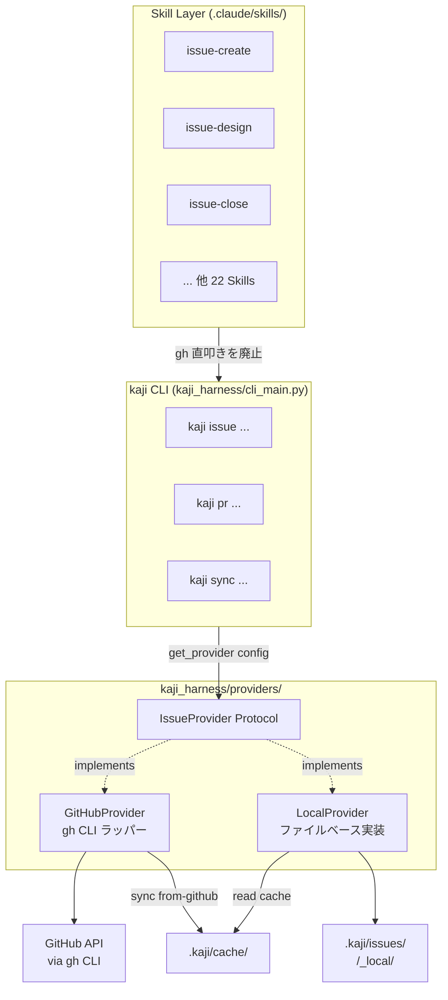
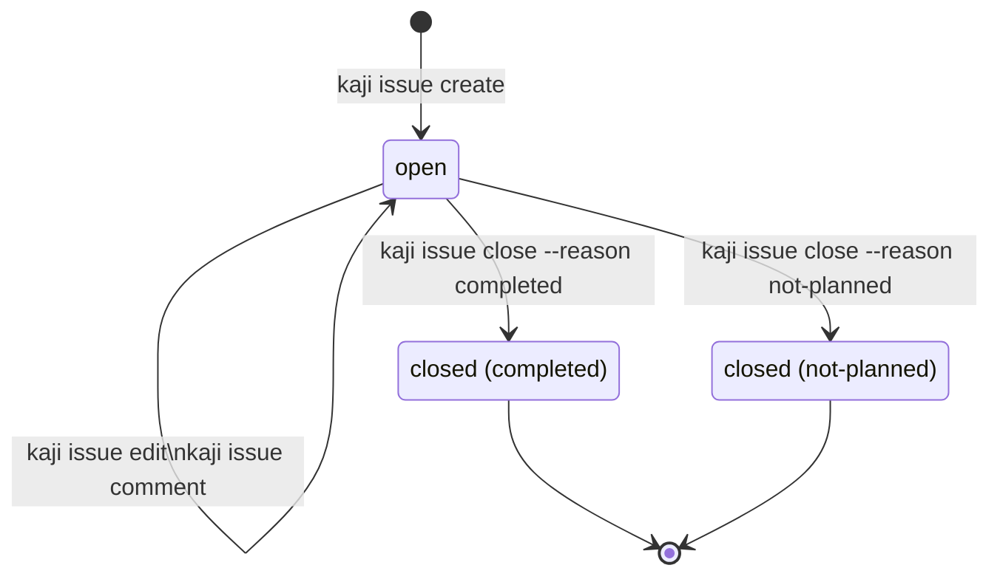
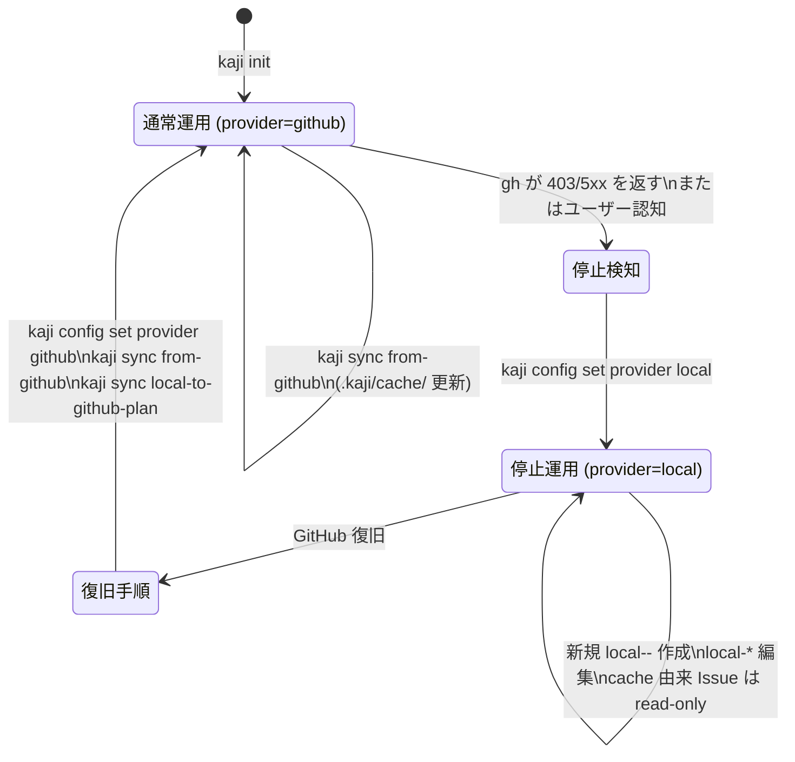

# [設計] kaji local mode — GitHub 非依存のローカル運用 provider

Issue: TBD（GitHub アカウント停止中。復旧後に起票して紐付ける。本設計が解決する障害そのもののため、設計レビュー時点では Issue 番号を付けられない）

## Primary Sources（一次情報）

設計判断の根拠として参照した実装・設定・既存 Skill。レビュアーは以下を起点に整合性を検証できる。

| カテゴリ | パス / コマンド | 参照目的 |
|---------|----------------|---------|
| **既存 CLI 実装** | `kaji_harness/cli_main.py:58-59` | `kaji run` の `issue` 引数が現在 `int` 型である事実、Phase 1 で `str` 化する根拠 |
| 既存 CLI 実装 | `kaji_harness/state.py:34, 114` | `SessionState.issue_number` の型変更影響箇所 |
| 既存 CLI 実装 | `kaji_harness/prompt.py:12, 48` | `f"GitHub Issue #{issue}"` の表示文言を provider 別に整形する根拠 |
| 既存 CLI 実装 | `kaji_harness/logger.py:37` | log フィールド型の追従対象 |
| 既存 config | `.kaji/config.toml` | 現行に `[provider]` セクションが存在しない事実、Phase 3 で追記必須化する根拠 |
| 既存 config 実装 | `kaji_harness/config.py:48` | TOML 拡張で `[provider]` を追加する整合性 |
| 既存 workflow | `.kaji/wf/feature-development.yaml:1-3` | `issue-create` / `issue-start` 事前手動実行が前提である事実 |
| 既存 Skill 全般 | `find .claude/skills -name SKILL.md \| wc -l` = **23**、dir 数 24 のうち `_shared/` を除外 | Skill 数の根拠（`gh` 直叩きカウント 20 の母数）。互換 alias `issue-pr` / `issue-doc-check` 削除後の値（refactor: drop deprecated skill aliases にて 25→23 に減少） |
| 既存 Skill | `.claude/skills/issue-close/SKILL.md:81, 89` | `gh pr merge --merge` 呼び出しの存在、worktree → branch 削除順序の規範 |
| 既存依存関係 | `pyproject.toml:25` の `[dependency-groups.dev]` | `pytest-httpx` が未掲載 → 追加要 |
| インシデント | 2026-05-03 GitHub アカウント停止 | 本設計の動機（背景・目的セクション参照） |
| 規約 | `docs/reference/testing-size-guide.md` | テストサイズ Small/Medium/Large の定義（Large = 外部実通信のみ） |
| 規約 | `docs/guides/git-commit-flow.md` | merge 戦略 `--no-ff` 固定の根拠 |
| 既存 ADR | `docs/adr/001-003` | EPIC orchestration ADR は未確定（004 は `draft/lab/`）、本設計の loose coupling 方針の前提 |

各設計判断の根拠は本文内で当該パス / コマンドを inline で再掲する。本一覧は review 時の起点として使用する。

## 概要

kaji を **GitHub に依存せずローカルファイルだけで全 workflow を完結**できるようにし、加えて **GitHub 停止時に開発が止まらない BCP 機能**を組み込む。`kaji_harness/providers/` に provider 抽象層を導入し、`provider: local | github` を config で切り替え可能にする。Skill からの `gh` 直接呼び出しを廃し、`kaji` CLI の薄いラッパー (`kaji issue ...` / `kaji pr ...`) 経由に統一する。Issue は `.kaji/issues/local-<machine>-<n>-<slug>/issue.md`（directory-per-issue、frontmatter + body）として表現し、コメントは同ディレクトリ内 `comments/` に格納する。

PR の扱いは provider によって異なる：

- **GitHub provider**: 従来通り `kaji pr create/view/merge/review` を介して GitHub PR をフル活用（既存運用に変化なし）
- **local provider**: PR 概念は持たない。git ブランチ + 既存の design / code レビュー Skill (`/issue-review-design` `/issue-review-code`) でレビュー文化を維持し、merge は手元の `git merge --no-ff` で完結

通常運用は GitHub provider を SoT（source of truth）として継続し、`kaji sync from-github` コマンドで定期的に local cache に snapshot を取る。GitHub 停止検知時は **1 コマンドで cache を初期状態とした local provider に切り替え**、停止期間中は `local-<machine>-<n>` 番号空間で新規開発を継続する。復旧後は手動で local 作業を GitHub に転記する。常時 dual-write は採用しない（複雑性に見合わないため、後述「スコープ外」参照）。

複数 PC（4 台想定）からの並行運用に対応するため、Issue ID には **machine prefix** を含める (`local-pc1-1`, `local-pc2-1`)。これにより各 PC は独立した番号空間を持ち、ID 採番の衝突は構造的に発生しない。同一 Issue を異なる PC で同時に編集した場合は git の通常の merge conflict として扱う。

## 運用前提

| 構成 | 必要なもの |
|------|----------|
| **複数 PC 運用** | 共有可能な git remote が 1 つ以上必要（GitHub / GitLab / 他 cloud forge / self-host Gitea / Forgejo / LAN 内 bare repo 等） |
| **単一 PC 運用** | local mode のみで完結。git remote 不要 |

local mode は「issue 管理を GitHub から切り離す」機能であり、複数 PC 間のコード同期そのものは git remote の責務である。local mode が動作するための remote は GitHub である必要はない。具体的な選定基準と setup 手順は `docs/operations/local-mode-runbook.md` で扱う。

## 背景・目的

### 現状の問題

| 観点 | 現状 | 1 次情報 |
|------|------|---------|
| Skill の forge 依存 | 23 Skill のうち 20 が `gh` CLI 直叩き | `find .claude/skills -name SKILL.md \| wc -l` = 23（`.claude/skills/` 配下 dir 数 24 のうち `_shared/` を除外）、`grep -l "gh issue\|gh pr\|gh api" .claude/skills/*/SKILL.md \| wc -l` = 20。**注: この計測は文字列マッチで verdict 例の prose にも hit しうるため、Phase 2 着手前にコードブロック内の `gh` 呼び出しのみを抽出する形へ計測手法を見直す（drop-deprecated-skill-aliases リファクタの遺留事項）** |
| 障害耐性 | GitHub アカウント停止 / GitHub 障害で開発が完全停止 | 2026-05-03 にアカウント停止が実発生し全 workflow が機能停止 |
| 試用障壁 | 新規ユーザーは GitHub アカウント + token + repo 設定が必須 | `docs/operations/release/admin-setup.md` 参照 |
| vendor lock-in | GitHub 以外の forge (GitLab/Codeberg) への移行は全 Skill 書き換えが必要 | 抽象層が存在しない |

### ユーザーストーリー

- **Maintainer (apokamo) として**、GitHub 接続不能時もローカルで設計・実装・レビューを継続したい。
- **新規ユーザーとして**、GitHub アカウント設定なしで `kaji run` を試し、ツールの価値を体験したい。
- **将来の私として**、別 forge への移行を「provider 実装の追加」だけで実現できる構造にしておきたい。

### 設計判断のサマリ

| 論点 | 決定 | 理由 |
|------|------|------|
| モード併存 | provider 抽象化（`github` / `local` の 2 実装） | 復旧後も両方使える。将来 `gitlab` 等を追加しやすい |
| Skill ↔ provider 結合 | Skill は `kaji` CLI のみ呼ぶ。`gh` 直叩き全廃 | Skill markdown を provider 中立に保つ |
| Issue ID | `local-<machine>-<int>` 形式、CLI 入力では `<int>` 単独も省略可 | GitHub `#N` との混同防止。字形衝突回避（`l-001` を退ける） |
| ID の zero-pad | **なし** (`local-pc1-1` / `local-pc1-1234`)。GitHub `#N` と一貫 | 1000 等の閾値で破綻しない。tooling は常に int parse でソート |
| マルチ PC 対応 | machine prefix で番号空間を PC 単位に分離 (`local-pc1-*` / `local-pc2-*`) | 4 PC 並行運用想定。ID 衝突を構造的にゼロにする |
| machine_id の管理 | `.kaji/config.local.toml`（gitignore 対象）で PC ごとに設定。**未指定時はエラー停止**（hostname 自動採用は行わない） | repo 内 `config.toml` だと PC 間で衝突する。fail-fast 原則により暗黙のフォールバックを設けない |
| PR 概念 | **GitHub provider では従来通り使用**。local provider のみ廃止し、git merge + 既存 review Skill で代替 | local には PR を載せる中央サーバーが無い。GitHub mode の運用は不変 |
| 同期 | GitHub → local の **単方向 snapshot のみ**。write 同期なし | dual-write は分散システム問題で複雑度爆発。snapshot だけで BCP 効果は得られる |
| 停止時の継続性 | `kaji sync from-github` で日常的に cache 更新 → 停止時 1 コマンドで local provider に切替 | 停止発生時に焦らず即時継続できる。差分転記は手動で十分 |
| Issue 保存場所 | `.kaji/issues/local-<machine>-<n>-<slug>/issue.md`（directory-per-issue、git 管理対象） | comments を同ディレクトリ配下に同居でき、複数 PC 間で git 同期可能 |
| Comment 配置 | `.kaji/issues/<id>/comments/<seq>-<machine>.md` | 正本として git 管理。複数 PC 間で同期される |
| Config 形式 | TOML（既存 `kaji_harness/config.py:48` と整合）| 既存の `[paths]` `[execution]` セクションを破壊せず、`[provider]` `[provider.local]` `[provider.github]` を追加 |
| 設定値の解決 | **fail-fast 原則**。未設定値に暗黙デフォルトを設けず、必須項目が欠けたらエラー停止 | 想定外の挙動を避ける。user の意図を環境推測ではなく宣言で確定する。エラーメッセージは「何を、どこに、どう書くか」を完全に提示 |
| kaji 規約パス | **本設計で新規追加する** `.kaji/issues/`, `.kaji/cache/` はコード内固定（user 設定不可）。既存の `paths.artifacts_dir` は user 設定可能を維持 | 「新規 path = kaji 規約、既存 path = 既存挙動維持」で破壊的変更を避ける |
| provider 切替の永続化先 | `.kaji/config.local.toml`（gitignored）に書き込む。tracked な `.kaji/config.toml` は触らない | BCP 切替で tracked file を汚さない。PC 間で active provider が独立 |
| 状態管理 | frontmatter に `state: open | closed`、`labels`、`assignees` を持つ | YAML で機械可読、git diff で人間可読 |
| JSON 出力契約 | **既存 Skill が利用する GitHub API field の互換 subset**（`labels: [{"name": "..."}, ...]`、`title`、`body`、PR の `number`/`title`/`headRefName` 等） | Skill 側の jq クエリを変更不要にする。frontmatter 表記は string 配列 `[type:feature]` で良いが、provider 内部で変換。**全 GitHub API への完全準拠は目指さない**（color/description 等の付加情報は null で返す） |

## インターフェース

### CLI（新規追加）

provider に依存しない統一 CLI を `kaji` 配下に追加する。Skill はこちらだけを呼ぶ。

```
kaji issue create   --title TEXT (--body TEXT | --body-file PATH) [--label LABEL]...
kaji issue view     ID   [--comments] [--json FIELDS] [--jq EXPR | -q EXPR]
kaji issue edit     ID   [(--body TEXT | --body-file PATH)] [--add-label LABEL]... [--add-frontmatter KEY=VALUE]...
kaji issue comment  ID   (--body TEXT | --body-file PATH)
kaji issue close    ID   [--reason completed|not-planned]
kaji issue list          [--state open|closed|all] [--label LABEL] [--json FIELDS] [--jq EXPR | -q EXPR]

kaji pr   create    --base BRANCH --head BRANCH --title TEXT (--body TEXT | --body-file PATH)
kaji pr   view      ID   [--comments] [--json FIELDS] [--jq EXPR | -q EXPR]
kaji pr   list           [--head BRANCH] [--state open|merged|closed] [--json FIELDS] [--jq EXPR | -q EXPR]
kaji pr   merge     ID                          # 常に no-ff merge（後述）
kaji pr   comment   ID   (--body TEXT | --body-file PATH)
kaji pr   review    ID   --approve|--request-changes (--body TEXT | --body-file PATH)

# kaji pr 配下のコマンドは forge provider 専用
# （PR / MR を持つ remote 系 provider。現状は github のみ、
#  将来 gitlab / forgejo 等を追加可能）。
# provider=local（bare provider）で呼ばれた場合は明示的なエラーで停止し、
# 「local mode は forge を持たないため PR 概念がありません。
#  git merge --no-ff で完結してください」とガイドする
# （後述「local mode における PR の扱い」参照）。

# kaji pr merge は --method フラグを露出しない。
# 内部で常に gh pr merge --merge（--no-ff 相当）固定で実行する。
# squash / rebase は kaji の merge 規約 (docs/guides/git-commit-flow.md)
# に反するため CLI 上に出さない。

kaji sync from-github            [--dry-run] [--since DATE]
kaji sync status
kaji sync local-to-github-plan   [--json]
```

`kaji sync from-github` は GitHub 上の Issue を全件（または `--since` 指定時はその日付以降の更新分）取得し、`.kaji/cache/issues/<gh-number>.json` に GitHub 形式で保存する。あわせて `.kaji/cache/state.json` に最終同期時刻を記録する。`--dry-run` で取得対象だけ表示する。

`kaji sync status` は最終同期時刻、cache 件数、現在の provider、GitHub 接続性を表示する診断用コマンド。

`kaji sync local-to-github-plan` は GitHub 復旧後の運用補助コマンドで、停止期間中に作られた `local-<machine>-<n>` Issue を **全 PC 横断**で一覧表示する（既に `migrated_to: <gh-number>` frontmatter を持つものは除外）。`--json` で機械可読出力（AI に転記依頼する用途）。**plan の出力のみ**を提供し、転記実行は user / AI の手動作業とする（後述「BCP フロー」参照）。

`kaji issue edit ID --add-frontmatter KEY=VALUE` は frontmatter に任意の key を追記する（同名 key が既存なら上書き）。GitHub 復旧後の `migrated_to: <gh-number>` 記録など、ad-hoc な metadata を保持するための一般化された interface。値は string 固定（YAML scalar として安全）。

ID は以下のいずれの形式でも受理し、**provider と入力形式の組み合わせで解決先を一意に決定**する：

| 入力形式 | provider=github | provider=local |
|---------|-----------------|----------------|
| `local-pc1-1` / `local-pc2-42` | エラー（local 専用形式） | local Issue として解決 |
| `pc1-1`（machine 省略形）| エラー | local Issue として解決 |
| 数値のみ `1` / `153` | GitHub Issue `#1` / `#153` | **local Issue `local-<config.machine_id>-1` を新規採番／参照**（cache 参照ではない） |
| `#153` | GitHub Issue `#153` | **cache から読み出す GitHub Issue `#153`**（local mode 中の read-only 参照専用） |

**重要な設計判断**: local mode 中の数値のみ入力（例: `kaji issue view 153`）は **local 番号空間** (`local-<machine>-153`) として解釈する。GitHub cache を参照したい場合は `#153` を必須とする。これにより以下が達成できる：

- 数値のみ入力の解決先が provider 内で曖昧にならない（local mode 中は常に local 空間、`#` prefix で明示的に cache を指す）
- normalize_id の出力が「`local-<machine>-<n>` または cache key `#N`」のいずれか一意に決まる
- `kaji issue list` で local Issue と cache 由来 Issue を統合表示する際、ID 形式 (`local-pc1-1` vs `#153`) で出自が判別可能

provider が未確定で数値のみが渡された場合はエラー。`#N` 形式は cache 存在チェックを経て、cache 不在ならエラー停止（「provider=local 中、cache に GitHub Issue #N が見つかりません。`kaji sync from-github` を実行してください」とガイド）。

#### 既存 Skill との互換契約

`kaji issue` / `kaji pr` は **`gh issue` / `gh pr` のフラグサブセット互換**を保つ。Skill 側のコマンドラインを変更不要にするため、Skill が現在使っているフラグはすべて受理する：

| フラグ | 用途 | github provider | local provider |
|---|---|---|---|
| `--title` | タイトル指定 | `gh` に渡す | frontmatter / 引数で受理 |
| `--body` | 本文を引数で渡す | `gh` に渡す | 直接受理 |
| `--body-file` | 本文をファイルから読む | `gh` に渡す | ファイル読み込み |
| `--label` | ラベル付与 | `gh` に渡す | frontmatter `labels` に追記 |
| `--add-label` | ラベル追加（edit 時） | `gh` に渡す | frontmatter `labels` に append |
| `--json FIELDS` | JSON 出力 | `gh` に渡す | LocalProvider が GitHub API スキーマで生成 |
| `--jq EXPR` / `-q EXPR` | jq 式評価 | `gh` に渡す | Python 側で `pyjq` または `subprocess.run(["jq", "-e", expr])` で評価 |
| `--comments` | コメント含めて表示 | `gh` に渡す | コメントディレクトリを集約 |
| `--state` / `--reason` | 状態指定 | `gh` に渡す | frontmatter 更新 |

**LocalProvider の `--jq` 実装方針**:

- 第一選択: `subprocess.run(["jq", "-c", expr], input=json_str)` で外部 `jq` を呼ぶ（`gh` も内部で `jq` ライブラリを使うので動作互換性が高い）
- 依存: `jq` バイナリが PATH に存在することを kaji の前提条件とする（受け入れ条件で検証）
- `jq` 不在時のエラー: 「jq が PATH に見つかりません。`apt install jq` 等でインストールしてください」とガイド

これにより Skill の `gh issue view 123 --json title,body --jq '.title'` を `kaji issue view 123 --json title,body --jq '.title'` にそのまま置換できる。

### Config

config は既存の `.kaji/config.toml` を拡張する形で実装する（既存実装 `kaji_harness/config.py:48` と整合）。**共通設定** と **マシン固有設定** の 2 ファイルに分離する。

#### 設定値の解決方針: fail-fast 原則

未設定値に対する暗黙のデフォルトは設けない。必須設定が欠けた場合は明示的なエラーで停止する。理由は「想定外の挙動を避ける」「user の意図を環境推測ではなく宣言で確定する」こと。

**user が決める設定**（必須、未設定はエラー停止 — **Phase 3 以降**）:

| 設定 | 種別 | 未設定時 |
|------|------|---------|
| `provider.type` | 共通 | エラー停止。`github` / `local` の指定を要求 |
| `provider.local.machine_id` | machine 固有 | エラー停止（provider=local 時）。hostname 自動採用は行わない |
| `provider.local.default_branch` | 共通 | エラー停止（provider=local 時）。明示的な branch 名を要求 |
| `provider.github.repo` | 共通 | エラー停止（provider=github 時） |

**Phase 1-2 の暫定動作**（fail-fast の段階導入）:

`provider` 抽象が未導入の Phase 1（`kaji issue` / `kaji pr` CLI 追加）と Phase 2（Skill の `gh` → `kaji` 置換）では、`kaji issue` / `kaji pr` は **provider config なしでも `gh` 互換ラッパーとして動作**する（既存挙動の維持）。これにより：

- 既存利用者は config 追記なしに Skill 置換の効果を受けられる
- Skill 側の `gh` → `kaji` 置換と config 移行を独立にリリースできる
- Phase 3（LocalProvider 実装）で初めて `provider.type` を必須化（破壊的変更）。Phase 3 リリース時に明示的な migration ガイドを CHANGELOG / release notes で告知

`config` なしで `kaji issue` を呼んだときの暫定挙動は「内部で `gh` を呼ぶ。`gh` 不在ならエラー」。Phase 3 以降は「`provider.type` 未設定ならエラー停止し、書くべき内容を提示」へ切り替わる。

**kaji 規約（設定不可、コード内固定）**:

`.kaji/issues/`, `.kaji/cache/` のディレクトリ配置は本設計で新規導入するため、kaji の filesystem 規約として固定し、user は変更できない。これは config の対象外であり、cargo の `target/` や git 自体の `.git/` と同じ位置づけ。

**例外: `paths.artifacts_dir`**:

`.kaji-artifacts/` 等の artifacts 出力先は **既存実装で user 設定可能 (`paths.artifacts_dir`) として運用されている**ため、本設計では既存挙動を維持する（`paths.artifacts_dir` を引き続き user 設定対象とする）。「既に user が決めている path は尊重し、新規 path のみ kaji 規約として固定する」というルール。

| パス | 設定可否 | 既定 | 理由 |
|------|---------|------|------|
| `paths.artifacts_dir` | **user 設定可能（既存挙動維持）** | 既存 repo は `.kaji-artifacts` | 既存 config を破壊しない |
| `.kaji/issues/` | kaji 規約（固定） | — | 本設計で新規導入。user 設定不要 |
| `.kaji/cache/` | kaji 規約（固定） | — | 本設計で新規導入。user 設定不要 |

エラーメッセージは「**何を、どのファイルに、どう書くか**」を完全に示すことを必須とする。エラーを見た user / AI が即修正できる粒度を保証する。

#### 設定ファイル例

**`.kaji/config.toml`（共通、git 管理対象）**:

このファイルには **base 値（推奨運用）** を宣言する。BCP 切替時にこのファイルを書き換えると、tracked file が dirty になり、PC 間差分・復帰時の混乱が発生する。そのため `kaji config set` は本ファイルを書き換えない（後述）。

```toml
# 既存の必須セクション（artifacts_dir は user 設定可能を維持）
[paths]
artifacts_dir = ".kaji-artifacts"     # 既存値を維持。user 設定対象（kaji 規約として固定しない）
skill_dir = ".claude/skills"

[execution]
default_timeout = 300

# 本設計で追加するセクション。すべて必須項目（fail-fast）
[provider]
type = "github"                       # 必須。base 値。github | local

[provider.local]
default_branch = "main"               # provider=local 時に必須。/issue-close で merge する base

[provider.github]
repo = "apokamo/kaji"                 # provider=github 時に必須
```

**`.kaji/config.local.toml`（マシン固有、`.gitignore` 対象、active provider 永続化先）**:

```toml
[provider.local]
machine_id = "pc1"                    # provider=local 時に必須。各 PC で個別設定

# BCP 切替時はこのファイルに type を書く（tracked config を汚さないため）
# [provider]
# type = "local"                      # active provider の override
```

**`~/.config/kaji/config.toml`（グローバル、ユーザー単位、任意）**:

```toml
# 全 repo 共通のデフォルトを置きたい場合のみ使用
[provider.local]
machine_id = "pc1"
```

#### 優先順位（高い順に上書き）

1. 環境変数 (`KAJI_PROVIDER_TYPE`, `KAJI_MACHINE_ID`)
2. `.kaji/config.local.toml`（machine 固有、active provider の永続化先）
3. `.kaji/config.toml`（repo 共通、base 値）
4. `~/.config/kaji/config.toml`（user グローバル）

**いずれの層でも値が解決できなければエラー停止**（環境変数で全必須項目を埋める運用も可能）。

#### `kaji config set` の書き込み先

`kaji config set provider <type>` は **`.kaji/config.local.toml`（gitignored）に書き込む**。tracked な `.kaji/config.toml` は触らない。

理由：

- `.kaji/config.toml` は git tracked。書き換えると未コミット差分が発生し、PC 間 sync で意図しない競合を生む
- BCP 切替（github → local）は **PC ごとの一時的な state** であり、PC 間で共有すべきではない
- 復旧時に `.kaji/config.local.toml` の `[provider] type` を削除するだけで、tracked `.kaji/config.toml` の base 値（`github`）に戻る

```
通常時:
  .kaji/config.toml         [provider] type = "github"  ← base
  .kaji/config.local.toml   （[provider] セクションなし）
  → active = github

停止時 (kaji config set provider local 後):
  .kaji/config.toml         [provider] type = "github"  ← base、変化なし
  .kaji/config.local.toml   [provider] type = "local"   ← override
  → active = local

復旧時 (kaji config set provider github 後):
  .kaji/config.toml         [provider] type = "github"  ← base、変化なし
  .kaji/config.local.toml   （[provider] type を削除）
  → active = github（base に戻る）
```

`kaji config set` の他のキー（machine_id 等）も同様に `.kaji/config.local.toml` を書き込み先とする（machine 固有設定なので tracked 不可）。

#### エラーメッセージ仕様

未設定エラー時の出力例：

```
ERROR: provider.type is not configured.

To use GitHub, add the following to .kaji/config.toml:

  [provider]
  type = "github"

  [provider.github]
  repo = "owner/repo"

To use local mode, add the following:

  [provider]
  type = "local"

  [provider.local]
  default_branch = "main"

And add to .kaji/config.local.toml (machine-specific):

  [provider.local]
  machine_id = "<your-pc-name>"

See docs/cli-guides/config.md for the full reference.
```

このように **書くべき場所と内容を完全に提示**することを義務とする。「設定が不足している」だけでは user が次に何をすべきか分からない。

### ファイルレイアウト（local mode）

```
.kaji/
├── config.toml                       # 共通設定（git 管理対象、既存 TOML を拡張）
├── config.local.toml                 # マシン固有設定（.gitignore 対象、machine_id 等）
├── issues/                           # Issue source data（local mode の正本、directory-per-issue）
│   ├── local-pc1-1-foo/              # 1 Issue = 1 ディレクトリ
│   │   ├── issue.md                  # frontmatter + body
│   │   └── comments/                 # コメント・編集履歴（git 管理）
│   │       ├── 0001-pc1.md           # Issue 本文の編集前 snapshot
│   │       ├── 0002-pc1.md           # コメント 1
│   │       └── 0003-pc2.md           # 別 PC からのコメント
│   ├── local-pc1-2-bar/
│   │   ├── issue.md
│   │   └── comments/
│   ├── local-pc2-1-baz/              # 別 PC が作成した Issue
│   │   ├── issue.md
│   │   └── comments/
│   └── ...
├── cache/                            # GitHub からの snapshot（BCP 用、user-data 性、git 管理）
│   ├── state.json                    # 最終同期時刻、件数等のメタ情報
│   └── issues/
│       ├── 153.json                  # GitHub Issue #153 の snapshot（GitHub API JSON）
│       ├── 154.json
│       └── ...
└── （`paths.artifacts_dir` 設定値、例: `.kaji-artifacts/`）  # 実行時生成物（.gitignore 対象）
    ├── <issue>/                      # 既存: kaji run の Issue 単位 output
    │   └── ...
    ├── _epics/                       # 将来 EPIC orchestration 用（loose coupling）
    │   └── <epic_n>/
    │       └── state.json
    └── _local/                       # local-mode の運用 state（コメント等の正本ではない）
        └── counters/                 # machine 別 ID カウンタ
            ├── pc1                   # pc1 の最新採番値（テキスト整数）
            ├── pc2
            └── ...
```

注: 上記レイアウトは `paths.artifacts_dir = ".kaji/artifacts"` を仮定した表示だが、実際の配置先は user の config 設定値に従う。本設計で新規追加する `_epics/` と `_local/` は artifacts_dir 配下の subtree として配置する。

レイアウトの方針：

- **user-data 性のもの（`issues/`, `cache/`, `config.toml`）は git 管理対象**: 複数 PC 間で同期されるべきデータ。Issue とコメントの正本はここに集約
- **runtime state（`artifacts/`）は `.gitignore` 対象**: kaji 実行が生成する派生データ・カウンタ等。machine 別カウンタは PC 固有なので git 同期不要
- **machine 固有設定 (`config.local.toml`) は `.gitignore` 対象**: machine_id は PC ごとに異なるべき
- アンダースコア prefix (`_epics`, `_local`) で「kaji 内部用」を示し、Issue 番号ディレクトリと衝突しない命名

**git 管理対象 vs 非対象の早見表**:

| パス | git | 理由 |
|------|-----|------|
| `.kaji/config.toml` | ✓ | 共通設定 |
| `.kaji/config.local.toml` | ✗ | machine 固有 |
| `.kaji/issues/` | ✓ | Issue 正本（コメント含む） |
| `.kaji/cache/` | ✓ | GitHub snapshot（停止時の read 用） |
| `paths.artifacts_dir`（既存。例: `.kaji-artifacts/`） | ✗ | 実行時生成物・カウンタ等。配置先は既存 config に従う |

Issue ファイル例（`.kaji/issues/local-pc1-1-foo/issue.md`）:

```markdown
---
id: local-pc1-1
title: ローカル mode の最小実装
state: open
labels: [type:feature, area:harness]      # frontmatter 表記は string 配列（人間可読優先）
assignees: [apokamo]
created_by: pc1                       # 作成 machine_id（後で「どの PC で作ったか」を追える）
created_at: 2026-05-04T15:30:00+09:00
updated_at: 2026-05-04T16:00:00+09:00
closed_at: null
---

## 概要

(Issue 本文)
```

注: frontmatter の `labels` は string 配列で表現するが、`kaji issue view --json` で出力する際は GitHub API スキーマに揃えて `[{"name": "type:feature"}, {"name": "area:harness"}]` の object 配列に変換する。Skill 側の jq クエリ (`[.labels[].name]`) を変更しないための設計上の配慮。

### 出力契約

`kaji issue view <id> --json title,body,labels` は **既存 Skill が利用する GitHub API field の互換 subset**を返す（全 field の完全準拠ではなく、Skill が実際に jq で参照している `labels[].name`、`title`、`body`、PR の `number`/`title`/`headRefName` 等を最低保証）：

```json
{
  "title": "ローカル mode の最小実装",
  "body": "## 概要\n...",
  "labels": [
    {"name": "type:feature", "color": null, "description": null},
    {"name": "area:harness", "color": null, "description": null}
  ]
}
```

Skill 側の jq クエリ (`--jq '{title: .title, body: .body, labels: [.labels[].name]}'` 等) を変えなくて済むよう、**既存 Skill が参照する field の互換 subset**を provider 共通契約とする。LocalProvider は内部で frontmatter の string 配列を object 配列に変換する（`color` / `description` 等の付加情報は LocalProvider では `null` を返す）。GitHub API の全 field 互換は目指さない方針：Skill が新たな field を要求し始めたら、その都度 LocalProvider 側に足す。

## 詳細設計

### provider の概念区分

PR (Pull Request) / MR (Merge Request) は git 本体の機能ではなく、forge（GitHub / GitLab / Forgejo 等の Web 系 git ホスティング）が提供する機能である。git CLI そのものはブランチと merge を持つだけで、レビューコメント・approve / request-changes・マージキュー等の概念は持たない。

この観点から provider を 2 種に分類する：

| 分類 | 例 | PR / MR | レビュー | sync 元 |
|------|---|---------|---------|---------|
| **forge provider** | github、（将来）gitlab / forgejo / codeberg / gitea | ✓ | ✓ | forge → local |
| **bare provider** | local（ファイルベース）、（将来）NAS bare repo 等 | ✗ | git commit/branch ベースで代替 | — |

`kaji pr ...` 配下のコマンドは **forge provider 専用**。bare provider では構造的に PR 概念が存在しないため、エラー停止し代替手順をガイドする。

`kaji issue ...` 配下のコマンドは **両方の provider で動作する**（issue は forge 機能ではなく、forge も bare も同等に持てる概念）。

### provider 抽象層



`kaji_harness/providers/` を新設：

```
kaji_harness/
└── providers/
    ├── __init__.py        # get_provider(config) -> IssueProvider
    ├── base.py            # IssueProvider, PullRequestProvider (Protocol)
    ├── models.py          # Issue, Comment, PullRequest, Label (dataclass)
    ├── github.py          # GitHubProvider — 既存 gh 呼び出しの集約
    └── local.py           # LocalProvider — ファイルベース実装
```

Protocol 定義（抜粋）：

```python
class IssueProvider(Protocol):
    # CRUD
    def create(self, *, title: str, body: str, labels: list[str]) -> Issue: ...
    def view(self, issue_id: str) -> Issue: ...
    def edit(self, issue_id: str, *, body: str | None = None,
             add_labels: list[str] | None = None,
             add_frontmatter: dict[str, str] | None = None) -> Issue: ...
    def comment(self, issue_id: str, body: str) -> Comment: ...
    def close(self, issue_id: str, reason: Literal["completed", "not-planned"]) -> None: ...
    def list(self, *, state: str = "open", labels: list[str] | None = None) -> list[Issue]: ...

    # JSON / jq 出力（gh 互換 subset）
    def view_json(self, issue_id: str, *, fields: list[str],
                  jq: str | None = None) -> str: ...
    def list_json(self, *, state: str, labels: list[str] | None,
                  fields: list[str], jq: str | None = None) -> str: ...

    # コメント集約 / 補助
    def list_comments(self, issue_id: str) -> list[Comment]: ...
    def is_readonly(self, issue_id: str) -> bool:
        """cache 由来 Issue（GitHub 番号）など編集不可なものを判定。
        local provider 上で GitHub 番号 ID を edit/comment しようとした場合に
        CLI 層で True ならエラー停止する。"""
        ...


class PullRequestProvider(Protocol):
    """forge provider 専用。bare provider は実装せずエラー返す。"""
    def create(self, *, base: str, head: str, title: str, body: str) -> PullRequest: ...
    def view(self, pr_id: str) -> PullRequest: ...
    def view_json(self, pr_id: str, *, fields: list[str],
                  jq: str | None = None) -> str: ...
    def list(self, *, head: str | None = None, state: str = "open") -> list[PullRequest]: ...
    def list_json(self, *, head: str | None, state: str,
                  fields: list[str], jq: str | None = None) -> str: ...
    def merge(self, pr_id: str) -> None: ...               # 常に no-ff 固定
    def comment(self, pr_id: str, body: str) -> Comment: ...
    def review(self, pr_id: str, *,
               decision: Literal["approve", "request-changes"],
               body: str) -> None: ...
    def list_review_comments(self, pr_id: str) -> list[ReviewComment]: ...
```

`kaji issue ...` / `kaji pr ...` CLI は `get_provider(config)` で実装を取得し、引数を Protocol メソッドに渡すだけの薄いディスパッチャ。`is_readonly()` を CRUD 操作前に呼ぶことで、local mode 中に cache 由来 Issue (`#153`) を edit/comment した場合の編集不可エラーを provider 共通で扱える。

### ID 採番（local mode）

- `<artifacts_dir>/_local/counters/<machine_id>`（`<artifacts_dir>` は `paths.artifacts_dir` 設定値）をテキスト整数で保持（初期値 `0`、最初の採番で `1` になる）
- 各 PC は **自分の machine_id のカウンタのみ更新**する。他 PC のカウンタは触らない
- ID は **zero-pad なし**で表現する。`local-pc1-1` / `local-pc1-1234`。tooling は常に最後のセグメントを `int` parse してから比較・ソートする

#### 採番アルゴリズム（fresh clone / artifacts 削除耐性）

カウンタファイルを gitignored な `<artifacts_dir>` に置くため、fresh clone 直後や `make clean` 後はカウンタが存在しない（または `0`）状態になる。一方で `.kaji/issues/local-<machine>-*` ディレクトリは tracked のため、既に `local-pc1-3` まで採番されている可能性がある。**カウンタだけを信用すると `local-pc1-1` を再採番して既存 dir と衝突する**。

これを防ぐため、`kaji issue create` の採番時は以下を必ず実行する：

```python
def next_local_id(machine_id: str, issues_root: Path, counter_path: Path) -> int:
    """カウンタと既存 dir の両方の max を取って次の ID を決定する。

    - counter_path: <artifacts_dir>/_local/counters/<machine_id>（gitignored）
    - issues_root: .kaji/issues/（tracked、他 PC の作成分も含む）
    """
    counter_value = int(counter_path.read_text().strip()) if counter_path.exists() else 0
    # 既存 issue dir から自分の machine_id 分の最大 n を取得
    pattern = re.compile(rf"^local-{re.escape(machine_id)}-([1-9][0-9]*)-")
    existing_max = 0
    for d in issues_root.iterdir():
        if d.is_dir() and (m := pattern.match(d.name)):
            existing_max = max(existing_max, int(m.group(1)))
    next_n = max(counter_value, existing_max) + 1
    counter_path.write_text(str(next_n))  # カウンタを再同期
    return next_n
```

**設計上の効果**:

- fresh clone でカウンタ不在でも、`.kaji/issues/local-pc1-1`～`local-pc1-3` を見て次は `4` から採番される
- `make clean` で `<artifacts_dir>` が削除されても同様
- 他 PC が pull で持ってきた `local-pc1-*`（=自分が以前作って push したもの）も拾える

**呼び出し側**: `kaji issue create` 実行時に flock で `<artifacts_dir>/_local/counters/<machine_id>` を排他制御し、`next_local_id()` を呼ぶ → Issue 作成。採番後に Issue ファイル作成が失敗した場合、ID は欠番として残す（rollback しない、運用シンプル化のため）。

#### 排他制御の実装方針（OS 依存性）

| プラットフォーム | 実装 | 状態 |
|-----------------|------|------|
| Linux / macOS (POSIX) | `fcntl.flock(fd, fcntl.LOCK_EX)` で advisory lock | Phase 3 で対応 |
| Windows | **本 Phase では非対応**。kaji 起動時に platform を検出し、provider=local かつ Windows なら警告を出して続行（複数プロセス並列時の race は user 責務） | Phase 3 範囲外 |
| 将来対応 | `portalocker` パッケージで OS 抽象化、または atomic create+rename ベース（`*.tmp` → `os.replace`）に置換 | オープン論点 |

カウンタ更新は単一 PC 内のプロセス間排他のみ保証する。複数 PC 間は machine prefix で番号空間を物理分離しているため、排他制御は不要。

### ID 正規化

`kaji_harness/providers/__init__.py`:

**machine_id の文法**:

machine_id は `[a-z0-9]{1,16}` に制限する（**ハイフン禁止**）。理由：

- `local-<machine>-<int>` 形式の parse を完全に一意化する
- `local-mac-mini-1` のような曖昧な ID（machine が `mac` か `mac-mini` か判別不能）を構造的に防ぐ
- `pc1-1` 省略形やディレクトリ名 `local-pc1-1-foo` の解析も正規表現 1 本で確定する

実用上は `pc1`、`mac1`、`desktop`、`home`、`office` 等で十分。「mac-mini」のような複合語が必要な場合は `macmini` にする。

**正規化ロジック**:

```python
import re

# machine_id 文法: 英数字のみ、1〜16 文字
MACHINE_RE = re.compile(r"^[a-z0-9]{1,16}$")
# Local ID 全体: local-<machine>-<int>
LOCAL_ID_RE = re.compile(r"^local-([a-z0-9]{1,16})-([1-9][0-9]*)$")
# 省略形: <machine>-<int>
SHORT_RE = re.compile(r"^([a-z0-9]{1,16})-([1-9][0-9]*)$")
# GitHub cache 参照: #N
HASH_RE = re.compile(r"^#([1-9][0-9]*)$")


@dataclass(frozen=True)
class ResolvedId:
    kind: Literal["local", "github_cache", "github"]
    value: str  # local: "local-pc1-1", github / github_cache: "153"


def normalize_id(raw: str, *, provider_name: str, machine_id: str | None) -> ResolvedId:
    """入力 ID を provider と組み合わせて一意な ResolvedId に正規化。

    - provider=github: 数値 / "#N" → ResolvedId(github, "N")
    - provider=local:
        - "local-<m>-<n>" / "<m>-<n>" / 数値 → ResolvedId(local, "local-<m>-<n>")
            （数値は config.machine_id を補う。cache の意味はもたない）
        - "#N" → ResolvedId(github_cache, "N")（cache 参照専用、read-only）
    """
    if provider_name == "github":
        if m := HASH_RE.match(raw):
            return ResolvedId("github", m.group(1))
        if raw.isdigit() and int(raw) > 0:
            return ResolvedId("github", raw)
        raise ValueError(f"github provider expects '#N' or positive integer, got: {raw}")

    if provider_name == "local":
        # cache 参照は明示的な "#N" のみ。数値のみは local 空間に予約する
        if m := HASH_RE.match(raw):
            return ResolvedId("github_cache", m.group(1))
        if m := LOCAL_ID_RE.match(raw):
            return ResolvedId("local", f"local-{m.group(1)}-{int(m.group(2))}")
        if m := SHORT_RE.match(raw):
            return ResolvedId("local", f"local-{m.group(1)}-{int(m.group(2))}")
        if raw.isdigit() and int(raw) > 0:
            if not machine_id:
                raise ValueError(
                    "machine_id is required to resolve numeric-only id under local provider; "
                    "set [provider.local] machine_id in .kaji/config.local.toml "
                    "or use 'local-<machine>-<n>' form explicitly. "
                    "To reference a cached GitHub issue, use '#N' instead."
                )
            if not MACHINE_RE.match(machine_id):
                raise ValueError(
                    f"invalid machine_id '{machine_id}': must match [a-z0-9]{{1,16}}"
                )
            return ResolvedId("local", f"local-{machine_id}-{int(raw)}")
        raise ValueError(
            f"local provider expects 'local-<machine>-<n>', '<machine>-<n>', "
            f"numeric ID (local space), or '#N' (cache); got: {raw}"
        )

    raise ValueError(f"unknown provider: {provider_name}")
```

CLI 層は `ResolvedId.kind` で分岐する：

- `local` → LocalProvider の CRUD
- `github_cache` → cache reader（read-only。edit/comment/close は明示エラー）
- `github` → GitHubProvider の CRUD

これにより L772 の `kaji issue view 153`（local mode 中）は **local-<machine>-153 として解釈**され、GitHub cache を参照したい場合は `kaji issue view #153` を必要とする。設計判断のサマリ表とも整合。

**ディレクトリ名の parse も同じ文法で一意化**: `local-pc1-1-foo` は regex `^local-([a-z0-9]{1,16})-([1-9][0-9]*)-(.+)$` で一意に machine=`pc1`, n=`1`, slug=`foo` に分解できる。

#### ID から Issue ディレクトリへの解決

CLI は ID（例: `local-pc1-1`）から実ディレクトリパス（例: `.kaji/issues/local-pc1-1-foo/`）を解決する必要がある。アルゴリズム：

```python
def resolve_issue_dir(issues_root: Path, issue_id: str) -> Path:
    """正規化済み ID から Issue ディレクトリを一意解決。

    ID に対応する slug 部分は実行時に決まるため glob で検索する。
    重複検出時はエラーで停止し、user に状況を提示する。
    """
    candidates = list(issues_root.glob(f"{issue_id}-*"))
    if not candidates:
        raise IssueNotFoundError(
            f"Issue not found: {issue_id}\n"
            f"  searched in: {issues_root}\n"
            f"  expected pattern: {issue_id}-<slug>/"
        )
    if len(candidates) > 1:
        raise DuplicateIssueIdError(
            f"Duplicate ID detected: {issue_id} matched {len(candidates)} directories:\n"
            + "\n".join(f"  - {c.name}" for c in candidates)
            + "\nThis should not happen in normal operation. "
            "It may indicate a git merge conflict left untreated. "
            "Resolve manually by renaming or removing duplicates."
        )
    return candidates[0]
```

**設計上の注意**:

- index ファイル (`.kaji/issues/_index.json` 等) は持たない。**git merge 衝突の温床になる**ため、glob ベースで都度解決する
- glob の性能: 4 PC × 数百 Issue 規模では実用上問題なし（ms オーダー）
- 重複は正常運用では発生しないが、git merge 事故等で発生し得る → 検出してエラーで停止する設計

**slug の rename**:

ディレクトリ名の slug 部分を変更したい場合は通常の git 操作（`git mv .kaji/issues/local-pc1-1-foo .kaji/issues/local-pc1-1-bar`）で扱う。kaji 側に専用コマンドは持たない。将来必要なら `kaji issue rename <id> <new-slug>` を追加する余地は残す（オープン論点）。

### Skill の改修

全 Skill markdown の `gh` 呼び出しを `kaji` 経由に置換。例：

| Before | After |
|--------|-------|
| `gh issue view 123 --json title,body,labels` | `kaji issue view 123 --json title,body,labels` |
| `gh issue edit 123 --body-file body.md` | `kaji issue edit 123 --body-file body.md` |
| `gh issue close 123 --reason completed` | `kaji issue close 123 --reason completed` |
| `gh pr create --base main --title ...` | `kaji pr create --base main --title ...` |
| `gh pr merge feat-123-foo --merge` | `kaji pr merge feat-123-foo`（`--merge` 等の method flag は露出しない。内部で常に `--no-ff` 相当固定） |
| `gh api repos/{owner}/{repo}/pulls/.../comments` | （GitHub 専用機能。local 不要、Skill 側で provider 分岐） |

**Phase 2 の置換時の注意**: 既存 Skill (`.claude/skills/issue-close/SKILL.md` 等) は `gh pr merge ... --merge` を呼んでいるが、`kaji pr merge` は method flag を露出しないため、置換時に `--merge` 引数も**同時に除去**する。単純な `gh` → `kaji` の文字列置換では済まない例外として Phase 2 タスクで扱う（legacy alias は受け入れない。混乱を増やすだけのため）。

レビューコメント API (`gh api .../pulls/N/comments`) は GitHub の inline review 機能に依存しており local では非対応。`pr-fix` / `pr-verify` Skill は **provider が github の時のみ動作する**仕様とし、`provider=local` 時は「review コメントは設計書 / コミットメッセージで代替」というガイドを表示する。

### ブランチ命名規則

worktree や PR 作成時のブランチ名は provider 別に統一する。

| provider | パターン | 例 |
|---------|---------|------|
| github | `<type>-<gh-number>-<slug>` | `feat-153-foo` |
| local | `<type>-local-<machine>-<n>-<slug>` | `feat-local-pc1-1-foo` |

worktree パスは `<repo-root>/<branch-name>/` を基本とする（kaji 既存運用と同形）。worktree 機構そのものは git 標準 (`git worktree add`) を使用するため、provider の違いによる影響はない。

### マルチ PC 並行運用

4 PC からの並行使用に耐える設計。各衝突点と防御方式を明示する。

#### 衝突マトリクス

| 衝突点 | シナリオ | 防御方式 |
|---|---|---|
| **ID 採番** | pc1 と pc2 が同時に「次の番号」を取得 | machine prefix で番号空間を物理分離。pc1 は `local-pc1-*`、pc2 は `local-pc2-*` のみ作成。**衝突は構造的に発生しない** |
| **同一 PC 内の複数 workflow が同時採番** | 同じ pc1 上で kaji が 2 並列実行され、両方が `kaji issue create` | `flock` で `<artifacts_dir>/_local/counters/pc1` を排他制御 |
| **同一 Issue を別 PC が同時編集** | pc1 で `local-pc1-1` を edit、pc2 でも同じ Issue を edit | git の通常 merge conflict として扱う。kaji は介入しない |
| **コメントファイル番号の衝突** | 同じ Issue の異なる PC が `0003.md` を作成 | コメントファイル名は `<seq>-<machine>.md` 形式（例: `.kaji/issues/local-pc1-1-foo/comments/0003-pc1.md`）。同一 seq でも machine 違いで共存可能。git の merge 時もファイル名衝突なし |
| **`kaji sync from-github` の race** | pc1 と pc2 が同時 sync で cache 書き込み競合 | atomic rename (`*.tmp` に書いて `os.replace`) で個別ファイルの破損を防ぐ。複数 PC 間の最終勝者は git push 順序で決まる |
| **config.local.toml の commit 事故** | machine_id を含むファイルを誤って commit | repo の `.gitignore` に `.kaji/config.local.toml` を登録（kaji セットアップ時の手順で明記） |

#### machine_id 命名と運用ルール

- 各 PC は repo を初めて clone した直後に `kaji config set machine_id <name>` を実行する
- `<name>` の制約: `[a-z0-9]{1,16}`（**ハイフン禁止**）。`pc1` / `mac1` / `desktop` / `home` / `office` 等が想定。複合語が必要な場合は `macmini` のように連結する
- `.kaji/config.local.toml` は `.gitignore` 必須
- 同一 user が同じ machine_id を 2 PC で使ってしまった場合は ID 衝突する。回避は user 責務（明示宣言を必須とすることで「自動推測の罠」を排除）

#### 同一 Issue の同時編集が起きた時の挙動

- pc1 で `local-pc1-1-foo.md` の body を edit、commit、push
- pc2 でも同じファイルを edit、commit、push しようとする → push reject（non-fast-forward）
- pc2 で `git pull --rebase` → merge conflict → user 解決 → push

これは git の通常運用そのもの。kaji は何もしない。

#### Issue 作成のタイミング考察

- Issue 作成は user が `kaji issue create` を打った時点で確定（local file が即作られる）
- その時点では別 PC は知らない
- pc1 が作成 → 他 PC が `git pull` するまで存在を知らない
- これは GitHub mode でも `gh issue create` の直後 〜 他 PC が view するまでの間は同じ。実害なし

### local mode における PR の扱い

- **「PR」は概念として存在しない**。代わりに：
  - `/issue-design` → `draft/design/local-<machine>-<n>-foo.md` 作成
  - `/issue-review-design` → 設計レビュー（自己 or 別 agent）
  - `/issue-implement` → ブランチ作業 + commit
  - `/issue-review-code` → コードレビュー（commit diff / `git log -p` ベース）
  - `/issue-close` → ローカルで `git merge --no-ff` してブランチ削除、Issue を closed に
- `kaji pr ...` CLI は **forge provider 専用**（github / 将来 gitlab 等）。bare provider (local) で呼ばれたらエラーで停止し、上記の代替手順をガイドする
- `i-pr` / `pr-fix` / `pr-verify` Skill は provider=local では skip するか、エラーで止める

#### local mode における `/issue-close` の手順

bare provider 環境では PR を介した merge が存在しないため、`/issue-close` は git 操作と Issue frontmatter 更新を直接行う。手順を厳密に定める：

1. **Preflight check**:
   - `git status --porcelain` の出力が空（未コミット変更がない）
   - 現在の HEAD が `<type>-local-<machine>-<n>-<slug>` パターンのブランチ上にある
   - base branch（`provider.local.default_branch`、設定必須）が ローカルに存在する
   - いずれか失敗 → ABORT、エラーメッセージで原因を表示
2. **Base branch の最新化**:
   - remote 設定があれば `git fetch <remote> <base>` を実行
   - `git switch <base> && git merge --ff-only <remote>/<base>`（fast-forward 失敗 → ABORT）
3. **Merge 実行**:
   - `git merge --no-ff --no-edit <feature-branch>`
   - 衝突 → ABORT、Issue は open のまま、user に手動 resolve を依頼
   - その他失敗 → ABORT
4. **Issue frontmatter 更新 + commit**（destructive ops の前に確定させる）:
   - `state: closed`、`closed_at: <ISO8601>`、`close_reason: completed`、`closed_by: <machine_id>` を frontmatter に書き込み
   - `git add .kaji/issues/<id>-<slug>/issue.md && git commit -m "chore(issue): close <id>"`
   - commit 失敗 → ABORT（Issue は open のまま、merge は base に残る点を user に通知）
5. **Cleanup**（既存 skill `.claude/skills/issue-close/SKILL.md:89` と同順序: worktree → branch）:
   - `git worktree remove <worktree-path>`
   - `git branch -d <feature-branch>`（worktree 削除後でないと checkout 中で削除失敗するため、この順序が必須）
   - cleanup 失敗 → 警告のみ（Issue は既に closed 確定。手動 cleanup を促す）
6. **Push**（remote 設定がある場合）:
   - `git push <remote> <base>`
   - 失敗 → 警告のみ（Issue 状態の更新は完了している、手動 push を促す）

各ステップで失敗時の挙動を明示し、Issue の半端な状態（branch 削除済みだが state が open のまま等）を防ぐ。**Step 4 までで Issue close は確定**（commit が完了している）。Step 5/6 の失敗は警告に留め、user が手動回復できる状態にする。

**順序設計の根拠**:

- frontmatter 更新を Step 5 の cleanup より前に置く理由: cleanup（worktree/branch 削除）が失敗しても Issue 状態は closed として確定済になり、「branch は消えたが Issue は open」の半端状態が構造的に発生しない
- worktree 削除を branch 削除より前に置く理由: feature branch が worktree で checkout 中だと `git branch -d` が失敗する（既存 skill `.claude/skills/issue-close/SKILL.md:89` と同方針）

### 状態遷移（local mode）



| イベント | 変更 |
|---------|------|
| `kaji issue create` | `state: open`, `created_at`, `updated_at` 設定。`next_issue_id` インクリメント |
| `kaji issue edit` | `body` 上書き、`updated_at` 更新。コメント履歴に edit 前 body を保存 |
| `kaji issue comment` | `.kaji/issues/local-<machine>-<n>-<slug>/comments/<seq>-<machine>.md` に追記（git 管理対象） |
| `kaji issue close` | `state: closed`, `closed_at`, `close_reason` 設定 |
| `kaji issue list --state open` | `issues_dir` を走査、frontmatter で `state: open` のものを返す |

cache 由来 Issue（GitHub 番号）は **frontmatter を持たない** GitHub API JSON 形式で `.kaji/cache/issues/NNN.json` に保存されており、`provider: local` 時は read-only。状態遷移の対象外。

### BCP フロー（GitHub 停止時の運用）

通常運用と停止運用を 1 つの設計に統合した、本機能の核となるフロー。



#### 通常時（GitHub 接続正常）

```
provider.type = "github"  ← .kaji/config.toml で指定
```

- 全 read/write は GitHub provider 経由
- ユーザーは定期的に `kaji sync from-github` を実行
  - 推奨頻度: 1 日 1 回（cron / GitHub Actions / 手動 いずれでも可）
  - 同期対象: 自分が owner / collaborator の repo の全 Issue
- cache は git 管理されるので、commit すれば他端末・他環境にも同期される

#### GitHub 停止検知

GitHub 停止は以下のいずれかで検知する：

1. **能動検知**: `kaji issue ...` 実行時に `gh` が 403 / 5xx / network error を返す
2. **受動検知**: ユーザーがメール等で停止を認識し、明示的に切替

能動検知時は CLI が以下を表示してユーザーに切替を促す（自動切替はしない、誤検知時の混乱を避けるため）：

```
ERROR: GitHub API returned 403 (account suspended).

Your local cache is available with 170 issues from last sync at 2026-05-04 09:00 JST.

To continue working in local mode:
  kaji config set provider local

This switches to local-<machine>-<n> issue space. Existing GitHub
issues remain read-accessible from cache. New issues on this machine
(machine_id=pc1) will be created as local-pc1-1, local-pc1-2, ...
```

#### 停止期間中（local mode）

```toml
[provider]
type = "local"
```

- `kaji issue view #153` → cache から読み出して **provider=github と同形式で整形表示**（**`#` prefix 必須**。`kaji issue view 153` は local-<machine>-153 として解釈される）
  - cache は GitHub API JSON 形式で保存されているので、view 整形ロジックは provider 共通。ユーザーは provider の違いを意識せずに同じ操作で内容を確認できる
- `kaji issue list` → local Issue (`.kaji/issues/local-*`) と cache 由来 Issue (`.kaji/cache/issues/*`) を **統合して一覧表示**
  - state / label / assignee のフィルタは両者に対する union 検索
  - 出力では ID 形式 (`local-pc1-1` vs `#153`) で出自が判別可能
- `kaji issue create ...` → 新規 Issue を `local-<machine>-<n>` で作成（machine は config 由来）
- `kaji issue edit local-pc1-1 ...` → local Issue は通常通り編集可能
- `kaji issue edit #153 ...` → cache 由来の GitHub Issue は **編集不可エラー**で停止（`is_readonly()` が True）
  - 「停止中の GitHub Issue 編集は cache では受け付けません。新規 local Issue を作成してください」
- `/issue-design` 〜 `/issue-close` は `local-<machine>-<n>` に対して通常通り動作

#### 復旧時

```
1. kaji config set provider github
2. kaji sync from-github            # cache を最新化
3. kaji sync local-to-github-plan   # 停止期間中の local-* の転記計画を表示
```

`kaji sync local-to-github-plan` は停止期間中に作られた `local-<machine>-<n>` Issue を **全 PC ぶんまとめて**一覧表示し、ユーザーが選択的に GitHub Issue 化できるよう支援する。**plan の出力のみ**を提供し、転記の実行は ユーザーが手動（または AI に依頼）で行う方針：

```
The following local issues were created during GitHub downtime:

  local-pc1-1: ローカル mode の最小実装         (state: closed, design + impl exists)
  local-pc1-2: cache サイズ肥大化対応            (state: open)
  local-pc2-1: provider 切替時の race condition (state: closed)

To migrate these to GitHub, copy each issue's body and labels into a new
GitHub issue manually (or ask Claude Code to do it). After creating the
GitHub issue, mark the local issue as migrated:

  kaji issue edit local-pc1-1 --add-frontmatter migrated_to=<gh-number>
```

**転記の自動化はスコープ外**（オープン論点参照）。理由：

- 転記時の判断（タイトル整形、ラベル正規化、本文の追加コンテキスト）は user / AI に委ねたほうが柔軟
- 自動化すると失敗時の rollback / 重複検知が必要になり実装が肥大化
- 停止期間中に作られる local Issue は実用上少数（停止が長期化しなければ数件レベル）であり、自動化の費用対効果が低い

転記後の local Issue ファイルは frontmatter に `migrated_to: <gh-number>` を追記して保持する（履歴として残し、削除はしない）。

### Workflow YAML との関係

### Workflow YAML の追加（local mode 用）

既存 `.kaji/wf/feature-development.yaml` は `final-check -> i-pr -> end` で終端しており、`i-pr` は forge 上で PR を作成する Skill のため bare provider では動作しない。**新規 workflow ファイルを追加**する：

なお既存 workflow と同様、**`/issue-create` および `/issue-start` は workflow 起動前に手動実行することが前提**（`.kaji/wf/feature-development.yaml:3` の description および `kaji_harness/cli_main.py:58` の issue 引数必須仕様による）。`kaji run` 起動時点で Issue は既に存在し、worktree が用意されている状態を期待する。local 用 workflow も `issue-design` を起点とする：

```
.kaji/wf/feature-development-local.yaml   # 新規追加
```

#### 既存 workflow との差分

| step 順序 | github 用（既存） | local 用（新規） |
|----------|------------------|-----------------|
| 1 | issue-design | issue-design |
| 2 | issue-review-design | issue-review-design |
| 3 | issue-fix-design / verify-design | issue-fix-design / verify-design |
| 4 | issue-implement | issue-implement |
| 5 | issue-review-code | issue-review-code |
| 6 | issue-fix-code / verify-code | issue-fix-code / verify-code |
| 7 | i-dev-final-check | i-dev-final-check |
| 8 | **i-pr** | **issue-close** ← 差分 |
| 9 | end | end |

local 用 workflow は **PR 作成 step を skip し、直接 issue-close（merge + Issue クローズ）に進む**。`/issue-close` の手順は本設計で詳細仕様化済み（「local mode における /issue-close の手順」参照）。

#### 呼び出し方

```bash
# GitHub mode（既存）
kaji run feature-development.yaml 153

# local mode（新規）
kaji run feature-development-local.yaml local-pc1-1
```

config の `provider.type` と workflow ファイルが整合しない呼び出し（例: `provider=github` で local 用 workflow を起動）は kaji 起動時に検証してエラー停止。

#### `provider=local` で `pr-fix` / `pr-verify` を呼んだ場合

通常の workflow には現れないが、user が手動で `/pr-fix` `/pr-verify` を呼んだ場合は kaji CLI レベルで明示的なエラー停止：

```
ERROR: pr-fix is a forge-only skill and cannot run in local mode.
For local mode, use the design / code review skills directly:
  /issue-review-code, /issue-fix-code, /issue-verify-code
```

#### Phase 計画への反映

Phase 4 で `pr-*` Skill の provider 対応に加え、**新規 `feature-development-local.yaml` を追加**し、E2E テストで完走を確認する。

### `kaji run` の issue パラメータ型変更

既存の `kaji run workflow.yaml <issue>` の **CLI 上のインターフェースは互換**だが、内部の型は変更する：

| 観点 | 変更前 | 変更後 |
|------|-------|-------|
| `cli_main.py:59` の type hint | `issue: int` | `issue: str`（新型 alias `IssueId = str`） |
| `runner.py` の `SessionState.issue` | `int` | `str` |
| 受理する CLI 入力 | `153` のみ | `153` / `local-pc1-1` / `pc1-1` / `1`（normalize_id で正規化） |
| artifact path 生成 | `f"{issue}/"`（既存）| 不変。文字列でも動く |
| 表示文言 | `Issue #{issue}` | provider 別に整形 (`#153` または `local-pc1-1`) |

**後方互換**: 既存の `kaji run wf.yaml 153` 呼び出しはそのまま動作する（`"153"` として受理 → provider=github 解決 → `#153` として処理）。

**影響を受ける実装ファイル**（一次情報で確認済み）:

| ファイル | 行 | 変更内容 |
|---------|----|---------|
| `kaji_harness/cli_main.py` | 59 | `issue: int` の type hint → `str` (新型 alias `IssueId = str`) |
| `kaji_harness/state.py` | 34 | `SessionState.issue_number: int` → `str` |
| `kaji_harness/state.py` | 114 | dict serialize 時の int キャスト除去（str のまま保存） |
| `kaji_harness/prompt.py` | 12, 48 | `f"GitHub Issue #{issue}"` を provider 別整形に変更（github: `#153`、local: `local-pc1-1`） |
| `kaji_harness/logger.py` | 37 | log フィールド `issue: int` → `str` |
| `kaji_harness/runner.py` | 全般 | SessionState 経由で issue を扱う箇所の型追従 |

**影響を受ける既存テスト**:

- `tests/test_cli_main.py` 内で `issue` を int として渡している箇所を str に修正
- `tests/test_state.py` の `SessionState` fixture（`issue_number`）を str 化
- `tests/test_runner.py` の workflow 入力 mock を str 化
- `tests/test_prompt.py` / `tests/test_logger.py` の表示・ログ整形テストを provider 別出力で更新

これらの修正は **Phase 1（CLI 追加）と Phase 2（Skill 置換）の境界で集中的に実施**する。`SessionState` の型変更は破壊的なので、Phase 1 で完了させる方針。

### Workflow YAML との関係

`kaji run` の内部で provider を解決して issue body 取得や状態更新を行う。Workflow の各 step が呼ぶ Skill が `kaji` CLI 経由になっているので、provider 切り替えは Skill 側に透過。Workflow YAML 自体のスキーマは変更不要。

## EPIC orchestration との将来連携方針 (loose coupling)

EPIC 単位の自動連続実行（複数 Issue を依存グラフ順に処理する仕組み）は `draft/lab/epic-orchestration.md` および `draft/lab/adr-004-epic-orchestration.md` で検討中であり、ADR としては未確定（現在の `docs/adr/` には 001-003 のみ存在）。本設計はこの構想に **依存しない**（loose coupling）。

ただし将来 EPIC orchestration が ADR 化・実装される際の整合性を担保するため、ディレクトリ命名規則と provider 抽象を以下のとおり整える。EPIC 側が後で ADR 化された時に本設計の変更が不要になることを目的とする。

### 概念レイヤーの分離

```mermaid
flowchart TB
    subgraph EPIC["EPIC Layer (将来 ADR、未確定)"]
        ER[kaji run-epic]
        ES[child issue states\nPENDING/IN_PROGRESS/MERGED/\nREVIEW_SETTLED/ABORT/PAUSED]
    end
    subgraph LM["Local-mode Layer (本設計)"]
        IC[kaji issue/pr/sync]
        IP[IssueProvider Protocol\ngithub | local]
    end
    ER --> IC
    IC --> IP

    classDef epic fill:#fef3c7,stroke:#92400e
    classDef lm fill:#dbeafe,stroke:#1e40af
    class ER,ES epic
    class IC,IP lm
```

- **将来 EPIC ADR = EPIC scope の orchestration 層**: 複数子 Issue の依存解決・並列実行・post-merge レビュー収束待ち
- **local-mode = 単一 Issue scope の persistence 層**: Issue 1 件の CRUD と GitHub backend からの抽象化
- 両者は **直交する関心事**であり、概念を統合してはならない（`open` ≠ `PENDING`、`closed` ≠ `MERGED`）

### 統合ポイント

| 観点 | 統合方針 |
|---|---|
| ディレクトリ命名 | `<artifacts_dir>/` 配下に `_epics/` (将来 EPIC ADR) と `_local/` (本設計) をアンダースコア prefix で並列配置。既存運用の `<issue>/` とも衝突しない。`<artifacts_dir>` は `paths.artifacts_dir` の user 設定値に従う |
| state.json の置き場所 | EPIC: `<artifacts_dir>/_epics/<epic_n>/state.json`。local-mode: `<artifacts_dir>/_local/` 配下のサブツリー（カウンタ）。命名規則は共通 |
| EPIC runner と provider 抽象 | `kaji run-epic` は子 Issue の状態取得を **provider 抽象経由**で行う。これにより local-mode 上でも EPIC を実行可能 |
| local-mode 切替時の EPIC 挙動 | EPIC 実行中に GitHub 停止を検知した場合、将来 EPIC ADR の `PAUSED` 状態に遷移させる（人手判断を要するため）。自動継続はしない |

### 将来 EPIC ADR への影響（loose coupling）

- 将来 EPIC ADR の Decision 部分は **変更を要しない**（本設計が EPIC の concept に手を入れない）
- 将来 EPIC ADR で言及される `<artifacts_dir>/_epics/<epic_n>/state.json` のパス規約は本設計と整合済み（`<artifacts_dir>` は `paths.artifacts_dir` 設定値）
- 将来 EPIC ADR が child issue state を取得する経路は、本設計の Phase 1-2（CLI + Skill 置換）完了時点で `kaji issue view` 経由に揃う

### 実装順序の調整

| Phase | 本設計 | 将来 EPIC orchestration | 備考 |
|-------|--------|---------|------|
| 先行 | Phase 1 (CLI 追加) | — | EPIC runner が依存する `kaji issue view` の interface を先に固める |
| 並行可 | Phase 2-5 | EPIC runner 実装 | Skill 置換と EPIC runner は独立に進められる |
| 後続 | — | EPIC × local-mode の統合テスト | 両機能完成後の組み合わせ検証 |

## 移行・互換性

### 既存 config の移行手順

fail-fast 原則の採用により、既存の `.kaji/config.toml`（`[provider]` セクションなし）は **Phase 3 リリース以降、次回 `kaji run` 実行時にエラーで停止**する（Phase 1-2 の間は config なしで動作）。Phase 3 リリース時に利用者は以下の追記を 1 度行う必要がある。

**最小の追記例（既存 GitHub 運用を継続するケース）**:

```toml
# 以下を .kaji/config.toml の末尾に追加
[provider]
type = "github"

[provider.github]
repo = "apokamo/kaji"   # owner/repo を実値で
```

**local mode を有効にするケース**:

```toml
# .kaji/config.toml に追記
[provider]
type = "local"

[provider.local]
default_branch = "main"
```

```toml
# 新規作成: .kaji/config.local.toml（gitignore 対象）
[provider.local]
machine_id = "pc1"
```

**自動移行ヘルパー**: 本フェーズでは提供しない。エラーメッセージで完全に手順が伝わるため、手動追記で十分。将来 `kaji init` / `kaji config doctor` 等のコマンドを追加する余地は残す（オープン論点）。

**現実的な影響範囲**: kaji の現利用者は本リポジトリの maintainer（apokamo）1 名のため、上記の追記を一度行えば移行は完了する。OSS 公開後も初回 setup 手順としてドキュメント化する。

### 既存 GitHub 運用への影響

- **Phase 3 以降**、既存ユーザーは初回 `kaji run` 前に `[provider]` セクションを 1 度追記する必要がある（前述「既存 config の移行手順」参照）。一度追記すれば従来運用がそのまま継続できる
- **Phase 1-2 の間**は config 追記なしでも `kaji issue` / `kaji pr` が `gh` 互換ラッパーとして動作する（既存挙動を温存）。fail-fast 化は Phase 3 で初めて発生する破壊的変更とし、CHANGELOG / release notes で明示告知する
- 移行は段階実装可能：
  1. Phase 1: `kaji issue` / `kaji pr` CLI を追加し、内部実装は `gh` 直呼び出し（GitHub provider のみ）
  2. Phase 2: 全 Skill の `gh` を `kaji` に置換
  3. Phase 3: `LocalProvider` 実装追加、`config.provider` 切替を有効化
  4. Phase 4: `pr-*` 系 Skill の provider 対応
  5. Phase 5: `kaji sync from-github` / `kaji sync local-to-github-plan` 実装、BCP フロー完成

### 既存 Issue（`#1` ~ `#170` 程度）の扱い

- GitHub にあるものは GitHub に留め置き、移行しない
- local mode は新規 Issue 用。番号空間が完全に独立 (`#153` vs `local-pc1-1`)
- 必要なら復旧後、手動で local issue を GitHub に転記

## スコープ外

- **双方向同期 / 常時 dual-write**（local ↔ GitHub）。トランザクション境界・drift・競合解決の複雑性が爆発する。本設計では「GitHub → local の単方向 snapshot」と「停止時の手動転記」のみ採用
- **GitHub 停止の自動検知＋自動切替**。誤検知時の混乱を避け、必ずユーザーの明示的切替を要求する
- **GitHub Web UI 経由の編集の追跡**。snapshot は `kaji sync` 実行時点の状態のみ反映。Web UI でのコメント追加等は次回 sync まで反映されない
- **マルチユーザー**運用（複数の異なる開発者が同一 repo で local-mode を使う）。local mode は **単一開発者・複数 PC** 前提。マルチ PC のうちどれかが「同じ machine_id を使ってしまう」事故は user 責務で回避する
- **同一 Issue の同時編集の自動マージ**。pc1 と pc2 が同じ Issue を編集した場合は git の merge conflict として扱い、kaji は介入しない
- **複数 PC 間のソースコード同期機構**。git remote の構成（cloud mirror / self-host / bundle）に依存し、本設計では扱わない。「運用前提」表を参照
- **inline review コメント**の bare provider 実装。forge provider（github / 将来 gitlab 等）のみで提供
- **GitHub Actions / CI 連携**。local mode は手元 `make check` で代替
- **ラベル定義の構造化管理** (`.github/labels.yml` 相当の local 版)。labels は frontmatter の自由文字列リストとして扱う
- **GitLab / Codeberg provider の実装**。設計上は将来追加可能だが、本 Issue のスコープ外

## 受け入れ条件

- [ ] `kaji issue` / `kaji pr` CLI が `kaji --help` で確認できる
- [ ] `provider: github` で全 Skill が従来通り動作する（既存 workflow が通る）
- [ ] `provider: local` で、`/issue-create` → `/issue-start`（事前手動実行）→ `kaji run feature-development-local.yaml local-pc1-1` で `issue-design` 〜 `/issue-close` までが完走する
- [ ] `pr-fix` / `pr-verify` は `provider: local` で明示的にエラー停止し、代替手順をガイドする
- [ ] `IssueProvider` Protocol の単体テストが `LocalProvider` / `GitHubProvider` 両方で通る（GitHubProvider はモック）
- [ ] `kaji sync from-github` で全 Issue が `.kaji/cache/` に保存され、`kaji sync status` で件数・最終同期時刻が確認できる
- [ ] cache が存在する状態で `provider: local` に切替えると、cache 由来 Issue は read 可能、新規は `local-<machine>-<n>` で作成される
- [ ] `provider: local` 時に `kaji issue view #<gh-number>` が cache から読み出して `provider: github` 時と同形式の整形出力を返す（`#` prefix なしの数値入力は local 空間として解釈される）
- [ ] `provider: local` 時に `kaji issue list` が local Issue と cache 由来 Issue を統合表示し、ユーザーは ID 形式で出自を判別できる
- [ ] 4 PC 並行運用シナリオで、各 PC が独立した番号空間 (`local-pc1-*` / `local-pc2-*` / ...) で Issue を作成し、ID 衝突が発生しないことが integration test で確認できる
- [ ] `.kaji/config.local.toml` を `.gitignore` に登録するセットアップ手順がドキュメント化され、誤 commit を防げる
- [ ] config の必須項目欠落時にエラー停止し、エラーメッセージで「何を、どのファイルに、どう書くか」が完全に伝わる
- [ ] `provider.type`、`machine_id`（provider=local 時）、`default_branch`（provider=local 時）、`github.repo`（provider=github 時）のいずれが欠けてもエラー停止する
- [ ] `kaji issue` / `kaji pr` が `gh` の互換フラグ (`--body` / `--body-file` / `--label` / `--add-label` / `--json` / `--jq` / `-q` / `--comments` 等) をすべて受理し、Skill 側の置換は **原則として「`gh` → `kaji`」の文字列置換のみで完了する**。例外として `gh pr merge ... --merge` は `kaji pr merge ...` への置換と同時に `--merge` フラグを除去する（`kaji pr merge` は method flag を露出せず、内部で常に `--no-ff` 相当固定で実行するため。詳細は本文「Skill の改修」セクション参照）
- [ ] machine_id が `[a-z0-9]{1,16}` の grammar に従い、ハイフン入力時はエラーで停止する
- [ ] `kaji config set provider <type>` が `.kaji/config.local.toml`（gitignored）にのみ書き込み、tracked な `.kaji/config.toml` を変更しない
- [ ] `paths.artifacts_dir` は user 設定可能な状態を維持し、既存 repo の `.kaji-artifacts` 等の値が破壊されない
- [ ] `provider=local` で `kaji run feature-development-local.yaml local-pc1-1` が `issue-design` から `/issue-close` まで完走する（`/issue-create` `/issue-start` は事前手動実行）
- [ ] `kaji pr merge` が `--method` フラグを露出せず、内部で常に `--no-ff` 相当の merge を実行する
- [ ] resolve_issue_dir が glob で一意解決し、重複検出時は明示エラーで停止する
- [ ] `next_local_id()` がカウンタファイル不在時（fresh clone / `make clean` 後）も既存 `.kaji/issues/local-<machine>-*` dir の最大値を見て採番衝突を起こさない
- [ ] `kaji issue edit #<gh-number>` を `provider: local` 時に呼ぶと `is_readonly()` 経由で編集不可エラーが返る
- [ ] `kaji sync local-to-github-plan` が停止期間中の `local-<machine>-<n>` を全 PC 横断で一覧表示する
- [ ] 既存の `make check` が通る
- [ ] `docs/cli-guides/` に `kaji issue` / `kaji pr` / `kaji sync` のリファレンスを追加
- [ ] `docs/dev/workflow_guide.md` に provider 切り替え + BCP フローの記述を追加
- [ ] `docs/operations/` に GitHub 停止時の運用 runbook を追加
- [ ] runbook 内に「コード同期戦略」セクションがあり、cloud mirror / self-host / bundle の 3 案と選定基準が記述されている
- [ ] 「テスト戦略」セクション記載の Small / Medium / Large テストが各 Phase 完了時点で緑になっている
- [ ] `kaji run` の `issue` パラメータが str 受理に変更され、既存テスト（`tests/test_cli_main.py` 等）が更新後 緑になっている
- [ ] `.kaji/issues/` が directory-per-issue 構造（`<id>-<slug>/issue.md` + `comments/`）で実装されている
- [ ] `provider: local` 時の `/issue-close` が「local mode における /issue-close の手順」記載のステップ通りに動作する（preflight check 失敗 / merge 衝突 / push 失敗 が ABORT または警告で正しく扱われる）
- [ ] `/issue-close` が frontmatter 更新 commit → worktree 削除 → branch 削除の順序で実行され、cleanup 失敗時も Issue 状態は closed として確定する
- [ ] LocalProvider の `kaji issue view --json` 出力が、既存 Skill が参照する GitHub API field の互換 subset（`labels[].name`、`title`、`body`、PR の `number`/`title`/`headRefName` 等）を満たしている

## テスト戦略

`docs/dev/testing-convention.md` および `docs/reference/testing-size-guide.md` に従い、Small / Medium / Large の 3 サイズで責務を分担する。

サイズ分類は `docs/reference/testing-size-guide.md` に従う：Small は単一プロセス・外部依存なし（mock も含む）、Medium は localhost リソース（DB / file system）あり、Large は外部サービスへの実通信あり。

### Small（単一プロセス、外部依存なし、mock 完結）

| 対象 | 例 |
|------|------|
| `normalize_id` の入力 / 出力 | provider × 入力の組み合わせ（`(github, "153")` → `ResolvedId(github, "153")`、`(local, "153")` → `ResolvedId(local, "local-<m>-153")`、`(local, "#153")` → `ResolvedId(github_cache, "153")`、`(local, "local-pc1-1")`、`(local, "pc1-1")`、不正入力 / machine_id 欠落の例外） |
| frontmatter parse / serialize | YAML frontmatter ↔ Python dict の round-trip |
| string / object labels の双方向変換 | `["type:feature"]` ↔ `[{"name": "type:feature"}]` |
| config merge の優先順位 | env > config.local.toml > config.toml > global の順序確認（in-memory dict の合成） |
| ID 採番ロジック | `next_local_id()` の `max(counter, existing_max) + 1` の振る舞い（カウンタ不在 / カウンタ < dir max / カウンタ > dir max の各ケース） |
| GitHubProvider の `gh` wrapper（mock） | `subprocess.run` を mock し、コマンドライン組み立て / 出力 parse を確認 |
| `kaji sync from-github` の HTTP wrapper（mock） | `pytest-httpx` でレスポンスを mock し、parse / cache 書き出し直前までの logic を確認。**`pytest-httpx` は dev dependency に追加が必要**（現行 `pyproject.toml:25` の `[dependency-groups.dev]` に未掲載） |
| `--jq` 評価 logic（mock）| jq subprocess を mock し、kaji 側の引数組み立て / 結果 parse を確認 |

### Medium（localhost リソース、実 file I/O / 実 git 操作）

| 対象 | 例 |
|------|------|
| LocalProvider のファイル操作 | `kaji issue create/edit/comment/view/list` の filesystem への実 I/O |
| flock 排他制御 | 同一プロセス内 2 並列での counter 更新が衝突しないこと（実 fcntl） |
| cache の atomic rename | `*.tmp` → `os.replace` で部分書き込みが残らないこと（実 file system） |
| directory-per-issue 構造 | Issue dir 作成時に `comments/` も同時生成、削除時に再帰削除（実 file system） |
| frontmatter 更新 | `kaji issue close` 後の state / closed_at が実ファイルに書き込まれている |
| git 管理対象の検証 | tmp repo を初期化し、`.kaji/issues/*` が tracked、artifacts_dir と `.kaji/config.local.toml` が ignored |
| `/issue-close` の git 操作 | tmp repo で実ブランチ作成 → merge → frontmatter 更新まで完走 |
| ID から Issue dir の glob 解決 | 実 directory 群を作成し、resolve_issue_dir の正常系 / 重複検出 / 不在エラーを確認 |

### Medium 追加項目（外部サービス通信なし、localhost で完結する E2E / シナリオ）

`docs/reference/testing-size-guide.md` の定義（Large = **外部サービスへの実通信**）に厳密に従い、以下は外部実通信を伴わないため Medium に分類する：

| 対象 | 例 |
|------|------|
| provider=local での E2E workflow | `/issue-create` → `/issue-design` → `/issue-implement` → `/issue-close` の完走（kaji CLI を実プロセスで起動するが、すべて localhost file I/O + 実 git のみ） |
| provider 切替シナリオ | 実 file system で github（gh は mock）→ local → github の往復で、cache 由来 Issue の read と local Issue の作成が両立 |
| マルチ PC simulation | 2 worktree を立て、それぞれ別 machine_id で Issue create → git merge での同期（remote は localhost bare repo） |

### Large（外部サービスへの実通信）

| 対象 | 例 |
|------|------|
| 実 GitHub API での sync | テスト用 GitHub repo に対する `kaji sync from-github` 実通信（CI で apokamo 環境のみ実行）。**Large はこの 1 項目のみ** |

### 恒久テストで守る不変条件

- ID 正規化が provider 切替で破綻しない（同じ ID がどの形式で渡されても同一の正規化結果）
- config の merge 順序が環境変化で逆転しない
- file I/O が部分書き込みで壊れない（atomic rename を経由している）
- gh wrapper が exit code を正しく伝播する（成功 0、失敗 nonzero）
- frontmatter の labels（string 配列）と JSON 出力（object 配列）が常に一致する

### CI 統合

- `make test-small` / `make test-medium` / `make test-large` の既存ターゲットに追加
- Phase 1 から各 Phase 完了時点で対応する Small / Medium テストが緑であることを必須条件とする
- Large テストは Phase 3 完了以降で運用開始

## 工数見積

| Phase | 内容 | 見積 |
|-------|------|------|
| 1 | `kaji issue/pr` CLI 追加（中身は gh 呼び出し）+ `kaji run` の issue 型 str 化（state.py / prompt.py / logger.py 含む） | 1.5 日 |
| 2 | 20 Skill の `gh` → `kaji` 置換（互換フラグ全網羅。着手前に計測手法を見直し真値を確定） | 1.5 日 |
| 3 | `LocalProvider` 実装 + 単体テスト + ID resolve / glob 解決 | 2 日 |
| 4 | `pr-*` Skill の provider 対応 + 新規 `feature-development-local.yaml` 追加 + ドキュメント | 1 日 |
| 5 | `kaji sync` 実装（from-github / status / local-to-github-plan） + BCP runbook（コード同期戦略章を含む） | 2 日 |
| 予備 | バグ修正・統合テスト | 0.5 日 |
| **合計** | | **8.5 日** |

GitHub 復旧が 5 営業日以内に来た場合、Phase 1 + Phase 2 + Phase 5（snapshot だけ）まで先行実装し、Phase 3-4 は復旧後に別 Issue として進めることもできる。Phase 5 単独でも「停止時に焦らない」効果は得られるため、優先度を上げる選択肢もある。

## オープンな論点

- `.kaji/cache/` のサイズ管理。Issue 数が多い repo では数 MB-数十 MB になり得る。git LFS 検討、または `--since` での差分 sync を運用標準化するかの選択
- 既存 GitHub Issue 番号と衝突しない prefix を `local` に固定するか、ユーザー設定可能にするか（`prefix: local | dev | <custom>`）
- `kaji sync from-github` の自動実行ポリシー。pre-commit hook で実行 / cron で定期実行 / GitHub Actions で実行 のいずれを推奨運用とするか
- Phase 2 完了時点で `gh` 直叩きを残す Skill はあるか（外部 PR レビューなど不可避なケース）の精査
- cache 由来 Issue の closed 状態を local mode 中にどう扱うか（read-only で view 可能とするが、本当にそれで十分か）
- machine_id の `[a-z0-9]{1,16}` 制約の妥当性。短すぎる場合の衝突リスク vs 長すぎる場合のファイル名肥大。ハイフン禁止により複合語不可だが、現状の利用想定（個人 4 PC）では問題ない
- 同一 machine_id を 2 PC で誤設定した場合の検知方法（`kaji issue create` 時に hostname と config の machine_id を突き合わせて警告するか）
- 推奨される standard コード同期戦略の文書化（個人用途で何を default 推奨するか — cloud mirror / self-host / bundle のいずれか）
- self-host 構築ガイドを kaji repo に同梱するか、別 repo / 別 doc に分離するか
- Windows 対応の優先度。Phase 3 では非対応だが、`portalocker` 導入 / atomic rename 化のどちらに進むか
- `kaji sync local-to-github-plan` の出力フォーマット（人間用 vs 機械可読）。AI に転記依頼する想定なら markdown table が良いか、JSON が良いか
- 復旧後の cache invalidation。停止前の cache が古くなっている場合の自動再 sync のトリガ（明示コマンド / sync 時刻からの経過）
- `kaji init` / `kaji config doctor` 等のセットアップ補助コマンドを追加するか。fail-fast エラーメッセージで足りるか、対話的セットアップが価値を持つか
