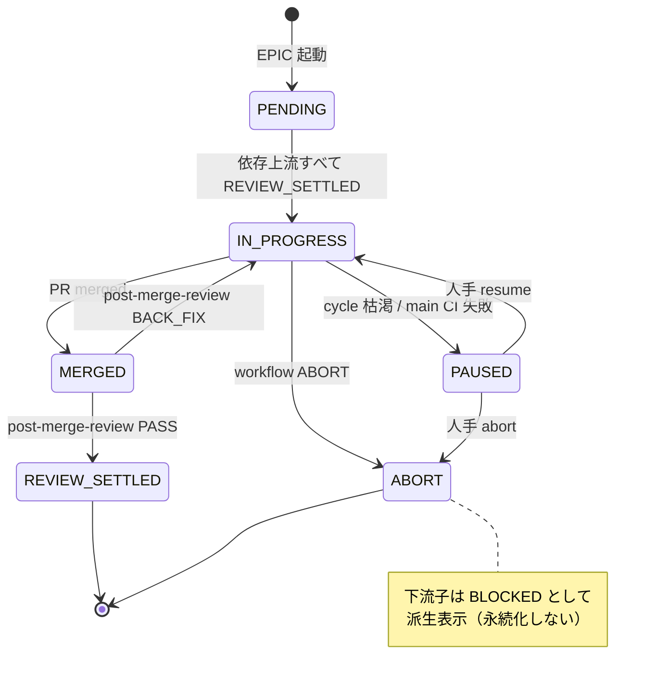

# ADR-004: EPIC オーケストレーションアーキテクチャ

> **Status**: Draft (2026-05-04 起草)
> **Depends on**: ADR-001 (Revised) — VERDICT プロトコル拡張
> **Related RFC**: ADR Accept 時に `draft/lab/epic-orchestration.md` から `docs/rfc/epic-orchestration.md` へ昇格予定。
> 現時点の参照先は `draft/lab/epic-orchestration.md`。

## Status

Draft（明日 2026-05-05 に Accept 予定）

## Context

### 動機

複数の関連 Issue（EPIC + 子 Issue 群）を依存グラフに従って自動実行したいユースケースが具体化した。
発端は kamo2#1080（7 子 Issue + 依存グラフ + マイルストーン）。
現状の `kaji run <workflow.yaml> <issue>` は単一 Issue 起点で、依存解決・並列・post-merge レビュー対応・
失敗伝播はすべて手作業になり、半自動以下の運用にとどまる。

詳細な背景・課題分析（24 件）・既存制約は `draft/lab/epic-orchestration.md`（ADR Accept 時に `docs/rfc/` へ昇格予定）に整理済み。
本 ADR は同 RFC で提示された方針のうち、**アーキテクチャレベルの決定事項**を記録する。

### 現状の制約（事実ベース）

- `kaji_harness/cli_main.py` の `kaji run` は `issue: int` を 1 つだけ受け取る
- `kaji_harness/runner.py` は while ループで逐次実行（並列なし）
- `SessionState` は Issue scoped、EPIC 全体を束ねる構造はない
- `feature-development.yaml` は `i-pr` 終端、merge 待ち・post-merge レビューを含まない
- cycle 枯渇時は `on_exhaust: ABORT` 直行のみ
- secrets / DB / 環境前提の preflight 機構なし

## Decision

### 1. 上位 EPIC runner の新設（既存 runner は変更しない）

新規 CLI コマンド `kaji run-epic <epic.yaml>` を導入する。
既存 `kaji run` は単一 Issue 用として維持し、EPIC runner はその上位で各子 Issue を呼び出す構造。

**入力**:
- EPIC Issue 番号 または EPIC YAML パス
- `--resume-from <child>` / `--skip-completed` オプション

**EPIC YAML スキーマ**:
- 子 Issue 群（番号、ワークフロー、`depends_on`）
- 並列グループ（明示指定 or 依存グラフから自動推定）
- merge キュー順序
- EPIC 単位の `max_parallelism` / `max_budget_usd` / 通知先
- preflight 引数

### 2. 子 Issue 状態モデル

EPIC scoped に以下の 6 状態で管理する:

| 状態 | 意味 |
|------|------|
| `PENDING` | 依存待ち |
| `IN_PROGRESS` | 子ワークフロー実行中 |
| `MERGED` | PR が main に merged された |
| `REVIEW_SETTLED` | post-merge review が収束し、下流ゲート開放可能 |
| `ABORT` | 子ワークフローが ABORT、下流は `BLOCKED` |
| `PAUSED` | 人手介入待ち（cycle 枯渇 / main CI 失敗 / 不整合検出） |

**下流ゲート開放条件**: 上流すべてが `REVIEW_SETTLED` であること
（`MERGED` 単独では開けない。post-merge review 収束を待つ）。

**永続化**: `.kaji/artifacts/_epics/<epic_n>/state.json`

**`BLOCKED` の扱い**: 永続化された状態としては保持しない。
上流が `ABORT` の子に対して動的に派生する**表示概念**として扱う
（runner 起動時 / 状態クエリ時に `ABORT` 子の存在から計算）。
これにより状態数を増やさず、上流状態変化に追随する複雑なルールが不要になる。

### 状態遷移図



### 3. 並列実行モデル

asyncio で依存制約を満たした子 Issue を同時起動する。

- `max_parallelism` で上限制御（CLI レート制限・課金枠の安全弁）
- 並列度の上限はデフォルト 2、EPIC YAML で上書き可能
- 同時実行中の子は別 worktree で分離（既存 `git worktree` 運用を踏襲）

### 4. merge 直列化（PR 作成のグローバル直列化）

並列実装しても、main への merge は **グローバルに直列化**する。
依存辺だけでなく、**依存関係のない並列ノード（C/D など）の merge も順序付ける**。

実装方針:

- EPIC runner が **同時 open 中の PR は最大 1 本** を強制する
  （並列実装ノードでも PR 作成は 1 本ずつ EPIC runner が許可）
- merge 順序は次のルールで決定:
  1. 依存グラフのトポロジカル順序（上流が先）
  2. 同一階層の並列ノード間は EPIC YAML の `merge_order` で明示宣言
  3. `merge_order` 未指定の場合は子 Issue 番号昇順（決定的）
- auto-merge は引き続き利用可。GitHub 側 merge タイミングのばらつきは
  「同時 open 1 本制約」で吸収される
- これにより post-merge review の commit range が紛らわしくならない

> **代替案**: auto-merge を無効化し runner が手動 merge する案も検討したが、
> GitHub の機能を捨てるデメリットが大きく不採用。
> PR 作成側の制御で同等の順序保証が達成できる。

### 5. post-merge フェーズの導入

単一 Issue ワークフローを `i-pr` 終端から拡張し、以下を追加する:

```
... → i-pr → wait-merge → verify-main-green → post-merge-review
                                                ├─ PASS → issue-close → REVIEW_SETTLED
                                                └─ BACK_FIX → post-merge-fix
                                                                → 新ブランチ → 新 PR
                                                                → wait-merge → ...（再帰、上限あり）
```

新規スキル:
- `wait-merge`: gh API で PR merge 状態をポーリング
- `verify-main-green`: merge 後 main の CI green 確認
- `post-merge-review`: merged commit range を codex でレビュー
- `post-merge-fix`: merge 済 PR への push は不可のため、新ブランチ・新 PR を作成

ワークフロー配置:
- 新規ワークフロー `feature-with-postmerge.yaml` として追加（既存 `feature-development.yaml` は変更しない）
- 利用側が選択できる形式とする

### 6. 失敗ハンドリング

- **cycle 枯渇** → `on_exhaust: PAUSE` を選択可能に（ADR-001 改定で導入）
- **子 ABORT** → 下流すべてを skip（`BLOCKED` は §2 の通り永続化せず派生表示として扱う）
- **main CI 失敗** → `PAUSE`（revert / hotfix の判断は人手）
- **PAUSE 通知** → ntfy 等の外部チャネル（実装は別 Issue でアダプタ化）

### 7. EPIC 起動準備フェーズ

人手起票された EPIC + 子 Issue 群から EPIC YAML を生成する補助スキル群を提供する:

| スキル | 責務 |
|--------|------|
| `i-epic-policy-review` | 子 Issue 群の方針整合レビュー（指摘のみ） |
| `i-epic-policy-fix` | 子 Issue 本文を gh issue edit で修正 |
| `i-epic-yaml-generate` | EPIC + 子 Issue 構造から EPIC YAML を生成（決定的処理 + LLM ハイブリッド） |
| `i-epic-yaml-review` | 生成 YAML の意図整合レビュー（指摘のみ） |
| `i-epic-yaml-fix` | YAML 修正（人手 PAUSE 代替も可） |

**verify は省略**（policy / yaml は diff で人手確認可能、review 再回しで収束保証）。
ただし review skill 側で「修正の妥当性確認は責務に含めない」ルールを明記する。

### 8. ブートストラップ

EPIC runner 自体の開発に EPIC runner は使えない。
全 Phase の実装イシューは既存 `feature-development.yaml` で 1 件ずつ手動駆動する。
EPIC runner が動作開始した後、kaji 自身の次 EPIC からドッグフーディングを開始する。

### 9. 実装フェーズ分割

詳細は RFC 第 10 章に従う。本 ADR は方針記録のみで、各 Phase の実装スコープは個別 Issue で詰める。

```
Phase 1: 単一 Issue ワークフロー拡張 + EPIC YAML スキーマ + VERDICT 拡張機構
         + issue-close 組込
         （#159 を吸収。VERDICT 拡張は post-merge-review が BACK_* を使うため P1 同梱。
           issue-close は post-merge phase の REVIEW_SETTLED 遷移と不可分のため P1 に前倒し）
Phase 2: EPIC runner コア（逐次・状態管理）
Phase 3: 並列実行 + 失敗制御 (PAUSE)
Phase 4: EPIC 準備スキル
Phase 5: 周辺整備（post-merge-fix / issue-start 組込 / preflight）
         （issue-close 組込は Phase 1 に移動済）
Phase 6: ドッグフーディング
```

> **EPIC 本文との整合**: RFC 第 10 章の Phase スコープ（P1-1 / P5-2）も本 ADR の決定に
> 合わせて改訂する。RFC 昇格時に同期する。

## Consequences

### Positive

- 複数 Issue を依存グラフで自動駆動でき、人手介入を「PR レビュー承認」と「PAUSE 解除」のみに最小化できる
- 既存 single-issue runner は変更せず、上位 runner を新規追加する形で副作用を局所化
- post-merge フェーズが正規化され、merge 後の品質ゲート（main CI green / post-merge review）が自動化される
- 状態モデルが明示されることで失敗伝播・再開・通知の運用が予測可能になる

### Negative

- runner 実装の複雑度が増加（asyncio、状態永続化、依存解決、再開）
- EPIC YAML という新しい設定スキーマの学習コストが発生
- 長時間実行に対する運用負荷（CLI レート制限・課金・タイムアウト耐性）
- post-merge-fix が新ブランチ・新 PR となり、人手レビュー量が増加する可能性

### Risks

- **AI コスト爆発**: 7 子 Issue × 数十 step の連続実行で課金枠を圧迫
  - 対策: EPIC 単位 `max_budget_usd`、並列度上限、cycle カウンタ
- **DAG 不整合**: 依存グラフと merge 順序の矛盾、循環依存
  - 対策: `kaji validate-epic` で起動前検証、循環検出をエラー化
- **状態永続化の破損**: `.kaji/artifacts/_epics/<n>/state.json` の中途半端な書き込み
  - 対策: atomic write（tmp → rename）、起動時整合性チェック
- **auto-merge との競合**: GitHub 側 merge タイミングと EPIC runner の期待順序のズレ
  - 対策: 「上流が REVIEW_SETTLED になるまで下流 PR を作らない」順序強制
- **ブートストラップ期間の手作業負荷**: 全 Phase Issue を手動駆動
  - 対策: 各 Phase Issue を単独で意味成立するスコープに保つ（10.1 方針）

## Alternatives Considered

### A. 既存 single-issue runner を multi-issue 対応に拡張

却下理由:
- runner の責務が肥大化、既存ユーザーへの副作用大
- 状態モデル（Issue scoped → EPIC scoped）の破壊的変更が必要

### B. GitHub Actions などの外部 CI で EPIC を駆動

却下理由:
- 既存スキル / verdict プロトコル / worktree 運用との統合コストが高い
- ローカル開発環境でのデバッグが困難
- AI agent 実行のレート制限 / コスト管理を CI 側で持ち込む必要

### C. 完全自動化（人手介入ゼロ）を目指す

却下理由:
- PR レビュー承認・main CI 失敗判断・revert/hotfix 判断は本質的に人手が必要
- "半自動（人手介入は PR レビュー承認と PAUSE 解除のみ）" が現実的な到達点

## References

- RFC: `docs/rfc/epic-orchestration.md`（ADR Accept 時に `draft/lab/epic-orchestration.md` から昇格予定）
- ADR-001 (Revised): VERDICT プロトコル拡張（同時 Accept）
- Issue #159: final-check の動的後退（Phase 1 に吸収）
